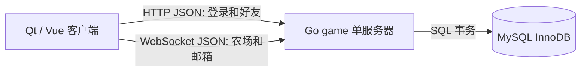
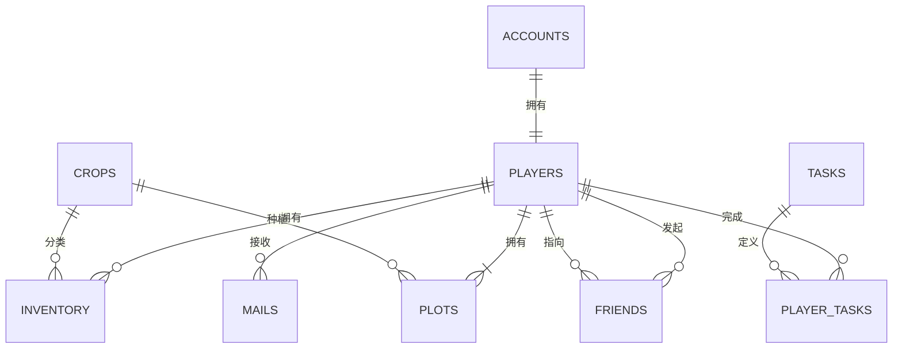

# class-mid 架构与数据库

## 整体结构

后端只有一个进程。`main.go` 读取配置、连接 MySQL、初始化表并调用 Go 标准库 `http.Server.ListenAndServe`。`http.go` 注册路由和管理内存 Session；`websocket.go` 持续读游戏命令；`game.go` 编写业务 SQL；`friend.go` 处理好友；`mysql.go` 建表、注册和查询快照；`model.go` 定义 JSON 数据。

## 数据库关系

| 表 | 主键 | 用途 |
|---|---|---|
| `class_mid_accounts` | `player_id` | 用户名和凯撒编码后的密码 |
| `class_mid_players` | `player_id` | 金币、肥料、章节和版本 |
| `class_mid_crops` | `crop_id` | 6 种作物的商店配置 |
| `class_mid_inventory` | `(player_id,crop_id)` | 每种作物的种子数和成品数 |
| `class_mid_plots` | `(player_id,plot_no)` | 每位玩家 16 块地的状态 |
| `class_mid_tasks` | `task_id` | 任务定义 |
| `class_mid_player_tasks` | `(player_id,task_id)` | 玩家任务进度 |
| `class_mid_mails` | `mail_id` | 系统或好友邮件 |
| `class_mid_friends` | `(player_id,friend_id)` | 双向好友关系 |

账号与玩家是 1:1。一个玩家有 16 块地、多条库存、任务和邮件，所以是 1:N。玩家与作物是 N:M，中间用库存表表示；玩家与玩家的 N:M 好友关系用好友表表示。一对好友保存 A→B 和 B→A 两行，查询简单。

## 写操作与行锁

一次种植会开启事务，用 `SELECT ... FOR UPDATE` 查询这一块地和库存行。`FOR UPDATE` 由 MySQL/InnoDB 加行锁；Go 的 `QueryRowContext` 只负责执行 SQL。随后扣种子、更新地块和任务，最后 `Commit`。失败则 `Rollback`，避免出现“种子扣了但地没种上”。普通 `UPDATE` 也会在修改时加锁，但 `FOR UPDATE` 可以先读状态并把“检查后修改”保护在同一事务中。

偷菜同样锁住好友的目标地块。确认双方是好友且作物成熟后，事务一次完成：自己的库存增加产量、金币增加 1、好友地块变为待清理。两个请求同时偷同一块地时，后来的请求等待锁，之后读取到待清理状态并失败。

## 请求链路

注册：Qt POST JSON → `register` → 事务插入账号、玩家、16 块地、6 条库存、任务进度和欢迎邮件 → 提交 → 返回玩家 ID。

登录：Qt POST JSON → `login` → 对输入密码做相同凯撒移位后比较 → 创建内存 token。Qt 再建立 WebSocket 并发送 `AUTH`。之后服务器的循环每收到一条 JSON 命令就启动一个短事务，提交后返回完整快照。

HTTP 服务器会为不同连接并发调用处理函数。同一个 WebSocket 中的消息由该连接自己的循环顺序处理；数据库事务和行锁处理多个连接同时修改同一数据的情况。
