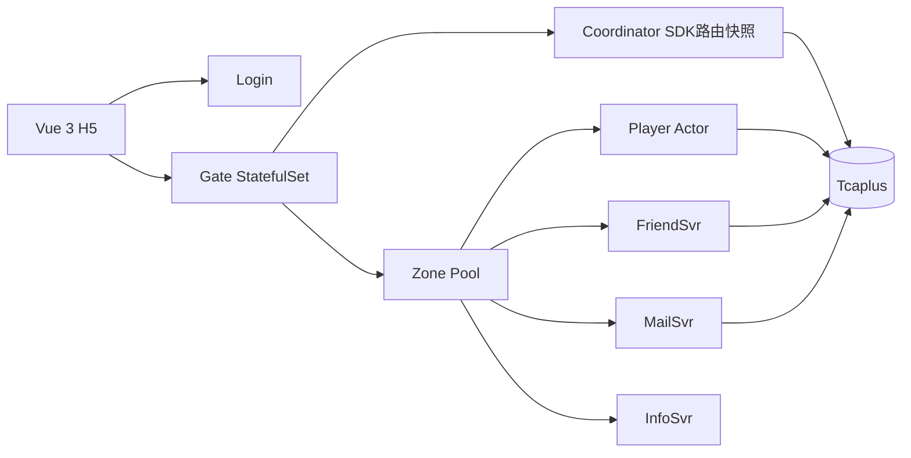

# Classic Farm 当前整体架构

## 1. 文档定位

本文是当前架构总览。具体业务规则以合同和单人闭环设计为准，重要取舍以ADR为准，
性能数字以证据目录为准。V1无状态方案和V2同步Journal方案只保存在历史归档中。

## 2. 目标与边界

项目交付一个可本地演示的经典农场H5原型，并通过缩小实现验证面向3000万DAU的
关键机制：玩家状态串行化、逻辑分片、动态Zone、Owner fencing、异步持久化、
跨Zone好友交互和水平扩展方向。

3000万DAU是容量设计目标，不是本地集群实测结论。生产级多可用区、百万长连接、
大规模Actor内存、混合读写长稳和存储故障恢复仍需独立验证。

## 3. 总体拓扑



客户端只连接Login和Gate，不直接连接Zone。Gate按玩家ID计算逻辑Shard，并从本地
Coordinator SDK快照读取Owner Zone和epoch。Zone以StatefulSet Pod身份动态加入
`zone-pool`，Coordinator根据健康状态、负载和ShardMap进行放置与迁移。

## 4. 服务职责

| 服务 | 职责 |
|---|---|
| Login | 注册、登录、CSRF、Session、WebSocket Ticket |
| Gate | WebSocket连接、认证、路由、命令转发、精确Push投递 |
| Coordinator | Zone发现、4096 ShardMap、lease、epoch、放置、迁移与Drain |
| Zone | Player Actor、农场命令、Dirty写回、Owner校验和好友Owner操作 |
| FriendSvr | 好友关系、邀请码、好友列表和跨玩家关系校验 |
| MailSvr | 公共/私人邮件、礼物邮件、阅读和领取状态 |
| InfoSvr | 玩家轻量信息、在线与红点相关快速查询 |
| Tcaplus | 账号、Session、Checkpoint、Fence、路由、迁移、好友、邮件和Outbox |

## 5. 玩家命令链路

```text
Login签发Ticket
→ 客户端连接任一Gate并AUTH
→ Gate从本地路由快照取得Owner Zone和epoch
→ Zone校验内部HMAC、Shard Owner与epoch
→ Player Actor按玩家串行执行命令
→ 修改内存、推进player_seq并标记Dirty
→ 响应客户端
→ Flusher异步批量保存版本化Checkpoint到Tcaplus
```

同一玩家的普通命令不需要分布式锁；Actor mailbox提供串行语义。不同玩家之间的
好友交互不能依赖单Actor原子性，使用显式Owner调用、interaction记录和幂等步骤。

## 6. Shard、路由与迁移

- 玩家映射到4096个逻辑Shard，逻辑Shard数量不随Pod数量变化；
- Coordinator保存版本化ShardMap，Gate和Zone通过SDK缓存并按版本更新；
- Zone必须持有有效lease和匹配的Owner epoch才能处理命令或写Checkpoint；
- 迁移依次完成目标准备、源端停止接单与最终刷盘、路由提交和新Owner激活；
- Tcaplus Fence拒绝旧epoch写入，避免旧Owner复活形成双写；
- 扩容通过增加`zone-pool`副本并渐进迁移Shard完成，客户端地址不发生变化。

## 7. 持久化与一致性

Player Actor内存是在线权威状态。普通命令采用异步Dirty写回，换取低延迟，但明确
接受Zone异常退出时最近未刷新的普通状态可能回退。正常停机、Actor驱逐和迁移必须
先刷完Dirty状态。

Tcaplus是当前原型持久化目标。MySQL和同步Kafka Journal属于历史基线，不在当前
在线主链路中。账号、Session、ShardRoute、Fence、迁移进度和需要跨服务恢复的
interaction/outbox记录仍必须持久化，不能只存在Actor内存中。

## 8. 好友与实时同步

- FriendSvr管理好友关系，Zone管理玩家农场权威状态；
- 访客进入好友农场后建立带epoch的访问关系；
- Owner农场变化产生`farm_view_seq`递增Patch；
- Zone记录连接对应的Gate ID和直连endpoint，Push精确投递到持有连接的Gate；
- 客户端遇到epoch变化或seq缺口时重新获取完整Snapshot；
- 偷菜等跨Actor写操作通过可恢复interaction步骤避免直接共享内存。

## 9. 部署基线

当前Kubernetes清单使用Login Deployment、Gate StatefulSet、单节点Coordinator、
动态Zone StatefulSet、Friend/Mail多副本和Info单副本。默认副本及资源以
`deploy/k8s/`为准，详见`../project/deployment.md`。

本地单节点kind只验证机制，不代表生产高可用。生产目标需要至少三节点多数派
Coordinator、多可用区Zone/Gate、容量冗余和故障接管演练。

## 10. 容量设计

规划模型以3000万DAU、峰值在线和峰值请求估算服务数量。现有实测只提供场景化
单实例基线：单Zone Snapshot、三Gate分流、好友交互和连接到达实验。不能把某个
单一读场景QPS直接乘副本数后声明达到目标。

当前容量结论和限制见`../evidence/2026-08-19-classic-farm-performance-report.md`。

## 11. 有效决策与合同

- ADR-0003：Stateful Player Actor Zone；
- ADR-0006：异步Dirty写回；
- ADR-0008：多数派授权的Shard Coordinator目标；
- ADR-0009：章节任务归属Player Actor；
- ADR-0012：Kubernetes发现与持久化动态路由；
- HTTP、WebSocket、内部gRPC、数据、事件、错误与幂等合同位于`../contracts/`。

历史架构、开发计划和过程记录位于`../archive/`，不覆盖本文。
