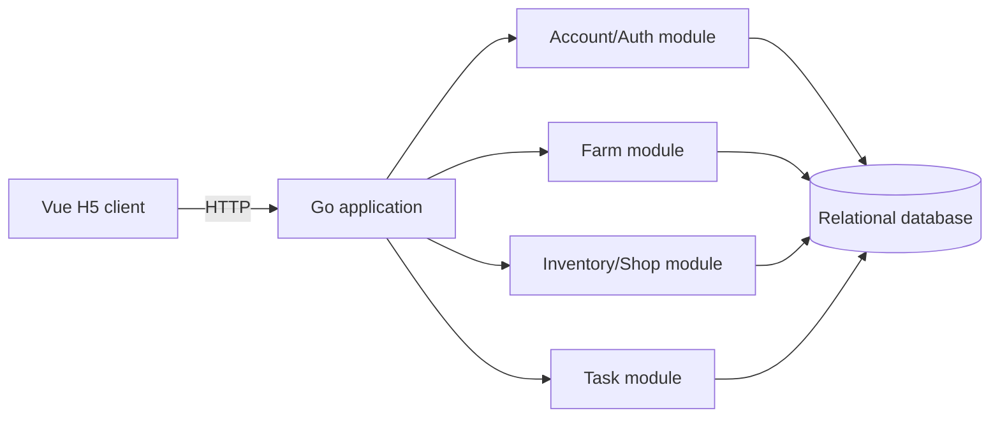

# Current Architecture

## Status

This document is a proposed baseline. No product code exists yet, and no performance claim has been validated.

## Phase 1 boundary

The first implementation will support only the farm owner's single-player loop. Friend relationships and realtime multiplayer are outside the first vertical slice.

## Proposed baseline



## Design principles

- Correctness before distribution.
- Server-authoritative game rules.
- Business operations go through module services rather than editing tables from handlers.
- Multi-step economy changes must be atomic.
- Store enough durable state to recover after process restart.
- Add distributed components only after a requirement or measurement justifies them.

## Planned evolution

```text
single-player correctness
→ friends and invitations
→ realtime room
→ concurrency and versioning
→ reconnect and weak-network behavior
→ load testing and target-scale evolution
```

Each transition requires an accepted ADR and a validation plan.
