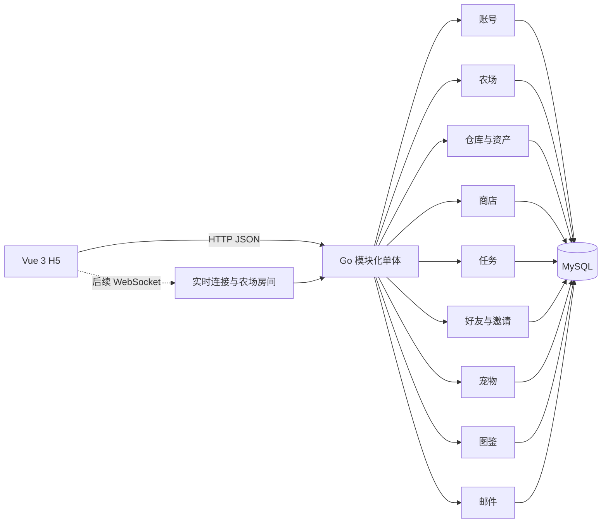

# Classic Farm 整体设计

## 1. 文档用途与状态

本文是经典农场项目的开发设计总纲，面向项目负责人和后续参与开发的 AI。它说明系统边界、模块职责、核心流程、一致性原则、验证方式和开发顺序，不替代模块实施计划、数据库迁移或 API 详细定义。

| 标记 | 含义 |
|---|---|
| 【已确认】 | 项目负责人能说明问题、替代方案、理由、代价和验证方法；重大决定应有 ADR |
| 【候选】 | 当前推荐的第一版方案，尚未正式确认 |
| 【待验证】 | 需要代码、测试、压测或运行证据 |
| 【待确认】 | 会改变产品行为或技术方向，需要后续讨论 |
| 【后续】 | 属于最终交付范围，但不阻塞当前单人闭环 |

“第一版”是本地可演示实现，不等于 3000 万 DAU 生产系统。候选优化不能写成已具备能力。

## 2. 项目目标、约束与非目标

### 2.1 目标

独立完成一个经典农场 H5 游戏，使用 Go 后端，形成可运行、可测试、可解释的实现，并能够说明：

- 单人种植和经济闭环如何保证正确；
- 好友、分享邀请和 2～3 人同农场同步如何接入；
- 重复请求、并发操作、进程重启和断线后如何恢复；
- 面向 3000 万 DAU 时如何估算负载、定位瓶颈并提出演进方案；
- AI 辅助开发中的人类判断、方案变化和验证证据。

### 2.2 已知约束

- 一人独立开发，后端使用 Go，H5 经验有限，本地机器演示。
- 中期答辩为 2026-07-31，材料应在 2026-07-29 前准备。
- 最终答辩为 2026-08-21，材料应在 2026-08-18 前冻结。
- 第一版先支持农场主单人闭环；好友和多人同步后置，但属于最终范围。
- 使用项目自己的账号数据，不接入公司认证或内部基础设施。
- UC 后台、xRPC、Actor、Proxyless 等学习资料只是参考，不能自动成为本项目选型。

### 2.3 第一版非目标

- 商业游戏级 UI、美术和复杂数值体系；
- 微服务、真实大规模集群和跨地域部署；
- Redis、消息队列或分库分表作为预设前提；
- 复杂运营后台、支付、拍卖、复杂宠物养成和玩家间交易；
- 在没有负载模型和压测证据时声称已支持 3000 万 DAU。

## 3. 需求范围与阶段

| 能力 | 最小行为 | 阶段 |
|---|---|---|
| 账号 | 注册、登录、鉴权、退出 | 第一阶段 |
| 商店 | 商品列表、购买种子、出售作物 | 第一阶段 |
| 资产 | 查看金币和物品、100 格与单格 300 上限、可靠增减 | 第一阶段 |
| 农场 | 地块、种植、离线成熟、农场主收获 | 第一阶段 |
| 任务 | 行为进度、自动完成、自动金币奖励和奖励记录 | 第一阶段末 |
| 好友/邀请 | 30 分钟多次邀请、好友列表、访问农场和偷菜 | 第二阶段 |
| 宠物 | 获得、列表、选择一只展示 | 第二阶段最小实现 |
| 图鉴 | 首次获得后解锁、列表展示 | 第二阶段最小实现 |
| 邮件 | 列表、已读、附件只领取一次 | 第二阶段最小实现 |
| 多人同步 | 2～3 人看到同一农场地块变化 | 第三阶段 |
| 弱网/重连 | 请求安全重试、状态恢复 | 第三阶段 |
| 容量设计 | 假设、估算、单实例压测和演进 | 第四阶段 |

第一条纵向闭环：

```text
注册/登录
→ 初始化玩家、钱包、农场和空地
→ 购买种子
→ 查看仓库
→ 选择空地种植
→ 离线或等待成熟
→ 收获进入仓库
→ 出售作物获得金币
→ 任务达标时自动发金币并记录奖励
```

只有这条链路在正常、失败、重试、并发和重启场景下可验证后，才进入好友和多人同步。

## 4. 总体架构

### 4.1 第一版形态【已确认】

第一版采用 Go 模块化单体：一个 Go 应用、一个 MySQL 实例，H5 通过 HTTP JSON 调用。代码按业务模块隔离，必须强一致的模块共享本地数据库事务。详情见 [ADR-0001](../decisions/ADR-0001-modular-monolith-first.md)。



选择理由：当前只有一名开发者和十几个本地演示玩家，没有独立扩容或部署证据；种植、收获、买卖和领奖存在跨模块强一致写入；模块化单体仍可通过包、接口和测试保持边界。以后根据负载、故障隔离或独立部署证据再拆分。

代价：所有模块共同部署，不能独立扩容；共享数据库容易形成跨模块改表；本地事务造成一定耦合。因此每张表必须有明确所有者，其他模块只通过领域能力协作，事务中禁止外部网络调用。

## 5. 模块职责与数据归属

| 模块 | 拥有的数据 | 核心能力 | 禁止事项 |
|---|---|---|---|
| 账号 | 账号、密码摘要、玩家身份、Session | 注册、登录、鉴权、退出 | 不保存金币、仓库或农场状态 |
| 农场 | 农场、地块、种植/产出快照、偷菜状态、历史、版本 | 快照、种植、成熟判断、收获、偷菜 | 不直接覆盖资产或好友关系 |
| 资产 | 钱包、物品余额、资产流水 | 条件扣减、容量校验、原子增加、余额查询 | 客户端不能调用通用发奖接口 |
| 商店 | 商品、价格、交易规则和记录 | 商品列表、购买和出售编排 | 不信任客户端价格 |
| 任务 | 配置、进度、完成状态、奖励记录 | 更新进度、自动完成和发奖、查询 | 不从其他表反推成功行为 |
| 好友/邀请 | 邀请、好友关系、访问与偷菜授权 | 创建、接受、列表、权限判断 | 不拥有好友农场数据 |
| 宠物 | 配置、玩家宠物、展示选择 | 获得、列表、展示 | 第一版不做战斗或复杂养成 |
| 图鉴 | 配置、首次解锁记录 | 解锁、查询 | 不复制实时仓库余额 |
| 邮件 | 邮件、阅读和附件领取状态 | 列表、阅读、领取 | 不无条件写资产表 |
| 实时同步 | 连接、房间、临时订阅 | 广播、重连恢复 | 不作为持久化农场真相 |

已确认命名为“资产模块”，统一拥有金币、种子、作物和普通奖励道具；商店只拥有商品、价格、交易规则并编排资产变更。

## 6. 核心数据模型

这里只定义概念实体和关键约束；字段长度、索引和 SQL 在实施计划中确定。

- 身份：`account`、`player`、`session`。用户名唯一，密码和 Token 不保存明文；单设备登录，新登录撤销旧 Session，登录后固定 1 小时到期。
- 农场：`farm`、`farm_plot`、`crop_config`、种植/收获历史。地块保存原始产量、已偷数量、偷菜者、偷菜时间和版本；一名玩家第一版一个农场，`(farm_id, plot_no)` 唯一。
- 资产：`player_wallet`、`player_item`、`inventory_ledger`。初始金币 10；最多 100 种数量大于 0 的物品，每种最多 300；余额非负，`(player_id, item_id)` 唯一，流水用于审计而非求余额。
- 交易：`shop_product`、`shop_transaction`。服务端记录当次实际价格。
- 任务：`task_config`、`player_task`、奖励记录和行为去重记录。`(player_id, task_id)` 唯一，状态为进行中或已完成；第一阶段达标时自动发金币，不存在可领取状态。
- 幂等：顶层业务保存 `request_id` 结果；资产流水另用稳定 `business_type + business_id` 防内部重复入账。
- 版本：农场和地块预留递增版本，用于后续乱序、丢失和重连恢复。

## 7. 核心业务流程

### 7.1 新玩家初始化【已确认】

```text
同一 MySQL 事务内创建 account 和 player
→ 创建含 10 金币的钱包
→ 创建农场和固定数量空地
→ 全部成功后提交
```

任一步失败则全部回滚，对外表现为“注册失败且账号不存在”。新手任务、欢迎邮件、宠物、图鉴不进入注册事务。初始地块数量和是否赠送种子仍在实现计划前确定。

### 7.2 购买、种植、收获、出售和任务

- 购买：按提交时服务端价格，在事务中扣金币、校验容量、加种子、写交易/流水/幂等结果。
- 种植：锁定空地，校验种子，生成 `planted_at` 和 `mature_at`，固化产出和偷菜初始快照，扣种子并写地块/历史。
- 查询：服务端用当前时间与 `mature_at` 比较；客户端倒计时只用于展示。
- 收获：锁定地块并复核成熟，按原始产量减去已偷数量入库；容量不足则整体失败且成熟作物保留；成功后保存历史、清空地块并递增版本。
- 出售：只出售成熟作物，在事务中扣作物并按服务端当前回收价增加金币。
- 任务：核心行为在自己的事务内同步记录任务动作；达标时自动完成、发放金币并保存奖励记录，不提供手动领奖。

### 7.3 好友偷菜【第二阶段已确认规则】

- 好友关系由好友模块校验，真正的写操作由农场 `StealCrop` 用例执行。
- 每轮成熟作物最多被偷一次；演示基准产量 10，好友获得 3，农场主剩余 7；偷菜不清空地块。
- 偷菜者资产、地块偷菜状态、历史、版本和幂等结果同事务。
- 农场主收获和好友偷菜锁同一地块并在锁内复核状态；实时模块只在提交后广播，不能直接写农田。

## 8. 事务与一致性

| 操作 | 必须同时提交的状态 |
|---|---|
| 注册 | 账号 + 玩家身份 + 10 金币钱包 + 农场 + 初始地块 |
| 购买 | 金币扣除 + 种子增加 + 交易/幂等结果 + 任务动作/可能的自动金币奖励记录 |
| 种植 | 种子扣除 + 地块种植快照/历史 + 幂等结果 + 任务动作/可能的自动金币奖励记录 |
| 农场主收获 | 剩余产量入库 + 收获历史 + 地块清空/版本 + 幂等结果 + 任务动作/可能的自动金币奖励记录 |
| 好友偷菜 | 偷菜者作物增加 + 地块已偷状态/历史/版本 + 幂等结果 |
| 出售 | 作物扣除 + 金币增加 + 交易/幂等结果 + 任务动作/可能的自动金币奖励记录 |

第一阶段的任务进度、完成状态、金币奖励和奖励记录与触发动作同事务；任一步失败则核心动作回滚。WebSocket 广播、成熟通知和后续图鉴展示可以提交后处理，失败不能回滚已提交业务，但要通过版本与重新拉快照恢复。宠物、图鉴和邮件当前不实现，其事务规则在进入对应阶段时确定。

## 9. 作物成熟机制【候选，待 ADR】

- 种植时保存服务端生成的 `planted_at` 和固化的 `mature_at`；
- 同时固化产出物、产量和可选配置版本，改配置只影响新种植；
- 查询和收获时比较 `server_now` 与 `mature_at`；
- 不保存可推导的 `is_mature`；
- 不为每株作物建立内存定时器，也不扫描全部作物；
- 进程重启后直接从持久化时间恢复判断。

当前只要求“访问时状态正确”，不是成熟瞬间主动产生副作用。代价是不主动通知、依赖可信服务端时钟，且配置修复不追溯旧地块。若未来需要推送或自动结算，再增加可持久化、可重试的后台任务。

必须验证：成熟边界、客户端改时间、服务重启、配置变更、并发收获和响应丢失重试。

## 10. API、鉴权和错误模型【候选】

- 第一版使用 HTTP JSON；Handler 只做协议、参数、身份和响应转换，规则进入模块服务。
- 受保护接口从 Session 取得当前 `player_id`。
- 客户端提交操作意图，不提交可信价格、产量、成熟状态、进度或奖励。
- 关键写接口携带 `request_id`，超时重试复用原编号。
- 错误至少区分未认证、无权限、参数无效、资源不存在、状态冲突、余额不足、尚未成熟、重复业务、限流和内部暂时失败。
- 状态冲突或版本落后时客户端刷新权威快照；错误不得泄漏密码、Token、SQL 或堆栈。

## 11. 幂等、并发与恢复【候选】

- 同请求重试：相同 `request_id` 重放原已提交结果。
- 不同请求重复业务：由地块状态、领取状态和业务唯一约束阻止。
- 并发扣减：用条件原子更新或短事务行锁，不能先读后无条件覆盖。
- 同地块操作：事务内锁定地块并重新检查条件。
- 响应丢失：业务、资产、流水和幂等结果同事务，重试能证明已成功。
- 服务重启：业务状态、Session 和生长时间持久化；在线连接重新建立。
- 广播失败：数据库仍是事实，客户端用版本或重新拉快照恢复。

## 12. 后续模块与多人演进

- 好友/邀请：30 分钟随机 Token 可由不同玩家多次使用，直至过期或撤销；规范化唯一好友关系防重复；好友可访问农场并通过农场模块偷菜。
- 宠物、图鉴、邮件：保留在最终范围，本阶段不开发；进入对应阶段前再确定最小验收和事务规则。
- 多人同步：先 HTTP 获取快照和版本，再通过 WebSocket 订阅房间；产品规则不设置房间人数硬上限，第一轮以三个客户端同时访问为验收基线；命令仍由农场模块落库，提交后广播，断线或版本不连续时重新拉快照。
- 并发策略：第一版就保证同地块操作正确；未来只根据压测证据优化锁竞争、广播吞吐和部署形态，不能把数据正确性留到未来。

## 13. 测试与证据

测试层次：领域单元测试、模块集成测试、跨模块事务测试、API 测试、端到端测试和单实例压测。

每条关键流程至少覆盖正常、边界、失败、事务回滚、相同请求重试、不同请求并发、重启/重连、越权和参数篡改。测试环境、命令、结果和限制写入 `docs/evidence/`；未执行的只能称为验证计划。

## 14. 3000 万 DAU 设计方法【待验证】

计算前必须明确玩家行为频率、峰值系数、同时在线比例、地块/物品/好友/邮件规模、WebSocket 心跳与事件频率、数据保留期。

```text
DAU 与行为假设
→ 峰值 HTTP QPS、连接数和消息速率
→ 数据行数、写放大、存储和带宽
→ 单实例压测基线
→ 瓶颈证据
→ 缓存、异步事件、拆服务或分片方案
```

Session/配置缓存、农场分片、WebSocket 网关、可靠事件、读副本和冷热归档都只是候选，只有出现证据瓶颈时采用。

## 15. 开发顺序与完成标准

1. **设计基线**：整体设计完成第一轮阅读；模块化单体 ADR 接受；资产归属、任务一致性、邀请和偷菜规则已确认；补齐成熟机制 ADR 与第一条闭环实施计划。
2. **单人闭环**：最小 Go/MySQL/Vue 骨架；依次完成账号、初始化、商店/资产、种植/收获、出售和任务；同步完成失败、重试和事务测试。
3. **好友与多人**：好友/邀请、偷菜、快照版本、WebSocket、三客户端同步及断线恢复。
4. **最终功能补齐**：按剩余时间确定宠物、图鉴和邮件的最小闭环；当前只保留范围记录。
5. **容量研究**：明确假设，建立单实例基线，只优化已测瓶颈。

## 16. 决策状态与待确认清单

### 16.1 已确认

- 第一版采用一个 Go 应用、一个 MySQL 的模块化单体；保持模块边界和独立测试，未来根据证据拆分。
- 模块命名为资产，统一拥有金币和物品；初始金币 10，仓库 100 格，每种物品最多 300。
- 单设备登录；Session 登录后固定 1 小时到期，不滑动续期；新登录撤销旧 Session。
- 注册事务创建账号、玩家、钱包、农场和初始地块；失败整体回滚。
- 第一版商店购买种子、出售成熟作物，结算采用提交时服务端价格。
- 收获成功后清空地块并保留种植/收获历史；仓库超限时收获整体失败，成熟作物保留。
- 任务达标后自动完成、自动发金币并记录奖励；它与触发动作同事务，不提供手动领奖。
- 邀请链接 30 分钟内可被不同玩家多次使用；好友可访问农场并偷菜。
- 每轮成熟作物最多被偷一次；演示产量 10 时好友获得 3、农场主剩余 7；并发正确性由同地块行锁和状态复核保证。
- 产品规则不设房间人数硬上限，第一轮以三个客户端同时访问作为验收基线。
- 宠物、图鉴、邮件保留在最终范围，本阶段不开发。

### 16.2 高优先级候选

- Vue 3 H5、HTTP JSON、MySQL；
- 种植时固化 `mature_at`，查询时派生成熟状态；
- 顶层 `request_id` + 业务唯一约束两层防重复；
- MySQL 事务、条件更新、行锁和唯一约束保证第一版并发正确性。

### 16.3 实施前仍待确认

1. 初始地块数和是否赠送种子；
2. 第一阶段具体任务清单、目标值和金币奖励数；
3. 偷菜的 30% 遇到非 10 的产量时采用何种取整规则；
4. 删除好友是否进入第一版；
5. `request_id` 作用域、保存时长和清理策略；
6. 本地可见延迟目标，以及宠物、图鉴、邮件进入开发的时间点。

## 17. 阅读与迭代方法

第一轮只阅读第 1～5、7～9、15～16 节，确认范围、架构、主流程和待确认项。第二轮围绕五个主题完成“问题、替代方案、选择、代价、验证”的复述：模块化单体、数据归属与事务、作物成熟、幂等与并发、目标规模演进。

每完成一个重大决定就新增 ADR；本文只同步当前有效结论。Obsidian 中 2026-07-26 的各模块方案继续作为讨论材料，只有经确认的内容才进入正式仓库。

## 18. 文档入口

- 模块设计、接口能力与数据流：`docs/architecture/module-design-and-flows.md`
- 稳定项目事实：`docs/context/PROJECT.md`
- 当前工作交接：`docs/context/CURRENT.md`
- 架构决策：`docs/decisions/`
- 实施计划：`docs/plans/`
- 测试与压测证据：`docs/evidence/`
- AI 工作记录：`docs/ai-workflow/`
