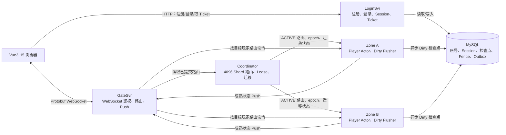
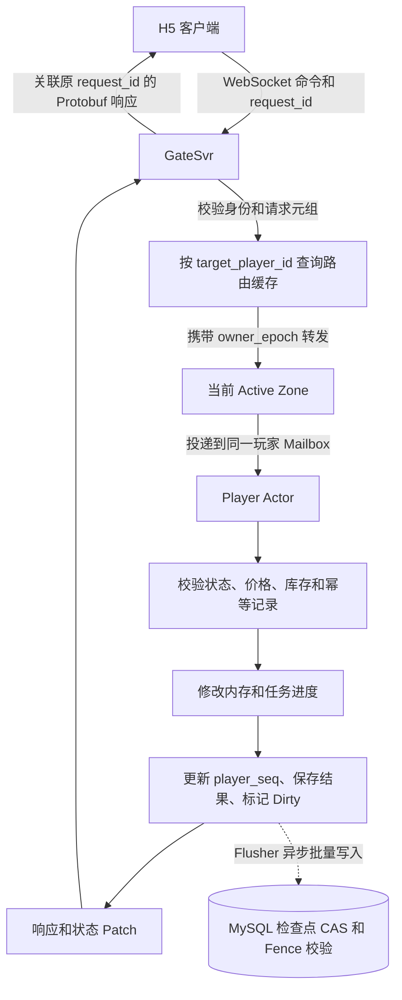
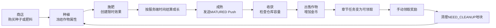
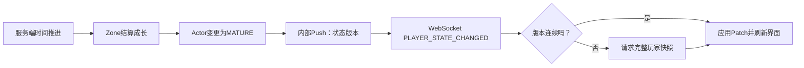
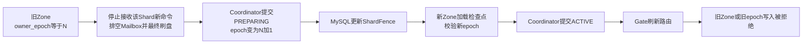

# 经典农场当前实现介绍

## 1. 这是什么项目

经典农场是一个 Go 后端、Vue 3 H5 客户端的农场游戏原型。它不只展示前端种菜流程，还验证一个有状态游戏后端的核心问题：

- 玩家命令如何经过认证、网关和路由，到达唯一的状态 Owner；
- 同一玩家的购买、种植、施肥、收获和领奖如何串行执行、幂等重试；
- 在线状态如何异步持久化，并在重启后恢复；
- 两个 Zone 如何按 Shard 分担玩家，避免旧 Owner 在迁移后继续写数据；
- 如何用可复现的小规模测量，支撑 3000 万 DAU 的架构设计和容量外推。

当前生产目标是 V3：**Player Actor + 唯一 Zone Owner + 异步 Dirty 检查点**。当前代码是该目标的本地缩小原型，不宣称已经实测支撑 3000 万 DAU。

## 2. 当前完成到什么程度

### 已实现并有证据

| 能力         | 当前实现                                                         | 已验证的结果                                     |
| ---------- | ------------------------------------------------------------ | ------------------------------------------ |
| 注册、登录与游戏连接 | HTTP Session、CSRF、一次性 WebSocket Ticket、Protobuf WebSocket 鉴权 | 可复现协议 E2E；H5 手工登录验证                        |
| 单玩家农场闭环    | 买种子/肥料、种植、施肥、成长、成熟 Push、收获、出售、领奖、清理                          | 完整链路到 `player_seq=8`；命令具备幂等结果              |
| 玩家状态       | 一个 Player Actor 维护金币、仓库、十六块地、章节任务、近期请求结果、Outbox 和版本          | 同一玩家 Mailbox 串行；不同玩家可并行                    |
| MySQL 恢复   | 注册、Session、玩家检查点；Dirty 异步写回、CAS 与 Fence 校验                   | 多进程停启后恢复完整单玩家状态                            |
| 双 Zone     | 4096 逻辑 Shard、Rendezvous 初始安置、Gate 路由缓存、错误 Owner 拒绝          | 两个 Zone 路由隔离、`NOT_OWNER` 刷新重试              |
| Shard 迁移   | 空闲/活跃 Shard 的 PREPARING、排空、最终刷盘、Fence epoch 切换、目标 Zone 准备    | 活跃迁移后旧 Zone 拒绝写；Coordinator 重启可恢复迁移进度      |
| 基础性能       | 真实认证与 WebSocket 链路上的闭环 `GET_PLAYER_SNAPSHOT` 压测              | 本机 50 虚拟用户约 16,080.84 QPS、P99 9.225 ms、零错误 |

### 尚未实现或尚未验证

- 好友关系、分享链接、访问好友农场、偷菜结算和最多三人同步；
- Outbox Relay、邮件投递和邮件 UI；
- MySQL 模式的浏览器完整主人环证据仍待补齐；
- Actor 写路径、Push、Dirty 刷盘和资源占用的完整性能矩阵；
- Zone 异常终止时 Dirty 未刷盘窗口的实测；
- 生产三节点 Coordinator、自动故障切换、跨 Gate Push 重试、真实多机大规模容量。

## 3. 实际运行拓扑

本地双 Zone + MySQL 模式下，系统由一个 H5、四类后端角色和一个 MySQL 实例组成。Coordinator 在本地是单进程兼容原型；生产目标才是多数派控制面。



### 各角色的职责

| 角色          | 职责                                            | 不负责什么                |
| ----------- | --------------------------------------------- | -------------------- |
| LoginSvr    | 账号、密码校验、Session、CSRF、WebSocket Ticket、客户端配置入口 | 不保存在线农场状态            |
| GateSvr     | 持久 WebSocket、身份绑定、路由、命令转发、Push 订阅与版本处理        | 不直接修改玩家游戏状态          |
| Coordinator | 维护本地原型的 Shard Owner、epoch、Lease 和迁移状态         | 不在每条普通命令的热路径参与路由     |
| ZoneSvr     | Player Actor、命令校验、业务状态变更、Dirty 标记和后台刷盘        | 不信任客户端价格、成熟状态或奖励     |
| MySQL       | 账号/Session、最近检查点、Fence、迁移进度和 Outbox           | 不充当活跃 Actor 的同步在线事实源 |

## 4. 一次游戏命令如何执行

客户端使用同一条 WebSocket 发送游戏命令。Gate 从已认证连接得到调用者身份，按**目标玩家**计算 Shard 并将命令转发给当前 Owner Zone。Zone 内同一个玩家只有一个 Actor Mailbox，因此同一玩家的命令不会并发修改状态。



成功普通写命令的逻辑顺序是：

```text
校验当前状态
→ 原子修改 Actor 内存
→ 推进匹配的章节任务
→ player_seq 增加
→ 保存 request_id 的幂等结果与待投递 Outbox
→ checkpoint_revision 增加
→ 标记 Dirty
→ 向客户端响应
→ 后台批量写 MySQL
```

这里有两个版本号：

- `player_seq`：客户端可见的业务状态版本；与 `owner_epoch` 组成状态版本，用于快照和 Push 排序。
- `checkpoint_revision`：仅用于 MySQL 检查点 CAS；即使保存的是确定业务失败或清理旧幂等结果，也可以增加它而不增加 `player_seq`。

## 5. 玩家农场业务闭环

当前 H5 已提供商店、十六块地、仓库、金币、章节任务和工具操作。服务端实现的主人闭环如下：



关键业务规则：

- 种植时冻结作物的成熟阈值、成长速度和基础产量；后续改配置不会追溯影响已种植作物。
- 成长通过服务端时间差推导，不为每块地持续写库 tick。
- 肥料是限时效果；跨效果边界会按区间精确结算成长。
- 收获先检查完整产量能否进入仓库，不能则整次收获失败，避免部分发奖。
- 商店价格带版本号，客户端报价过期会被拒绝。
- 每个写命令携带 `request_id`；相同请求重试返回第一次结果，而不是重复扣金币或重复发物品。
- 章节奖励满仓时当前只写入待投递 Outbox；尚未实现实际邮件送达。

## 6. 成熟 Push 与客户端状态恢复

Zone 在本地扫描中发现作物成熟后，更新 Actor 状态并将 `PLAYER_STATE_CHANGED/MATURED` 发送给 Gate。Gate 在快照进行期间会缓冲更晚的 Push，按版本过滤旧消息。客户端发现版本缺口时请求完整快照恢复，而不是依赖本地猜测。



当前 Push 是本地 loopback 传输，不具备跨 Gate 投递、持久化重试和生产背压能力；断线后的正确性依赖重新连接后拉取权威快照。

## 7. 为什么需要双 Zone、epoch 和 Fence

玩家按照 `player_id` 映射到 4096 个逻辑 Shard。一个 Shard 在同一时刻只能有一个 Active Zone Owner。Gate 缓存已提交路由，普通命令不查询 Coordinator；遇到 `NOT_OWNER` 时才刷新路由并用同一个 `request_id` 重试。



迁移的目的不是追求本地高可用，而是证明以下安全性质：

- 同一 Shard 不会有两个可写 Owner；
- 活跃 Actor 在正常迁移时先刷盘，再切换 Owner；
- MySQL Fence 使旧 Zone 即使延迟执行，也无法用旧 epoch 覆盖新状态；
- Gate 的陈旧路由可以通过 `NOT_OWNER` 恢复。

本地原型已验证静态双 Zone、空闲 Shard 迁移、活跃 Shard MySQL 迁移和 PREPARING 进度恢复。生产需要三节点多数派 Coordinator；本地单节点不具备控制面高可用。

## 8. 持久化与故障边界

V3 的在线真相在活跃 Actor 内存中，MySQL 保存最近已刷新的检查点。这降低了普通写命令对数据库同步延迟的依赖，但意味着异常停止存在最近 Dirty 状态尚未写入的窗口。

| 场景 | 当前语义 |
|---|---|
| 普通命令成功返回 | 内存状态和幂等结果已经生效，后台等待 Dirty 刷盘 |
| 正常停机 | 应等待 Actor/Dirty 刷盘完成 |
| 可控 Shard 迁移 | 先排空和最终刷盘，再改变 Fence/epoch |
| 异常 Zone 退出 | 可能丢失最近尚未落库的普通游戏状态 |
| 重启后激活 Actor | 从 MySQL 最近检查点加载，不会静默创建默认状态 |
| 旧 Owner 延迟写入 | 被 MySQL Fence 和 epoch 拒绝 |

这是一项明确接受的 V3 取舍：用低延迟和批量写入，交换“异常情况下少量普通状态可回退”的风险。该边界已经有正常恢复和迁移证据；异常 Dirty 窗口的杀进程实验仍待补齐。

## 9. 当前性能基线

已完成真实 HTTP/CSRF/Ticket/Protobuf WebSocket 路径上的 `GET_PLAYER_SNAPSHOT` 闭环压测：压测客户端、Login、Gate、两个 Zone、Coordinator 和 MySQL 同机运行，预热 10 秒、采样 60 秒。

| 并发虚拟用户 | 成功 QPS | P50 | P95 | P99 | 错误数 |
|---:|---:|---:|---:|---:|---:|
| 1 | 3,094.83 | 0.519 ms | 0.554 ms | 1.029 ms | 0 |
| 10 | 13,250.00 | 0.602 ms | 1.512 ms | 2.090 ms | 0 |
| 25 | 15,046.84 | 1.512 ms | 3.172 ms | 4.523 ms | 0 |
| 50 | 16,080.84 | 2.749 ms | 6.094 ms | 9.225 ms | 0 |
| 100 | 13,846.43 | 6.245 ms | 15.066 ms | 23.256 ms | 0 |

50 并发是该机器、该只读场景的观察到的吞吐拐点；增加到 100 并发后吞吐下降、延迟上升，但仍零错误。压测还发现并修复了 Gate 到 Zone 的 HTTP 空闲连接回收时序问题。

这些数字不能外推成“已支持 3000 万 DAU”：当前只测了单机读路径，尚未测写 Actor、Push、Dirty、长期连接、资源占用和多机网络成本。完整数据见 `../evidence/2026-08-03-r3-snapshot-read-baseline.zh-CN.md`。

## 10. 如何在答辩中介绍项目

建议按以下顺序讲解：

1. **问题与取舍**：农场是一个有状态业务；用 Player Actor 解决同一玩家的串行修改，用异步 Dirty 降低普通命令延迟。
2. **可演示链路**：浏览器登录，完成买种、种植、施肥、成熟、收获、出售、领奖和清理。
3. **正确性机制**：`request_id` 幂等、`player_seq` 状态版本、MySQL `checkpoint_revision` CAS、Fence 和 epoch。
4. **分布式机制**：双 Zone 下 Gate 缓存路由，迁移时排空、刷盘、切 Fence、激活新 Owner，旧 Owner 写入被拒绝。
5. **性能与边界**：展示读路径基线与已修复问题；明确 3000 万 DAU 是按测量数据继续外推的生产设计目标。
6. **下一步**：Linux 演示部署、好友/偷菜/三人同步最小闭环、写路径与 Dirty 测量、云上小规模验证。

## 11. 文档阅读入口

- 当前事实与下一步：`../context/CURRENT.md`
- V3 目标架构与生产边界：`stateful-zone-v3-architecture.md`
- 单玩家业务规则：`single-player-vertical-loop-business-architecture.md`
- 精确 HTTP、WebSocket、数据和错误规则：`../contracts/`
- 双 Zone、迁移与恢复证据：`../evidence/2026-08-03-*.md`
- 当前中文性能报告：`../evidence/2026-08-03-r3-snapshot-read-baseline.zh-CN.md`
- 最终交付路线：Cursor 计划 `final-delivery-roadmap`

