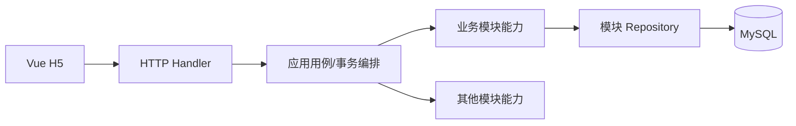

# 模块设计、接口能力与数据流

## 1. 文档定位

本文是 [整体设计](architecture.md) 的配套文档，面向后续模块实施和 AI 交接。它定义业务能力、数据所有权、调用方向、事务参与方式和关键错误，不在当前阶段锁定完整 HTTP 路径、JSON DTO、Go 函数签名、Repository 或 SQL。

本文仍包含 V1/V2 时期的 HTTP、数据库事务、行锁、`mature_at` 和异步 Task Service 描述，只能提取未被新决策覆盖的业务候选规则。当前实现边界以 [V3](stateful-zone-v3-architecture.md)、[单玩家纵向闭环业务架构](single-player-vertical-loop-business-architecture.md) 和最新 accepted ADR 为准。

## 2. 统一调用结构



- Handler 只负责协议、参数、身份和响应转换。
- 应用用例层负责一个完整业务动作以及事务边界。
- 模块领域能力负责规则和不变量。
- Repository 只能写本模块拥有的数据。
- 跨模块协作调用能力接口，不能从 Handler 或其他模块直接改表。
- 第一版跨模块强一致调用发生在同一进程、同一 MySQL 事务中；事务内禁止外部网络调用。

## 3. 各模块设计摘要

### 3.1 账号

- **目标**：建立玩家身份，向其他模块提供可信 `player_id`。
- **数据**：账号、密码摘要、玩家身份、Session。
- **主流程**：注册并初始化；登录创建 Session；鉴权；退出撤销 Session。
- **已确认规则**：单设备登录；每次登录后 Token 固定有效 1 小时，不滑动续期；新登录撤销旧 Session；用户名唯一；不保存明文密码/完整 Token；当前玩家只从 Session 得出。
- **注册失败语义**：本地单库原型中，`account + player + wallet + farm + initial_plots` 在同一事务创建，任一步失败则整体回滚，对外表现为“注册失败且账号不存在”。新手任务和欢迎邮件不进入该事务。生产目标中账号服务与玩家 Zone 已分离，初始化流程仍待确认。

### 3.2 资产

- **目标**：管理金币、种子、作物和普通奖励道具的余额与流水。
- **数据**：钱包、物品余额、物品配置、资产流水。
- **主流程**：查询；条件扣减；原子增加；按业务编号去重。
- **已确认规则**：初始金币 10；仓库最多占用 100 个不同物品格；每种物品最多堆叠 300 个；数量为 0 的物品不占格。
- **不变量**：余额非负；一次业务只入账一次；客户端不能调用通用发奖；资产变化与所属业务状态同事务；新增物品类型导致超格或堆叠超限时，整个业务原子失败。

### 3.3 商店

- **目标**：定义可买卖内容和服务端价格，编排购买与出售。
- **数据**：商品/回收配置、价格版本、交易记录。
- **主流程**：查询商品；购买种子时扣金币加种子；出售成熟作物时扣作物加金币。
- **不变量**：客户端价格不可信；金额用整数；相同请求不重复结算；余额不足或仓库超限时整体失败。
- **已确认规则**：页面展示并在提交时采用服务端当前价格；配置变更后展示新价格；第一版购买种子、出售成熟作物。

### 3.4 农场

- **目标**：维护农场和地块权威状态，完成种植、离线成熟、农场主收获和好友偷菜。
- **数据**：Player Actor 内的地块、种植配置快照、累计成长、肥料/虫害效果、偷菜信息、历史和版本。
- **主流程**：获取 Actor 权威快照；种植；按服务端时间惰性成长；施肥；成熟固化；收获；清理；好友投虫、捉虫和偷菜。
- **已确认规则**：收获后进入待清理状态，清理后才恢复空地；动态 Buff 使用分段成长；每轮成熟作物最多被好友偷取一次；偷菜不清空地块。
- **不变量**：一块地只有一轮种植；成熟前不能收获或偷取；一轮只由农场主收获一次；偷菜者必须是农场主的好友且不能是本人；同一地块上的偷菜与收获串行校验。生产目标在农场主分片原子提交地块、历史、`theft_order`、幂等结果和奖励 Outbox；偷菜者资产可靠异步到账。

### 3.5 任务

- **目标**：把同一 Player Actor 内的成功业务动作转成当前章节进度，达标后允许手动领取。
- **数据**：ConfigSvr 任务配置；Actor 内当前章节、进度、`CLAIMABLE`、领取状态和奖励结果。
- **主流程**：成功命令同步更新进度；全部达标；玩家手动领取；原子激活下一章。
- **已确认规则**：客户端不能上报进度或奖励；金币、普通物品和肥料可作为奖励；满仓物品生成邮件 Outbox。
- **不变量**：只有成功业务动作增加进度；相同 `request_id` 不重复推进；同一章节只领取一次；领取和下一章激活属于同一 Actor 状态变化。

### 3.6 好友与邀请

- **目标**：通过分享链接建立唯一好友关系，为好友农场访问和偷菜授权。
- **数据**：邀请 Token 哈希、有效期、撤销状态、规范化好友关系。
- **主流程**：生成链接；登录后接受；查询列表；校验访问/偷菜权限；可选删除。
- **已确认规则**：同一邀请链接在 30 分钟内可被不同玩家多次使用，不因第一次成功添加而消耗；好友可以访问农场并通过农场模块偷菜。
- **不变量**：不能添加自己；两人最多一条关系；关系对称；普通玩家最多 200 名好友；重复接受返回已有关系；过期、已撤销、超上限或限频邀请不可使用。
- **待确认**：删除好友是否进入第一版。

### 3.7 宠物

- **目标**：获得宠物、查看列表、选择一只在农场展示。
- **数据**：宠物定义、玩家拥有记录、展示选择。
- **阶段状态**：最终范围保留，本阶段不开发；获得来源、增益和重复拥有规则后续确认。

### 3.8 图鉴

- **目标**：记录曾经解锁的内容，不作为另一份仓库。
- **数据**：图鉴定义、玩家首次解锁记录。
- **阶段状态**：最终范围保留，本阶段不开发；条目类别、解锁条件和奖励规则后续确认。

### 3.9 邮件

- **目标**：展示系统邮件、记录已读、可靠领取一次附件。
- **数据**：邮件实例、正文/摘要、附件快照、阅读/领取状态、过期时间。
- **阶段状态**：奖励邮件创建和附件幂等领取进入分布式关键原型；完整运营邮件页面后续开发。满仓偷菜奖励邮件在领取前不自动过期。

### 3.10 实时同步

- **目标**：让进入同一农场的有权限玩家看到已提交变化；三客户端同时访问作为第一轮验收基线。
- **数据**：连接、房间、订阅在内存；农场/地块版本持久化。
- **主流程**：HTTP 快照；WebSocket 订阅；业务提交后广播；断线或版本缺口重新拉快照。
- **已确认规则**：产品规则不设置房间人数硬上限；好友写能力当前仅限调用农场模块的偷菜用例。
- **不变量**：数据库是最终事实；实时模块不直接修改农田或资产；提交前不广播；旧版本不覆盖新版本；订阅和写入分别鉴权。并发正确性从第一版就用地块行锁、状态复核和版本保证，吞吐优化留到出现证据后。

## 4. 对外 HTTP 能力目录

本表描述用例，不锁定 URL 和 DTO。`request_id` 只列在需要安全重试的关键写操作上。标为“后续”的能力不进入当前阶段实现。

| 模块 | 能力 | 身份 | 主要输入 | 主要输出 | 幂等/关键错误 |
|---|---|---|---|---|---|
| 账号 | 注册 | 匿名 | 用户名、密码、昵称 | 玩家摘要、可选 Session | 用户名冲突；初始化失败整体回滚 |
| 账号 | 登录 | 匿名 | 用户名、密码 | Session Token、到期时间、玩家摘要 | 凭据错误；账号禁用；旧 Session 撤销 |
| 账号 | 当前玩家 | 登录 | 无 | 玩家公开资料 | Session 失效/过期 |
| 账号 | 退出 | 登录 | 当前 Session | 成功 | 重复退出返回成功语义 |
| 资产 | 查询资产 | 登录 | 可选类别 | 金币、已占格数、物品列表 | 只能查询本人 |
| 商店 | 商品列表 | 登录 | 可选版本 | 种子商品、成熟作物回收价 | 配置不可用 |
| 商店 | 购买种子 | 登录 | 商品、数量、`request_id` | 实际价格、余额、获得种子 | 余额不足、仓库超限、价格变化、请求冲突 |
| 商店 | 出售成熟作物 | 登录 | 物品、数量、`request_id` | 实际价格、余额、剩余作物 | 库存不足、不可出售 |
| 农场 | 获取快照 | 登录 | 目标农场/玩家 | 服务端时间、地块版本与状态 | 无权限、目标不存在 |
| 农场 | 种植 | 登录 | 地块、作物、`request_id` | 权威地块状态 | 非空地、无种子、无权限 |
| 农场 | 农场主收获 | 登录 | 地块、`request_id` | 权威地块、获得作物 | 未成熟、空地、仓库超限、并发冲突 |
| 农场 | 好友偷菜 | 登录 | 目标地块、`request_id` | 偷取数量、地块版本、奖励投递状态 | 非好友、未成熟、已偷取、并发冲突 |
| 任务 | 任务与奖励记录 | 登录 | 可选分页 | 进度、完成状态、自动奖励记录 | 只能查询本人 |
| 好友 | 生成邀请 | 登录 | 无 | 30 分钟分享 Token/链接 | 频率限制 |
| 好友 | 接受邀请 | 登录 | Token、`request_id` | 好友关系摘要 | 过期、撤销、自加、已是好友 |
| 好友 | 好友列表 | 登录 | 分页 | 好友公开资料 | 稳定排序 |
| 好友 | 删除好友 | 登录 | 目标玩家、`request_id` | 删除结果 | 是否进入第一版待定 |
| 宠物 | 宠物列表/展示 | 登录 | 后续定义 | 后续定义 | 后续阶段 |
| 图鉴 | 图鉴列表 | 登录 | 后续定义 | 后续定义 | 后续阶段 |
| 邮件 | 奖励邮件/领取附件 | 登录 | 邮件或 `claim_id` | 附件与领取状态 | 重复领取、仓库仍满 |
| 实时 | 订阅农场 | 登录连接 | 农场、最近版本 | 订阅结果/刷新指令 | 无权限、版本缺口 |

## 5. 内部模块能力契约

| 提供方 | 候选能力 | 调用方 | 是否参与调用方事务 | 关键语义 |
|---|---|---|---|---|
| 账号 | `ResolveSession` | 所有 Handler | 否，读取 | 返回可信 `player_id`；固定 1 小时到期；新登录使旧 Session 失效 |
| 账号/玩家 | `GetPublicProfiles` | 好友 | 否，批量读取 | 只返回允许公开的资料 |
| 资产 | `DebitCoin` / `CreditCoin` | 商店、任务 | 是 | 条件扣减、原子增加、余额非负 |
| 资产 | `DebitItem` / `CreditItem` | 农场、商店 | 是 | 校验 100 格和单格 300 上限；稳定业务编号防重复入账 |
| 农场 | `GetSnapshot` | HTTP、实时 | 否，读取 | 统一计算成熟状态并返回版本 |
| 好友 | `CanViewFarm` / `CanStealCrop` | 农场、实时 | 否，读取 | 本人可查看；好友可查看并按规则偷菜 |
| 任务 | 消费领域事件 | 消息系统 | 否，独立事务 | `event_id` 去重；异步更新进度，完成后发送唯一奖励事件 |
| 实时 | `PublishCommittedPlot` | 农场 | 否，必须提交后 | 只广播已提交版本；失败不回滚业务 |
| 图鉴 | `UnlockFromFact` | 后续模块 | 后续确定 | 本阶段不实现 |
| 宠物 | `GrantPet` | 后续模块 | 后续确定 | 本阶段不实现 |
| 邮件 | `CreateRewardMail` / `ClaimAttachment` | 奖励消费者、HTTP | 否，独立事务 | `theft_id` 防重复邮件，`claim_id` 防重复入账 |

接口名只是语义占位，实施时可以调整。真正的契约是输入来源、数据所有者、事务关系、不变量和错误语义。

## 6. 关键数据流

### 6.1 注册与初始化

```text
H5 → 注册用例：用户名、密码、昵称
→ 开启一个 MySQL 事务
→ 创建 account + player + 10 金币 wallet + farm + initial_plots
→ 任一步失败：全部回滚，账号不存在
→ 全部成功：提交并返回玩家摘要 + Session
```

新手任务、欢迎邮件和其他后续模块不进入注册事务。注册后若立即登录，Session 遵循单设备和固定 1 小时规则。

### 6.2 购买种子

```text
H5 → 商店用例：商品、数量、request_id
→ 事务内读取服务端当前价格
→ 条件扣金币
→ 校验资产格数/堆叠并增加种子
→ 写交易、资产流水和幂等结果
→ 写行为 Outbox
→ 一并提交；任务服务异步消费
```

任何一步失败全部回滚；旧页面价格只用于展示，结算以提交时服务端价格为准。

### 6.3 种植

```text
H5 → 农场用例：plot_id、crop_id、request_id
→ 校验本人写权限并锁定地块
→ 读取作物配置和种子余额
→ 资产模块条件扣除种子
→ 写 planted_at、mature_at、原始产量快照、偷菜初始状态和版本
→ 写种植历史、幂等结果和行为 Outbox
→ 一并提交；任务服务异步消费
```

### 6.4 农场主收获

```text
H5 → 农场用例：plot_id、request_id
→ 锁地块并按 server_now 复核 mature_at
→ 计算 remaining_yield = original_yield - stolen_quantity
→ 校验资产容量并增加 remaining_yield
→ 保存收获历史，清空地块并递增版本
→ 写幂等结果和行为/广播 Outbox
→ 一并提交；任务和实时服务异步消费
```

若资产仓库已满，整个收获失败，作物仍保持成熟且可再次尝试。

### 6.5 出售成熟作物

```text
H5 → 商店用例：item_id、数量、request_id
→ 读取服务端当前回收价
→ 条件扣成熟作物并增加金币
→ 写交易、资产流水、幂等结果和行为 Outbox
→ 一并提交；任务服务异步消费
```

### 6.6 任务自动完成与发奖

任务没有手动领奖写接口。Zone 在购买、种植、收获或出售的本地事务中提交核心状态和行为 Outbox，然后立即返回；任务服务按 `event_id` 幂等消费，更新独立任务分片。达标时任务状态条件更新为完成，并产生唯一 `reward_id`；玩家 Zone 按 `reward_id` 幂等增加金币或物品，满仓物品转系统奖励邮件。任务服务或消息系统故障不回滚核心动作，恢复后从积压事件追平。
### 6.7 好友邀请与访问

```text
A → 好友用例：生成随机邀请 Token，保存哈希和 30 分钟过期时间
B/C/... → 登录后提交同一 Token
→ 校验未过期、未撤销、不是自己
→ 依赖规范化好友关系唯一约束创建或返回已有关系
→ 邀请不因成功使用而消耗，直至过期或撤销
→ 访问农场时调用 CanViewFarm
```

### 6.8 好友偷菜

```text
好友 → 农场 StealCrop：plot_id、request_id
→ 校验好友关系、200 好友上限相关状态并锁定成熟地块
→ 复核本轮尚未被偷，固化偷取量（演示：10 的 30%，即 3）
→ 农场主分片写 stolen_quantity、stolen_by、stolen_at、theft_order、版本、幂等结果和奖励 Outbox
→ 提交后返回 reward_pending，并广播地块新版本
→ 奖励消费者按 theft_id 向偷菜者分片幂等入库
→ 仓库满则按 theft_id 幂等创建不自动过期的系统奖励邮件
```

偷菜不清空地块。农场主与好友并发操作同一地块时都以农场主分片地块行为权威：农场主先提交则好友得到“已收获”；好友先提交则农场主随后收获剩余 7。偷菜事实不因奖励延迟回滚，实时模块不能直接写农田数据库。
### 6.9 多人同步

```text
HTTP 拉权威快照和版本
→ WebSocket 鉴权并订阅 farm_id
→ 所有写命令仍走农场 HTTP/应用用例
→ 数据库事务提交
→ 广播新版本和必要字段
→ 客户端发现断线或版本缺口后重新拉快照
```

产品规则不设置房间人数硬上限；第一轮只证明三个客户端可同时进入、观察和执行已授权的偷菜操作。

## 7. 横切契约

### 7.1 身份与数据可信度

- 当前玩家只来自 Session；目标玩家/农场可以是资源参数，但不能替换操作者身份。
- Session 登录后固定 1 小时到期，不滑动续期；新登录撤销该账号此前有效 Session。
- 客户端提交意图，不提交可信价格、成熟状态、产量、任务进度、奖励或偷取数量。

### 7.2 事务和副作用

- 应用用例拥有事务；Repository 不自行提交，模块能力接受同一事务上下文。
- 单玩家资产、地块、幂等结果和 Outbox 在玩家分片本地事务；任务、跨玩家奖励和邮件各自独立事务并通过可靠事件最终一致。
- 事务内禁止 WebSocket 广播和其他外部网络调用；只在提交后广播。
- 注册核心初始化失败整体回滚；宠物和图鉴不进入核心事务；奖励邮件通过幂等消息创建。

### 7.3 容量、幂等与并发

- 物品数量为 0 不占格；新增第 101 种物品或单种超过 300 时，整个业务失败。
- 顶层写操作用 `request_id` 重放已提交结果；事件、奖励、偷菜和邮件领取分别使用 `event_id`、`reward_id`、`theft_id`、`claim_id` 防重复效果。
- 余额使用条件原子更新；同一地块的种植、收获、偷菜使用短事务行锁并在锁内复核状态。
- 地块保存递增版本；状态冲突时客户端刷新权威快照，不允许旧状态覆盖新状态。

### 7.4 错误语义

统一错误至少覆盖：未认证、Session 过期、无权限、参数无效、资源不存在、状态冲突、余额不足、库存不足、仓库格数/堆叠超限、尚未成熟、本轮已偷、重复业务、限流和内部暂时失败。

错误返回稳定业务码和可展示消息，不暴露密码、Token、SQL 或堆栈。状态冲突响应应携带或引导刷新最新资源版本。

## 8. 实施前仍需产出的详细设计

每开始一个模块前，再补充对应实施计划：

1. 最终 HTTP 路径、请求/响应 DTO 和错误码；
2. Go 包结构、接口签名和依赖方向；
3. 表结构、索引、迁移和 Repository；
4. 事务具体由哪个应用用例开启；
5. 单元、集成、并发、回滚和端到端测试清单；
6. 该模块候选决定是否需要 ADR。

实施计划按目标架构六阶段展开：单玩家事务与 Outbox、两个无状态 Zone 和分片、异步任务、跨分片偷菜与邮件、实时同步与故障恢复、压测故障证据与方案修订。
