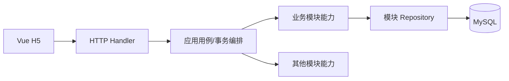
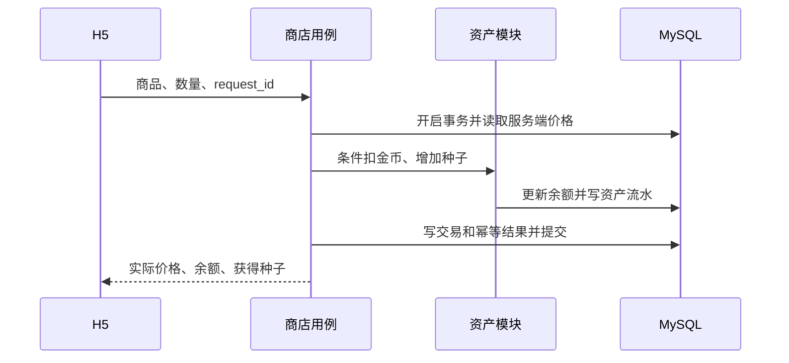

# 模块设计、接口能力与数据流

## 1. 文档定位

本文是 [整体设计](architecture.md) 的配套文档，面向后续模块实施和 AI 交接。它定义业务能力、数据所有权、调用方向、事务参与方式和关键错误，不在当前阶段锁定完整 HTTP 路径、JSON DTO、Go 函数签名、Repository 或 SQL。

状态沿用整体设计：除模块化单体外，本文内容均为候选，需在对应模块实施前确认并转化为计划、测试或 ADR。

## 2. 统一调用结构



- Handler 只负责协议、参数、身份和响应转换。
- 应用用例层负责一个完整业务动作以及事务边界。
- 模块领域能力负责规则和不变量。
- Repository 只能写本模块拥有的数据。
- 跨模块协作调用能力接口，不能从 Handler 或其他模块直接改表。
- 第一版跨模块强一致调用发生在同一进程、同一 MySQL 事务中；事务内禁止外部网络调用。

## 3. 各模块设计摘要

### 3.1 账号

- **目标**：建立玩家身份，向其他模块提供可信 `player_id`。
- **数据**：账号、密码摘要、玩家身份、Session。
- **主流程**：注册；登录创建 Session；鉴权；退出撤销 Session。
- **不变量**：用户名唯一；不保存明文密码/完整 Token；当前玩家只从 Session 得出；账号与玩家身份同事务创建。
- **待确认**：单设备或多设备、Session 有效期、注册后初始化失败语义。

### 3.2 仓库/资产

- **目标**：管理金币、种子、作物和普通奖励道具的余额与流水。
- **数据**：钱包、物品余额、物品配置、资产流水。
- **主流程**：查询；条件扣减；原子增加；按业务编号去重。
- **不变量**：余额非负；一次业务只入账一次；客户端不能调用通用发奖；资产变化与所属业务状态同事务。
- **待确认**：命名为资产或经济模块、初始金币、容量和资产上限。

### 3.3 商店

- **目标**：定义可买卖内容和服务端价格，编排购买与出售。
- **数据**：商品/回收配置、价格版本、交易记录。
- **主流程**：查询商品；购买时扣金币加种子；出售时扣作物加金币。
- **不变量**：客户端价格不可信；金额用整数；相同请求不重复结算；余额不足整体失败。
- **待确认**：页面旧价格的交互、第一版买卖范围。

### 3.4 农场

- **目标**：维护农场和地块权威状态，完成种植、离线成熟和收获。
- **数据**：农场、地块、作物配置、种植/产出快照、版本。
- **主流程**：获取快照；种植；按时间派生成熟；收获。
- **不变量**：一块地只有一轮种植；成熟前不能收获；一轮只收获一次；地块和资产同事务。
- **待确认**：收获后是否直接清空、种植历史、好友访问权限。

### 3.5 任务

- **目标**：把成功业务行为转成进度，并保证奖励只领取一次。
- **数据**：任务配置、玩家进度、领取状态、奖励快照、行为去重记录。
- **主流程**：接收成功行为；更新进度；查询；手动领取奖励。
- **不变量**：失败业务不增加进度；同一业务事实只贡献一次；未达标不能领取；领取状态与奖励同事务。
- **待确认**：任务清单、手动或自动领取、进度失败是否回滚核心动作。

### 3.6 好友与邀请

- **目标**：通过分享链接建立唯一好友关系，为好友农场访问授权。
- **数据**：邀请 Token 哈希、有效期、使用状态、规范化好友关系。
- **主流程**：生成链接；登录后接受；查询列表；校验访问；可选删除。
- **不变量**：不能添加自己；两人最多一条关系；关系对称；单次邀请的消耗与建关系同事务。
- **待确认**：链接单次/多次、删除好友、好友农场只读/互动。

### 3.7 宠物

- **目标**：获得宠物、查看列表、选择一只在农场展示。
- **数据**：宠物定义、玩家拥有记录、展示选择。
- **主流程**：受控业务来源发放；查询；选择展示。
- **不变量**：只能选择已拥有宠物；同种宠物第一版最多一只；当前展示最多一只。
- **待确认**：获得来源、是否有农场增益、是否允许重复拥有。

### 3.8 图鉴

- **目标**：记录曾经解锁的内容，不作为另一份仓库。
- **数据**：图鉴定义、玩家首次解锁记录。
- **主流程**：成功获得内容后尝试解锁；查询全量条目和解锁状态。
- **不变量**：每条目只解锁一次；解锁后不因出售回退；客户端不能直接解锁。
- **待确认**：条目类别、首次获得/收获条件、是否发奖励。

### 3.9 邮件

- **目标**：展示系统邮件、记录已读、可靠领取一次附件。
- **数据**：邮件实例、正文/摘要、附件快照、阅读/领取状态、过期时间。
- **主流程**：受控创建；列表/详情；标记已读；领取全部附件。
- **不变量**：只能读本人邮件；已读不等于已领取；附件全部成功或全部失败；最多领取一次。
- **待确认**：邮件来源、有效期、管理员发信和删除规则。

### 3.10 实时同步

- **目标**：让 2～3 名有权限玩家看到同一农场已提交变化。
- **数据**：连接、房间、订阅在内存；农场/地块版本持久化。
- **主流程**：HTTP 快照；WebSocket 订阅；提交后广播；断线或版本缺口重新拉快照。
- **不变量**：数据库是最终事实；提交前不广播；旧版本不覆盖新版本；订阅和写入分别鉴权。
- **待确认**：三人目标、好友写权限、本地可见延迟目标。

## 4. 对外 HTTP 能力目录

本表描述用例，不锁定 URL 和 DTO。`request_id` 仅列在需要安全重试的关键写操作上。

| 模块 | 能力 | 身份 | 主要输入 | 主要输出 | 幂等/关键错误 |
|---|---|---|---|---|---|
| 账号 | 注册 | 匿名 | 用户名、密码、昵称 | 玩家摘要、可选 Session | 用户名冲突；是否做请求幂等待定 |
| 账号 | 登录 | 匿名 | 用户名、密码 | Session Token、玩家摘要 | 凭据错误、账号禁用 |
| 账号 | 当前玩家 | 登录 | 无 | 玩家公开资料 | Session 失效 |
| 账号 | 退出 | 登录 | 当前 Session | 成功 | 重复退出返回成功语义 |
| 商店 | 商品列表 | 登录 | 可选版本 | 商品与服务端价格 | 配置不可用 |
| 商店 | 购买 | 登录 | 商品、数量、`request_id` | 实际价格、余额、获得物品 | 余额不足、价格变化、请求冲突 |
| 商店 | 出售 | 登录 | 物品、数量、`request_id` | 实际价格、余额、剩余物品 | 库存不足、不可出售 |
| 仓库 | 查询资产 | 登录 | 可选类别 | 金币、物品列表 | 只能查询本人 |
| 农场 | 获取快照 | 登录 | 目标农场/玩家 | 服务端时间、农场/地块版本与状态 | 无权限、目标不存在 |
| 农场 | 种植 | 登录 | 地块、作物、`request_id` | 权威地块状态 | 非空地、无种子、无权限 |
| 农场 | 收获 | 登录 | 地块、`request_id` | 权威地块、获得作物 | 未成熟、空地、并发冲突 |
| 任务 | 查询列表 | 登录 | 无 | 进度和领取状态 | 只能查询本人 |
| 任务 | 领取奖励 | 登录 | 任务、`request_id` | 领取状态、到账资产 | 未完成、已领取 |
| 好友 | 生成邀请 | 登录 | 可选失效时长 | 分享 Token/链接 | 频率限制 |
| 好友 | 接受邀请 | 登录 | Token、`request_id` | 好友关系摘要 | 过期、自加、已使用 |
| 好友 | 好友列表 | 登录 | 分页 | 好友公开资料 | 稳定排序 |
| 好友 | 删除好友 | 登录 | 目标玩家、`request_id` | 删除结果 | 是否进入第一版待定 |
| 宠物 | 宠物列表 | 登录 | 无 | 拥有和展示状态 | 只能查询本人 |
| 宠物 | 选择展示 | 登录 | 宠物编号 | 当前展示宠物 | 未拥有 |
| 图鉴 | 图鉴列表 | 登录 | 类别 | 条目与解锁状态 | 稳定配置版本 |
| 邮件 | 邮件列表/详情 | 登录 | 分页、邮件编号 | 摘要/正文/附件状态 | 越权、过期显示规则 |
| 邮件 | 领取附件 | 登录 | 邮件编号、`request_id` | 到账资产、领取状态 | 已领取、已过期 |
| 实时 | 订阅农场 | 登录连接 | 农场、最近版本 | 订阅结果/刷新指令 | 无权限、版本缺口 |

## 5. 内部模块能力契约

| 提供方 | 候选能力 | 调用方 | 是否参与调用方事务 | 关键语义 |
|---|---|---|---|---|
| 账号 | `ResolveSession` | 所有 Handler | 否，读取 | 返回可信 `player_id`，不接受客户端替换 |
| 账号/玩家 | `GetPublicProfiles` | 好友 | 否，批量读取 | 只返回允许公开的资料 |
| 资产 | `DebitCoin` / `CreditCoin` | 商店、任务、邮件 | 是 | 条件扣减、原子增加、余额非负 |
| 资产 | `DebitItem` / `CreditItem` | 农场、商店、任务、邮件 | 是 | 使用稳定业务编号防重复入账 |
| 农场 | `GetSnapshot` | HTTP、实时 | 否，读取 | 统一计算成熟状态并返回版本 |
| 好友 | `CanViewFarm` | 农场、实时 | 否，读取 | 本人直接允许；好友按规则授权 |
| 任务 | `RecordAction` | 农场、商店 | 待确认 | 同一业务事实只贡献一次 |
| 图鉴 | `UnlockFromFact` | 农场、宠物、资产编排 | 候选为提交后 | 幂等解锁，不阻塞核心资产待确认 |
| 宠物 | `GrantPet` | 任务、邮件等受控流程 | 发放业务事务内 | 重复发放返回既有语义 |
| 实时 | `PublishCommittedPlot` | 农场 | 否，必须提交后 | 广播失败不回滚业务 |

接口名只是语义占位，实施时可调整。真正的契约是输入来源、数据所有者、事务关系、不变量和错误语义。

## 6. 关键数据流

### 6.1 注册与初始化

```text
H5 → 账号用例：用户名、密码、昵称
账号事务：创建 account + player
提交后/可补建：初始化钱包、农场、地块、任务、欢迎邮件
返回：玩家摘要 + Session
```

待确认：业务初始化是否与注册同事务；若不在同一事务，必须依赖 `player_id` 唯一约束安全补建。

### 6.2 购买种子



事务所有者是商店购买用例；任何一步失败全部回滚。

### 6.3 种植

```text
H5 → 农场用例：plot_id、crop_id、request_id
→ 校验本人写权限并锁定地块
→ 读取服务端作物配置和种子余额
→ 资产模块条件扣除种子
→ 写 planted_at、mature_at、产出快照和版本
→ 写幂等结果并提交
→ 返回权威地块状态
```

事务所有者是农场种植用例。

### 6.4 收获

```text
H5 → 农场用例：plot_id、request_id
→ 锁地块并按 server_now 复核 mature_at
→ 资产模块增加固化产出
→ 清空地块并递增版本
→ 写幂等结果并提交
→ 提交后尝试图鉴解锁/实时广播
```

事务所有者是农场收获用例。任务进度和图鉴是否在事务内仍待确认。

### 6.5 出售作物

```text
H5 → 商店用例：item_id、数量、request_id
→ 读取服务端回收价
→ 资产模块条件扣作物并增加金币
→ 写交易、流水和幂等结果并提交
→ 返回实际价格和新余额
```

### 6.6 任务领奖与邮件附件

```text
锁定任务/邮件领取记录
→ 检查资格、未领取和过期规则
→ 从服务端奖励快照得到资产内容
→ 资产模块全部入账
→ 标记已领取并写幂等结果
→ 同一事务提交
```

事务所有者分别是任务领取用例和邮件领取用例。相同请求重放原结果，不同请求仍由业务领取状态阻止重复发放。

### 6.7 好友邀请与访问

```text
A 生成随机分享 Token
→ B 打开链接，未登录则登录后保留 Token
→ 好友用例锁定邀请，校验过期、自加和现有关系
→ 事务内创建规范化 friendship 并消耗邀请
→ B 请求 A 的农场
→ 农场模块调用 CanViewFarm
→ 返回只读访客快照或拒绝
```

### 6.8 多人同步

```text
HTTP 获取快照与版本
→ WebSocket 鉴权并订阅 farm_id
→ 客户端仍通过农场写用例提交操作
→ 数据库事务提交状态和新版本
→ 提交后广播完整地块新状态
→ 客户端忽略旧/重复版本
→ 断线或版本缺口时重新获取快照
```

实时模块不参与业务判定，也不拥有持久化地块状态。

## 7. 横切契约

### 7.1 身份与数据可信度

- 当前玩家只来自 Session；目标玩家/农场可以是资源参数，但不能替换操作者身份。
- 价格、奖励、产量、成熟状态、进度和附件内容来自服务端配置或已提交业务事实。
- 时间判断统一使用服务端时间，存储建议使用 UTC。

### 7.2 事务和副作用

- 应用用例层开启并提交事务；被调用模块只参与，不擅自提交。
- 资产、地块和领取状态等强一致数据必须在同一事务。
- 外部网络、WebSocket 广播和可重建展示不能放在事务中。
- 提交后副作用必须允许失败，并有重试、重建或快照恢复方案。

### 7.3 幂等与并发

- `request_id` 解决同一请求超时重试；业务状态/唯一约束解决不同请求重复同一业务。
- 顶层业务保存可重放结果；资产流水用稳定业务编号防内部重复。
- 余额扣减使用条件更新；同一地块、任务或邮件领取使用行锁或条件状态更新。

### 7.4 错误语义

稳定错误类别至少包括：未认证、无权限、参数无效、资源不存在、状态冲突、余额不足、尚未成熟、已领取/重复业务、请求号冲突、限流和内部暂时失败。

内部错误不得泄漏密码、Token、SQL 或堆栈。状态冲突和版本落后应引导客户端刷新权威状态。

## 8. 实施前仍需产出的详细设计

每开始一个模块前，再补充对应实施计划：

1. 最终 HTTP 路径、请求/响应 DTO 和错误码；
2. Go 包结构、接口签名和依赖方向；
3. 表结构、索引、迁移和 Repository；
4. 事务具体由哪个应用用例开启；
5. 单元、集成、并发、回滚和端到端测试清单；
6. 该模块候选决定是否需要 ADR。

第一阶段优先把账号、资产、商店、农场和任务写到上述详细程度；后续模块在进入其阶段时再展开。
