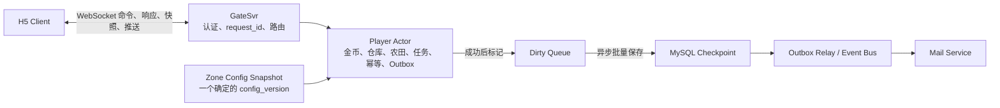
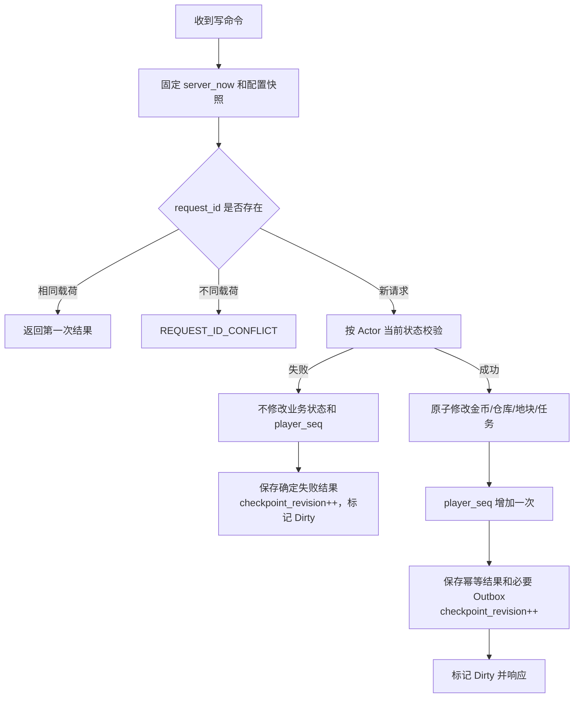
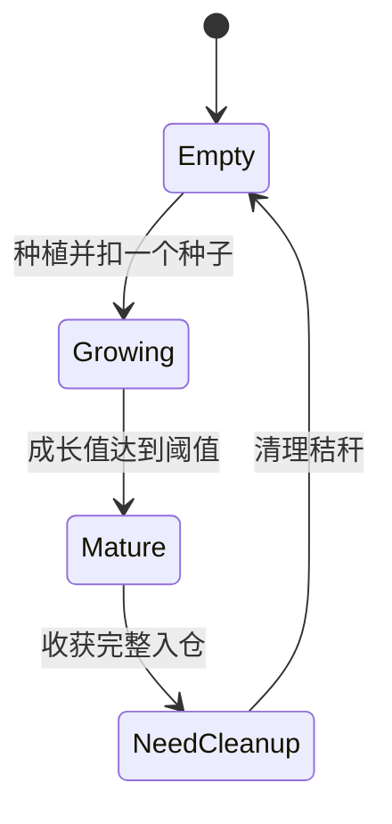
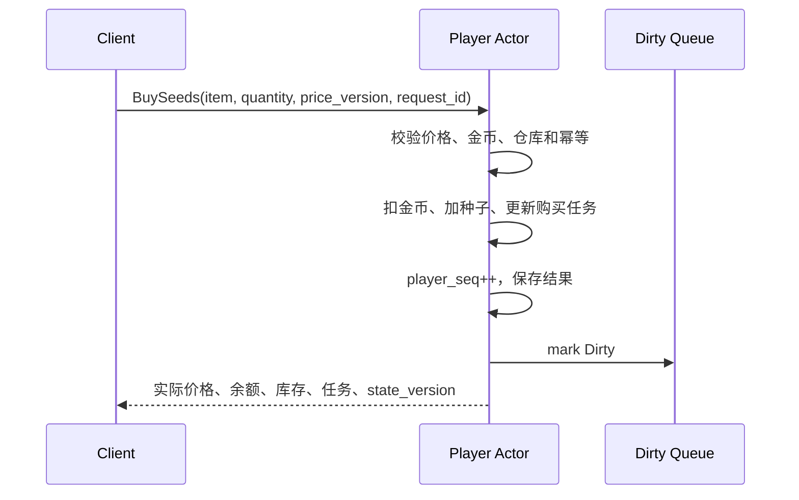

# 第一条单玩家纵向闭环业务架构

## 1. 目标与范围

第一条业务闭环：

```text
购买种子
→ 种植
→ 施肥
→ 成长与成熟
→ 收获入仓
→ 出售换金币
→ 任务更新
→ 手动领取章节奖励
→ 清理秸秆
```

本阶段只设计和实现这条闭环。好友投虫、捉虫和清理保留业务接口，但不阻塞单玩家闭环；好友消耗自己的肥料给对方施肥、天气、宠物 Buff、随机产量和肥料增产延期。

本文件定义业务所有权、状态机、不变量和流程，不锁定 WebSocket DTO、Go 接口或存储格式。

## 2. 业务所有权



一个 Player Actor 同时拥有：

```text
金币
仓库
农田和地块
当前任务章节与进度
近期 request_id 结果
player_seq
checkpoint_revision
待落库 Outbox
```

同玩家命令由 Mailbox 串行执行。单玩家闭环不使用数据库行锁作为在线并发主流程。

## 3. 命令通用语义



成功命令使用：

```text
Validate current state
→ Apply Actor memory atomically
→ update matching task progress
→ player_seq++
→ save request result and pending Outbox
→ checkpoint_revision++
→ mark Dirty
→ reply
```

失败命令：

- 不扣金币或道具；
- 不修改地块；
- 不增加任务；
- 不增加 `player_seq`；
- 不创建奖励 Outbox。
- 保存确定失败结果时只增加 `checkpoint_revision` 并标记 Dirty，保证相同 `request_id` 重放第一次失败。

`(owner_epoch, player_seq)` 用于快照、推送排序和缺口检测，不要求每条业务命令强制匹配全局 `player_seq`。命令根据当前权威状态和资源条件重新校验。

`checkpoint_revision` 只用于检查点内容变更和 Dirty CAS，不发送给客户端。幂等窗口清理和 Outbox 对账同样只增加它。

近期幂等结果每名玩家同时限制为最近 100 个和最长 24 小时。

## 4. ConfigSvr 规则

- ConfigSvr 是全服配置权威；
- Zone 原子替换带版本的完整配置快照；
- 单条命令只能使用一个确定的快照；
- 作物种植时固化成长阈值、基础速度和基础产量；
- 肥料或虫害施加时固化倍率、开始和结束时间；
- 商品拥有独立 `price_version`；
- 价格版本变化时拒绝成交，客户端刷新确认后使用新 `request_id`；
- 作物、肥料和虫害配置只能停用，不能物理删除。

客户端不能提交可信价格、成长速度、成熟状态、产量、任务进度或奖励。

## 5. 初始资源与仓库

注册初始化：

```text
金币 10
普通肥料 1
```

第一章需要购买三个种子，因此三个目标种子的总价不得超过 10。

仓库规则：

- 最多 100 种物品；
- 每种最多 300 个；
- 数量为零不占格；
- 购买、收获和奖励入仓都由服务端最终校验；
- 普通购买和收获不允许部分成功。

## 6. 地块状态机



状态规则：

| 状态 | 允许动作 |
|---|---|
| `EMPTY` | 种植 |
| `GROWING` | 施肥、投虫、捉虫 |
| `MATURE` | 收获 |
| `NEED_CLEANUP` | 清理秸秆 |

肥料和虫害是 `GROWING` 上的限时效果槽，不是独立主状态。

地块至少保存：

```text
plot_id
plot_state
crop_id
crop_config_version
planted_at
maturity_value
base_growth_rate
base_yield
stolen_quantity
settled_growth_value
last_settled_at
estimated_mature_at
fertilizer_effect
pest_effect
```

`estimated_mature_at` 是调度和倒计时缓存，可以从权威成长字段重建。

## 7. 成长与 Buff

### 7.1 业务公式

第一版可以使用：

```text
成熟值 = 100
基础速度 = 1
肥料修正 = +0.5
虫害修正 = -0.3

只有肥料：1.5
只有虫害：0.7
同时存在：1.2
```

按时间区间结算：

```text
growth += elapsed × effective_growth_rate
mature = growth >= maturity_value
```

每次改变效果前：

```text
先按旧速度结算到 server_now
→ 更新 settled_growth_value 和 last_settled_at
→ 改变效果
→ 重新计算 estimated_mature_at
```

服务端使用十进制定点计算，内部不限制两位小数。客户端只显示预计成熟倒计时，不显示权威成长小数。

时间回拨时：

```text
effective_now = max(server_now, last_settled_at)
```

同时告警，成长值不得倒退。

### 7.2 肥料槽

```text
effect_instance_id
fertilizer_id
config_version
modifier
start_at
end_at
```

- 同时最多一个肥料效果；
- 有效期间拒绝再次施肥并保留道具；
- 过期后可以再次施肥；
- 区间为 `[start_at, end_at)`；
- 第一条闭环只能给自己的地块施肥；
- 成熟后不能施肥。

### 7.3 虫害槽

```text
effect_instance_id
pest_id
source_player_id
config_version
modifier
start_at
end_at
```

- 同时最多一个虫害；
- 有虫期间拒绝再次投虫；
- 自然结束或被捉后可以再次投虫；
- 投虫者不能捉自己投的虫；
- 成熟后虫害立即失效。

过期效果在相关历史区间结算完成前不能删除。

## 8. 倒计时、展示和成熟

### 8.1 客户端展示

客户端获得：

```text
server_now
estimated_mature_at
```

并显示“距离成熟还有多久”。种子、发芽和半成熟只由客户端根据时间比例切换图片：

- 不持久化；
- 不增加 `player_seq`；
- 不产生 Dirty；
- 服务端不推送纯展示节点。

### 8.2 本地原型调度

- 在线 Actor 使用一秒 Tick 检查成熟；
- Tick 不逐秒修改成长值；
- 成熟推送允许最多约一秒延迟；
- 权威成熟时刻必须按公式推导。

### 8.3 生产调度

生产目标每个 Actor 最多登记一个最近关键时间：

```text
最早肥料结束
最早虫害结束
按当前状态预测的最早成熟
```

种植、施肥、投虫和捉虫后重新安排。

### 8.4 成熟固化

首次成熟原子执行：

```text
成长值封顶
→ plot_state = MATURE
→ 终止肥料和虫害
→ 清除 estimated_mature_at
→ player_seq++
→ checkpoint_revision++
→ 标记 Dirty
→ 推送成熟
```

Actor 激活时立即固化离线期间已经成熟的地块。多块地按稳定 `plot_id` 顺序处理，每块分别增加一次 `player_seq`，激活完成后向首次请求返回最终完整快照。

## 9. 核心业务流程

### 9.1 购买种子



任一条件失败则全部不生效。超容量不自动缩减数量。

### 9.2 种植

校验农场主身份、空地、配置启用和种子库存。成功时：

```text
扣一个种子
→ 固化作物字段
→ settled_growth_value = 0
→ last_settled_at = planted_at = server_now
→ 清空效果槽
→ plot_state = GROWING
→ 计算 estimated_mature_at
→ 种植任务 +1
→ player_seq++
```

### 9.3 施肥

校验成长中、尚未成熟、肥料槽为空和肥料库存。成功时先结算旧成长区间，再扣肥料、写效果、重算成熟时间、推进施肥任务并增加一次 `player_seq`。

### 9.4 收获

```text
harvest_quantity = base_yield - stolen_quantity
```

第一版没有随机产量，肥料只影响速度。

若仓库不能完整容纳，整个收获失败，成熟作物保留。成功时完整入仓、地块进入 `NEED_CLEANUP`、收获任务增加一次。

### 9.5 清理

- 农场主和好友均可；
- 立即完成；
- 不消耗资源；
- 不发奖励；
- 第一版不计任务；
- 成功后地块回到 `EMPTY`。

### 9.6 出售

支持指定数量和出售全部。校验库存、可出售状态和 `price_version`。成功时扣作物、按当前整数价格加金币、按出售数量推进任务。

## 10. 章节任务

任务状态属于 Player Actor，见 ADR-0009。

五个任务同时展示：

```text
购买种子 3 个        按数量
种植 1 次            按成功次数
施肥 1 次            按成功次数
收获 1 次            按成功次数
出售作物 1 个        按数量
```

规则：

- 只由服务端成功业务动作推进；
- 客户端不能上报；
- 默认不追溯章节开放前行为；
- 全部达标后进入 `CLAIMABLE`；
- 玩家手动领取。

第一章奖励：

```text
金币 10
普通肥料 1
南瓜种子 3
```

领取命令原子执行：

```text
校验可领取且未领取
→ 金币入账
→ 可容纳物品入仓
→ 放不下的物品生成 CreateRewardMail Outbox
→ 第一章标记已领取
→ 第二章激活
→ player_seq++
```

响应区分“已入仓”和“邮件待送达”。邮件真正创建前不能声称邮件已经存在。

第二章在领取第一章奖励后激活，包含三个好友任务：添加 1 位好友、偷取
1 次好友作物、给好友农场投虫 1 次。第二章奖励为金币 10、普通肥料 5、
西瓜种子 10。第二章是当前演示版本的终章；领取后保留第二章及其完成进度，
状态改为 `CLAIMED`，不要求不存在的下一章配置。

H5 可翻页查看第一、二章。当前章节进入 `CLAIMABLE` 时任务入口显示本地
“待查看”红点，打开任务面板即清除；这只表示玩家已看到可领奖提示，不改变
服务端任务状态，也不等于领取奖励。

## 11. 好友扩展接口

### 11.1 投虫与捉虫

- 只有好友可以投虫；
- 第一版投虫不消耗道具；
- 命令直接路由到农场主 Actor；
- 农场主和非虫害来源好友可以捉虫；
- 投虫者不能捉自己投的虫；
- 捉虫立即结束效果，不发奖励；
- 并发捉虫第一条成功，后续返回“虫害已解除”。

### 11.2 跨玩家施肥

好友若消耗自己的肥料给目标农田施肥，会同时修改两个 Actor，不能使用单玩家原子操作。该玩法延期到跨玩家阶段，再选择预留或 Outbox 加补偿方案。

## 12. Dirty、恢复与回收

一次 Dirty 落库原子保存：

```text
Player Checkpoint
+ player_seq
+ checkpoint_revision
+ owner_epoch
+ recent request results
+ pending Outbox
```

异常 Zone 故障可能让金币、仓库、农田、任务、幂等结果和 Outbox 一起回退到最近检查点。客户端在新 `owner_epoch` 下必须接受完整快照。

Actor 只有在无连接、无人订阅、Mailbox 为空、无迁移或刷盘且空闲三分钟后才能回收。Dirty 必须先刷盘成功。

## 13. 第一轮验收场景

1. 购买、种植、施肥、成熟、收获、出售、任务和领奖闭环成功；
2. 相同请求重试不重复生效；
3. 相同 `request_id` 不同载荷返回冲突；
4. 价格变化要求刷新并使用新请求；
5. 肥料有效期间重复使用不扣道具；
6. 肥料与虫害重叠时分段成长正确；
7. 离线期间效果过期和作物成熟正确恢复；
8. 多块地离线成熟后返回最终权威快照；
9. 满仓时收获整体失败；
10. 任务只由成功动作推进，奖励只能领取一次；
11. 满仓任务奖励只生成一个邮件 Outbox；
12. 正常回收和停机刷完 Dirty；
13. 强杀 Zone 后展示允许的最近状态回退。
