# 经典农场 V2：有状态 Player Actor 目标架构

## 1. 文档定位

本文是对现有无状态 V1 的独立候选方案，不直接覆盖 V1，也不声称已经实现或达到 3000 万 DAU。V2 选择有状态 Player Actor 作为在线运行模型，同时要求已经成功响应的写操作可恢复。

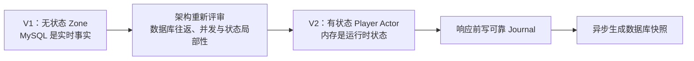

V2 的四个核心不变量：

1. 一个逻辑分片同一时刻只有一个具备写权限的 Active Zone Owner。
2. 同一玩家的写命令在一个 Player Actor 邮箱内串行执行。
3. 写命令只有在 Durable Journal 可靠提交后才能修改正式内存并返回成功。
4. 玩家状态可以由“最近快照 + 快照后的连续 Journal 事件”确定性恢复。

## 2. 总体架构

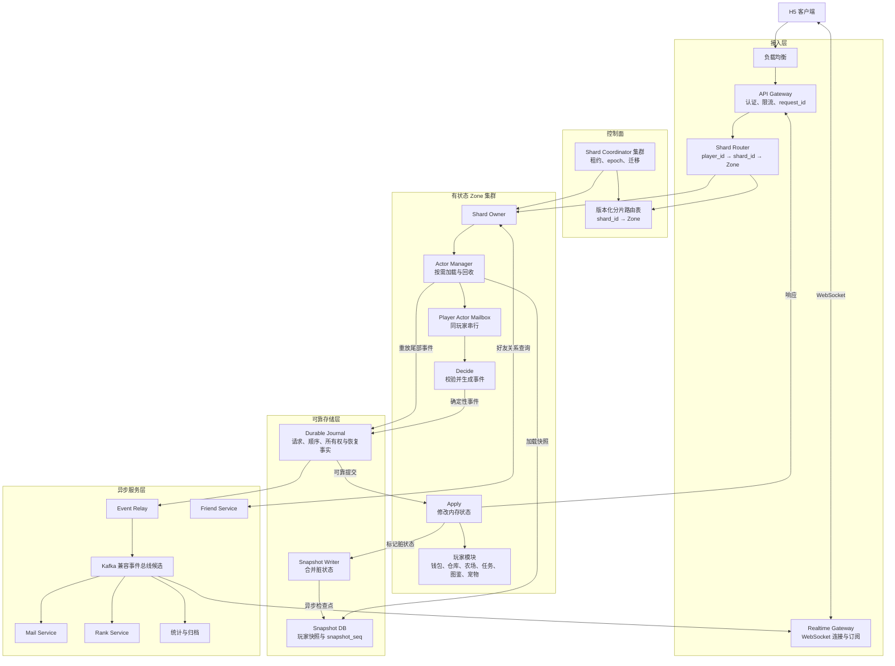

状态权威关系：

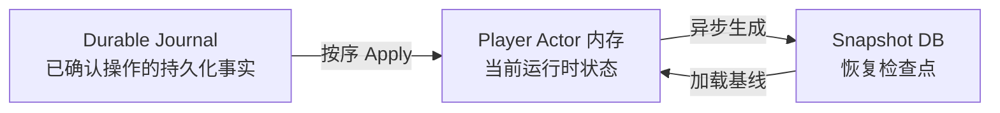

## 3. 路由与 Shard Coordinator

### 3.1 分片关系

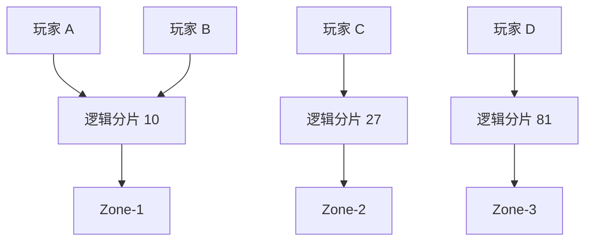

`shard_id = hash(target_player_id) % 1024`。一个 Zone 可持有多个逻辑分片，一个逻辑分片包含多个玩家；1024 是当前规划假设，仍需验证迁移粒度和路由表开销。

### 3.2 Coordinator 内部职责

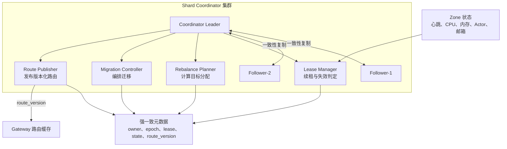

Coordinator 不进入普通请求的数据面：

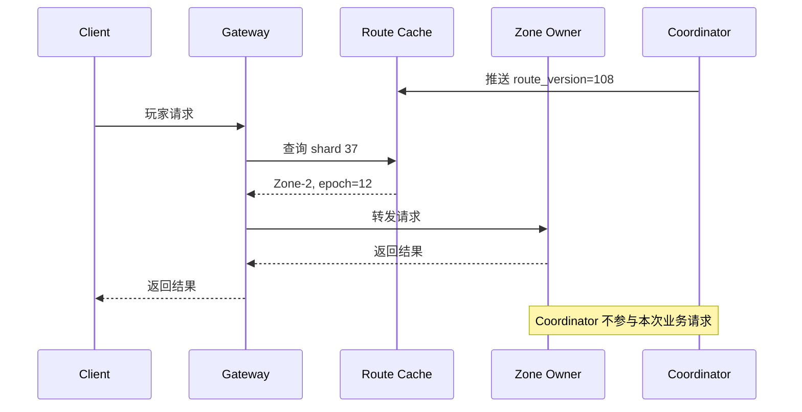

### 3.3 所有权状态机

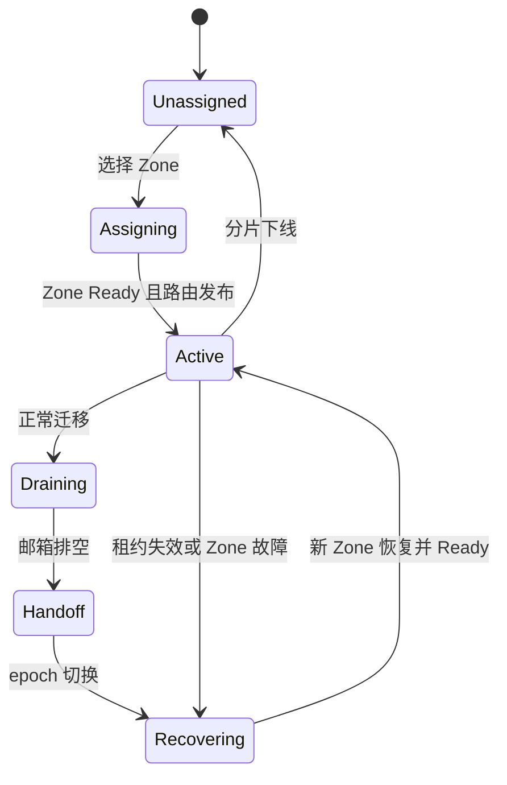

### 3.4 旧路由刷新

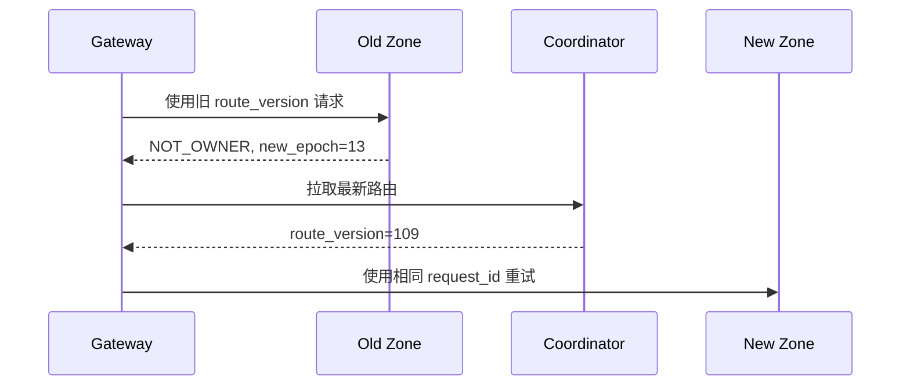

## 4. Player Actor

### 4.1 Zone、分片与 Actor

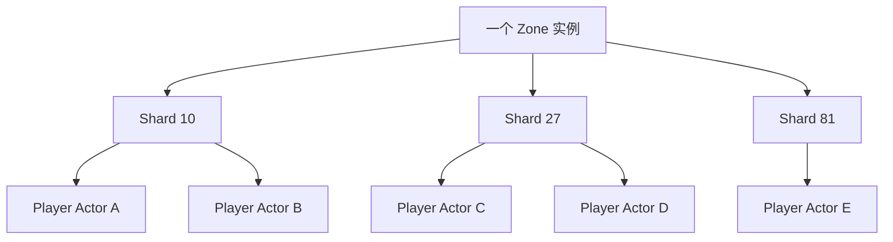

### 4.2 Actor 内部模块

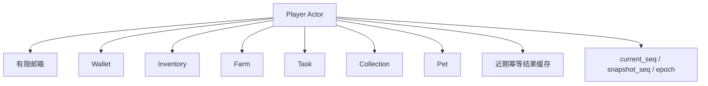

钱包、仓库、农场、任务、图鉴和宠物保持代码模块隔离，但共享同一玩家状态机；需要一起变化的数据可由一个事件原子 Apply。

### 4.3 Actor 生命周期

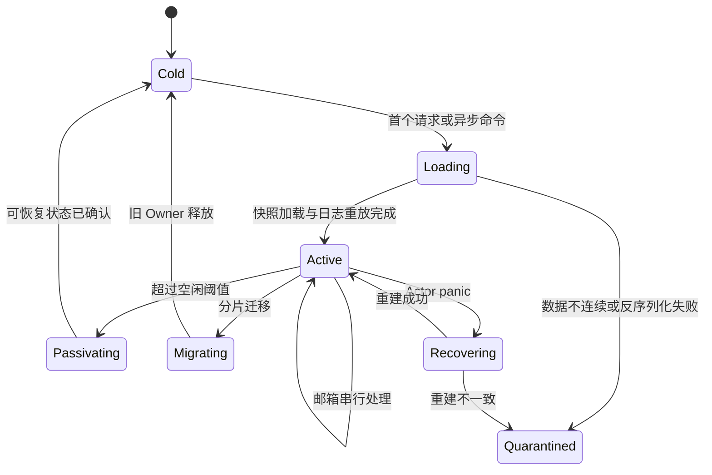

邮箱达到上限时返回 `PLAYER_BUSY`，不能无限排队。V2 第一版在等待 Journal 提交期间不执行该玩家的后续写命令，避免重入破坏顺序；不同玩家 Actor 仍可并行。

## 5. 写请求与可靠持久化

### 5.1 单玩家写入时序

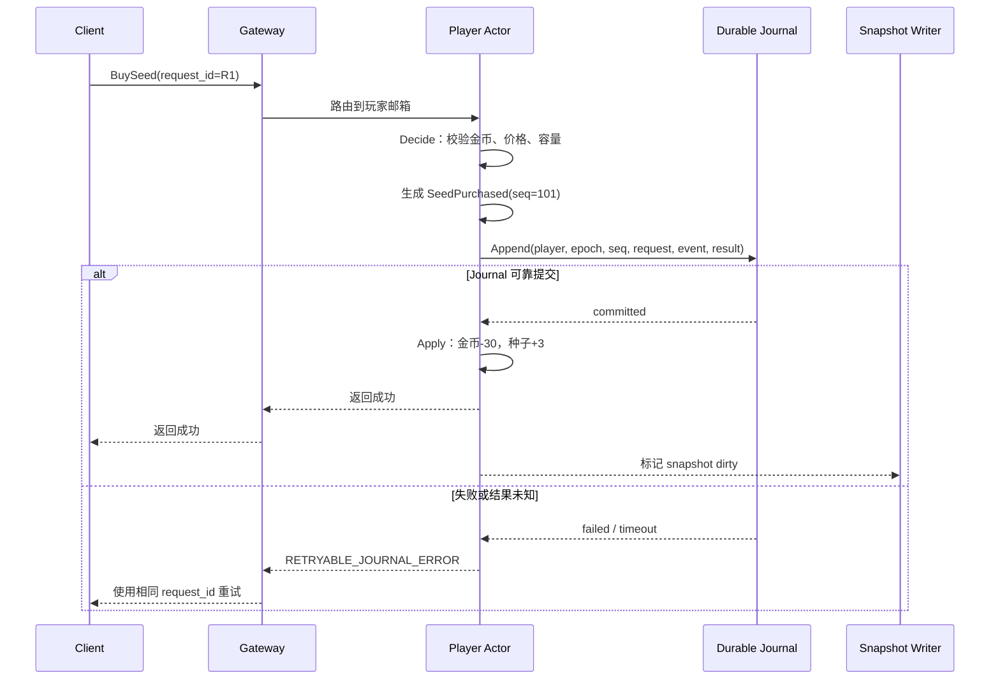

### 5.2 Decide 与 Apply

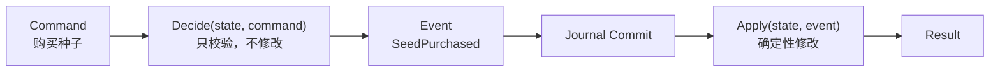

随机奖励、服务端时间结果和配置版本必须在 Decide 时固化进 Event。Apply 与日志重放不得重新随机、重新读取当前时间或依赖已变化的配置。

### 5.3 Journal 记录

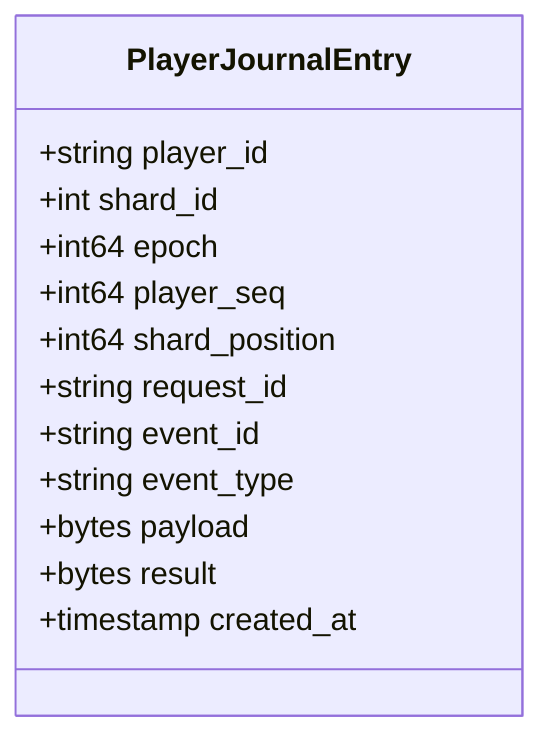

必须满足：

- `(player_id, player_seq)` 唯一且连续；
- `shard_position` 是 Journal 分片内的单调位置，用于迁移追平和 Event Relay 检查点，不代替玩家序号；
- `(player_id, request_id)` 唯一；
- 旧 `epoch` 写入被拒绝；
- 只有满足目标多副本持久化条件才返回 committed；
- Journal 后端产品、分片数、保留期和清理方式仍待选型与验证。

## 6. 快照、加载与恢复

### 6.1 异步快照

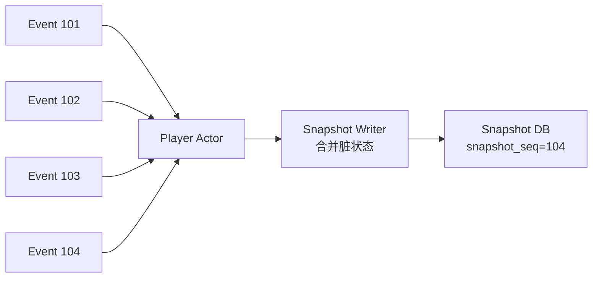

快照失败时 Journal 仍保证恢复，但日志尾部会增长。系统必须监控最老快照落后时间、最大版本差、脏 Actor 数、重试数和预计恢复耗时；超过保护阈值时限制相关分片写入。

### 6.2 加载与重放

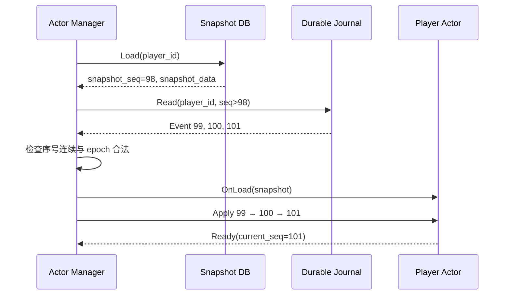

若序号缺口、快照损坏或事件无法确定性 Apply，Actor 进入 `Quarantined`，停止写服务并报警。

### 6.3 响应丢失后的幂等重试

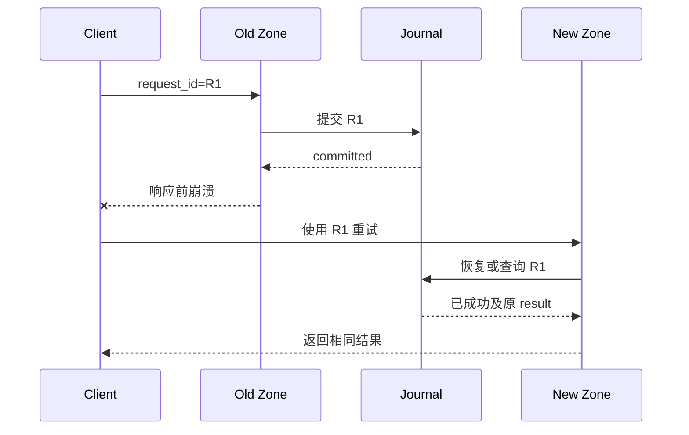

## 7. 异步事件与跨玩家流程

### 7.1 Journal 与事件总线的职责

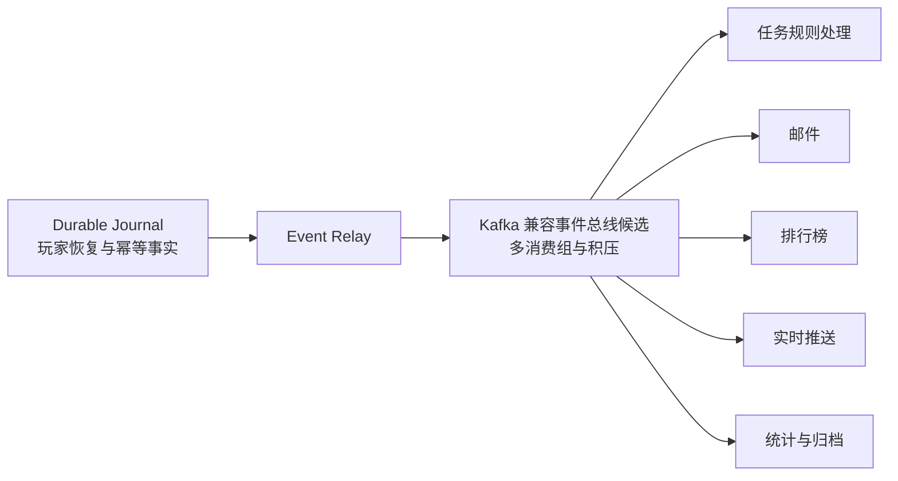

Kafka 类系统不直接被定义为第一版唯一的玩家随机恢复存储；它承担下游传播。若未来希望合并 Journal 与消息系统，必须先解决按玩家随机恢复、快照截断、长期保留和所有权 fencing。

任务规则处理器消费农场事件并生成幂等的 `AdvanceTaskProgress` 命令，再按玩家路由回 Player Actor。Player Actor 保存玩家任务进度和领奖幂等状态；任务规则处理器只负责规则计算，不形成第二份可写任务状态。

### 7.2 偷菜与奖励

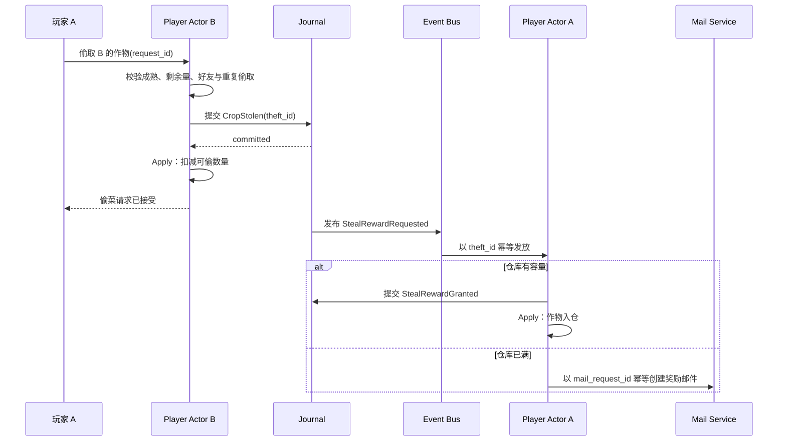

偷菜事实属于农场主 B；奖励属于玩家 A。两者是两个可靠步骤，不使用跨 Zone 分布式事务，奖励允许异步到账。

### 7.3 数据归属

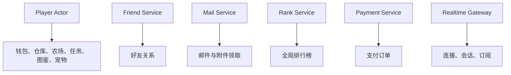

## 8. HTTP 快照与 WebSocket 增量

```mermaid
sequenceDiagram
    participant C as Client A
    participant R as Realtime Gateway
    participant Z as Player Actor B

    C->>R: Subscribe(farm=B)
    R-->>C: SubscribeAck(subscription_id)
    C->>Z: HTTP GetFarmSnapshot(B)
    Z-->>C: Snapshot(version=10)
    R-->>C: Delta(version=11)
    C->>C: 丢弃 version<=10，应用 11
    R-->>C: Delta(version=13)
    C->>C: 发现缺少 version=12
    C->>Z: 重新获取权威快照
```

Realtime Gateway 只持有连接和订阅，不持有权威农场状态。好友农场快照按被访问者 B 路由到其 Zone Owner。

## 9. 故障接管、迁移与 fencing

### 9.1 Zone 故障接管

```mermaid
sequenceDiagram
    participant O as Old Zone
    participant C as Coordinator
    participant N as New Zone
    participant S as Snapshot DB
    participant J as Journal
    participant G as Gateway

    O--xC: 心跳中断
    C->>C: 等待租约过期，Shard→RECOVERING
    C->>N: Prepare Shard
    N->>S: 加载快照
    N->>J: 重放尾部事件
    C->>C: CAS owner，epoch 12→13
    C->>N: Grant epoch=13
    N-->>C: Ready
    C->>G: 发布新 route_version
    G->>N: 恢复转发
```

### 9.2 旧主隔离

```mermaid
sequenceDiagram
    participant O as Old Zone(epoch=12)
    participant C as Coordinator(epoch=13)
    participant J as Journal

    O->>C: 恢复心跳并声明 epoch=12
    C-->>O: Ownership Lost
    O->>J: 尝试追加 epoch=12
    J-->>O: FENCED_EPOCH
    O->>O: 停止并释放该分片 Actor
```

### 9.3 正常迁移

```mermaid
sequenceDiagram
    participant C as Coordinator
    participant O as Old Zone
    participant N as New Zone
    participant J as Journal
    participant G as Gateway

    C->>N: Prepare Shard
    N-->>C: 预加载完成
    C->>O: Drain Shard
    O->>O: 拒绝新写并排空邮箱
    O->>J: 确认 handoff_position=500
    O-->>C: Drained，提交活跃 Actor 清单
    C->>C: epoch 12→13
    C->>N: Grant epoch=13
    N->>J: 追平到 shard_position=500
    N-->>C: Ready
    C->>G: 发布新路由
    C->>O: Release Shard
```

epoch 切换前可取消迁移并恢复旧主；切换后不得让旧主直接恢复写入，只能继续完成新主恢复或重新选主。

迁移只需要恢复旧 Zone 中仍活跃的 Actor：旧主在 Drain 后提交活跃 Actor 清单及其 `player_seq`，新主从快照与 Journal 恢复这些 Actor；冷玩家不搬运内存，下次请求到达时继续按需加载。`handoff_position` 表示整个 Journal 分片的追平水位，不能与任一玩家的 `player_seq` 混用。

## 10. 三可用区部署

```mermaid
flowchart TB
    subgraph AZ1["AZ-1"]
        G1["Gateway"]
        Z1["Zone"]
        J1["Journal Replica"]
        S1["Snapshot Replica"]
        C1["Coordinator Node"]
    end

    subgraph AZ2["AZ-2"]
        G2["Gateway"]
        Z2["Zone"]
        J2["Journal Replica"]
        S2["Snapshot Replica"]
        C2["Coordinator Node"]
    end

    subgraph AZ3["AZ-3"]
        G3["Gateway"]
        Z3["Zone"]
        J3["Journal Replica"]
        S3["Snapshot Replica"]
        C3["Coordinator Node"]
    end

    Z1 --> J1
    Z1 --> J2
    Z1 --> J3
    Z2 --> J1
    Z2 --> J2
    Z2 --> J3
    Z3 --> J1
    Z3 --> J2
    Z3 --> J3
    C1 <-->|"共识"| C2
    C2 <-->|"共识"| C3
    C3 <-->|"共识"| C1
    S1 <-->|"复制/备份"| S2
    S2 <-->|"复制/备份"| S3
```

三区合计计算容量继续以正常峰值约 150% 作为规划起点；单区故障后，剩余两区必须同时具备接管所需的 CPU、Actor 内存、Journal 吞吐和 Snapshot 恢复能力。具体复制协议和成功确认条件取决于最终存储产品，不在没有证据时写死。

## 11. 容量模型

V1 已确认的容量入口继续使用：3000 万 DAU、125 万平均在线、375 万正常峰值在线、6.25 万正常峰值外部 QPS、约 2.1 万峰值外部写 QPS和约 75 万正常 WebSocket 连接。

```mermaid
flowchart TD
    DAU["3000 万 DAU"] --> ONLINE["峰值在线 375 万"]
    ONLINE --> ACTOR["峰值驻留 Actor<br/>在线 + 断线保留 + 临时唤醒"]
    ACTOR --> MEM["Actor 内存需求"]
    ACTOR --> LOAD["加载与恢复吞吐"]

    QPS["外部峰值 QPS 6.25 万"] --> ZQPS["Zone CPU/QPS"]
    QPS --> WRITE["峰值写 QPS 约 2.1 万"]
    WRITE --> JQPS["Journal 逻辑追加吞吐"]
    JQPS --> REPLICA["多副本物理写入与网络放大"]
    WRITE --> SNAP["脏 Actor 与快照合并吞吐"]

    MEM --> COUNT["Zone 数量"]
    ZQPS --> COUNT
    LOAD --> COUNT
    JQPS --> COUNT
    COUNT --> HA["单区故障 + 发布 + 迁移余量"]
```

```text
Zone 实例数 = max(
  峰值 QPS / 单 Zone 安全 QPS,
  峰值写 QPS / 单 Zone 安全写 QPS,
  峰值 Actor 数 / 单 Zone 安全 Actor 数,
  Actor 总内存 / 单 Zone 安全内存
) + 故障、发布和迁移余量
```

单 Actor 内存、单 Zone 安全容量、Journal 条目大小、快照合并率、恢复速率和热点分片倾斜均为待测参数。

## 12. 观测与保护

```mermaid
flowchart LR
    Z["Zone"] --> ZM["Actor 数、邮箱、处理时长、GC、内存"]
    C["Coordinator"] --> CM["租约、迁移、路由版本、分片倾斜"]
    J["Journal"] --> JM["提交延迟、失败率、fencing、吞吐"]
    S["Snapshot"] --> SM["脏 Actor、版本差、最老落后、恢复重放量"]
    Q["Event Bus"] --> QM["积压、最老事件、重复、下游到账延迟"]
    R["Realtime"] --> RM["连接、订阅、广播、版本缺口、重连"]
```

保护动作：

```mermaid
flowchart TD
    R["请求进入"] --> M{"Actor 邮箱是否超限"}
    M -- "是" --> BUSY["PLAYER_BUSY<br/>退避重试"]
    M -- "否" --> J{"Journal 是否可确认"}
    J -- "否" --> RETRY["RETRYABLE_JOURNAL_ERROR<br/>不修改状态"]
    J -- "是" --> S{"分片是否仍有有效 epoch"}
    S -- "否" --> OWNER["NOT_OWNER<br/>刷新路由"]
    S -- "是" --> OK["Apply 并返回成功"]
```

## 13. 方案代价与未决项

V2 获得了同玩家串行、状态局部性和异步快照，但承担了新的复杂度：

- Player Actor 的加载、淘汰、内存和重入控制；
- Shard Coordinator、租约、epoch 与迁移状态机；
- Journal 的同步可靠提交延迟；
- 确定性事件、重放兼容和快照版本管理；
- 单 Actor 热点无法靠增加 Zone 直接拆分；
- 故障恢复期间优先一致性，相关分片可能短暂不可写。

尚未接受的产品和参数：

- Durable Journal 的具体后端及三可用区复制协议；
- Snapshot DB 产品、数据模型和快照频率；
- Coordinator 元数据实现；
- Journal 保留、归档与安全清理期限；
- Actor 空闲回收时间、邮箱上限和每 Zone Actor 上限；
- 单实例能力、实例数量、延迟目标和恢复目标。

## 14. 验证要求

```mermaid
flowchart TD
    D["V2 设计"] --> CORRECT["正确性<br/>串行、幂等、事件重放"]
    D --> CRASH["崩溃<br/>提交前后、响应丢失、Actor panic"]
    D --> OWNER["所有权<br/>旧路由、旧 epoch、双主隔离"]
    D --> MIGRATE["迁移<br/>Drain、handoff、追平、切换"]
    D --> LOAD["容量<br/>Actor 内存、Zone QPS、Journal、快照"]
    D --> REALTIME["实时<br/>订阅先行、版本缺口、重连"]
    D --> CROSS["跨玩家<br/>重复奖励、离线到账、满仓邮件"]
```

本机原型只验证机制与单实例基线，不能证明已经承载 3000 万 DAU。任何性能、可用性和恢复时间结论必须进入 `docs/evidence/` 并附可复现条件。

## 15. 文档演进

V1 保持原样作为对照基线。本文通过书面评审后，再新增 ADR 记录“为何从无状态 Zone 改为有状态 Player Actor”，并明确其对 ADR-0002 的 supersede 关系；在 ADR 接受前，不更新 `architecture.md` 为当前有效架构，也不把具体中间件写成已选型。
