# 经典农场 V2：有状态 Player Actor 目标架构

## 1. 文档定位

本文是当前生效的 3000 万 DAU 目标架构，取代无状态 V1 作为生产目标方向；V1 保留为历史对照。V2 选择有状态 Player Actor 作为在线运行模型，同时要求已经成功响应的写操作可恢复。本文仍是待原型验证的设计，不声称已经实现或达到 3000 万 DAU。

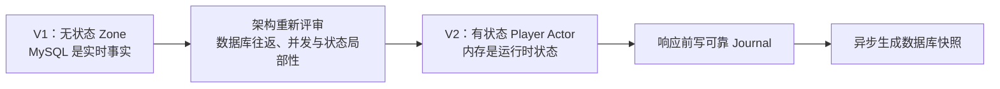

V2 的四个核心不变量：

1. 一个逻辑分片同一时刻只有一个具备写权限的 Active Zone Owner。
2. 同一玩家的写命令在一个 Player Actor 邮箱内串行执行。
3. 写命令只有在 Durable Journal 可靠提交后才能修改正式内存并返回成功。
4. 玩家状态可以由“最近快照 + 快照后的连续 Journal 事件”确定性恢复。

## 2. 总体架构

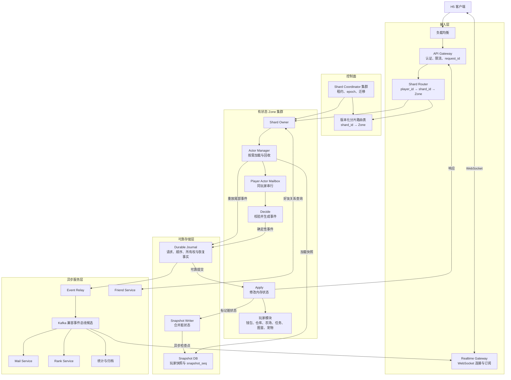

状态权威关系：

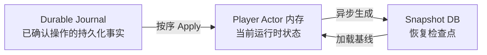

## 3. 路由与 Shard Coordinator

### 3.1 分片关系

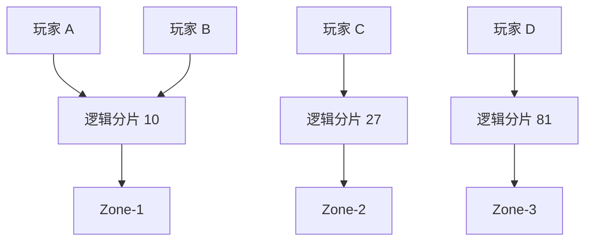

`shard_id = stable_hash64(target_player_id) % 4096`。一个 Zone 可持有多个逻辑分片，一个逻辑分片包含多个玩家。4096 是当前规划值，由版本化集群配置统一管理，不能散落成代码魔法数字；一旦产生持久化数据，修改分片函数或数量必须引入新版本并执行在线迁移，不能直接改模。

### 3.2 Coordinator 内部职责

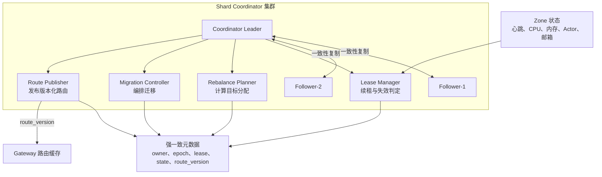

#### 3.2.1 项目实现边界

路径分配分为两层，不能混成一个哈希函数：

| 层次 | 解决的问题 | 本项目的责任 |
|---|---|---|
| 玩家到逻辑分片 | 玩家稳定落在哪个分片 | 实现 `stable_hash64(player_id) % 4096`，并对哈希函数与分片数做版本化 |
| 逻辑分片到 Zone | 当前哪个 Zone 是唯一写 Owner | 实现 Placement Planner、Owner 状态机、路由缓存、`route_epoch` 校验和迁移编排 |
| 控制面共识 | 哪一次 Owner 变更是全局权威决定 | 不从零实现 Raft；依赖成熟的一致性存储或共识库，具体产品仍待选型 |

因此，农场代码需要实现自己的 `ShardRouter` 和分配规则，但不需要自己编写选主、复制日志和多数派协议。若本机原型只使用单 Coordinator，只能验证路由、迁移和 fencing 语义；只有接入或运行三节点共识组件并执行故障实验后，才能声称验证过多数派容错。

#### 3.2.2 候选位置与权威分配

初版 Placement Planner 使用 Rendezvous Hashing（Highest Random Weight，一致性哈希的一种）从健康 Zone 集合中为每个逻辑分片计算候选 Owner。它不需要虚拟节点，Zone 增减时只移动部分分片。候选 Zone 超过 CPU、Actor 内存、邮箱积压或迁移并发阈值时，再按负载选择下一候选。

一致性哈希只回答“理想上放在哪里”，不能单独产生写权限。当前 Owner 必须经过 Coordinator 多数派提交：

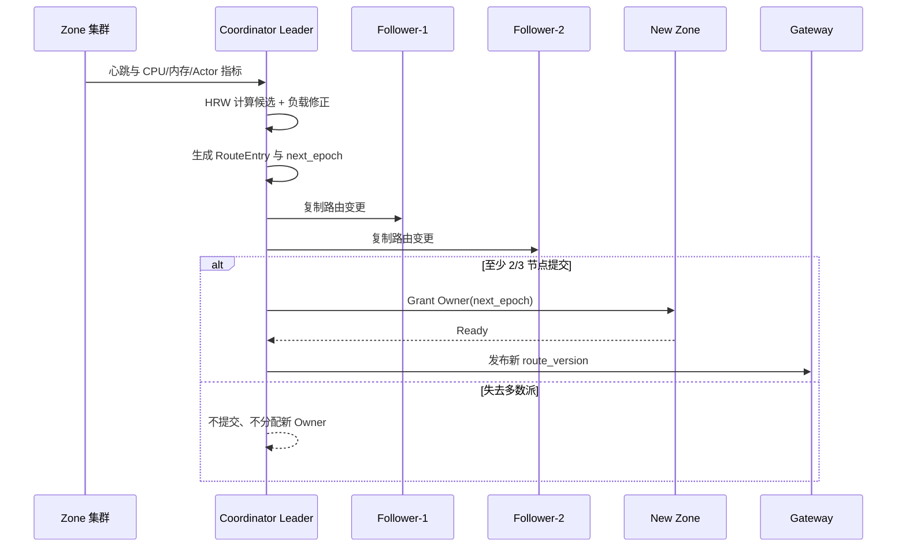

权威路由记录至少包含：

```text
RouteEntry {
  shard_id
  owner_zone_id
  route_epoch
  lease_deadline
  state
  route_version
}
```

Follower 不独立给 Shard 分配 Owner。Zone 只需要向当前 Coordinator Leader 发送心跳或续租请求，不需要逐个联系所有控制节点；Leader 背后的共识层负责复制需要持久化的所有权变化。

#### 3.2.3 多数派丢失与数据面行为

三个 Coordinator 节点中至少两个可通信，控制面才能选出 Leader 并提交新的 Owner、`route_epoch` 或迁移状态。只有一个节点时：

- 不创建新 Owner，不递增 epoch，不发布新路由；
- 已有 Owner 只可在租约仍有效且 Journal 多数派仍接受当前 epoch 时继续写；
- 租约到期后 Zone 停止该分片写入，返回暂时不可用，不能自行延长租约；
- 读请求只能在不造成错误事实的前提下使用已有快照降级；
- 控制面恢复多数派后，重新确认 Owner 或提升 epoch，再恢复写入。

这里选择“短时不可写”而不是冒险产生两个 Owner。即使旧 Zone 没有及时收到新路由，Journal 和 Snapshot 的 epoch fencing 仍是最后一道写隔离。

Coordinator 不进入普通请求的数据面：

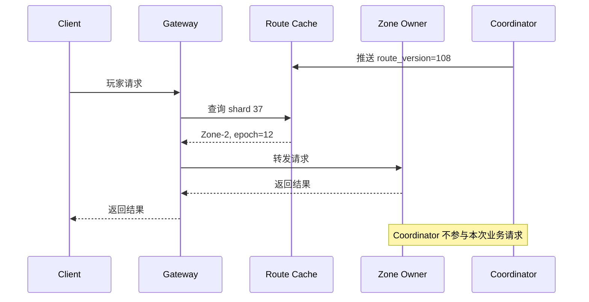

### 3.3 所有权状态机

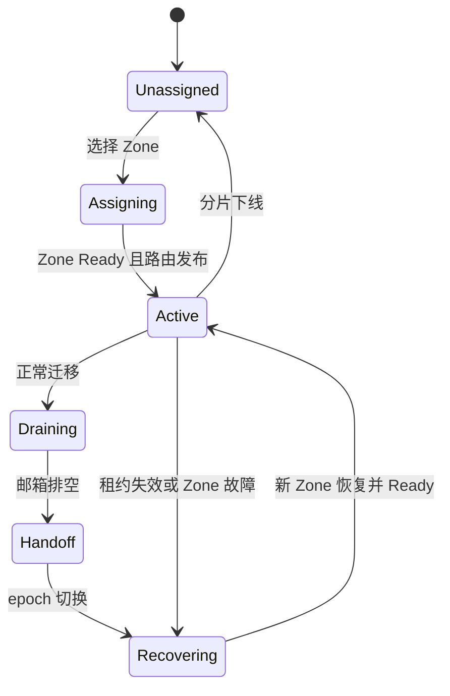

### 3.4 旧路由刷新

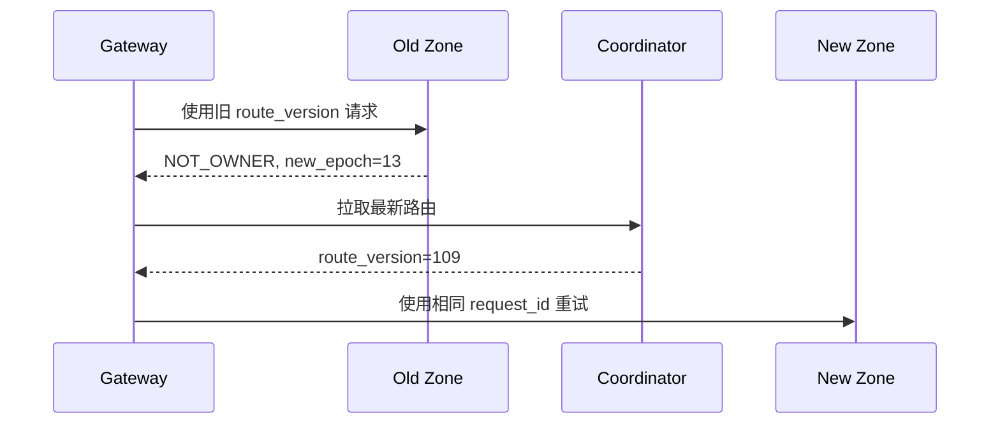

## 4. Player Actor

### 4.1 Zone、分片与 Actor

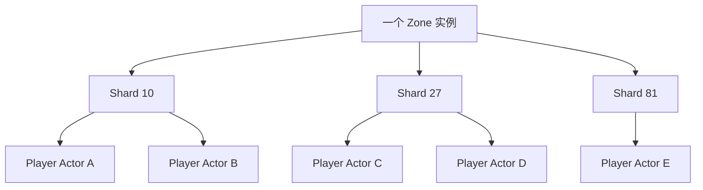

### 4.2 Actor 内部模块

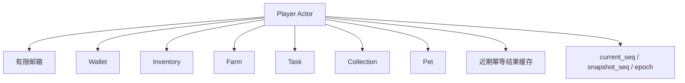

钱包、仓库、农场、任务、图鉴和宠物保持代码模块隔离，但共享同一玩家状态机；需要一起变化的数据可由一个事件原子 Apply。

### 4.3 Actor 生命周期

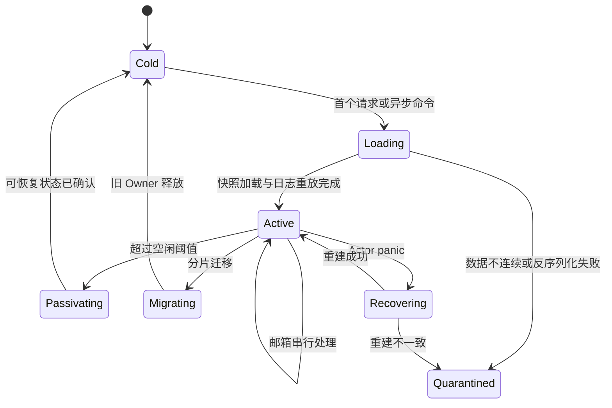

邮箱达到上限时返回 `PLAYER_BUSY`，不能无限排队。V2 第一版在等待 Journal 提交期间不执行该玩家的后续写命令，避免重入破坏顺序；不同玩家 Actor 仍可并行。

## 5. 写请求与可靠持久化

### 5.1 单玩家写入时序

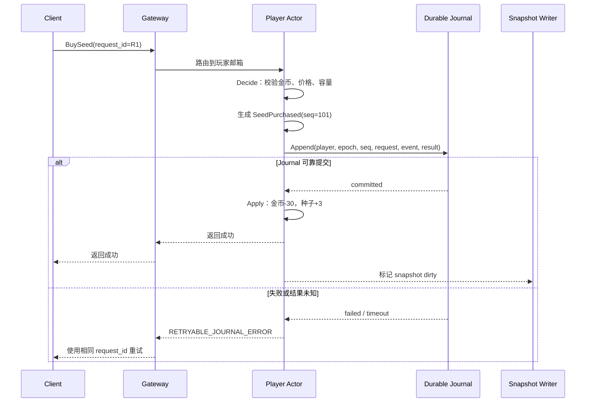

### 5.2 Decide 与 Apply

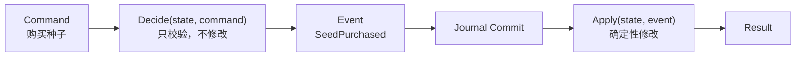

随机奖励、服务端时间结果和配置版本必须在 Decide 时固化进 Event。Apply 与日志重放不得重新随机、重新读取当前时间或依赖已变化的配置。

### 5.3 Journal 记录

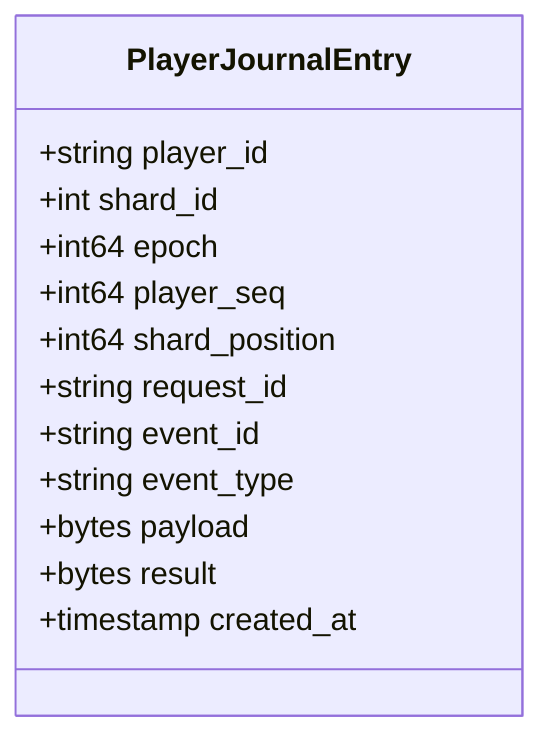

必须满足：

- `(player_id, player_seq)` 唯一且连续；
- `shard_position` 是 Journal 分片内的单调位置，用于迁移追平和 Event Relay 检查点，不代替玩家序号；
- `(player_id, request_id)` 唯一；
- 旧 `epoch` 写入被拒绝；
- 只有满足目标多副本持久化条件才返回 committed；
- Journal 后端产品、分片数、保留期和清理方式仍待选型与验证。

## 6. 快照、加载与恢复

### 6.1 异步快照

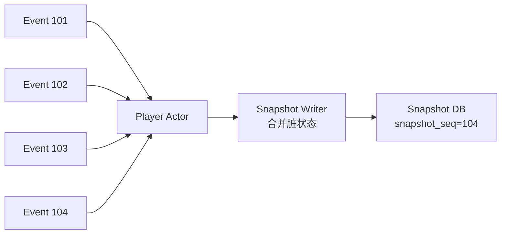

快照失败时 Journal 仍保证恢复，但日志尾部会增长。系统必须监控最老快照落后时间、最大版本差、脏 Actor 数、重试数和预计恢复耗时；超过保护阈值时限制相关分片写入。

### 6.2 加载与重放

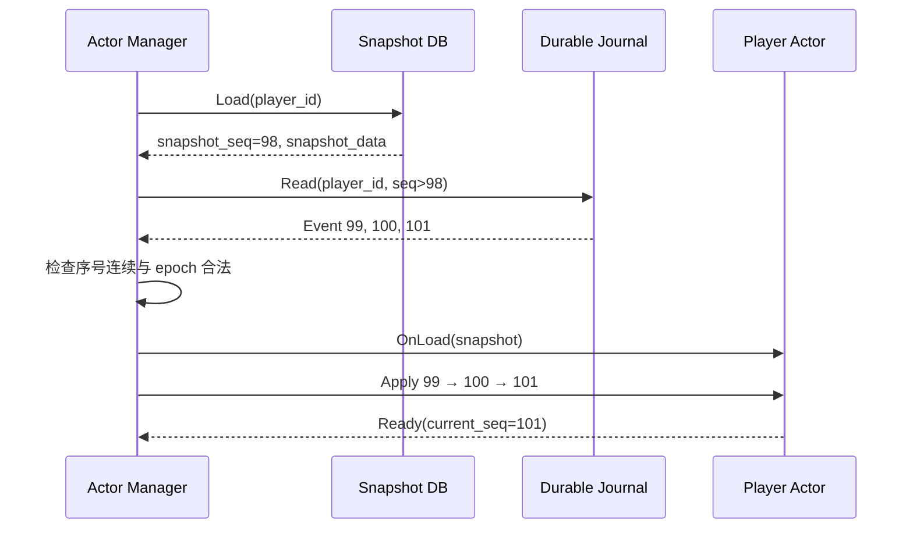

若序号缺口、快照损坏或事件无法确定性 Apply，Actor 进入 `Quarantined`，停止写服务并报警。

### 6.3 响应丢失后的幂等重试

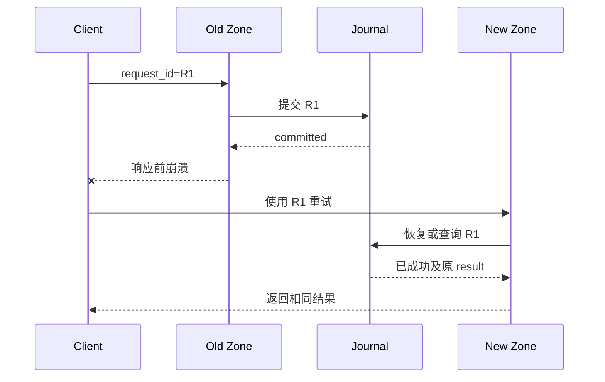

## 7. 异步事件与跨玩家流程

### 7.1 Journal 与事件总线的职责

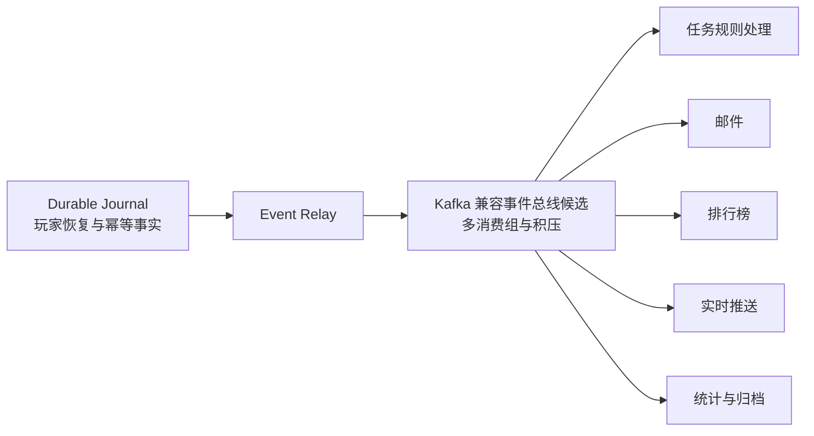

Kafka 类系统不直接被定义为第一版唯一的玩家随机恢复存储；它承担下游传播。若未来希望合并 Journal 与消息系统，必须先解决按玩家随机恢复、快照截断、长期保留和所有权 fencing。

任务规则处理器消费农场事件并生成幂等的 `AdvanceTaskProgress` 命令，再按玩家路由回 Player Actor。Player Actor 保存玩家任务进度和领奖幂等状态；任务规则处理器只负责规则计算，不形成第二份可写任务状态。

### 7.2 偷菜与奖励

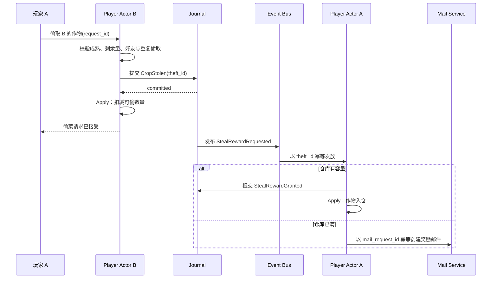

偷菜事实属于农场主 B；奖励属于玩家 A。两者是两个可靠步骤，不使用跨 Zone 分布式事务，奖励允许异步到账。

### 7.3 数据归属

```mermaid
flowchart TD
    PA["Player Actor"] --> CORE["钱包、仓库、农场、任务、图鉴、宠物"]
    FS["Friend Service"] --> FRIEND["好友关系"]
    MS["Mail Service"] --> MAIL["邮件与附件领取"]
    RS["Rank Service"] --> RANK["全局排行榜"]
    PS["Payment Service"] --> PAY["支付订单"]
    RG["Realtime Gateway"] --> CONN["连接、会话、订阅"]
```

## 8. HTTP 快照与 WebSocket 增量

```mermaid
sequenceDiagram
    participant C as Client A
    participant R as Realtime Gateway
    participant Z as Player Actor B

    C->>R: Subscribe(farm=B)
    R-->>C: SubscribeAck(subscription_id)
    C->>Z: HTTP GetFarmSnapshot(B)
    Z-->>C: Snapshot(version=10)
    R-->>C: Delta(version=11)
    C->>C: 丢弃 version<=10，应用 11
    R-->>C: Delta(version=13)
    C->>C: 发现缺少 version=12
    C->>Z: 重新获取权威快照
```

Realtime Gateway 只持有连接和订阅，不持有权威农场状态。好友农场快照按被访问者 B 路由到其 Zone Owner。

## 9. 故障接管、迁移与 fencing

### 9.1 Zone 故障接管

```mermaid
sequenceDiagram
    participant O as Old Zone
    participant C as Coordinator
    participant N as New Zone
    participant S as Snapshot DB
    participant J as Journal
    participant G as Gateway

    O--xC: 心跳中断
    C->>C: 等待租约过期，Shard→RECOVERING
    C->>N: Prepare Shard
    N->>S: 加载快照
    N->>J: 重放尾部事件
    C->>C: CAS owner，epoch 12→13
    C->>N: Grant epoch=13
    N-->>C: Ready
    C->>G: 发布新 route_version
    G->>N: 恢复转发
```

### 9.2 旧主隔离

```mermaid
sequenceDiagram
    participant O as Old Zone(epoch=12)
    participant C as Coordinator(epoch=13)
    participant J as Journal

    O->>C: 恢复心跳并声明 epoch=12
    C-->>O: Ownership Lost
    O->>J: 尝试追加 epoch=12
    J-->>O: FENCED_EPOCH
    O->>O: 停止并释放该分片 Actor
```

### 9.3 正常迁移

```mermaid
sequenceDiagram
    participant C as Coordinator
    participant O as Old Zone
    participant N as New Zone
    participant J as Journal
    participant G as Gateway

    C->>N: Prepare Shard
    N-->>C: 预加载完成
    C->>O: Drain Shard
    O->>O: 拒绝新写并排空邮箱
    O->>J: 确认 handoff_position=500
    O-->>C: Drained，提交活跃 Actor 清单
    C->>C: epoch 12→13
    C->>N: Grant epoch=13
    N->>J: 追平到 shard_position=500
    N-->>C: Ready
    C->>G: 发布新路由
    C->>O: Release Shard
```

epoch 切换前可取消迁移并恢复旧主；切换后不得让旧主直接恢复写入，只能继续完成新主恢复或重新选主。

迁移只需要恢复旧 Zone 中仍活跃的 Actor：旧主在 Drain 后提交活跃 Actor 清单及其 `player_seq`，新主从快照与 Journal 恢复这些 Actor；冷玩家不搬运内存，下次请求到达时继续按需加载。`handoff_position` 表示整个 Journal 分片的追平水位，不能与任一玩家的 `player_seq` 混用。

## 10. 三可用区部署

```mermaid
flowchart TB
    subgraph AZ1["AZ-1"]
        G1["Gateway"]
        Z1["Zone"]
        J1["Journal Replica"]
        S1["Snapshot Replica"]
        C1["Coordinator Node"]
    end

    subgraph AZ2["AZ-2"]
        G2["Gateway"]
        Z2["Zone"]
        J2["Journal Replica"]
        S2["Snapshot Replica"]
        C2["Coordinator Node"]
    end

    subgraph AZ3["AZ-3"]
        G3["Gateway"]
        Z3["Zone"]
        J3["Journal Replica"]
        S3["Snapshot Replica"]
        C3["Coordinator Node"]
    end

    Z1 --> J1
    Z1 --> J2
    Z1 --> J3
    Z2 --> J1
    Z2 --> J2
    Z2 --> J3
    Z3 --> J1
    Z3 --> J2
    Z3 --> J3
    C1 <-->|"共识"| C2
    C2 <-->|"共识"| C3
    C3 <-->|"共识"| C1
    S1 <-->|"复制/备份"| S2
    S2 <-->|"复制/备份"| S3
```

三区合计计算容量继续以正常峰值约 150% 作为规划起点；单区故障后，剩余两区必须同时具备接管所需的 CPU、Actor 内存、Journal 吞吐和 Snapshot 恢复能力。具体复制协议和成功确认条件取决于最终存储产品，不在没有证据时写死。

## 11. 容量模型

本节的目标不是直接猜测 Zone 数量，而是依次计算“玩家行为 → 外部流量 → 内部放大 → 单 Zone 安全容量 → 实例数”。输入分为三类：

- **题目输入**：3000 万 DAU；
- **规划假设**：会话、操作频次、峰值系数、报文大小和安全余量，用于在没有线上数据时给出第一版容量；
- **待测参数**：单 Actor 内存、单 Zone 安全 QPS、Journal 延迟与吞吐、快照写入和恢复速度，必须由原型压测替换。

任何由规划假设推导出的数字都不是生产实测结论。上线后按接口埋点采集 P50/P90/P99 行为次数和分时曲线，再重算本文。

### 11.1 在线规模

中档模型采用每天 4 次会话、每次 15 分钟，即每名 DAU 每天在线 60 分钟：

```text
平均在线 = 3000 万 × 60 / 1440 = 125 万
正常峰值在线 = 125 万 × 3 = 375 万
```

Zone 不会在连接断开后立即销毁 Actor。按峰值在线的 20% 作为断线保留与临时唤醒，另加 10% 迁移/恢复重叠，规划峰值驻留 Actor 约为：

```text
375 万 × (1 + 20% + 10%) = 487.5 万 ≈ 500 万 Actor
```

### 11.2 玩家行为模型

多地块种植和收获按批量命令计算：客户端可以逐块播放动画，但同一轮只发送一次命令。每次会话进入自己的农场时拉取一次完整快照，后续命令返回增量和 `player_seq`；只有登录、重连、版本缺口、迁移不匹配或 `RESYNC_REQUIRED` 时再次拉快照。

中档普通玩家的 60 次外部请求不是一个拍脑袋总数，而由下表逐项组成：

| 场景 | 次数/人/日 | 类型 | 主要入口 |
|---|---:|---|---|
| 登录或 Session 刷新 | 4 | 账号请求 | Account/Gateway |
| 自己的农场快照 | 4 | 读 | Zone |
| 批量种植 | 6 | 写 | Zone |
| 批量收获 | 6 | 写 | Zone |
| 打开商店 | 2 | 读 | Config/Shop |
| 批量购买种子 | 2 | 写 | Zone |
| 批量出售作物 | 2 | 写 | Zone |
| 打开任务面板 | 2 | 读 | Zone |
| 好友列表 | 4 | 读 | Friend Service |
| 访问好友农场 | 8 | 读 | 目标玩家 Zone |
| 尝试偷菜 | 2 | 写 | 目标玩家 Zone |
| 邮件列表 | 2 | 读 | Mail Service |
| 领取邮件附件 | 1 | 写 | Mail Service → Zone |
| 宠物状态 | 2 | 读 | Zone |
| 宠物互动 | 2 | 写 | Zone |
| 图鉴 | 2 | 读 | Zone |
| 仓库详情 | 2 | 读 | Zone |
| 配置/启动数据 | 4 | 读 | Config/Gateway |
| 异常重同步 | 2 | 读 | Zone |
| 幂等写重试 | 1 | 写重试 | 原业务入口 |
| **合计** | **60** | **34 读 + 22 写 + 4 账号** |  |

缺少真实数据时同时保留低、中、高三档，避免单点估算：

| 档位 | 会话/日 | 读/日 | 写/日 | 账号/日 | 外部请求/日 | 用途 |
|---|---:|---:|---:|---:|---:|---|
| 低活跃 | 2 | 14 | 9 | 2 | 25 | 成本下界 |
| 中档 | 4 | 34 | 22 | 4 | 60 | 正常容量规划 |
| 高活跃 | 6 | 64 | 50 | 6 | 120 | 压力与活动场景 |

三档采用不同峰值系数后的入口流量约为 2.19 万、6.94 万和 20.97 万 QPS。高档不是正常时刻的实例数依据，而是活动、集中成熟和重连叠加时的压力测试目标。

### 11.3 逐场景峰值 QPS

不同场景不能统一乘三倍。登录有明显潮汐；种植、收获、交易和偷菜会受成熟时间及活动影响；配置与普通列表读更平滑。中档模型采用下列第一版峰值系数：

| 场景 | 次数/人/日 | 峰值系数 | 峰值 QPS |
|---|---:|---:|---:|
| 登录或 Session 刷新 | 4 | 6 | 8,333 |
| 自己的农场快照 | 4 | 3 | 4,167 |
| 批量种植 | 6 | 4 | 8,333 |
| 批量收获 | 6 | 4 | 8,333 |
| 打开商店 | 2 | 2 | 1,389 |
| 批量购买种子 | 2 | 4 | 2,778 |
| 批量出售作物 | 2 | 4 | 2,778 |
| 打开任务面板 | 2 | 2 | 1,389 |
| 好友列表 | 4 | 3 | 4,167 |
| 访问好友农场 | 8 | 3 | 8,333 |
| 尝试偷菜 | 2 | 4 | 2,778 |
| 邮件列表 | 2 | 2 | 1,389 |
| 领取邮件附件 | 1 | 3 | 1,042 |
| 宠物状态 | 2 | 2 | 1,389 |
| 宠物互动 | 2 | 3 | 2,083 |
| 图鉴 | 2 | 2 | 1,389 |
| 仓库详情 | 2 | 3 | 2,083 |
| 配置/启动数据 | 4 | 3 | 4,167 |
| 异常重同步 | 2 | 3 | 2,083 |
| 幂等写重试 | 1 | 3 | 1,042 |
| **总计** | **60** | — | **约 69,444** |

按入口归属拆分后，正常规划峰值约为：Gateway 总入口 6.94 万 QPS，Account 0.83 万 QPS，Config 0.56 万 QPS，Friend 0.42 万 QPS，Mail 0.24 万 QPS，直接到达 Zone 的外部命令约 4.90 万 QPS。它们不会在同一台机器上相加，但都要从同一行为模型推导。

### 11.4 Zone、Journal 与事件放大

外部请求不等于 Zone 命令，也不等于 Journal 和数据库写入。中档模型增加以下内部假设：

- 种植、收获、购买和出售共 16 次核心业务写，每次产生一个行为事件；
- 约一半行为命中当前任务，形成 8 次任务进度命令；每天约 2 次任务完成并产生奖励命令；
- 每天 2 次偷菜尝试，按 70% 成功率估算为 1.4 次；成功时农场主写一次，偷菜者异步到账再写一次；
- 每天领取 1 次邮件附件，Mail Service 产生一个幂等的玩家奖励命令；
- 重复的 `request_id` 只返回原结果，不再次追加 Journal。

```mermaid
flowchart LR
    EXT["外部峰值约 6.94 万 QPS"] --> G["Gateway"]
    G --> ZE["Zone 外部命令<br/>约 4.90 万/s"]
    EVT["任务、偷菜奖励、邮件奖励"] --> ZI["Zone 内部命令<br/>约 1.69 万/s"]
    ZE --> Z["Zone 总命令<br/>约 6.58 万/s"]
    ZI --> Z
    Z --> J["Journal 估算峰值<br/>约 4.38 万逻辑追加/s"]
    J --> JM["含 25% 余量<br/>按 5.5 万/s 设计"]
    J --> BUS["行为/领域事件总线<br/>按 3 万事件/s 设计"]
    J --> SNAP["合并快照<br/>约 4200 写/s"]
```

Journal 的日均逻辑追加按约 31.8 条/DAU 估算：

```text
Journal 逻辑条目/日
= 3000 万 × (
  18 次直接玩家状态写
  + 1.4 次农场主偷菜事实
  + 8 次任务进度
  + 2 次任务奖励
  + 1.4 次偷菜者奖励
  + 1 次邮件奖励
)
= 9.54 亿条/日
```

若条目平均 500 B，则约 477 GB/日逻辑数据；三副本约 1.43 TB/日物理写入。按 72 小时热保留并加 30% 索引、协议和段文件余量，Journal 热存储规划量约 5.6 TB。该数字对条目大小非常敏感，原型必须记录真实序列化大小。若 Journal 同时承担下游事件流，不应再把同一份事件总线存储重复计费；若两者分开，事件总线按约 20 条事件/DAU/日、平均 300 B、三副本估算约 540 GB/日物理写入。

### 11.5 快照数据库

Snapshot Writer 合并同一 Actor 的连续变更，不为每次 Journal 追加写一次数据库。中档模型按每名活跃玩家平均 4 次完整快照/日、平均压缩后 4 KiB 估算：

```text
快照更新 = 3000 万 × 4 = 1.2 亿次/日
平均写入 ≈ 1389 次/s
三倍峰值 ≈ 4167 次/s
快照写入流量 ≈ 480 GB/日（逻辑）
当前玩家快照数据集 ≈ 120 GB（不含索引、副本和历史）
```

数据库分片数不能用 DAU 直接决定：

```text
Snapshot 主分片数
= ceil(峰值快照写入 / 单分片实测安全写入)
```

快照失败不会立即丢失已提交状态，但会增加 Journal 重放尾部；必须监控 `snapshot_seq` 落后、最老脏 Actor、预计恢复耗时和 Journal 可清理水位。

### 11.6 WebSocket 与带宽

正常按峰值在线的 20% 进入好友实时场景，极端按 30%：

| 指标 | 正常 | 极端 |
|---|---:|---:|
| WebSocket 连接 | 75 万 | 112.5 万 |
| 30 秒心跳 | 2.5 万次/s | 3.75 万次/s |
| 单网关安全连接 5 万时的裸实例数 | 15 | 23 |
| 加单区故障和发布余量 | 约 30 | 约 42 |

单连接 5 万只是压测入口，不是产品结论。实时网关需要分别测试空闲连接内存、TLS/心跳 CPU、业务推送、慢连接队列和重连风暴。一个客户端会话只建立一条 WebSocket，再切换好友农场订阅，不为每个好友建立连接。

HTTP 正常峰值中，若读响应平均 4 KiB、写/账号响应平均 1 KiB，则 API 下行负载约 1.35 Gbit/s；加入 30% TLS、Header 和协议余量后约 1.76 Gbit/s。请求平均 0.5 KiB 时，上行约 0.37 Gbit/s。WebSocket 若按 100 B 双向心跳帧和 3 万条/s、每条 0.5 KiB 业务投递估算，约增加 0.16 Gbit/s。H5 静态资源必须由 CDN 承担，不计入业务 API 出口。

### 11.7 Zone 数量初版

Zone 数量由 CPU/吞吐和 Actor 内存两个最紧约束共同决定：

```mermaid
flowchart TD
    DAU["3000 万 DAU"] --> ONLINE["峰值在线 375 万"]
    ONLINE --> ACTOR["规划驻留 Actor 约 500 万<br/>含断线、唤醒和迁移重叠"]
    ACTOR --> MEM["Actor 内存需求"]
    ACTOR --> LOAD["加载与恢复吞吐"]

    QPS["Zone 总命令约 6.58 万/s"] --> ZQPS["Zone CPU/QPS"]
    QPS --> WRITE["玩家状态写命令"]
    WRITE --> JQPS["Journal 设计峰值 5.5 万/s"]
    JQPS --> REPLICA["多副本物理写入与网络放大"]
    WRITE --> SNAP["脏 Actor 与快照合并吞吐"]

    MEM --> COUNT["Zone 数量"]
    ZQPS --> COUNT
    LOAD --> COUNT
    JQPS --> COUNT
    COUNT --> HA["单区故障 + 发布 + 迁移余量"]
```

```text
基础 Zone 实例数 = max(
  峰值 QPS / 单 Zone 安全 QPS,
  峰值写 QPS / 单 Zone 安全写 QPS,
  峰值 Actor 数 / 单 Zone 安全 Actor 数,
  Actor 总内存 / 单 Zone 安全内存
)

生产规划数 = ceil(基础实例数 × 1.5 单区故障系数 × 1.15 发布/迁移系数)
```

为得到可执行的第一版部署规模，假设 16 GiB Zone 进程只将约 5 GiB 安全用于 Actor 状态，其余留给运行时、邮箱、缓冲、连接和 GC。三档敏感性如下：

| 模型 | 单 Actor 实测目标 | 单 Zone 安全 Actor | 单 Zone 安全命令/s | Actor 约束 | QPS 约束 | 加余量后的 Zone |
|---|---:|---:|---:|---:|---:|---:|
| 乐观 | 16 KiB | 30 万 | 4,000 | 17 | 17 | **约 30** |
| 中档规划 | 32 KiB | 15 万 | 2,000 | 34 | 33 | **约 60** |
| 保守 | 64 KiB | 7.5 万 | 1,000 | 67 | 66 | **约 120** |

因此 V2 的初版容量规划采用 **60 个 Zone、三区各 20 个** 作为压测前的设计点，30～120 个作为敏感性区间。它不是最终采购数量：若单 Actor 内存或同步 Journal 延迟使单 Zone 只能达到保守档，就必须扩大到约 120；若原型证明可以稳定达到乐观档，则可以缩到约 30。

为了使迁移粒度显著小于单 Zone，V2 规划采用 4096 个逻辑分片。60 个 Zone 时平均约 68 个逻辑分片/Zone，500 万驻留 Actor 平均约 1220 个/分片、8.3 万个/Zone。4096 由版本化集群配置管理，不散落为代码魔法数字；一旦产生持久化数据便不能直接修改，变更必须通过分片函数版本与在线迁移完成。原型还需检查路由元数据大小、迁移耗时和热点倾斜。

### 11.8 原型如何替换规划假设

本机原型不需要真的建立 375 万连接或打满 6.94 万 QPS，但必须走生产目标的关键链路：

```text
Gateway → Zone Owner → Player Actor
→ Journal committed → Apply 内存 → 返回成功
→ 异步 Snapshot
```

单 Zone 的“安全容量”定义为持续压测而不是瞬时峰值：CPU 不超过 60%、进程内存不超过 70%、邮箱无持续积压、Journal 提交无数据丢失，且规划目标暂定为读请求 p99 ≤ 100 ms、写请求 p99 ≤ 200 ms。压测至少输出：

- 单 Actor 真实堆内存和 GC 放大；
- 单 Zone 读、写、混合安全 QPS；
- Journal 条目平均/P99 大小、提交 p99 和故障时行为；
- Snapshot 合并率、写入吞吐和 `snapshot_seq` 落后；
- 单 Zone 或单可用区故障后的 Actor 恢复速度；
- 增加 Zone/分片后吞吐是否近似水平增长。

只有“行为来源可复算 + 单元容量有实测 + 实例数可外推 + 故障实验不丢已确认成功的数据”同时成立，才能表述为架构可支撑 3000 万 DAU；在没有生产规模集群压测时，不能表述为已经实际承载 3000 万 DAU。

## 12. 观测与保护

```mermaid
flowchart LR
    Z["Zone"] --> ZM["Actor 数、邮箱、处理时长、GC、内存"]
    C["Coordinator"] --> CM["租约、迁移、路由版本、分片倾斜"]
    J["Journal"] --> JM["提交延迟、失败率、fencing、吞吐"]
    S["Snapshot"] --> SM["脏 Actor、版本差、最老落后、恢复重放量"]
    Q["Event Bus"] --> QM["积压、最老事件、重复、下游到账延迟"]
    R["Realtime"] --> RM["连接、订阅、广播、版本缺口、重连"]
```

保护动作：

```mermaid
flowchart TD
    R["请求进入"] --> M{"Actor 邮箱是否超限"}
    M -- "是" --> BUSY["PLAYER_BUSY<br/>退避重试"]
    M -- "否" --> J{"Journal 是否可确认"}
    J -- "否" --> RETRY["RETRYABLE_JOURNAL_ERROR<br/>不修改状态"]
    J -- "是" --> S{"分片是否仍有有效 epoch"}
    S -- "否" --> OWNER["NOT_OWNER<br/>刷新路由"]
    S -- "是" --> OK["Apply 并返回成功"]
```

## 13. 方案代价与未决项

V2 获得了同玩家串行、状态局部性和异步快照，但承担了新的复杂度：

- Player Actor 的加载、淘汰、内存和重入控制；
- Shard Coordinator、租约、epoch 与迁移状态机；
- Journal 的同步可靠提交延迟；
- 确定性事件、重放兼容和快照版本管理；
- 单 Actor 热点无法靠增加 Zone 直接拆分；
- 故障恢复期间优先一致性，相关分片可能短暂不可写。

尚未接受的产品和参数：

- Durable Journal 的具体后端及三可用区复制协议；
- Snapshot DB 产品、数据模型和快照频率；
- Coordinator 元数据实现；
- Journal 保留、归档与安全清理期限；
- Actor 空闲回收时间、邮箱上限和每 Zone Actor 上限；
- 单实例能力、实例数量、延迟目标和恢复目标。

## 14. 验证要求

```mermaid
flowchart TD
    D["V2 设计"] --> CORRECT["正确性<br/>串行、幂等、事件重放"]
    D --> CRASH["崩溃<br/>提交前后、响应丢失、Actor panic"]
    D --> OWNER["所有权<br/>旧路由、旧 epoch、双主隔离"]
    D --> MIGRATE["迁移<br/>Drain、handoff、追平、切换"]
    D --> LOAD["容量<br/>Actor 内存、Zone QPS、Journal、快照"]
    D --> REALTIME["实时<br/>订阅先行、版本缺口、重连"]
    D --> CROSS["跨玩家<br/>重复奖励、离线到账、满仓邮件"]
```

本机原型只验证机制与单实例基线，不能证明已经承载 3000 万 DAU。任何性能、可用性和恢复时间结论必须进入 `docs/evidence/` 并附可复现条件。

## 15. 文档演进

V1 保持原样作为历史对照。ADR-0003 已记录从无状态 Zone 改为有状态 Player Actor 的理由、代价和验证方法，并在生产目标层面取代 ADR-0002；`architecture.md` 与项目接力上下文应以本文为当前目标架构。具体 Journal、消息、缓存和协调服务产品仍是候选，必须通过原型证据后才能写成已选型。
