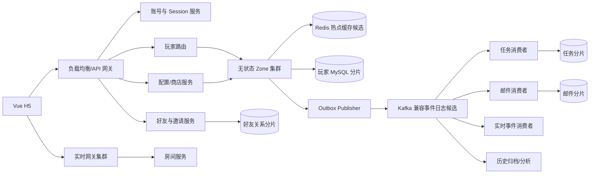

# 经典农场 3000 万 DAU 目标架构与分布式原型设计

## 1. 文档定位

本文定义经典农场面向 3000 万 DAU 的目标生产架构，以及能够在本机验证关键机制的缩小版分布式原型。它不声称当前代码已经达到目标容量，也不以组件名称替代容量计算和压测证据。

项目同时保留两种视角：

- **业务与本地实现视角**：使用一个代码仓库和清晰模块边界，优先验证农场、资产、商店等核心规则；
- **生产目标视角**：按容量、数据一致性和流量特征拆为 Zone、账号、好友、任务、邮件、实时等服务，并设计分片、缓存、消息、容灾和扩容路径。

本文中的容量数字是已确认的规划假设；具体单实例能力、实例数量、中间件产品和可用性达成情况均需要压测或故障实验验证。

## 2. 容量模型

### 2.1 用户与在线规模

已确认的第一版容量假设：

| 项目 | 假设 |
|---|---:|
| DAU | 3000 万 |
| 每人每天上线次数 | 4 次 |
| 每次在线时长 | 15 分钟 |
| 每人每天在线时长 | 60 分钟 |
| 峰值系数 | 平均在线的 3 倍 |

平均同时在线人数：

```text
3000 万 × 60 分钟 ÷ 1440 分钟
= 125 万
```

正常峰值同时在线人数：

```text
125 万 × 3
= 375 万
```

### 2.2 HTTP 请求规模

每名活跃玩家每天暂按 60 个外部请求估算，读写约为 2:1：

```text
平均外部 QPS
= 3000 万 × 60 ÷ 86400
≈ 20833

正常峰值外部 QPS
≈ 20833 × 3
≈ 62500
```

该数字不包含服务内部调用、消息写入、数据库索引、复制和广播带来的放大。

若峰值写请求约占三分之一，则外部写入约 2.1 万次/秒。每次业务粗略产生 3～6 次行更新、流水、幂等和 Outbox 写入时，数据库层可能面对约 6～12 万次行级写入/秒，消息层可能面对 2～6 万事件/秒。它们只是用于选择压测量级的放大假设，必须用实际 SQL 和事件数修正。

### 2.3 实时连接规模

单人农场使用 HTTP；只有进入好友或共享农场时建立 WebSocket。正常按峰值在线的 20% 进入共享场景，极端按 30%：

| 场景 | WebSocket 连接数 |
|---|---:|
| 正常 | 75 万 |
| 极端 | 112.5 万 |

30 秒一次心跳时，正常约 2.5 万次心跳/秒，极端约 3.75 万次/秒。心跳只更新网关进程内连接状态，不能访问 MySQL，也不应逐次写 Redis。

### 2.4 历史数据增长

每名玩家每天暂按 6 轮种植、一轮历史约 300 字节估算：

```text
每天记录数 = 3000 万 × 6 = 1.8 亿条
每天原始数据 ≈ 54 GB
含索引、复制和备份按约 3 倍估算 ≈ 162 GB/天
```

只保留最近 30 天在线热历史；更早数据异步归档到低成本存储。归档失败不阻塞种植、收获和资产操作。

## 3. 总体架构决策

### 3.1 比较过的路线

1. **水平扩容模块化大服务**：最容易实现，但所有模块共同扩容，连接、业务写入和异步任务互相影响；
2. **每个业务模块独立微服务**：独立扩容能力强，但购买、收获、偷菜和任务奖励立即引入大量分布式事务；
3. **以玩家 Zone 分片为核心的混合架构**：把同一玩家的强一致数据放在一起，把账号、好友、实时连接和异步处理按不同流量特征拆出。

目标生产架构采用路线 3。本地原型按阶段演进，不要求第一天启动全部服务。

### 3.2 目标拓扑



## 4. 服务边界

| 服务 | 拥有的状态 | 核心职责 | 可独立扩容原因 |
|---|---|---|---|
| API 网关 | 限流和短期路由状态 | TLS、鉴权前置、限流、灰度、路由 | 承担全部入口流量 |
| 账号/Session | 账号、密码摘要、Session | 注册、登录、单设备会话 | 登录流量和安全策略独立 |
| Zone | 玩家核心当前状态 | 农场、地块、资产、购买、种植、收获、出售、幂等、Outbox | 按玩家水平分片 |
| 配置/商店 | 作物、商品、价格和配置版本 | 发布服务端可信配置；Zone 按版本结算 | 读多写少、可独立缓存 |
| 好友/邀请 | 邀请、规范化好友关系 | 创建关系、列表、访问/偷菜授权 | 图关系访问模式不同 |
| 任务 | 任务配置、玩家进度、奖励记录 | 异步消费行为、自动完成和发奖 | 规则复杂度和消费积压独立 |
| 邮件 | 邮件、附件、领取状态 | 奖励兜底、系统邮件、幂等领取 | 低频且允许异步 |
| 实时网关 | 进程内连接 | WebSocket、心跳、发送队列、重连 | 连接数和网络资源独立 |
| 房间服务 | 临时房间订阅 | farm_id 到实时网关的订阅路由 | 广播扇出独立 |
| 归档/分析 | 冷历史和派生数据 | 30 天后归档、离线分析 | 不阻塞在线事务 |

普通玩家最多 200 名好友。邀请链接 30 分钟内可以由不同玩家多次使用，但受好友上限、生成频率、接受速率和单农场访问限流保护。

## 5. 玩家路由与数据库分片

### 5.1 无状态 Zone

任意 Zone 实例都能处理任意玩家请求；唯一状态不放在 Go 进程内。网关从 Session 得到可信 `player_id`，玩家路由计算逻辑分片，Zone 再访问对应缓存和数据库。

```text
H5 → 网关鉴权 → player_id → 逻辑分片 → 任意 Zone → MySQL 分片
```

Zone 实例故障后，负载均衡器摘除实例；客户端用相同 `request_id` 重试到其他 Zone。

### 5.2 逻辑分片

目标先固定 1024 个逻辑玩家分片：

```text
logical_shard = stable_hash(player_id) % 1024
```

1024 是逻辑桶数，不是立即部署 1024 台数据库。逻辑分片通过配置映射到少量物理 MySQL 集群，扩容时移动逻辑分片并切换映射。

以下玩家核心表必须按同一 `player_id` 共同分片：

- 玩家身份摘要；
- 钱包和物品；
- 农场、地块和当前种植快照；
- 顶层幂等结果；
- 业务 Outbox。

好友关系、任务进度、邮件、连接状态和冷历史分别由对应服务拥有，不能跨库直接改表。

## 6. 缓存设计与 Redis 候选

### 6.1 使用范围

目标架构只缓存热点玩家和热点农场，不缓存全部 3000 万玩家。若每名玩家当前快照粗略按 20 KB，全部玩家约 600 GB 原始数据；峰值活跃玩家约 75 GB 原始快照，考虑结构开销、副本和余量后再规划缓存集群。

候选缓存内容：

- 热点玩家/农场只读快照；
- Session 和撤销信息；
- 逻辑分片路由配置的短期缓存；
- 限流计数和短期去重辅助信息；
- 好友访问权限的短 TTL 结果。

Redis 不能作为金币、仓库和地块的唯一事实。

### 6.2 Cache Aside

读取：先读 Redis，未命中则读 MySQL 并回填。写入：MySQL 事务更新状态、递增版本并写 Outbox；提交后删除或刷新缓存。缓存携带版本，旧值不能覆盖新值；失效失败由 Outbox 事件重试。

### 6.3 为什么当前推荐 Redis

Redis 同时提供成熟的 TTL、原子计数、丰富数据结构、集群/副本能力和广泛 Go 客户端生态，适合热点快照、Session、限流和短期状态。但它只是候选，仍需和以下替代方案比较并压测：

| 方案 | 优点 | 主要代价 | 适用结论 |
|---|---|---|---|
| 进程内缓存 | 延迟最低 | 多实例不共享、失效和故障恢复复杂 | 只做极短本地缓存 |
| Memcached | 简单、纯缓存 | 数据结构和能力较少 | 纯 KV 快照可选 |
| Redis | TTL、计数、结构和生态成熟 | 集群运维、内存成本、热键风险 | 当前综合候选 |
| 数据库直读 | 事实一致、组件少 | 热点读取和连接压力大 | 回源，不承担全部高频读 |
| Redis 兼容替代实现 | 可能有更高单机性能 | 兼容性、成熟度和运维经验需验证 | 压测后再考虑 |

## 7. 可靠事件与 Kafka 工作机制

### 7.1 Kafka 的核心模型

Kafka 类系统可以理解为“按分区追加、可重复读取的持久化事件日志”，不是简单把消息交给某一个消费者后立即删除。

- **Topic**：事件类别，例如 `farm-domain-events`；
- **Partition**：Topic 内的有序子日志；
- **Record**：一条事件，包含 key、value 和 offset；
- **Offset**：记录在分区中的位置；
- **Consumer Group**：共同完成一种业务用途的一组消费者。

同一分区内事件有顺序；不同分区之间不提供全局顺序。生产者用业务 key 选择分区：农场事件可按 `farm_id`，发给某玩家的奖励命令按 `recipient_player_id`。

### 7.2 不同消费者如何收到同一收获事件

假设 Zone 写入：

```text
Topic: farm-domain-events
Key: player_id=10001
Event: CropHarvested(event_id=E123, crop_id=7, quantity=10)
```

不同用途使用不同 Consumer Group：

```text
task-progress-v1   → 更新任务
history-archive-v1 → 写归档
analytics-v1       → 统计行为
```

每个 Group 都维护自己的 offset，所以三个 Group 能独立读到同一事件，互不“抢走”。

同一个 Group 内如果有多个实例，则分区被分配给不同实例以并行处理：

```text
Task Consumer Group
├── 实例 A：分区 0、3
├── 实例 B：分区 1、4
└── 实例 C：分区 2、5
```

一条事件在同一时刻通常只由该 Group 的一个实例处理；实例故障后，分区会重新分配给其他实例。

### 7.3 为什么仍然可能重复消费

消费者通常先完成业务事务，再提交 offset：

```text
读取 E123
→ 更新任务数据库成功
→ 提交 offset
```

若数据库成功后、offset 提交前消费者崩溃，恢复后 E123 会再次出现。因此系统采用“至少一次投递 + 业务幂等”，而不是假设网络中的消息绝不重复：

- 任务用 `event_id` 去重；
- 奖励用 `reward_id` 去重；
- 偷菜用 `theft_id` 去重；
- 邮件领取用 `claim_id` 去重。

### 7.4 Outbox 如何防止事件丢失

Zone 在同一个 MySQL 事务内提交业务状态和 Outbox。Publisher 不断扫描/订阅未投递 Outbox，发送到消息系统；成功后标记已发送。数据库已成功但 Kafka 暂时不可用时，事件仍留在 Outbox，恢复后继续投递。

### 7.5 为什么当前推荐 Kafka 兼容日志

当前工作负载需要较高吞吐、按 key 分区顺序、多 Consumer Group 独立消费、消费积压观察和事件重放；Kafka 的日志模型与这些需求匹配。但具体产品仍是候选：

| 方案 | 优点 | 主要代价 | 适用结论 |
|---|---|---|---|
| Kafka 兼容日志 | 高吞吐、分区、Consumer Group、保留与重放生态成熟 | 运维和分区规划复杂 | 当前生产目标候选 |
| RabbitMQ | 路由和工作队列直观、单消息确认成熟 | 长期日志重放和超大吞吐不是核心模型 | 命令队列可选 |
| NATS JetStream | 轻量、低延迟、部署相对简单 | 生态和团队经验需验证 | 原型/实时事件候选 |
| Redis Streams | 组件少、上手快 | 与缓存共享故障域，长期积压和扩展需谨慎 | 小型原型可选，不作为默认生产日志 |
| Pulsar | 存储计算分离、多租户能力强 | 组件和运维复杂度更高 | 当前范围过重 |

选择标准不是“哪个中间件名气大”，而是压测以下指标：生产/消费吞吐、端到端延迟、重复处理、积压恢复、分区扩展、故障恢复和本地运维复杂度。

## 8. 一致性流程

### 8.1 注册初始化【待确认】

本地单库原型可以在一个事务创建账号、玩家、钱包、农场和初始地块；生产目标中账号服务与玩家 Zone 已经分离，不能继续声称一个 MySQL 事务。候选方案是账号服务先创建 `initializing` 玩家和 `PlayerCreated` Outbox，Zone 按 `player_id` 幂等初始化，成功后回写/通知账号变为 `active`；失败持续重试或由补偿流程关闭未激活账号。注册接口是等待激活还是返回初始化中，需下一轮由项目负责人确认。

### 8.2 单玩家核心操作

购买、种植、收获和出售只修改一个玩家分片，在一个 MySQL 本地事务内提交业务状态、资产、幂等结果和 Outbox。任何一步失败整体回滚。

### 8.3 任务最终一致

Zone 提交核心操作和行为 Outbox 后立即返回。任务服务异步消费 `event_id`，更新任务；完成后生成唯一 `reward_id`，再由玩家 Zone 幂等增加金币或物品。任务服务故障不回滚种植、收获或交易，客户端可短暂显示“进度同步中”。

### 8.4 跨分片偷菜

农场主分片锁定地块并提交偷菜事实、`theft_order` 和 Outbox。好友奖励异步投递：仓库有容量则按 `theft_id` 幂等入库；仓库满则创建不自动过期的系统奖励邮件。偷菜事实不因奖励延迟回滚。

### 8.5 邮件领取

邮件服务生成固定 `claim_id` 请求玩家 Zone 入账。若资产已入账但响应丢失，邮件服务用同一 `claim_id` 重试，Zone 返回原结果；确认后邮件标记已领取。仓库仍满时领取失败，邮件保持未领取。

## 9. HTTP 与 WebSocket 实时同步

HTTP 用于登录、快照和业务命令；WebSocket 用于服务器主动推送已经提交的共享农场变化。WebSocket 通常先用 HTTP Upgrade 握手，成功后同一 TCP/TLS 连接上传输 WebSocket Frame。Linux 服务可通过 epoll 管理大量 Socket；epoll 是 I/O 多路复用机制，不是传输协议。

进入好友农场时先用 HTTP 拉取 `snapshot + version`，再订阅 WebSocket。Zone 提交地块变化后发送按 `farm_id` 分区的事件，房间服务找到订阅所在实时网关并推送增量。客户端忽略重复/旧版本；若本地版本 10 直接收到 12，则通过 HTTP 重新拉权威快照。

实时网关只持有连接和有限发送队列，房间服务只持有临时订阅，二者都不拥有农场最终状态。慢客户端队列溢出时合并旧状态或断开连接，客户端重连恢复。

规划起点是假设单实时网关 5 万连接：正常最低 15 个实例；考虑约 50% 余量和单可用区故障，正常可从约 24 个实例规划，极端从约 36 个实例规划。该能力必须由 WebSocket 压测修正。

## 10. 可用性、降级与多可用区

目标为单地域三个可用区：核心 HTTP 月度可用性目标 99.95%，实时同步 99.9%，正常情况下 99% 异步奖励 5 秒内到账并最终保证交付。目标值不是当前证据。

每个可用区规划约正常峰值 50% 的无状态计算容量，三区合计约 150%；失去一个区后剩余两个区仍能承担 100% 正常峰值。

- Zone 故障：健康检查摘除，无状态实例接管，相同 `request_id` 重试；
- Redis 故障：限流回源 MySQL，关闭好友高读等非核心功能并逐步重建缓存；
- 消息故障：Outbox 积压，核心事务继续，任务/奖励/归档延迟并在恢复后追平；
- MySQL 主库故障：跨可用区副本提升，目标 RPO 接近 0、RTO 数分钟；切换期间写请求用原 `request_id` 重试；
- 实时网关故障：连接断开并指数退避/随机抖动重连，HTTP 核心操作继续；
- 单区故障：负载均衡切走故障区，剩余区承载流量。
### 10.1 保护与观测

网关按 IP、账号、玩家、邀请和单农场维度限流；热点农场快照使用请求合并和短 TTL 缓存；慢实时连接使用有限队列、合并旧版本或断开重连。所有服务至少输出请求量、错误率、p95/p99、CPU/内存、数据库连接/锁等待、缓存命中/热键、Outbox 未发送量、Consumer Lag、最老奖励延迟、在线连接、广播队列和重连速率。没有这些指标就不能判断扩容、降级或中间件选型是否有效。

## 11. 分布式原型与验证顺序

### 11.1 原型组成

- Gateway 1 个；
- Zone 2 个；
- 16 个逻辑分片映射到两个 MySQL 实例或独立 Schema；
- Redis 1 个，仅验证缓存和降级语义；
- 一个 Kafka 兼容或其他候选消息组件；
- Task、Reward、Mail Consumer；
- Realtime Gateway 2 个、Room Service 1 个；
- 三个 H5 客户端。

### 11.2 六个阶段

1. 单玩家核心事务、幂等和 Outbox；
2. 两个无状态 Zone、玩家路由和两个数据库分片；
3. 异步任务、消息重复和积压追平；
4. 跨分片偷菜、异步奖励和满仓邮件；
5. 两个实时网关、三个客户端、版本缺口和断线恢复；
6. HTTP、消息、WebSocket 压测，故障实验、容量外推和方案修订。

### 11.3 故障实验

- 停止一个 Zone，验证摘除、切流和原 `request_id` 重试；
- 停止任务消费者，验证核心操作继续、恢复后追平且不重复发奖；
- 停止实时网关，验证 HTTP 继续、重连和版本恢复；
- 让 Redis 不可用，验证受控回源和降级；
- 模拟数据库已提交但响应丢失，验证业务结果只生效一次。

## 12. 压测与容量外推

HTTP/Zone 记录 QPS、成功率、p50/p95/p99、CPU、内存、数据库连接池、事务冲突、缓存命中率和单请求读写放大；消息记录吞吐、积压、最老事件、重复事件、到账延迟和追平时间；WebSocket 记录单实例连接数、每连接内存、心跳 CPU、广播吞吐、慢连接和重连时间。

实例数量只基于实测安全容量外推：

```text
基础实例数 = 目标峰值 QPS ÷ 单实例安全 QPS
生产规划 = 基础实例数 + 单区故障容量 + 发布/突发余量
```

本地原型不能证明已经支持 3000 万 DAU 或达到月度可用性，只能证明机制正确、记录单实例基线，并展示如何根据证据修正目标资源规模。

## 13. 已确认与待验证

### 13.1 已确认设计方向

- 单地域、三个可用区的目标拓扑；
- 3000 万 DAU、375 万正常峰值在线、6.25 万正常峰值外部 QPS；
- 正常 75 万、极端 112.5 万 WebSocket 连接；
- 以无状态 Zone 和玩家数据分片为核心的混合架构；
- 1024 个逻辑玩家分片，逻辑到物理映射；
- 30 天热历史，之后异步归档；
- 普通玩家最多 200 名好友；
- 任务和跨玩家奖励使用可靠异步流程；
- 满仓偷菜奖励转不自动过期的系统邮件；
- HTTP 提交命令/拉快照，WebSocket 推送已提交变化；
- 多可用区、降级、幂等重试和故障实验方法。

### 13.2 技术候选，尚未接受

- Redis 是否是热点缓存、Session 和限流的最终产品；
- Kafka、NATS JetStream、RabbitMQ 等谁承担可靠业务事件；
- MySQL 数据访问组件、分片路由配置和高可用实现；
- 单实例 Zone、消费者和实时网关安全容量；
- 具体 Topic、Partition 数量、保留期和 Consumer Group 命名；
- 目标延迟、RTO/RPO 和成本在真实基础设施上的可达性。

这些内容必须通过机制复述、原型复杂度评估、压测和故障实验后再转为 accepted ADR。

## 14. 项目负责人复述清单

进入实施计划前，项目负责人应能解释：

1. DAU 如何换算为平均在线、峰值在线和 QPS；
2. 为什么核心玩家状态共同分片，而好友、任务和实时连接拆开；
3. 为什么 Zone 无状态，以及实例故障后如何恢复；
4. Redis 为什么只是缓存，MySQL 为什么是最终事实；
5. Kafka Consumer Group 如何让多个用途独立消费同一事件；
6. 为什么至少一次投递必须配合 `event_id/reward_id/theft_id/claim_id`；
7. 为什么偷菜奖励和任务奖励允许最终一致；
8. HTTP、WebSocket、TCP 和 epoll 分别处于什么层次；
9. 一个实例、一个中间件或一个可用区故障后，系统如何降级和恢复；
10. 本地压测能证明什么、不能证明什么。
