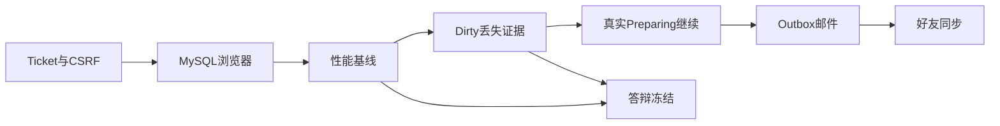

# 后续路线图与迭代表

## 目标

用一份文档说清：本地 V3 原型已经证明了什么、到 2026-08-21 答辩前还剩什么、下一步该做哪一轮。
这是**排期地图**，不是新的架构决策。

## 关键节点

| 日期 | 含义 |
|---|---|
| 2026-08-03 | 写本路线图；双 Zone MySQL 迁移与 PREPARING 恢复已完成 |
| 2026-08-18 | 终稿材料冻结目标 |
| 2026-08-21 | 最终答辩 |

前提：一人开发、本地演示。原型验证机制与单机测量基线，**不声称**本地跑出 3000 万 DAU。

## 已经完成（无缺陷不要重开）

| 编号  | 阶段                   | 结果                                   | 计划 / 证据                                              |
| --- | -------------------- | ------------------------------------ | ---------------------------------------------------- |
| C0  | 一阶段合约 + Protobuf     | HTTP/WS/数据/事件合约冻结；Go/TS 类型可生成        | `2026-07-31-v3-first-stage-implementation-plan.md`   |
| C1  | 登录认证 + Actor 主人环     | 注册/登录 → WS → 七条命令 → `player_seq=8`   | MySQL 重启与 H5 内存证据                                    |
| C2  | Dirty 检查点 + Fence    | 异步刷盘、CAS、Fence 校验、冷启动恢复              | MySQL E2E                                            |
| C3  | 双 Zone 路由            | Rendezvous 安置、Gate 缓存、错 Owner 拒绝     | `2026-08-03-static-dual-zone-routing-plan.md`        |
| C4  | 空闲 Shard 迁移          | 内存态 PREPARING→ACTIVE、陈旧缓存恢复          | `2026-08-03-manual-inactive-shard-migration-plan.md` |
| C5  | 静态双 Zone MySQL Fence | epoch=1 Fence 对齐到 Zone A/B           | `2026-08-03-static-dual-zone-mysql-fence-plan.md`    |
| C6  | 活跃 Shard MySQL 迁移    | 排空/刷盘/驱逐 → Fence CAS → 目标准备 → ACTIVE | `2026-08-03-active-shard-mysql-migration-plan.md`    |
| C7  | PREPARING 恢复         | 持久化进度、Fence 重建路由、检查/继续/放弃            | `2026-08-03-coordinator-preparing-recovery-plan.md`  |
| C8  | 本地测试平台               | 目录 + 安全执行器 + Vue 面板（仅本机）             | `tests/catalog.json`、`server/cmd/testrunner`         |

## 建议的剩余顺序

下面三步先按顺序做，用来补齐 MySQL 认证/演示缺口，并产出答辩可用数字。之后是加固证据或产品扩展。

```text
R1 Ticket/CSRF 边界
 -> R2 MySQL 浏览器主人环
 -> R3 Gate/Actor/Push/Dirty 测量
 -> R4 Dirty 丢失与成熟边界证据
 -> R5 真实 mid-PREPARING 继续（可选加固）
 -> R6 Outbox 中继 + 最小邮件（产品完整度）
 -> R7 好友 / 访问 / 同步（交付要求，靠后）
 -> R8 答辩冻结包
```



## 迭代表

状态含义：`已完成` / `下一步` / `排队` / `可选` / `靠后` / `本地不做`。

| 迭代  | 优先级 | 状态   | 目标                                 | 主要工作                                                                  | 完成标准                                    | 依赖          | 建议窗口                |
| --- | --- | ---- | ---------------------------------- | --------------------------------------------------------------------- | --------------------------------------- | ----------- | ------------------- |
| R1  | P0  | 已完成  | 冻结 WS Ticket 重启丢失边界                | 已选 A：短命进程内 Ticket/CSRF；见 ADR-0010 与 `http-api` §13.1                         | 主人能说清 Ticket 重启会丢什么；MySQL 认证不含跨 Login 重启的未用 Ticket | C1          | 2026-08-03          |
| R2  | P0  | 下一步  | MySQL 浏览器主人环                       | 用 `MYSQL_DSN` 跑一遍 H5：注册 → 完整环 → 可选重启 → 恢复；写证据                         | 浏览器演示 + 持久检查点恢复合成一条故事                   | R1          | 2026-08-03 .. 08-06 |
| R3  | P0  | 排队   | 单机性能基线                             | 测 Gate RPS/延迟、Actor 邮箱积压、Push 路径、Dirty 刷盘批次成本；脚本 + 证据表                | 可复现本机数字；容量页只引用「测量基线 + 规划假设」             | 最好先完成 R2    | 2026-08-07 .. 08-09 |
| R4  | P1  | 排队   | 异常 Dirty 窗口与成熟边界证据                 | Zone 刷盘中途被杀；跨化肥/成熟边界重启；多 Actor 批次刷盘                                   | 证据写清丢什么、恢复什么；V3 Dirty 丢失不再只是口头理论        | C2          | 2026-08-10 .. 08-11 |
| R5  | P1  | 可选   | 真实 mid-PREPARING：杀 Coordinator 再继续 | `DRAINED` 后只杀 Coordinator（Zone 仍在），检查 OPEN、继续、在 B 上写入；以及 Fence 前放弃的活测 | 用一次真实杀进程补齐组件级 continue/abandon          | C7          | 2026-08-11          |
| R6  | P2  | 靠后   | Outbox 中继 + 最小邮件                   | 中继 `CreateRewardMailV1`、Mail 服务桩、已投递标记或最小领取                           | 仓库满时领取奖励后，邮件不只停在 Actor Outbox 行         | C1 Outbox 表 | 2026-08-12 .. 08-14 |
| R7  | P2  | 靠后   | 好友 / 分享链接 / 多人同步                   | 拜访农场、分享拉新、同场 ≤3 人；同步规则按架构走                                            | 演示可拜访好友，且不破坏主人 Actor 所有权                | R2、架构说明     | 2026-08-14 .. 08-17 |
| R8  | P0  | 排队   | 答辩冻结包                              | 架构讲稿、容量数字、AI 工作流索引、演示脚本、已知限制                                          | 2026-08-18 前冻结；冻结后除非修缺陷不再加功能            | 至少完成 R1–R3  | 2026-08-15 .. 08-18 |
| X1  | —   | 本地不做 | 生产三节点 Coordinator 共识               | Raft/多数派日志                                                            | 本地演示不需要；仅作设计目标                          | ADR-0008    | 答辩后                 |
| X2  | —   | 本地不做 | 完整持久化 ShardMap 表                   | 4096 条路由控制面日志                                                         | 延后；本地用 Fence+迁移进度代替                     | C7          | 答辩后                 |
| X3  | —   | 本地不做 | 自动再均衡 / 故障切换                       | 负载或 Zone 死亡时自动搬 Shard                                                 | 原型只保留手动/本机 loopback 迁移                  | C6/C7       | 答辩后                 |
| X4  | —   | 本地不做 | 跨库 Fence / 多库分片                    | 生产库拓扑                                                                 | 本地继续单 MySQL                             | 数据模型合约      | 答辩后                 |

## 接下来三轮简要说明

### R1 — Ticket / CSRF 边界（已完成）

主人选择 A：短命 Ticket/CSRF 保持进程内。Login 重启后旧票作废；Session 仍在
（MySQL 模式）则重新领 CSRF/Ticket，否则重新登录。见 ADR-0010。

### R2 — MySQL 浏览器主人环

问题：H5 浏览器证据在内存模式；MySQL 证据在协议/脚本 E2E。答辩需要一条人眼可见、两者合一的路径。

工作：

1. 用 `MYSQL_DSN` 启动单 Zone 或双 Zone 栈。
2. 主人在浏览器完成：买种 → 种植 → 施肥 → 成熟 Push → 收获 → 出售 → 领奖 → 清理。
3. 可选：停/启服务后展示检查点恢复。
4. 记入 `docs/evidence/`（截图或结构化笔记；不写凭证）。

### R3 — 测量

问题：3000 万 DAU 仍是规划假设。

工作：

1. 用现有测试平台或小脚本测 Gate 命令延迟、Actor 饱和、Push 延迟、Dirty 批次大小/耗时。
2. 公布表格，写明机器、并发、限制。
3. 容量页分开写：**本机测得基线** vs **规划外推**。

禁止把外推 DAU 说成已测量能力。

## 答辩必做 vs 加分项

### 冻结前必做（2026-08-18）

- R1 决策已记录
- R2 MySQL 浏览器故事
- R3 测量基线 + 诚实的容量叙述
- 已有 C0–C7 机制主人能自己讲清楚
- 演示脚本：单人环 + 双 Zone 所有权/迁移亮点
- AI 工作流索引指向计划与证据

### 有时间再做

- R4 Dirty 丢失杀进程测试
- R5 真实 PREPARING 继续
- R6 邮件中继
- H5 美术抛光

### 明确靠后 / 答辩后

- 好友与多人（R7），除非 R3 后仍有余力
- 生产共识 Coordinator（X1）
- 全量 ShardMap 持久化表（X2）
- 自动 failover（X3）

## 建议日程

| 日期 | 焦点 | 退出检查 |
|---|---|---|
| 08-04 | R1 Ticket 边界说明/ADR + 若持久化则小改代码 | 文档里决策已接受 |
| 08-05 | R2 MySQL H5 试跑 | 浏览器在 MySQL 上走到领奖/清理 |
| 08-06 | R2 证据 + 同故事里的重启恢复 | 证据文件存在 |
| 08-07 | R3 测量脚手架 + Gate/Actor 第一批数字 | 一张可复现表 |
| 08-08 | R3 Push + Dirty 数字 | 四类指标齐 |
| 08-09 | R3 成文；容量页草稿 | 无「未测却当实测」的 DAU |
| 08-10 | R4 Dirty 丢失杀进程 | 丢失窗口有证据 |
| 08-11 | R4/R5 加固 | 可选真实 PREPARING 继续 |
| 08-12 .. 08-14 | R6 邮件 **或** 答辩叙述打磨 | 按剩余时间二选一 |
| 08-15 .. 08-17 | R8 冻结包；可选很薄的 R7 | 讲稿可排练 |
| 08-18 | 冻结 | 不再加功能 |
| 08-19 .. 08-20 | 排练 / 只修缺陷 | 演示稳定 |
| 08-21 | 答辩 | — |

## 怎么用这份文档

1. 每次开工先看 `../../../context/CURRENT.md` 的下一步。
2. 选未阻塞的、优先级最高的 `下一步`/`排队` P0。
3. 大改前为该轮另写一份有边界的执行计划到 `docs/archive/development/plans/`。
4. 一轮结束后：这里标 `已完成`，并更新 `CURRENT.md` 下一步。
5. 答辩窗口内不要把 X1–X4 当成本地原型必做项。

## 本文件不做的事

- 不单独接受新 ADR
- 不改合约
- 不把生产级高可用排进本地原型
- 不替代每一轮的具体执行计划

## 已拍板

R1 已选 **A（短命 Ticket）**。当前挡住演示主线的是 **R2 MySQL 浏览器主人环**。
