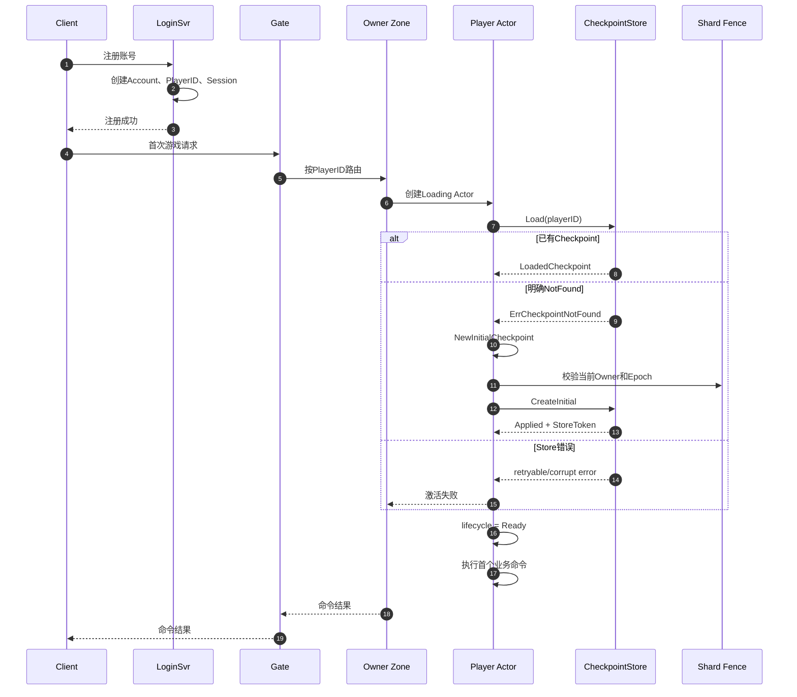

# 新玩家农田延迟初始化 Implementation Plan

> **For agentic workers:** REQUIRED SUB-SKILL: Use
> `superpowers:subagent-driven-development` or `superpowers:executing-plans`.
> 开始前确认 `01-Actor先创建后Load.md` 已完成并通过回归。

**Goal:** LoginSvr 只创建账号身份；新玩家第一次激活 Player Actor 时，由当前 Owner Zone 创建并持久化初始农田 Checkpoint。

**Architecture:** 注册成功不依赖 Zone、Shard Fence 或 PlayerCheckpoint。Zone 激活 Actor 时，`Load` 成功则恢复老玩家；只有明确返回 `ErrCheckpointNotFound` 才创建初始状态。初始 Checkpoint 通过带 Fence 校验的 `CreateInitial` 同步持久化，成功后 Actor 才进入 `Ready`。

**Tech Stack:** Go、Player Actor、Tcaplus、MySQL 回滚适配器、CheckpointStore、LoginSvr。

## Global Constraints

- 账号、密码、Session 属于 LoginSvr。
- 农田、金币、仓库、任务和互动收据属于 Player Actor。
- 临时 Store 错误、超时或数据损坏不能当成新玩家。
- 只有当前 Shard Owner Zone 可以创建初始 Checkpoint。
- 创建初始 Checkpoint 只能使用 Insert/Create-if-absent，不能覆盖已有存档。
- 初始 Checkpoint 持久化成功后 Actor 才能进入 `Ready`。
- Tcaplus 是当前正式目标；MySQL 适配器必须保持可编译和语义一致。
- 不修改客户端协议、普通命令幂等、广播和 FriendInteraction Saga。

---

## 1. 目标数据流



## 2. 修改范围

### LoginSvr

```text
server/internal/auth/tcaplus_store.go
server/internal/auth/mysql_store.go
server/internal/auth/tcaplus_store_test.go
server/internal/auth/mysql_store_test.go
server/cmd/login/main.go
```

目标：

- 注册不再创建 `PlayerCheckpointV1`；
- 注册不再查询 Shard Fence；
- Tcaplus Auth Store 不再依赖 checkpoint creator；
- 注册成功只依赖 Account、PlayerID 和 Session。

### Player/Zone

```text
server/internal/player/checkpoint_store.go
server/internal/player/runtime.go
server/internal/player/tcaplus_store.go
server/internal/player/tcaplus_durable_store.go
server/internal/player/mysql_loader.go
server/internal/player/runtime_activation_test.go
server/internal/player/tcaplus_store_test.go
server/internal/player/tcaplus_durable_store_test.go
server/internal/player/mysql_loader_test.go
```

目标：

- Actor 激活处理 `ErrCheckpointNotFound`；
- Zone 创建初始 Player State；
- 初始 Checkpoint 经过 Fence 校验后同步持久化；
- Actor 保存返回的 Store token 和 persisted revision；
- 创建成功后进入 `Ready`。

### 文档与证据

```text
docs/context/CURRENT.md
docs/contracts/data-model.md
docs/contracts/data-model.zh-CN.md
docs/archive/evidence/historical/2026-08-10-zone-initial-player-checkpoint.md
```

如果当前契约明确要求 LoginSvr 创建初始 Checkpoint，修改契约前先记录决策变化，不得只改代码。

## 3. 存储接口

不要把 `CreateInitial` 强制加入现有 `CheckpointStore`，否则所有只测试 Load/SaveCAS 的 fake Store 都必须无意义实现它。

建议增加独立能力接口：

```go
type InitialCheckpointStore interface {
    CreateInitial(
        context.Context,
        *datav1.PlayerCheckpointV1,
    ) (CheckpointWriteResult, error)
}
```

`Runtime` 继续依赖：

```go
type CheckpointStore interface {
    Load(context.Context, uint64) (LoadedCheckpoint, error)
    SaveCAS(context.Context, CheckpointWrite) (CheckpointWriteResult, error)
}
```

首次 Load 返回 `ErrCheckpointNotFound` 时，Runtime 要求当前 Store 同时实现：

```go
InitialCheckpointStore
```

不支持该能力时返回明确的配置错误，不能退回内存初始化后继续服务。

### CreateInitial 语义

- 记录不存在：插入并返回 `CheckpointWriteApplied`；
- 相同内容已经存在：返回 `CheckpointWriteAlreadyApplied` 和当前 token；
- 已存在不同内容：返回 `CheckpointWriteCorruptConflict`；
- 当前 Zone 已被 Fence：返回 `CheckpointWriteFenced`；
- 临时存储错误：返回 `CheckpointWriteRetryableFailure`；
- 禁止使用普通 Update 覆盖已有记录。

## 4. 实施任务

### Task 1：LoginSvr 停止创建农田 Checkpoint

**Files:**

- Modify: `server/internal/auth/tcaplus_store.go`
- Modify: `server/internal/auth/mysql_store.go`
- Modify: `server/cmd/login/main.go`
- Test: `server/internal/auth/tcaplus_store_test.go`
- Test: `server/internal/auth/mysql_store_test.go`

- [x] 修改 Tcaplus 注册测试，断言注册只创建：
  - AccountByName；
  - PlayerAccount；
  - Session；
  - PlayerID 分配记录。
- [x] 断言注册过程不访问 `PlayerCheckpoint` 和 `ShardFence`。
- [x] 修改前运行测试，确认旧实现仍创建 Checkpoint。
- [x] 删除 `checkpointCreator` 和 `tcaplusAuthStore.checkpoints`。
- [x] 修改 `NewTcaplusStore`，不再接收 Checkpoint Store。
- [x] 从 Tcaplus `register` 删除：
  - `player.NewInitialCheckpoint`；
  - `loadFence`；
  - `checkpoints.Create`。
- [x] 修改 MySQL 注册事务，只保留 Account 和 Session，不再查询 `shard_fences` 或插入 `player_checkpoints`。
- [x] 修改 LoginSvr 组装和日志，不再打开 PlayerCheckpoint/Fence 表用于注册。
- [x] 运行 Auth 测试。

验证命令：

```bash
cd server
go test ./internal/auth ./cmd/login -count=1
```

完成标准：

- 注册成功不依赖 Zone、Fence 和 PlayerCheckpoint；
- 注册完成后 `Load(playerID)` 明确返回 `ErrCheckpointNotFound`；
- 已有账号登录流程不受影响。

### Task 2：为 Zone 增加初始 Checkpoint 创建能力

**Files:**

- Modify: `server/internal/player/checkpoint_store.go`
- Modify: `server/internal/player/tcaplus_store.go`
- Modify: `server/internal/player/tcaplus_durable_store.go`
- Modify: `server/internal/player/mysql_loader.go`
- Test: `server/internal/player/tcaplus_store_test.go`
- Test: `server/internal/player/tcaplus_durable_store_test.go`
- Test: `server/internal/player/mysql_loader_test.go`

- [x] 在 `checkpoint_store.go` 增加 `InitialCheckpointStore`。
- [x] 将 Tcaplus 现有 `Create` 收敛为 `CreateInitial`，或保留内部 `Create` 并由 `CreateInitial` 调用。
- [x] 为 `TcaplusDurableCheckpointStore` 实现 `CreateInitial`：
  - 根据 `player_id` 计算 Shard；
  - 校验 Zone 是当前 Fence Owner；
  - 校验 `owner_epoch` 与 Fence 一致；
  - 调用 Tcaplus Insert；
  - 返回 Tcaplus record version token。
- [x] 为 `MySQLCheckpointStore` 实现相同语义：
  - 事务内锁定并校验 `shard_fences`；
  - 只使用 INSERT；
  - 已存在时加载并比较；
  - 相同内容返回 AlreadyApplied；
  - 不同内容返回 CorruptConflict。
- [x] 测试不存在、重复相同创建、重复不同创建、Fence 拒绝和临时错误。
- [x] 运行 Store 测试。

验证命令：

```bash
cd server
go test ./internal/player \
  -run 'CreateInitial|InitialCheckpoint|Fenced' \
  -count=1
```

完成标准：

- Tcaplus 和 MySQL 的 CreateInitial 语义一致；
- 已有 Checkpoint 永远不会被初始状态覆盖；
- 陈旧 Owner 无法创建初始状态；
- 成功结果包含可用于后续 SaveCAS 的 Store token。

### Task 3：Actor 首次激活时初始化农田

**Files:**

- Modify: `server/internal/player/runtime.go`
- Test: `server/internal/player/runtime_activation_test.go`

- [x] 编写新玩家激活测试：
  - `Load` 返回 `ErrCheckpointNotFound`；
  - Runtime 创建 `NewInitialCheckpoint(playerID, now)`；
  - 写入当前 `ownerEpoch`；
  - 调用 `CreateInitial`；
  - 创建成功后 Actor 才进入 `Ready`。
- [x] 断言初始状态包含当前确定规则：
  - 初始金币；
  - 初始仓库；
  - 四块空地；
  - 当前章节和任务；
  - 配置版本；
  - 正确的 player ID、Shard 和 Owner Epoch。
- [x] 将 NotFound 分支加入 Actor 初始化任务。
- [x] `CreateInitial` 成功后保存：
  - `persistedRevision`；
  - `persistedToken`；
  - 初始 Player State。
- [x] 创建失败时将 Actor 标记为 Failed，并复用 01 计划的条件删除和重新激活逻辑。
- [x] 运行激活测试和 race detector。

建议测试：

```go
func TestRuntimeCreatesInitialCheckpointOnFirstActivation(t *testing.T)
func TestRuntimeDoesNotBecomeReadyBeforeInitialCheckpointIsDurable(t *testing.T)
```

验证命令：

```bash
cd server
go test -race ./internal/player \
  -run 'FirstActivation|InitialCheckpoint' \
  -count=20
```

完成标准：

- 初始 Checkpoint 持久化前不执行首个业务命令；
- Actor Ready 后拥有正确 persisted token；
- 第一次普通 SaveCAS 使用 CreateInitial 返回的 token；
- 初始化失败后可以安全重试。

### Task 4：处理并发创建和错误分类

**Files:**

- Modify: `server/internal/player/runtime.go`
- Test: `server/internal/player/runtime_activation_test.go`

- [x] 并发发送 100 个新玩家首请求，断言：
  - 一个 Loading Actor；
  - 一次 Load；
  - 一次有效 CreateInitial；
  - 一份初始农田；
  - 首个命令只执行一次。
- [x] 模拟“创建结果已写入，但响应丢失”：
  - CreateInitial 返回不确定错误；
  - 重试 Load；
  - 已存在内容与预期一致时按 AlreadyApplied 恢复。
- [x] 模拟其他 Owner 已创建相同 Player checkpoint：
  - 重新 Load；
  - 校验 Owner Epoch；
  - 当前 Owner 不合法时返回 `NOT_OWNER`/Fenced；
  - 禁止覆盖记录。
- [x] 分别测试：
  - `ErrCheckpointNotFound`：允许初始化；
  - timeout/retryable：激活失败；
  - corrupt：激活失败；
  - fenced：返回 ownership 错误；
  - already exists with different content：冲突并报警。
- [x] 运行 race detector。

建议测试：

```go
func TestRuntimeInitializesNewPlayerOnceUnderConcurrency(t *testing.T)
func TestRuntimeNeverTreatsStoreFailureAsCheckpointNotFound(t *testing.T)
func TestRuntimeReconcilesAmbiguousInitialCheckpointCreate(t *testing.T)
```

完成标准：

- 只有明确 NotFound 进入初始化；
- 临时错误不会重置玩家；
- 并发和不确定结果不会创建两份不同存档；
- 旧 Owner 不会获得可写 Actor。

### Task 5：完整 E2E 和证据

- [x] 运行完整 Go 测试：

```bash
cd server
go test -race ./internal/auth ./internal/player -count=1
go test ./... -count=1
go vet ./...
```

- [ ] 运行 Tcaplus E2E：

```text
注册账号
-> 确认 PlayerCheckpoint 尚不存在
-> 登录和 WS AUTH
-> 首次 GET_PLAYER_SNAPSHOT
-> Zone 创建初始 Checkpoint
-> 执行普通写命令
-> Dirty flush
-> 重启 Zone
-> Load 同一 Checkpoint
-> 状态保持一致
```

- [ ] 增加初始化失败 E2E：
  - 账号注册成功；
  - 首次农田初始化临时失败；
  - 用户仍可重新登录；
  - Store 恢复后再次进入成功。
- [ ] 运行双 Zone 测试，确认初始 Checkpoint 只由路由指定的 Owner 创建。
- [ ] 如果 MySQL 适配器仍在支持范围内，运行 MySQL 注册→首次激活→重启恢复测试。
- [x] 创建证据：

```text
docs/archive/evidence/historical/2026-08-10-zone-initial-player-checkpoint.md
```

证据记录：

- 注册后 Checkpoint 不存在；
- 首次激活后的 Checkpoint 内容；
- 当前创建 Owner 和 Epoch；
- 并发首次进入结果；
- 初始化失败后重试结果；
- 重启恢复结果；
- Tcaplus 和 MySQL 已验证范围。

- [x] 更新契约中的创建责任。
- [x] 更新 `docs/context/CURRENT.md`。
- [x] 修正 LoginSvr 日志和学习笔记中“注册创建农田”的旧描述。

## 5. 验证清单

- [x] LoginSvr 不再导入 Player 业务初始化逻辑；
- [x] Tcaplus 注册不访问 Checkpoint/Fence；
- [x] MySQL 注册不插入 `player_checkpoints`；
- [x] 注册失败和农田初始化失败已经解耦；
- [x] Store NotFound 与其他错误严格区分；
- [x] 初始 Checkpoint 只能 Create-if-absent；
- [x] 创建前校验当前 Fence；
- [x] 创建成功后才 Actor Ready；
- [x] 并发首请求只初始化一次；
- [x] 创建结果不确定时可以对账；
- [x] 已有玩家不会被重新初始化；
- [x] 旧 Owner 不能创建或覆盖存档；
- [x] 第一次 SaveCAS 使用正确 Store token；
- [ ] Tcaplus 重启恢复通过；
- [x] 完整 Go 回归通过；
- [x] Evidence 和 `CURRENT.md` 已更新。

## 6. 停止条件

出现以下情况时停止并重新检查设计：

- Store 无法区分 NotFound 与临时错误；
- `CreateInitial` 需要使用覆盖式 Update；
- Zone 无法在创建前验证当前 Fence；
- Actor 必须在持久化完成前进入 Ready；
- LoginSvr 仍然需要知道初始金币、地块或任务；
- 修改导致账号注册必须调用 Zone；
- 为完成初始化必须修改客户端协议；
- 并发创建可能覆盖已有玩家数据；
- 与 01 阶段的 Actor 生命周期实现冲突。

## 7. 项目所有者复盘

完成后应能口述：

```text
Checkpoint 是 Player Actor 的完整游戏存档，存放在 Tcaplus 的
PlayerCheckpoint 表中，不属于账号系统。

以前 LoginSvr 注册时同时创建账号、Session 和初始 Checkpoint，因此 Login
知道初始金币、地块、任务、Shard Fence 和 Owner Epoch，账号与游戏业务发生
了耦合。

修改后 LoginSvr 只创建账号身份。玩家第一次发送游戏请求时，Gate 将请求路由
到当前 Owner Zone。Zone 创建 Loading Actor 并 Load Checkpoint。只有 Load
明确返回 NotFound 时，Zone 才构造初始农田，并通过带 Fence 校验的
CreateInitial 同步持久化。

创建成功后 Actor 才进入 Ready 并执行首个命令。超时、存储错误和数据损坏不能
被当成 NotFound，否则可能用初始农田覆盖已有玩家数据。
```

## 8. 决策状态

已经确认：

- 注册成功只代表账号身份创建成功；
- LoginSvr 不负责创建农田业务数据；
- Zone 在 Player Actor 第一次激活时创建初始农田；
- 只有明确 NotFound 才允许初始化；
- 初始 Checkpoint 持久化成功后 Actor 才进入 Ready；
- 初始化失败不影响账号继续登录和之后重试。

仍为 `proposed`：

- 接口最终命名使用 `CreateInitial` 还是 `CreateIfAbsent`；
- MySQL 回滚适配器是否继续作为本阶段 E2E 门禁；
- 初始配置版本来自当前 Zone ConfigSnapshot 的具体读取位置；
- 创建结果不确定时的最大对账次数和超时；
- 是否为首次初始化增加独立指标。