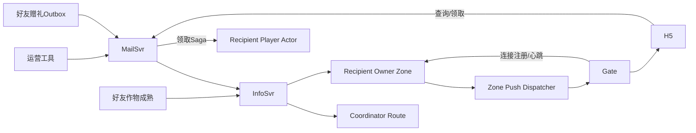
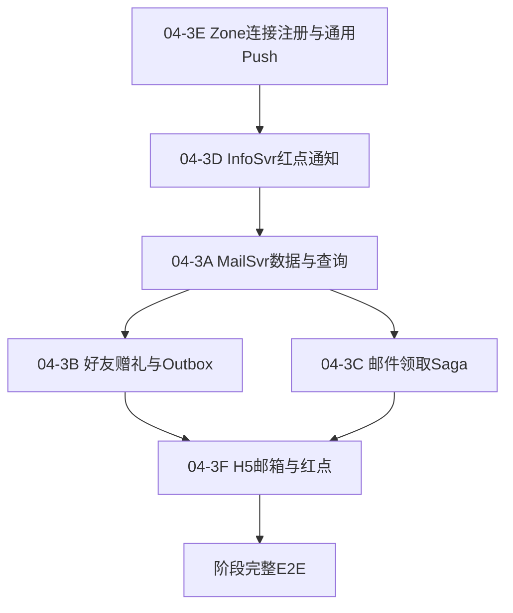

# 邮件与通知阶段总计划

> **For agentic workers:** 本文件只管理范围、依赖和验收。每次只执行一份子计划。开始前读取 `CURRENT.md`、检查工作树，并确认依赖计划已完成。

## 1. 目标

实现：

- 独立 MailSvr；
- 运营公开邮件；
- 运营私人邮件；
- 好友赠礼；
- 手动领取附件；
- 邮件领取 Saga；
- InfoSvr 红点通知；
- 好友作物成熟红点；
- Zone 玩家连接注册；
- Zone 通用 Push Dispatcher；
- H5 邮箱和好友红点。

## 2. 全局架构



## 3. 服务职责

### MailSvr

负责：

- 公开邮件；
- 私人邮件；
- 好友礼物邮件；
- 邮件查询；
- 邮箱打开游标；
- 已读和领取状态；
- 邮件领取 Saga；
- 产生邮箱红点事件。

不直接修改玩家仓库。

### InfoSvr

负责：

- 邮箱红点；
- 好友农场可偷红点；
- 根据 Player RouteCache 找到接收玩家 Owner Zone；
- 向 Zone 投递红点变化。

不保存红点，不使用 Player Actor，不维护玩家到 Gate 的映射。

### Zone

负责：

- 维护自己拥有玩家的临时 Gate 连接；
- 每个 Zone 一个通用 Push Dispatcher；
- 按 Gate 分组并推送；
- Recipient Player Actor 的附件入仓；
- 邮件领取幂等收据。

连接表不持久化。

### Gate

负责：

- 为 WebSocket 连接生成 `connection_id`；
- AUTH 后向 Owner Zone 注册；
- 每 30 秒刷新连接租约；
- 断线时注销；
- 接收 Zone Push 并写入客户端。

### Coordinator

只负责：

```text
player_id -> shard -> owner Zone
```

不保存玩家 Gate 连接。

## 4. 已确认规则

### 公开邮件

- 只保存一份；
- 不在发布时为每个玩家生成收件记录；
- 不进行全服 Push；
- 玩家只能看到注册后发布的公开邮件；
- 每名玩家拥有独立已读和领取状态；
- 登录时按需检查是否存在新邮件。

### 私人邮件

- 运营者可以发送给指定 Player ID；
- 创建后触发邮箱红点；
- 使用内网 Admin API 和密钥鉴权；
- 不做运营后台 UI。

### 好友赠礼

- 只能赠送仓库中的作物；
- 每封只赠送一种作物；
- 单次数量为 1–10；
- 允许赠送给离线好友；
- 标题和正文使用服务器固定模板；
- 不设置每日次数限制；
- 发送时立即从寄件人仓库扣除；
- 同一次 Actor 提交写入 GiftMail Outbox；
- MailSvr 使用 event ID 去重。

### 邮件附件

- 必须手动领取；
- 不设置过期时间；
- 全部领取或全部失败；
- 仓库不足时保持未领取；
- 使用 MailSvr + Player Actor Saga；
- 相同 claim 不重复增加物品。

### 邮箱红点

- 公开邮件不主动全服推送；
- 登录时 MailSvr 检查新邮件；
- 私人邮件和好友礼物立即产生红点事件；
- 点击邮箱后 H5 清除红点；
- MailSvr 更新 `last_mailbox_opened_at_ms`；
- 未领取的旧邮件不会反复点亮；
- 只有上次打开后到达的新邮件重新点亮。

### 好友成熟红点

- 地块进入可偷成熟状态时产生一次事件；
- InfoSvr 将红点投递给 owner 的好友；
- 红点显示在对应好友的“进入农场”按钮；
- 点击按钮后 H5 本地清除；
- 是否真实可偷仍由 Owner Actor 判断；
- 玩家离线时红点允许丢失；
- 不持久化红点。

### 连接注册

```text
Gate AUTH
-> RegisterConnection

Gate每30秒
-> RefreshConnection

Zone租约
-> 90秒

Gate断线
-> UnregisterConnection
```

Zone 内存保存：

```text
player_id
-> gate_id
-> connection_id
-> expires_at
```

## 5. 实施顺序



执行顺序：

1. `04-3E-Zone连接注册与通用Push.md`
2. `04-3D-InfoSvr红点通知.md`
3. `04-3A-MailSvr数据与查询.md`
4. `04-3B-好友赠礼与Outbox.md`
5. `04-3C-邮件领取Saga.md`
6. `04-3F-H5邮箱与红点窗口.md`
7. 完整 E2E

## 6. 子计划验收

### 04-3E：Zone 连接注册与通用 Push

- Gate AUTH 后注册连接；
- 连接使用 `connection_id` 防止旧连接误删新连接；
- Gate 和 Zone 心跳正常；
- Zone 重启后 Gate 可以重新注册；
- Dispatcher 支持 FarmView 和 RedDot；
- 当前单 Gate 回归通过；
- 接口不写死未来只能有一个 Gate。

### 04-3D：InfoSvr 红点通知

- InfoSvr 拥有 Player RouteCache；
- 能向 Recipient Owner Zone 投递红点；
- `NOT_OWNER` 后刷新并重试一次；
- 邮件和好友农场红点协议稳定；
- InfoSvr 不保存每玩家红点状态；
- 离线或投递失败不会影响业务。

### 04-3A：MailSvr 数据与查询

- MailSvr 独立运行；
- 支持公开和私人邮件；
- 公开邮件只保存一份；
- 玩家看不到注册前的公开邮件；
- 邮箱查询能合并公开、私人和礼物邮件；
- 打开邮箱更新游标；
- Admin API 有内网鉴权。

### 04-3B：好友赠礼与 Outbox

- 只有好友可以赠送；
- 只能赠送一种作物、数量 1–10；
- 发送时立即扣除；
- Outbox 与扣除同一次 Actor 提交；
- Relay 重试不重复创建邮件；
- 寄件人重试不重复扣除。

### 04-3C：邮件领取 Saga

- BeginClaim、ApplyMailReward、CompleteClaim 完整；
- 仓库不足时全部失败；
- Player Actor 保存领取收据；
- 崩溃恢复不丢奖励、不重复发奖；
- MailSvr 可恢复长期 `CLAIMING`。

### 04-3F：H5 邮箱与红点

- 点击邮箱打开小窗口；
- 点击时清除本地红点；
- 支持公开、私人和好友礼物展示；
- 显示时间、寄信人、收信人和附件；
- 支持标记已读和手动领取；
- 好友进入农场按钮显示独立红点；
- 手机尺寸无横向溢出。

## 7. 阶段完整 E2E

- [ ] Gate AUTH 后向 Owner Zone 注册连接。
- [ ] MailSvr 发布一封公开邮件。
- [ ] 注册时间早于邮件的玩家可以看到。
- [ ] 注册时间晚于邮件的玩家看不到。
- [ ] 运营者向指定玩家发送私人邮件。
- [ ] 在线玩家收到邮箱红点。
- [ ] 玩家点击邮箱，红点清除并返回邮件列表。
- [ ] 玩家未领取附件再次登录，旧邮件不重新点亮。
- [ ] 好友 A 向好友 B 赠送作物。
- [ ] A 的仓库立即扣除。
- [ ] MailSvr 最终创建一封礼物邮件。
- [ ] B 收到邮箱红点。
- [ ] B 仓库不足时领取失败，邮件保持未领取。
- [ ] B 清理仓库后领取成功。
- [ ] 重复领取不重复增加作物。
- [ ] 领取中途重启后 Saga 恢复。
- [ ] 好友作物成熟后，进入农场按钮显示红点。
- [ ] 点击进入后红点清除。
- [ ] InfoSvr、Zone 或 Gate 丢失一次红点不影响邮件或偷菜。
- [ ] 当前单 Gate FarmView 回归通过。
- [ ] 全栈重启后邮件、领取状态和赠礼结果恢复。

## 8. 存储边界

需要由各子计划设计具体 Tcaplus 主键：

```text
PublicMail
PrivateMail
PlayerMailboxCursor
PlayerMailState
MailClaimSaga
```

不得将以下内容持久化：

```text
红点
player_id -> gate_id
connection_id
Dispatcher队列
WebSocket连接
```

## 9. 证据

各子计划分别创建证据。阶段结束后创建：

```text
docs/evidence/2026-08-12-mail-notification-e2e.md
```

内容：

- 服务拓扑；
- Tcaplus 表；
- 完整 E2E；
- 公开邮件查询结果；
- 好友赠礼结果；
- 领取 Saga 崩溃恢复；
- 红点推送；
- Gate/Zone 心跳；
- 当前单 Gate 限制；
- 多 Gate 后续设计。

## 10. Agent 阶段检查

- [ ] 六份子计划均完成；
- [ ] MailSvr 和 InfoSvr 可独立启动；
- [ ] Zone 连接注册不进入 Player Checkpoint；
- [ ] Dispatcher 每 Zone 一个，不是每 Actor 一个；
- [ ] InfoSvr 不维护 Gate 映射；
- [ ] Coordinator 不维护 Gate 映射；
- [ ] 公开邮件没有按玩家全量展开；
- [ ] 好友赠礼使用 Outbox；
- [ ] 邮件领取使用 Saga；
- [ ] 红点允许丢失且不影响业务；
- [ ] 单 Gate 完整回归通过；
- [ ] 完整 E2E 和 Evidence 完成；
- [ ] `CURRENT.md` 已更新。

## 11. 停止条件

- 运营发布公开邮件需要同步写每个玩家；
- InfoSvr 开始保存 Player Actor 或红点状态；
- Zone 连接表被写入 Player Checkpoint；
- 好友赠礼绕过 FriendSvr 校验；
- 赠礼扣除和 Outbox 不在同一次 Actor 提交；
- 邮件领取先标记完成但奖励尚未入仓；
- 重试可能重复发奖；
- Dispatcher 使用无界队列或每消息一个 goroutine；
- 为实现红点必须让 Coordinator 保存连接状态；
- 与正在进行的好友代码发生不可安全合并的冲突。

## 12. 决策状态

本文件中的业务和架构边界已经由项目所有者确认。

各子计划仍需确定：

- Protobuf 精确字段；
- Tcaplus 主键；
- gRPC 方法名；
- Dispatcher 通用事件类型；
- Gate Client Pool 的最小接口；
- Mail Claim Saga 的具体状态枚举；
- 各队列容量和超时。

这些实现细节必须通过测试确定，不自动形成新的 accepted ADR。