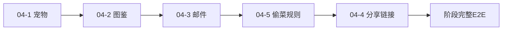

# 基础业务补齐：阶段总计划

> **For agentic workers:** 本文件只管理范围、顺序和总验收，不包含具体实现步骤。每次只执行一份 `04-x` 子计划；开始前检查 `CURRENT.md` 和工作树，不覆盖其他任务的修改。

## 1. 目标

以最小但完整的纵向切片补齐：

- 宠物；
- 图鉴；
- 邮件；
- 分享链接自动加好友；
- 好友偷菜最终规则。

每个功能必须同时具备：

```text
服务端权威规则
+ 持久化
+ Protobuf协议
+ H5入口
+ 正常路径
+ 非法路径
+ 幂等或重复请求语义
+ 重启恢复
+ E2E证据
```

## 2. 全局约束

- 只实现答辩所需最小玩法，不扩展复杂养成或运营系统。
- Player 私有业务状态优先归属 Player Actor。
- 好友关系继续由 FriendSvr 维护。
- 跨两个 Player Actor 的资源修改继续复用 FriendInteraction Saga。
- 前端只展示服务端状态，不复制权威业务判断。
- 普通 Player 命令暂时保留现有幂等实现；统一迁移留到第 06 阶段。
- 广播使用第 03 阶段的 `DomainChanges -> FarmViewEvent -> Dispatcher`。
- 所有状态必须支持 Tcaplus checkpoint 或对应权威 Store 恢复。
- 每个子计划完成后单独提交、验证和记录证据。

## 3. 执行顺序



分享链接编号为 `04-4`，但建议在偷菜规则之后实施，因为它还需要与第 05 阶段 HTTPS 部署衔接。

如果好友代码仍被其他任务修改：

```text
完成宠物、图鉴和邮件
-> 等待好友修改稳定
-> 再执行偷菜和分享链接
```

## 4. 子目标

### 04-1：宠物最小闭环（已完成 2026-08-11）

**范围：**

- 一个默认宠物；
- 查看宠物状态；
- 一次服务端权威互动；
- 最小冷却或次数约束；
- checkpoint 持久化；
- H5 入口。

**不做：**

- 多宠物编队；
- 战斗；
- 换装；
- 宠物交易；
- 复杂成长树；
- 运营后台。

**完成标准：**

- 新玩家初始无宠物，通过购买获得（以 04-1 详细计划为准）；
- 合法互动修改权威状态；
- 非法或冷却中的互动不修改状态；
- 重复请求不重复生效；
- 重启后状态恢复；
- H5 和 E2E 可演示。

**计划：**

```text
04-1-宠物最小闭环.md
```

### 04-2：图鉴最小闭环

**范围：**

- 首次收获一种作物时解锁图鉴；
- 展示已解锁和未解锁条目；
- 图鉴状态属于 Player Actor；
- checkpoint 持久化。

**不做：**

- 完整奖励体系；
- 稀有度和成就系统；
- 全品类后台配置；
- 跨赛季图鉴。

**完成标准：**

- 首次收获解锁；
- 重复收获不重复解锁或发奖；
- 非成功收获不解锁；
- 重启后图鉴保持；
- H5 展示与权威状态一致。

**计划：**

```text
04-2-图鉴最小闭环.md
```

### 04-3：邮件最小闭环

**范围：**

- 消费现有奖励 Outbox；
- 创建奖励邮件；
- 邮件列表；
- 标记已读；
- 领取附件；
- 防止重复投递和重复领取。

**不做：**

- 全服群发；
- 运营编辑器；
- 社交私信；
- 多种复杂附件；
- 大规模归档系统。

**完成标准：**

- 仓库溢出产生 Outbox；
- Relay 最终创建一封邮件；
- 重复投递不产生重复邮件；
- 领取通过服务端权威流程发放；
- 重复领取不重复获得资源；
- 中途失败和重启可以恢复；
- H5 可查看和领取。

**计划：**

```text
04-3-邮件最小闭环.md
```

### 04-4：分享链接自动加好友

**范围：**

```text
A生成HTTPS分享链接
-> B打开链接
-> 未登录时先完成登录
-> 登录后继续兑换邀请
-> FriendSvr建立好友
-> H5展示结果
```

**必须复用：**

- 现有 share code；
- FriendSvr；
- FriendRelation；
- FriendList；
- 建好友 Saga。

**完成标准：**

- 已登录用户打开链接后自动兑换；
- 未登录用户登录后继续兑换；
- 重复打开不重复建关系或发奖励；
- 自己添加自己失败；
- 链接过期返回确定错误；
- 好友已满返回确定错误；
- 手机 HTTPS 环境 E2E 通过。

**计划：**

```text
04-4-分享链接自动加好友.md
```

### 04-5：好友偷菜规则收口

**范围：**

- 冻结并实现最终偷菜规则；
- 继续复用 FriendInteraction Saga；
- 保持主人 Actor 是地块权威；
- 使用第 03 阶段广播链路同步公开变化。

**必须明确：**

- 哪些地块可以偷；
- 单次偷取数量；
- 每个访客对同一地块的限制；
- 每块地总偷取次数；
- 主人最低保留量；
- 多访客并发时的结果；
- 重复请求和崩溃恢复。

**完成标准：**

- 未成熟、非好友或 visit 无效时不能偷；
- 主人保护量不被突破；
- 次数限制正确；
- 相同请求不重复扣减或奖励；
- 多访客并发满足规则；
- 三类 Saga crash window 恢复通过；
- owner 和 visitor 最终状态一致；
- 三客户端广播通过。

**计划：**

```text
04-5-好友偷菜规则收口.md
```

## 5. 阶段集成任务

五个子计划完成后执行一次完整集成验证。

### Task 1：完整产品 E2E

- [ ] 注册新账号，首次进入由 Zone 初始化 Player checkpoint。
- [ ] 完成宠物互动。
- [ ] 种植并收获作物，解锁图鉴。
- [ ] 构造仓库溢出，产生奖励邮件。
- [ ] 查看、标记已读并领取邮件。
- [ ] 创建第二个账号。
- [ ] 使用分享入口建立好友关系。
- [ ] 进入好友农场。
- [ ] 完成一次合法偷菜。
- [ ] 两名访客同时观察 owner 农场变化。
- [ ] 重复发送互动请求，确认不重复结算。
- [ ] 重启完整服务。
- [ ] 验证宠物、图鉴、邮件、好友关系和互动结果恢复。

### Task 2：完整回归

```bash
cd server
go test -race \
  ./internal/player \
  ./internal/auth \
  ./internal/friend \
  ./internal/interaction \
  ./internal/farmview \
  ./internal/visit \
  -count=1

go test ./... -count=1
go vet ./...
```

前端使用仓库现有命令运行：

```text
类型检查
构建
现有前端测试
移动端烟雾测试
```

### Task 3：阶段证据

创建：

```text
docs/evidence/2026-08-11-basic-product-gaps-e2e.md
```

只记录：

- 测试环境和版本；
- 完整 E2E 步骤；
- 每项权威状态存放位置；
- 重复请求结果；
- 重启恢复结果；
- 尚未完成的 UI 或可靠性限制。

项目状态实质变化后更新：

```text
docs/context/CURRENT.md
```

## 6. 文件所有权

| 子计划 | 主要服务 | 主要数据所有者 |
|---|---|---|
| 宠物 | Zone | Player Actor |
| 图鉴 | Zone | Player Actor |
| 邮件 | Mail/Zone | Mail Store + Player Actor |
| 分享链接 | H5/Login/FriendSvr | FriendSvr |
| 偷菜 | Zone/FriendInteraction | Owner Actor + Visitor Actor + Saga |

如果一个实现需要跨出表中边界，必须在对应子计划中解释原因。

## 7. Agent 阶段检查

- [ ] 五个子计划分别完成；
- [ ] 每项均有服务端权威规则；
- [ ] 每项均有持久化恢复；
- [ ] 每项均有 H5 入口；
- [ ] 每项均覆盖至少一个非法路径；
- [ ] 重复请求不会重复发放资源；
- [ ] 跨 Actor 修改继续使用 Saga；
- [ ] 公开地块变化使用独立广播链路；
- [ ] 完整产品 E2E 通过；
- [ ] 全栈重启恢复通过；
- [ ] race detector 和完整回归通过；
- [ ] 阶段 Evidence 已创建；
- [ ] `CURRENT.md` 已更新。

## 8. 止损规则

- 宠物时间不足：只保留一个宠物和一个互动。
- 图鉴时间不足：只保留“首次收获解锁”，不增加奖励。
- 邮件时间不足：只支持奖励邮件，不实现群发和复杂附件。
- 分享链接受部署阻塞：先完成 URL 参数和登录后续接，本地 HTTPS 验证移到第 05 阶段。
- 偷菜规则修改与好友任务冲突：等待当前好友任务完成后再合并，禁止覆盖其代码。
- 任一功能不能持久化恢复：不得仅凭 H5 展示标记完成。
- 任一跨 Actor 资源修改绕过 Saga：停止实现并重新检查设计。

## 9. 决策状态

已经确认：

- 04 阶段拆成五份独立子计划；
- 所有功能只做最小纵向闭环；
- Player 私有状态优先属于 Player Actor；
- 分享链接复用 FriendSvr；
- 偷菜继续复用 FriendInteraction Saga；
- 每个子功能必须有持久化、H5 和 E2E。

每个功能的具体业务规则仍需在对应 `04-x` 子计划中确认。