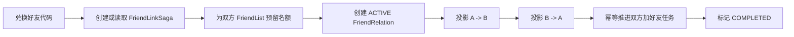

# FriendSvr 详细设计

## 1. 职责

FriendSvr 是独立的 gRPC 服务，只管理社交关系：

```text
好友代码
→ 建立双向好友
→ 好友列表
→ 校验两名玩家是否双向好友
```

它不管理农场地块、访客心跳、农场公开 Push 或偷菜 Saga。

## 2. 已确认规则

- 好友列表显示现有 `account_name`；
- 每名玩家最多 100 名好友；
- 每名玩家同时最多一个有效好友代码；
- 好友代码服务端生成、可重复兑换、有效期 10 分钟；
- 有效代码被同一玩家重复兑换时返回已有好友关系；
- 玩家不能兑换自己的代码；
- 好友申请确认、备注、分组、在线状态、删除好友 UI 不在第一版范围。

## 3. 逻辑数据

```text
FriendCodeCurrent
- owner_player_id
- code
- created_at
- expires_at
- status

FriendCodeLookup
- code
- owner_player_id
- expires_at
- status

FriendRelation
- player_low_id
- player_high_id
- relation_id
- status
- created_at

FriendList
- player_id
- entries: [{friend_player_id, account_name, relation_id, created_at}]
- reservations: [{link_id, friend_player_id, expires_at}]
- active_count
- reserved_count

FriendLinkSaga
- link_id
- code
- owner_player_id
- redeemer_player_id
- status
- player_low_task_credit_status
- player_high_task_credit_status
- created_at / updated_at
```

`FriendCodeCurrent` 以 `owner_player_id` 为主键，保证每名玩家只有一个当前
有效代码；`FriendCodeLookup` 提供按代码兑换的查找入口。

`FriendRelation` 以排序后的 `(player_low_id, player_high_id)` 为复合主键，
是双向好友关系的唯一权威记录。`CheckMutualFriend` 直接读取它，不依赖
两份列表是否已经投影完成。

`FriendList` 每位玩家一条 Tcaplus 记录，是列表查询投影。
`reservations` 必须按 `link_id` 持久化，`reserved_count` 是其汇总值，
用于并发兑换时预留好友名额，避免超过 100 人上限。投影缺失可由
`FriendRelation` 和 `FriendLinkSaga` 对账修复。

## 4. 建立好友 Saga



规则：

1. `link_id` 由代码和兑换者确定，同一兑换可安全重试；
2. 双方名额均预留成功后，才允许创建 `ACTIVE FriendRelation`；
3. `CheckMutualFriend` 只认可 `ACTIVE FriendRelation`；
4. 两份 `FriendList` 是可修复投影，不作为访问授权；
5. 关系建立后，FriendSvr 按 `relation_id` 幂等调用双方 Player Owner，
   为双方各推进一次第二章“加好友”任务；任务暂时失败不撤销好友关系，
   由 Saga 对账继续；
6. 任一步 CAS 冲突或临时失败保留 Saga，稍后重试或对账；
7. 已经是好友时不重复占用名额，也不重复推进任务。

## 5. gRPC 方法

```text
CreateShareCode(caller_player_id)
RedeemShareCode(caller_player_id, code)
ListFriends(caller_player_id)
CheckMutualFriend(player_a_id, player_b_id)
```

`CheckMutualFriend` 仅由 Zone 内部调用。H5 只能经 Gate 使用好友代码和好友列表接口。

## 6. 边界

- FriendSvr 的双向好友 Saga 与跨玩家农场互动 Saga 是两套独立状态机；
- 好友关系成功不代表已经进入对方农场；
- 进入农场仍需经过访客 Zone、`ENTER_FARM` 与农场主 Zone 的访客表校验；
- 好友代码、Session、Ticket、gRPC Metadata 和日志都不得包含可重放的明文 Secret。

