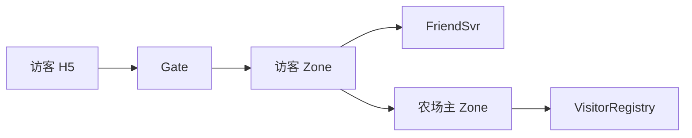
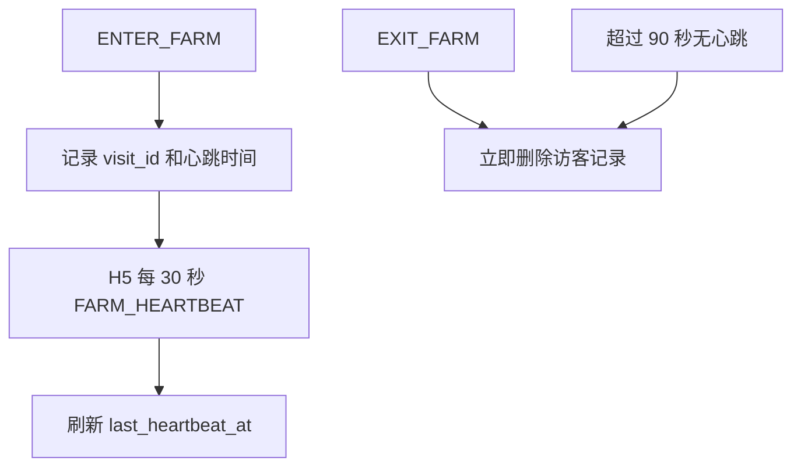

# 好友访问与心跳详细设计

## 1. 访问链路

浏览器不直连 Zone。好友访问、心跳和访客互动先到访客自己的 Zone，再由访客 Zone 调用农场主 Zone。



```text
H5 -> Gate -> 访客 Zone -> FriendSvr 校验好友
-> 农场主 Zone ENTER_FARM
-> 返回 FarmVisitSnapshot
```

## 2. 访问会话

规则：

- 一个 H5 页面一次只能访问一座好友农场；
- 切换好友时，先自动 `EXIT_FARM` 旧农场；
- 当前项目一个玩家只保留一个有效登录浏览器；
- `ENTER_FARM` 成功后生成或刷新一条 `visit_id`；
- 访客的所有好友动作都必须带有效 `visit_id`。

农场主 Zone 内存 `VisitorRegistry`：

```text
owner_player_id
visitor_player_id
visit_id
gate_id
last_heartbeat_at
```

它是在线态，不写入 Tcaplus，也不写入 Player Checkpoint。

## 3. 心跳和退出



心跳固定链路：

```text
H5 -> Gate -> 访客 Zone -> 农场主 Zone
```

农场主 Zone 或访客 Zone 重启后，旧访客表丢失。下次心跳返回 `VISIT_NOT_FOUND`，H5 必须重新 `ENTER_FARM` 并替换完整公开快照。

## 4. 公开农场版本

访客不能使用农场主私有 `player_seq`。买种子等私有变化会造成公开流版本跳跃。

每个农场在 Owner Zone 内存维护：

```text
farm_view_epoch
farm_view_seq
```

- `farm_view_epoch`：Owner Actor 每次激活时生成；Zone 重启、Actor
  eviction 后重激活或 Shard 迁移到新 Owner 时都改变；
- `farm_view_seq`：只在公开地块变化时增加；
- 访客收到新 Epoch 时整体替换 `FarmVisitSnapshot`；
- 私有金币、背包、任务变化不增加 `farm_view_seq`。

## 5. 公开 Push 和 Presence Push

农场主 Zone 地块出现公开变化时：

```text
Owner Actor
-> 查询 VisitorRegistry
-> 按记录的 gate_id 调 GatePushService
-> Gate 向农场主和所有在线访客下发 FarmViewPatch
```

农场主收到两类短暂 Toast：

```text
FARM_VISITOR_ENTERED
FARM_VISITOR_LEFT
```

Presence 不改变农场公开版本。访客公开 Patch 只含地块、虫害和 `can_steal`，绝不含农场主金币、背包、任务或其他访客私有数据。

