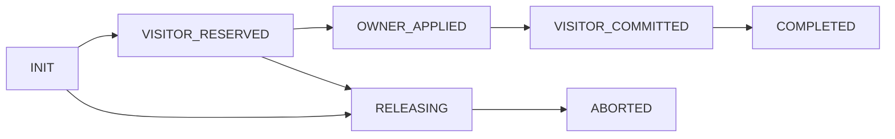
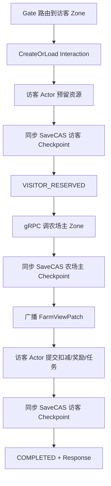

# 好友互动 Saga 详细设计

## 1. 数据归属

```text
访客 Actor Checkpoint：
- 投虫/捉虫/清理机会
- 偷取背包容量 reservation
- interaction_id 对应的资源 reservation 和完成回执

农场主 Actor Checkpoint：
- 地块、虫害、偷取次数、被偷数量
- interaction_id 对应的应用回执

FriendInteraction：跨 Actor Saga 的持久化进度
```

两个 Actor 可在不同 Zone。Tcaplus 只保证单记录 CAS，不能跨两名玩家原子提交。
`FriendInteraction` 只负责编排，不能替代两个 Player Checkpoint 中的资源
reservation 和回执。

## 2. 互动规则

| 操作 | 访客资源 | 农场主地块 |
|---|---|---|
| 投虫 | 成功后扣 1 次投虫机会 | `GROWING` 且无虫时写入虫害 |
| 捉虫 | 访客成功后扣 1 次；农场主本人免费 | 移除虫害；虫源不能捉自己投的虫 |
| 帮忙清理 | 成功后扣 1 次清理机会 | `NEED_CLEANUP -> EMPTY` |
| 偷取 | 预留背包容量，完成后入背包 | 增加 `steal_count`、`stolen_quantity` |

注册初始值：

```text
投虫机会 100
捉虫机会 100
清理机会 100
```

农场主自身保持现有免费清理规则。农场主是否看到行为者名称由配置决定。

## 3. 偷取规则

种植时冻结：

```text
base_yield
steal_quantity
max_steal_times
protected_owner_yield
```

默认：

```text
protected_owner_yield = 1
```

允许偷取：

```text
remaining = base_yield - stolen_quantity
remaining - steal_quantity >= protected_owner_yield
steal_count < max_steal_times
```

不满足时，好友界面 `can_steal=false`，服务端也必须拒绝。偷取成功后的第二章任务只在 Saga 完整提交、作物已进入访客背包后推进。

## 4. Saga 状态



`interaction_id` 直接使用 WebSocket `request_id`。

```text
FriendInteraction
- interaction_id
- visitor_player_id / owner_player_id / visit_id
- action / plot_id / request_digest
- status / result / error_code
- retry_at / created_at / updated_at
```

Player Checkpoint 至少新增：

```text
FriendResourceReservation
- interaction_id
- action
- reserved_action_chance
- reserved_inventory_item_id / quantity
- status

FriendInteractionReceipt
- interaction_id
- role: VISITOR / OWNER
- action
- result_digest
- status
```

同一 `interaction_id` 的 reservation 和 receipt 必须幂等覆盖，不能追加出
多份有效记录。

## 5. 成功流程



普通单玩家命令继续异步 Dirty；跨玩家互动是同步 CAS 特例。

每一步的持久化顺序固定为：

1. 先创建或读取 `FriendInteraction`；
2. 访客 Actor 写 reservation 并同步 SaveCAS；
3. Saga CAS 为 `VISITOR_RESERVED`；
4. 农场主 Actor 写地块变化和 OWNER receipt 并同步 SaveCAS；
5. Saga CAS 为 `OWNER_APPLIED`；
6. 访客 Actor 消费 reservation、写奖励和 VISITOR receipt；偷菜成功同时
   推进 `TASK_STEAL_CROP`，投虫成功同时推进
   `TASK_APPLY_PEST_TO_FRIEND`，然后同步 SaveCAS；
7. Saga CAS 为 `VISITOR_COMMITTED`，最后写 `COMPLETED`。

第二章任务只在访客提交已同步持久化后推进，并与同一次访客 Checkpoint
SaveCAS 一起提交。

## 6. 并发和恢复

- 农场主 Actor Mailbox 决定同一地块的先到先成功；
- 后到请求返回确定失败，访客预留必须释放；
- 农场主已保存 `OWNER_APPLIED` 后不允许反向撤销地块；
- 若响应丢失，使用同一 `interaction_id` 重试，农场主回执返回“已应用”；
- 访客 Checkpoint 已保存 reservation、但 Saga 仍为 `INIT` 时，以
  Checkpoint 为准补写 `VISITOR_RESERVED`；
- 农场主 Checkpoint 已保存应用回执、但 Saga 仍为
  `VISITOR_RESERVED` 时，以回执为准补写 `OWNER_APPLIED`；
- 访客 Checkpoint 已保存提交回执、但 Saga 尚未推进时，以回执为准补写
  `VISITOR_COMMITTED` 和 `COMPLETED`；
- 访客 Actor 激活时对账自己的未完成互动；
- Visitor Zone 定时扫描 `retry_at` 到期的未完成记录；
- 终态记录保留 24 小时；未完成记录不自动删除；
- Tcaplus 临时错误只推进重试时间，不能猜测成功或失败。

