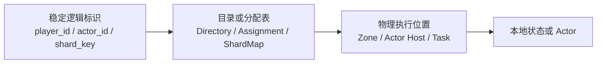
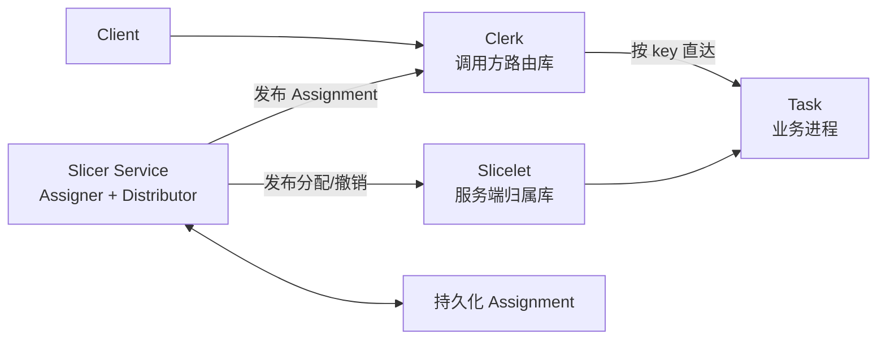
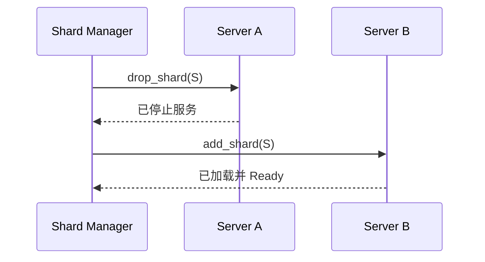
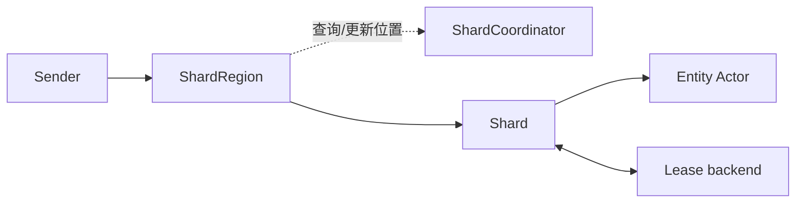
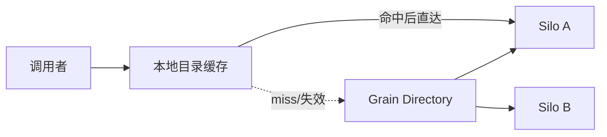
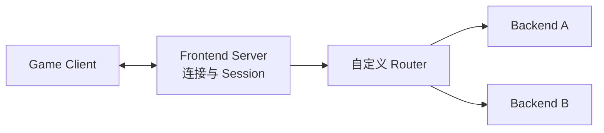

# 双 Zone 路由：论文与成熟项目解读

## 1. 先建立共同问题模型

这些资料使用的术语不同，但都在解决同一个问题：业务只知道一个稳定逻辑标识，系统必须把请求送到当前负责它的物理进程。



真正困难的不是哈希，而是：

- 物理节点上下线时谁能修改映射；
- 映射更新期间是否允许两个节点同时写；
- 调用方缓存旧映射后如何恢复；
- Owner 切换时状态如何停止、刷盘和重新加载；
- 控制面故障时现有请求能否继续。

## 2. Google Slicer

来源：[Slicer: Auto-Sharding for Datacenter Applications](https://www.usenix.org/conference/osdi16/technical-sessions/presentation/adya)，[论文 PDF](https://www.usenix.org/system/files/conference/osdi16/osdi16-adya.pdf)。

### 2.1 它解决什么问题

Google 内部许多服务都需要把具有相同 key 的请求送到同一个任务进程，以利用内存状态、缓存、连接或写聚合。如果每个项目自行实现一致性哈希、故障切换和负载均衡，会形成大量重复且难以演进的系统。

Slicer 把应用 key 哈希到一个统一空间，再把连续的哈希区间称为 slice，动态分配给任务进程。它不理解业务状态，只管理“哪一段 key 当前由哪些任务负责”。

### 2.2 核心架构



- Slicer Service 是控制面：收集节点健康、请求负载和容量信号，生成 Assignment；
- Clerk 是客户端库：把 key 映射到目标地址；
- Slicelet 是服务端库：告诉业务进程自己获得或失去了哪些 slice；
- Assignment 分发和优化都不在普通客户端请求的同步链路中。

### 2.3 最重要的设计思想

第一，控制面与数据面分离。控制面暂时不可用时，现有 Assignment 仍能继续转发流量，只是不能及时重新优化。

第二，key 数量与管理单元分离。Slicer 管理哈希区间，而不是为十亿个 key 分别维护一条记录。这与经典农场管理 4096 个逻辑 Shard、而不是为每个玩家保存路由记录的思路一致。

第三，“开头和结尾都检查自己是 Owner”仍然不够。一个 slice 可能在请求执行期间被撤销又重新分配。Slicer 为强归属场景提供连续 Assignment handle，用来确认一段执行期间归属没有中断。这提示经典农场需要单调 `owner_epoch`，不能只比较 `zone_id`。

第四，Slicer 同时支持强一致 Assignment 和偏可用的重叠 Assignment。修改内存状态的服务更适合 at-most-one 的强归属模式；只读缓存则可以接受多个副本。

### 2.4 不能直接照搬的部分

- Slicer 是完整通用平台，包含负载采集、自动再平衡、分发树和全局优化；双 Zone 原型不需要实现这些能力；
- 论文中的生产吞吐不能证明经典农场达到同样性能；
- Slicer 的 slice 是哈希区间，当前经典农场已经选择固定 4096 个逻辑 Shard，不应为了模仿论文改变分片合同。

## 3. Meta Shard Manager

来源：[Scaling services with Shard Manager](https://engineering.fb.com/2020/08/24/production-engineering/scaling-services-with-shard-manager/)。

### 3.1 它解决什么问题

Meta 的大量业务都有“把一组 opaque shard 分配给服务器”的需求。业务对 Shard 内部数据负责，Shard Manager 只负责服务器成员、负载、故障和 Shard 生命周期。

它把应用分为 primary-only、secondaries-only 和 primary-secondary。经典农场的玩家逻辑 Shard 属于 primary-only：一个 Shard 只有一个写 Owner，状态最终保存在外部 MySQL。

### 3.2 核心接口与迁移

业务进程只需要实现两个基本原语：

```text
add_shard(shard_id)
drop_shard(shard_id)
```

最简单的迁移为：



先成功停止 A，再让 B 加载，可以提供 at-most-one-primary，但中间会短暂不可用。Meta 后续增加了更复杂的无缝切换协议来缩短不可用时间。

### 3.3 路由和控制面

- Scheduler 收集节点、Shard 和负载状态，驱动 Shard 转移；
- Scheduler 把公开分配视图发布到高可用服务发现；
- 客户端公共路由库根据应用名和 Shard ID 得到 RPC client；
- 普通请求发现地址后直接访问应用服务器，Scheduler 不在热路径；
- 控制面失效时，应用可以继续使用既有分配降级运行。

### 3.4 对经典农场的启发

- `add_shard/drop_shard` 是很好的 Zone 生命周期接口，比让 Coordinator 操作 Player Actor 细节更清晰；
- 先实现有短暂停服的安全切换，再考虑无缝迁移；
- 一个 Shard 的负载、Actor 数量和 Dirty 积压应由 Zone 暴露，Coordinator 只使用指标而不理解玩家数据；
- 每台服务器持有数百个 Shard 是 Meta 的经验区间，与当前“4096 Shard、约 60 Zone”的规划粒度相符，但仍需自己的压测验证。

### 3.5 不能直接照搬的部分

- 通用约束优化器、自动扩缩副本、多资源调度和故障域布局超出当前原型范围；
- ZooKeeper、服务发现和 Meta 内部路由库不是必须依赖；
- 原型不能声称完成 Meta 生产级 at-most-one-primary，仅能通过双 Zone、Lease 和数据库 fence 验证本项目语义。

## 4. Akka Cluster Sharding

来源：[Akka Cluster Sharding](https://doc.akka.io/libraries/akka-core/current/typed/cluster-sharding.html)，[Akka Coordination](https://doc.akka.io/libraries/akka/2.7.0/coordination.html)。

### 4.1 核心模型



- Entity ID 先映射到 Shard ID；
- ShardRegion 知道 Shard 当前位于哪个节点，并转发消息；
- ShardCoordinator 决定 Shard 分配和再平衡；
- Shard 内创建具体 Entity Actor；
- Shard 可以配置 Lease，未取得 Lease 时不启动 Entity，而是缓存到达的消息；失去 Lease 后终止 Shard。

### 4.2 对经典农场最有价值的地方

Akka 明确区分“Coordinator 认为某节点应该承载 Shard”和“节点真正取得单写权限”。Lease 是最后一道保护：即使网络分区导致两个控制面视图短暂不一致，只有 Lease holder 能启动 Shard。

对应经典农场：

```text
ShardRegion      -> Gate RouteCache
ShardCoordinator -> Coordinator
Shard            -> Zone 内的一组 Player Actors
Entity           -> Player Actor
Lease            -> Route lease + owner_epoch + MySQL fence
```

Akka 在等待 Lease 时缓存消息的思路可以参考，但经典农场第一版更适合快速失败并让客户端重试，避免 Gate 无界积压。

### 4.3 局限

- Akka 的完整 Cluster、Membership、Distributed Data 和 Split Brain Resolver 都很复杂；
- Lease TTL 必须大于可能的长暂停，否则旧节点恢复时可能短暂以为自己仍有权；
- 只依赖进程内 Lease 检查不能阻止旧节点延迟写数据库，因此经典农场仍需要 MySQL fence。

## 5. Microsoft Orleans

来源：[Orleans: Distributed Virtual Actors for Programmability and Scalability](https://www.microsoft.com/en-us/research/wp-content/uploads/2016/02/Orleans-MSR-TR-2014-41.pdf)，[当前 Grain Directory 文档](https://learn.microsoft.com/en-us/dotnet/orleans/host/grain-directory)。

### 5.1 核心模型

Orleans 把 Actor 视为永远存在的逻辑实体，物理内存对象只是 activation。调用方不关心 activation 当前在哪个 Silo。



论文中的 Directory 是一跳 DHT。每条记录把 Actor ID 映射到 activation 地址；调用节点使用本地缓存避免每条消息多一次目录查询。论文报告生产服务中缓存命中率通常超过 90%。

### 5.2 错误路由恢复

目录缓存不要求永远准确。如果消息发到旧地址：

- 接收方可以转发到正确地址；或
- 把消息退回发送方；
- 双方随后清理本地缓存或修复目录，再重新路由。

这与经典农场的 `NOT_OWNER -> 删除 RouteCache -> 查询 Coordinator -> 相同 request_id 重试` 非常接近。

### 5.3 重要警告：逻辑单 Actor 不等于强单 Owner

早期 Orleans 论文选择可用性优先：Membership 变化期间可能短暂产生重复 activation，最终再删除其中一个。当前 Orleans 文档同时提供默认最终一致目录和强一致目录；需要防止不稳定期间重复 activation 时，必须选择强一致实现或依赖外部存储一致性。

因此经典农场不能只复制“目录 + 缓存”。玩家资产写入还需要 `owner_epoch` 和 MySQL fence。

### 5.4 状态持久化启发

Orleans 把 Actor checkpoint 频率交给业务选择：可以每次成功前持久化，也可以定期 checkpoint 并接受少量回退。这与经典农场从 V2 Journal 转向 V3 Dirty 的取舍高度一致。

## 6. Dapr Actor Placement

来源：[Dapr Placement control plane service](https://docs.dapr.io/concepts/dapr-services/placement/)，[Actor 运行时特性](https://docs.dapr.io/developing-applications/building-blocks/actors/actors-features-concepts/)。

### 6.1 核心模型

Dapr Placement 服务根据可承载某 Actor 类型的 Host，计算并分发一致性哈希表。每个 Dapr sidecar 保存 Placement Table，调用 Actor 时在本地对 `actor_type + actor_id` 哈希并选择 Host。

Placement 状态包含 `tableVersion` 和 Host 列表。Actor Host 上下线后，Placement 重新计算并发布新表。

### 6.2 对经典农场的启发

- Gate 应缓存一个带整体版本的路由快照；
- 新快照构造完成后原子替换，不能让并发请求读到半新半旧的数据；
- 需要调试接口展示 `map_version`、Host/Zone 和 Shard 分配；
- 控制面负责表更新，数据面只做本地计算和转发。

### 6.3 局限

Dapr 侧重 Actor Host placement，业务 Actor 状态通常通过 Dapr state store 持久化。它不会直接替经典农场解决 Dirty 批量快照、玩家 checkpoint 或 MySQL fence。

## 7. Proto.Actor / Proto.Cluster

来源：[Proto.Actor Go 仓库](https://github.com/asynkron/protoactor-go)，[Proto.Cluster 文档](https://proto.actor/protoactor/cluster/)，[Identity Lookup](https://proto.actor/docs/protoactor/cluster/identity-lookup-net/)。

### 7.1 核心模型

Proto.Cluster 使用 `kind + identity` 表示虚拟 Actor。Identity Lookup 把它解析为具体成员和 PID，Actor Cache 保存最近解析结果。集群成员管理可以借助 Consul、etcd 或 Kubernetes，而不是自己重写全部成员协议。

官方提供的思路包括：

- Partition Identity Lookup：Actor 位置按分区保存在内存；
- DB Identity Lookup：位置存储在外部数据库；
- 基于一致性哈希的 Partition Activator；
- request/response 发现 PID 失效后，刷新 PID 并重试。

### 7.2 对经典农场的价值

它是最接近当前 Go 技术栈的代码参考。可以重点阅读：

- Cluster Identity 与物理 PID 分离；
- Identity Lookup 接口；
- Actor Cache 失效；
- 远程 request/response 的关联与重试；
- Cluster Provider 如何把成员发现与 Actor 路由解耦。

### 7.3 为什么不建议现在整体引入

经典农场已经有自己的 WebSocket Protobuf、Player Actor、Dirty、checkpoint、Coordinator 合同和证据。整体迁移到 Proto.Cluster 会同时改变协议、生命周期、测试和讲解方式，成本高于实现双 Zone 所需的代码。

## 8. Pitaya

来源：[Pitaya GitHub](https://github.com/topfreegames/pitaya)，[Features](https://pitaya.readthedocs.io/en/latest/features.html)，[Communication](https://pitaya.readthedocs.io/en/latest/communication.html)，[Routing API](https://pitaya.readthedocs.io/en/latest/API.html#routing-messages)。

### 8.1 核心模型

Pitaya 是 Go 游戏服务器框架。Frontend Server 持有客户端连接和 Session，Backend Server 接收 Frontend 转发的 RPC。请求路由包含服务类型，应用可以给某种服务类型注册自定义 routing function。



Backend 收到的是 Session 的表示，真正连接仍位于 Frontend。后端 Push 需要再通过 Frontend 发送给客户端。

### 8.2 对经典农场的启发

- Gate 持有 WebSocket，Zone 不直接连接客户端；
- Gate 根据可信 Session 固定 caller identity，再选择后端；
- 路由逻辑可以作为独立接口注入，不与协议解析耦合；
- 后端处理完成后，响应沿 Gate 返回；Push 也需要明确 Zone 到 Gate 的路径。

### 8.3 局限

Pitaya 默认在目标服务器类型中随机选择实例，自定义 Router 也不会自动提供 Shard 状态机、Lease、`owner_epoch` 或数据库 fencing。它适合参考 Gate/RPC 工程结构，但不能单独成为唯一 Owner 方案。

## 9. 横向比较

| 系统 | 逻辑路由单元 | 控制面 | 调用方缓存 | 单 Owner 保护 | 迁移 | 对当前项目价值 |
|---|---|---|---|---|---|---|
| Slicer | 哈希 slice | Assigner/Distributor | Clerk Assignment | 连续 Assignment/强模式 | 动态再平衡 | 总体架构最强参考 |
| Shard Manager | opaque shard | Scheduler | 公共路由库 | at-most-one-primary | `drop/add` 及高级切换 | Owner 切换最强参考 |
| Akka | Shard | Coordinator | ShardRegion 状态 | 每 Shard Lease | Rebalance/Handoff | Lease 语义最强参考 |
| Orleans | Grain/Actor | Directory + Placement | 本地目录缓存 | 取决于 Directory 一致性 | 失效后再激活 | 缓存失效和重试 |
| Dapr | Actor key range | Placement Service | Sidecar Placement Table | 依赖运行时/存储边界 | 表重算与再分布 | 路由快照发布 |
| Proto.Actor | Cluster Identity | Provider + Identity Lookup | Actor Cache | 取决于 Lookup/Provider | 重解析与再激活 | Go 代码组织参考 |
| Pitaya | server type/自定义 key | 服务发现 + Router | 由应用实现 | 无内建 epoch fence | 由应用实现 | Gate 到 Zone 转发 |

## 10. 推荐阅读顺序

1. 先读 Slicer 第 2、4 节，理解 Assignment、Clerk/Slicelet 和控制面分离；
2. 再读 Meta Shard Manager 的 `add_shard/drop_shard`、client routing 和 central control plane；
3. 阅读 Akka 的 How it works、Shard allocation 和 Lease；
4. 阅读 Orleans 论文 3.2、3.8、3.9，理解目录缓存和重复 activation 风险；
5. 用 Dapr 验证 Placement Table 的版本化分发方式；
6. 最后阅读 Proto.Actor Go 与 Pitaya 源码，把概念转换成 Go 接口和测试。

## 11. 综合判断

没有一个项目同时具备经典农场的全部约束。Slicer 和 Shard Manager 更像通用 Shard 控制面；Akka、Orleans、Dapr 和 Proto.Actor 更像 Actor 运行时；Pitaya更像游戏连接与 RPC 框架。

因此正确做法不是选择其中一个“照抄”，而是用它们交叉验证当前 V3：

```text
Slicer 验证控制面/数据面分离
+ Shard Manager 验证 Shard 生命周期
+ Akka 验证 Lease 单 Owner
+ Orleans/Dapr 验证目录缓存
+ Proto.Actor 验证 Go Actor 路由实现
+ Pitaya 验证游戏 Gate 工程边界
```
