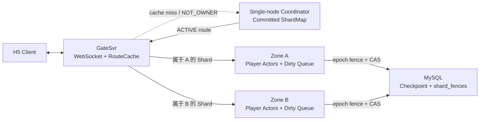
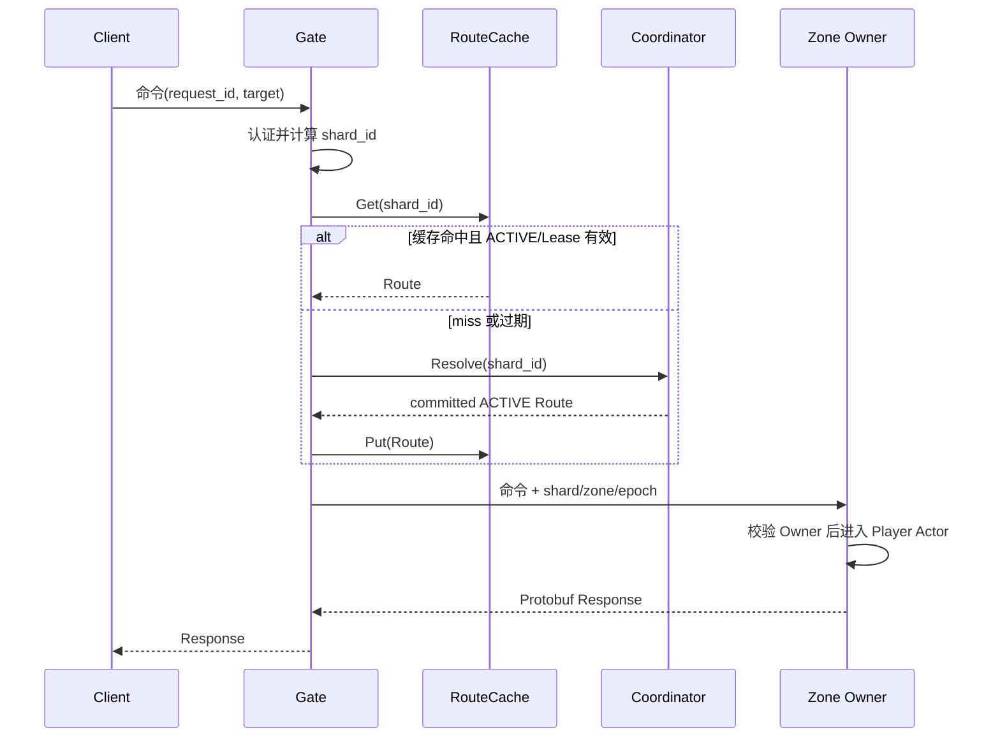
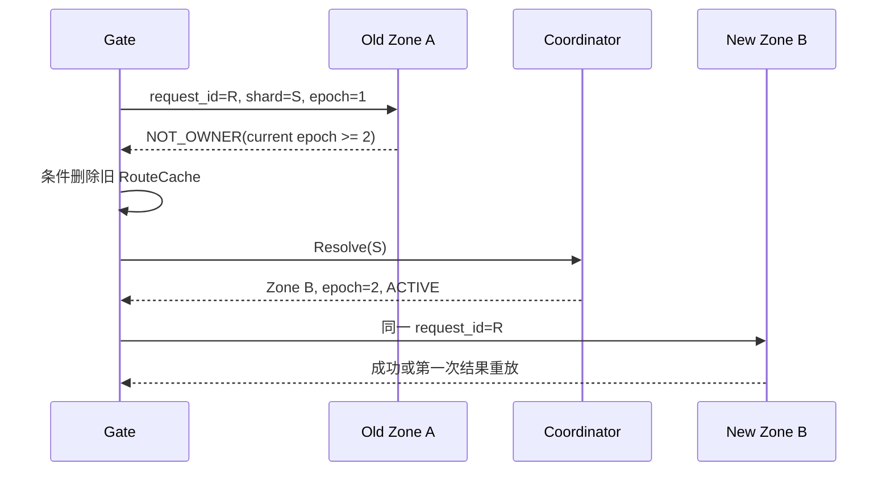
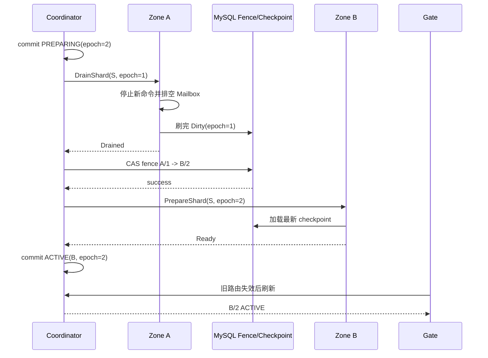

# 经典农场可借鉴结论

## 1. 结论先行

当前项目不需要引入完整 Actor 集群框架，也不需要重新设计 ShardMap。现有 V3 方向与成熟系统的共同模式一致：

```text
稳定 player_id
-> 固定逻辑 shard_id
-> Coordinator 维护权威 ShardMap
-> Gate 缓存 committed ACTIVE 路由
-> 请求直达 Zone Owner
-> Zone 和 MySQL fence 拒绝旧 epoch
```

下一步应当在现有代码上完成“静态双 Zone路由 -> 旧缓存恢复 -> 安全 Owner 切换”三个递进验证，而不是直接实现生产级共识、自动负载均衡或无缝迁移。

## 2. 各资料具体借什么

### 2.1 从 Slicer 借控制面和数据面分离

采用：

- Coordinator 只生成、提交和发布 ShardMap；
- 普通请求只读 Gate 本地缓存，不每次访问 Coordinator；
- Coordinator 暂时不可用时，Gate 可以在路由 Lease 仍有效的边界内继续使用已有路由；
- 每条路由具有递增 `route_version`，整张表具有递增 `map_version`；
- Gate 原子替换路由快照，不发布半更新状态。

不采用：

- 自动热点检测；
- 分层 Distributor；
- 复杂 Assignment 优化器；
- 动态 slice 切分。

### 2.2 从 Meta Shard Manager 借 Shard 生命周期

为 Zone 定义清晰的控制面接口语义：

```text
PrepareShard(shard_id, owner_epoch)
DrainShard(shard_id, owner_epoch)
ActivateShard(shard_id, owner_epoch)
DropShard(shard_id, owner_epoch)
```

第一版允许迁移期间短暂不可写，以换取容易证明的 at-most-one Owner：

```text
先停旧 Owner
-> 刷完 Dirty
-> 更新数据库 fence
-> 新 Owner 加载 checkpoint
-> 新 Owner Ready
-> 发布 ACTIVE
```

不先做无缝迁移、影子副本或热状态复制。

### 2.3 从 Akka 借 Lease 与失权行为

采用：

- Shard 只有取得有效 Lease 且状态为 `ACTIVE` 时才能接收写命令；
- Zone 失去 Lease 后立即拒绝新的关键写；
- `PREPARING` 期间不能对外提供写服务；
- Gate 无法解析有效 Owner 时快速失败，不在内存无限排队；
- Lease 是运行时授权，MySQL fence 是持久化最终防线。

不采用 Akka 完整 Cluster、Distributed Data 或 Split Brain Resolver。

### 2.4 从 Orleans 借目录缓存失效协议

采用：

```text
Gate 命中 RouteCache
-> 请求旧 Zone
-> Zone 返回 NOT_OWNER，并携带当前已知 epoch/version 提示
-> Gate 仅在缓存仍是旧版本时删除
-> 查询 Coordinator
-> 使用同一个 request_id 最多重试一次
```

这里必须复用原 `request_id`，否则请求可能在旧 Owner 已执行但响应丢失后被新 Owner 再次执行。

不采用早期 Orleans 的 eventual single activation 作为资产写安全保证。经典农场仍坚持 epoch 和数据库 fence。

### 2.5 从 Dapr 借 Placement Table 发布方式

采用：

- Coordinator 暴露带 `map_version` 的全量 Snapshot 和单 Shard 查询；
- Gate 以不可变对象保存当前 RouteCache；
- 新 Snapshot 完整校验后一次性替换；
- 调试接口展示 `shard_id`、`zone_id`、`owner_epoch`、`route_version`、状态和 Lease 到期时间；
- 先采用拉取与按需刷新，后续再考虑 Watch/长连接推送。

### 2.6 从 Proto.Actor 借 Go 接口组织

采用接口分层，而非引入整个框架：

```go
type RouteResolver interface {
    Resolve(ctx context.Context, shardID uint32) (Route, error)
}

type RouteCache interface {
    Get(shardID uint32, now time.Time) (Route, bool)
    Put(route Route)
    InvalidateIfVersion(shardID uint32, routeVersion uint64)
}

type ZoneCommander interface {
    Command(ctx context.Context, route Route, caller uint64, body []byte) ([]byte, error)
}
```

Actor 的逻辑身份与物理地址分开：业务层只认识 `player_id`，路由层才认识 `zone_endpoint`。

### 2.7 从 Pitaya 借 Gate/Zone 工程边界

采用：

- Client WebSocket 永远连接 Gate；
- Gate 从 Session 获得可信 `caller_player_id`；
- Gate 根据命令中的可信目标计算 Shard，而不是相信客户端上传的 Zone；
- Zone 不维护客户端连接；
- 命令响应和 Push 都经过 Gate；
- 路由器是独立组件，不与 WebSocket 编解码耦合。

## 3. 建议的双 Zone 目标结构



生产目标中的三节点多数派 Coordinator 不在本轮实现。本轮仍使用单节点 Coordinator，但所有外部结构保留未来兼容字段。

## 4. Shard 初始分配

推荐使用 Rendezvous Hashing 为每个 `shard_id` 在 `zone-a` 和 `zone-b` 中选择候选 Owner，然后把结果物化到 Coordinator 的 committed ShardMap。

关键区别：

```text
Rendezvous Hashing 只用于 Coordinator 计算候选
Gate 不自行使用哈希直接算 Zone
Gate 只相信 committed ShardMap
```

这样未来负载修正或手工迁移某个 Shard 时，不需要改变玩家到 Shard 的稳定映射，也不会要求所有 Gate 同时更换算法。

## 5. 路由字段建议

Gate 至少需要：

```text
shard_id
owner_zone_id
owner_endpoint
owner_epoch
route_version
state
lease_expires_at
map_version
```

Gate 转发给 Zone 时至少携带：

```text
caller_player_id
target_player_id 或由命令解析出的目标
shard_id
owner_zone_id
owner_epoch
request_id（已经位于 Protobuf envelope）
```

Zone 必须重新计算或核对 `target_player_id -> shard_id`，并校验：

```text
请求 shard_id 属于目标玩家
请求 owner_zone_id 等于本 Zone
请求 owner_epoch 等于本地 ACTIVE epoch
Lease 仍有效
```

不能只检查 `owner_epoch`。两个 Shard 都可能处于 epoch 1，只传 epoch 无法证明请求属于哪个 Shard 或 Zone。

## 6. 普通请求链路



Coordinator 不在缓存命中的同步链路中。

## 7. 旧路由恢复链路



限制：

- Gate 对一次客户端命令最多自动刷新重试一次；
- 只有明确 `NOT_OWNER` 才能确定需要刷新；普通超时不能证明请求未执行；
- 超时重试仍依赖同一个 `request_id` 的幂等结果；
- 新 Route 必须比旧 Route 的 `route_version` 或 `owner_epoch` 更新。

## 8. Owner 从 A 切换到 B



安全原则：

- 数据库 fence 更新失败时不能激活 B；
- A 在 Drain 后收到新请求必须返回 `NOT_OWNER` 或 `SHARD_MOVING`；
- A 的延迟 Dirty 写使用 epoch 1，会被数据库拒绝；
- B 只有加载 checkpoint 并 Ready 后才能进入 `ACTIVE`；
- `owner_epoch` 只增不减、不复用，即使迁移回 A 也必须使用 epoch 3。

## 9. 分阶段实现范围

### 阶段 A：静态双 Zone

- Coordinator 接收两个 Zone 配置；
- 启动时用 Rendezvous Hashing 生成 4096 条 committed `ACTIVE` 路由；
- Zone A、B 使用不同 `zone_id`、HTTP 地址和 Push 地址；
- Gate 能把不同 Shard 的玩家发送到不同 Zone；
- Zone 对错误 Shard、错误 Zone 和错误 epoch 返回 `NOT_OWNER`；
- 两个 Zone 都能独立激活 Actor 和 Dirty 写回。

### 阶段 B：RouteCache 与旧路由恢复

- Gate 增加有界不可变 RouteCache；
- 缓存考虑 `ACTIVE`、Lease 到期和版本；
- `NOT_OWNER` 条件失效并使用同一个 `request_id` 重试一次；
- 加入 Coordinator 查询计数，证明缓存命中时不访问控制面；
- 测试并发请求不会用旧响应覆盖更新路由。

### 阶段 C：安全 Owner 切换

- 为单个测试 Shard提供 Prepare/Drain/Activate 测试控制接口；
- A 正常 Drain、Dirty flush、fence CAS、B load、ACTIVE；
- Gate 从旧缓存恢复；
- A 的旧命令和旧 Dirty 写均失败；
- 迁移失败可保持 PREPARING/不可写并可人工恢复，不伪造成功。

## 10. 验收矩阵

| 场景 | 必须观察到的结果 |
|---|---|
| 两名玩家属于不同 Shard/Zone | Gate 分别调用 A 和 B |
| 同玩家重复请求 | 始终进入同一 Actor，`request_id` 只生效一次 |
| Gate 缓存命中 | Coordinator 路由查询计数不增加 |
| Gate 缓存指向旧 A | A 返回 `NOT_OWNER`，Gate 刷新后去 B |
| 请求发给错误 Zone | 在进入 Actor 前被拒绝 |
| 请求携带旧 epoch | 在 Zone 所有权校验处被拒绝 |
| 旧 Owner 延迟 Dirty | MySQL fence 拒绝，不覆盖 B 的 checkpoint |
| Route 为 PREPARING | Gate 不把它当成可路由 Owner |
| Coordinator 暂时不可用但缓存有效 | 已有 Route 可继续服务；miss 快速失败 |
| A 正常迁移到 B | 最终只有 B ACTIVE，checkpoint 连续 |
| B 加载失败 | 不提交 ACTIVE，不让两个 Zone 同时写 |
| Gate 自动重试 | 复用原 `request_id`，最多一次路由刷新重试 |

## 11. 本轮明确不做

- 三节点 Raft 或多数派 Coordinator；
- 自动故障检测和自动迁移所有 Shard；
- 按 CPU/内存/Actor 数动态负载修正；
- 无缝热迁移、内存状态流复制；
- 多 Gate 的 ShardMap Watch 广播；
- 跨可用区网络分区证明；
- 引入 Akka、Orleans、Dapr、Proto.Actor 或 Pitaya 作为运行时；
- 声称原型证明 3000 万 DAU。

## 12. 建议形成的项目决策

经过双 Zone 原型验证后，再由项目负责人决定是否把以下内容写入正式合同或 ADR：

1. Gate RouteCache 的版本、TTL、最大重试次数和并发失效语义；
2. Gate 到 Zone 的可信所有权头字段；
3. Zone Shard 生命周期接口；
4. Rendezvous Hashing 的候选计算细节；
5. 正常迁移允许的短暂不可用窗口；
6. Coordinator 不可用时 Gate 对已有路由和 cache miss 的降级规则。

## 13. 最终建议

下一次编码任务应只实现阶段 A 和阶段 B。它们已经能够回答答辩中的核心问题：

> 玩家请求如何经过 Gate 和 ShardMap 到达唯一 Zone Owner；Gate 缓存旧路由后如何发现并恢复；为什么 Coordinator 不会成为每个请求的性能瓶颈。

阶段 C 在前两阶段具有稳定 E2E 后再做，否则路由、Actor 激活、Dirty flush 和 Owner 迁移同时变化，会让故障难以定位。
