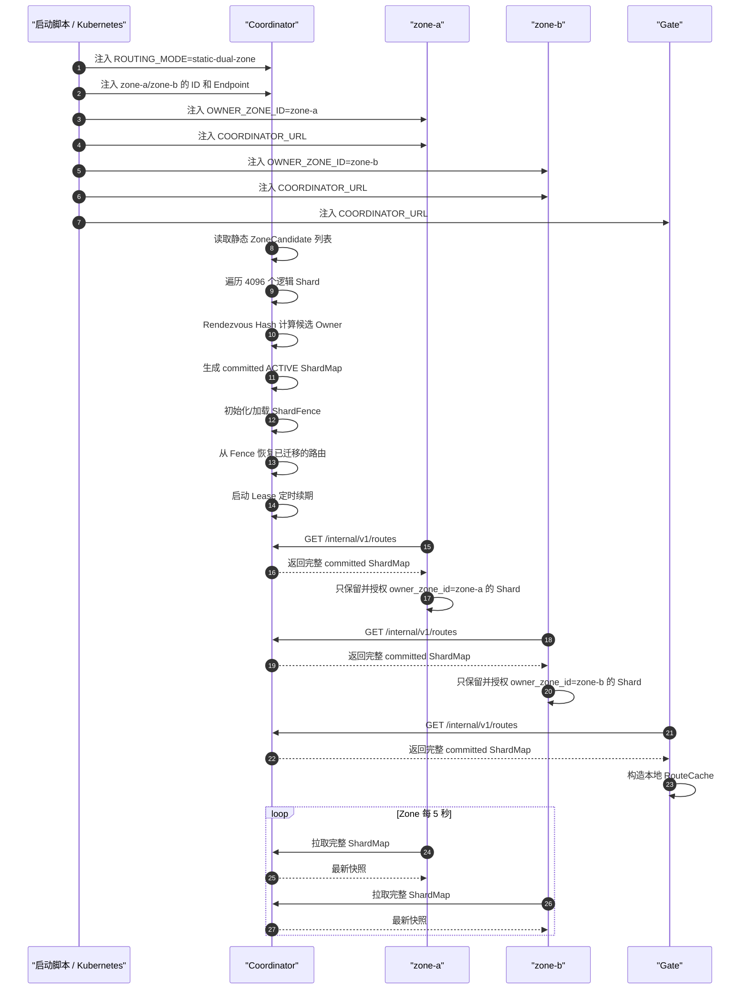

目前的 shard 分配：
脚本启动时向 coodinator 注册所有的 zone 信息，在 zone 证据 coodintor 的信息。
coodinator 进行哈希分配并构造 map，map 构造完成之后，zone 向 coodinator 申请完整的 map 并缓存。
gate 也在创建的时候向 coodinator 缓存。

> 这部分后续可以优化：目前注入的信息存在脚本里，后续具体信息从 db 中获取，然后由 coodinator 哈希分配，后续可以直接把分别配好的存在 db 里面并检查非法的分配进行少量迁移。
> 这个 k 8 s 可以自己识别到的，有多少 pod 的分配，所以需要让 ai 研究一下

