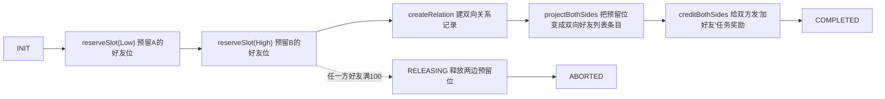
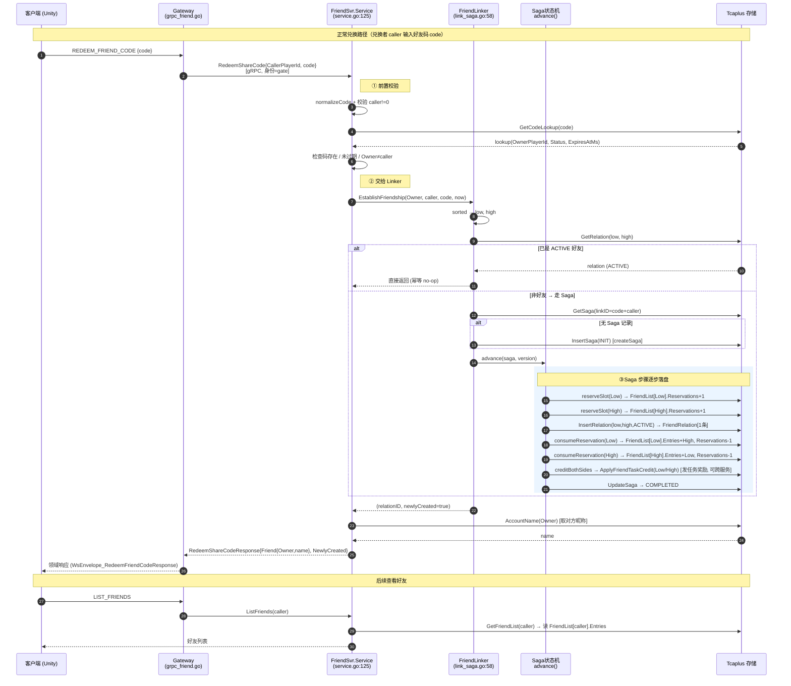
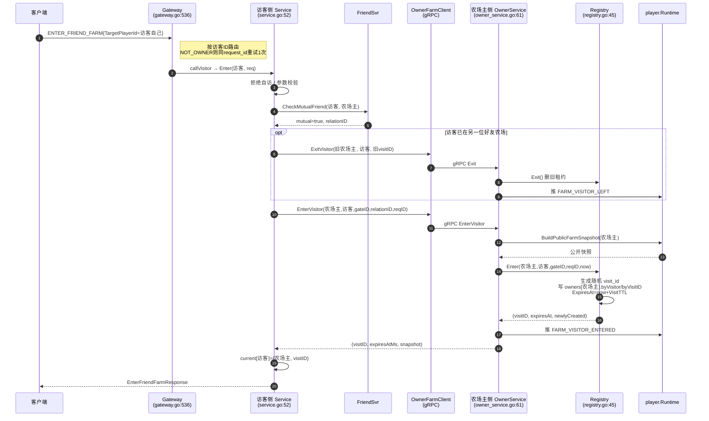
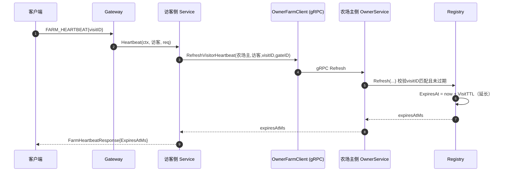
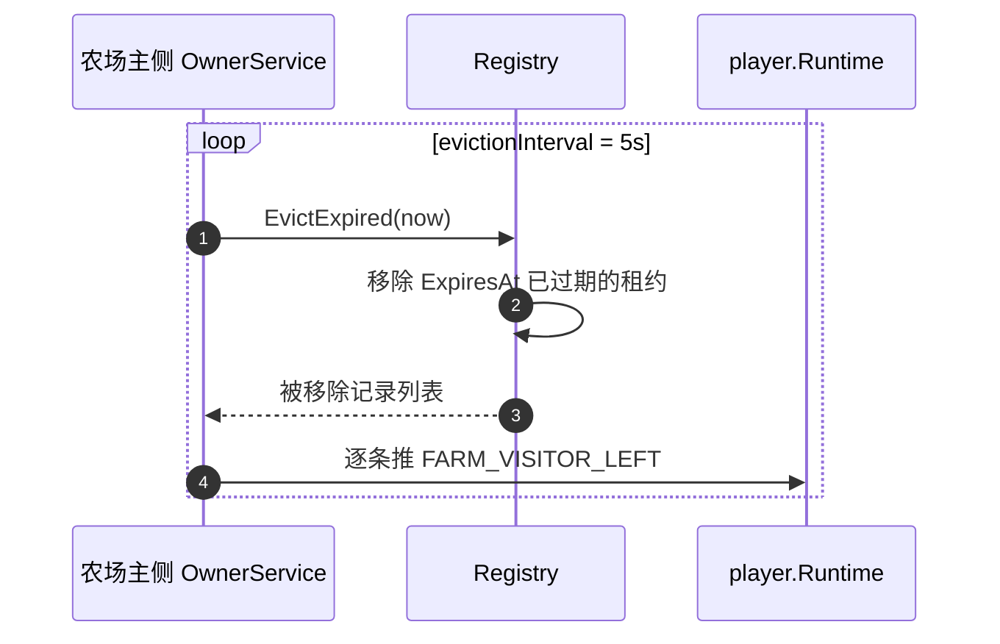
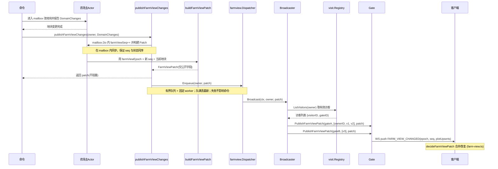

## 一、好友码兑换


**兑换好友时序图**
saga：先添加好友数量（预留位置）->添加好友关系->修改好友列表->发奖励->完成

## 二、tcaplus 好友关系存储
**关系表：用于验证 A 与 B 是否是好友的接口**
```go
// link_saga.go:344 createRelation
relation := &tcaplusv1.FriendRelation{
    PlayerLowId: saga.PlayerLowId,   // 较小的玩家 ID
    PlayerHighId: saga.PlayerHighId, // 较大的玩家 ID
    RelationId:  saga.RelationId,
    Status:      FRIEND_RELATION_STATUS_ACTIVE,
}
l.store.InsertRelation(ctx, relation)  // 插入一条
```
**好友列表**
```go
// link_saga.go:403
func (l *FriendLinker) projectBothSides(ctx, saga, now) error {
    l.consumeReservation(ctx, saga.PlayerLowId,  ...)  // 写给【Low 玩家】的好友列表
    l.consumeReservation(ctx, saga.PlayerHighId, ...)  // 写给【High 玩家】的好友列表
}
```

> 问题：是否需要一直维护这个表？还是判断好友直接从好友列表查找?
> 不需要，直接查好友双方的关系就能查到，redis 可以做到，要看 tcaplus 是否支持

## 三、访问他人农场
**registry**
农场主侧维护一个访客注册表——记录"哪个访客现在正以哪个 visit_id、在哪个 Gate、持有哪座农场的多久有效访问权"。
访客所有请求来到农场主作用前都应该校验当前租约是否过期。

```go
type Registry struct {
    mu     sync.Mutex
    owners map[uint64]*ownerVisits          // key = 农场主 player_id
}

type ownerVisits struct {
    byVisitor map[uint64]*VisitRecord        // key = 访客 player_id
    byVisitID map[string]*VisitRecord        // key = visit_id(16字节)
}

type VisitRecord struct {                   // 一条访客租约
    OwnerPlayerID   uint64
    VisitorPlayerID uint64
    VisitID         []byte                  // 随机生成的临时门票
    GateID          string                  // 访客当前连的 Gate
    LastHeartbeatAt time.Time
    ExpiresAt       time.Time               // 租约到期 = 上次心跳 + VisitTTL
    RequestID       string                  // 幂等用：相同 request_id 重入返回同 visit_id
}
```

**申请进入农场的时序图**


**访客的心跳续租**
客户端在**进入农场后**，每 30 s 发一条 `Action_FARM_HEARTBEAT` 业务消息，经gRPC `RefreshVisitorHeartbeat` → 农场主侧 `OwnerService.RefreshVisitorHeartbeat` → [`Registry.Refresh`](command:gongfeng.gongfeng-copilot.chat.open-symbol-in-file?%5B%7B%22%24mid%22%3A1%2C%22fsPath%22%3A%22%2Fdata%2Fworkspace%2Fsupernova-classic-farm%2Fserver%2Finternal%2Fvisit%2Fregistry.go%22%2C%22external%22%3A%22file%3A%2F%2F%2Fdata%2Fworkspace%2Fsupernova-classic-farm%2Fserver%2Finternal%2Fvisit%2Fregistry.go%22%2C%22path%22%3A%22%2Fdata%2Fworkspace%2Fsupernova-classic-farm%2Fserver%2Finternal%2Fvisit%2Fregistry.go%22%2C%22scheme%22%3A%22file%22%7D%2C%22Registry.Refresh%22%2C%5B%7B%22line%22%3A44%2C%22character%22%3A5%7D%2C%7B%22line%22%3A47%2C%22character%22%3A1%7D%5D%5D) 把 [`ExpiresAt`](command:gongfeng.gongfeng-copilot.chat.open-symbol-in-file?%5B%7B%22%24mid%22%3A1%2C%22fsPath%22%3A%22%2Fdata%2Fworkspace%2Fsupernova-classic-farm%2Fserver%2Finternal%2Fvisit%2Fregistry.go%22%2C%22external%22%3A%22file%3A%2F%2F%2Fdata%2Fworkspace%2Fsupernova-classic-farm%2Fserver%2Finternal%2Fvisit%2Fregistry.go%22%2C%22path%22%3A%22%2Fdata%2Fworkspace%2Fsupernova-classic-farm%2Fserver%2Finternal%2Fvisit%2Fregistry.go%22%2C%22scheme%22%3A%22file%22%7D%2C%22ExpiresAt%22%2C%5B%7B%22line%22%3A26%2C%22character%22%3A1%7D%2C%7B%22line%22%3A26%2C%22character%22%3A26%7D%5D%5D) 延长 90 s。


**后台 tick 清理过期的租约**


## 四、访客视图更新同步
农场主的 zone 维护两个版本号：
- `player_seq` 随任何玩家状态变化（包括金币、购买种子、任务推进）而自增，且这些**私有变化访客无权看到**——把 `farm_view_seq` 合并进 `player_seq` 会让 seq 空跳，访客按 seq 增量合并时拿到一堆"我看不到的空洞"，且访客根本没有农场主的 `player_seq` 权限。
- `farm_view_seq` 只在**公开地块**变化时自增（金币变化、买种子**不**生成公开 Patch）。业务命令只报告 `DomainChanges`（例如 `PlotChanged(plotID)`），Runtime 不再用中央 Action switch（旧 `publicPlotIDsChanged`）猜测哪些操作需要广播。

如果访客链路丢包，`farm_view_seq` 的序号就对不上，需要访客再次拉取完整的农场主完整快照。除了这个 seq 外，视图还需要校验 epoch。
在 Actor 重建/迁移/重启时刷新。epoch 变了，旧 `seq` 直接作废，客户端靠 epoch 不同判定"必须重进拿全量快照"，避免用错乱的 `seq` 续接一个已经不存在的旧世界。

> 问题：没有访客的时候需要消耗资源更新这个访客的版本号吗？
> 不用，广播任务需要单独隔离出来（sprint 03：有界 Dispatcher）


地块变更后，Actor 在 mailbox 内生成 Patch，再交给有界 Dispatcher 异步 fan-out；网络发送不阻塞业务，广播失败也不回滚已成功的命令。
有两类路径会进入 `publishFarmViewChanges`：后台成熟结算，以及业务成功提交后汇总的 `DomainChanges`（含 FriendInteraction 在 SaveCAS 成功之后）。

