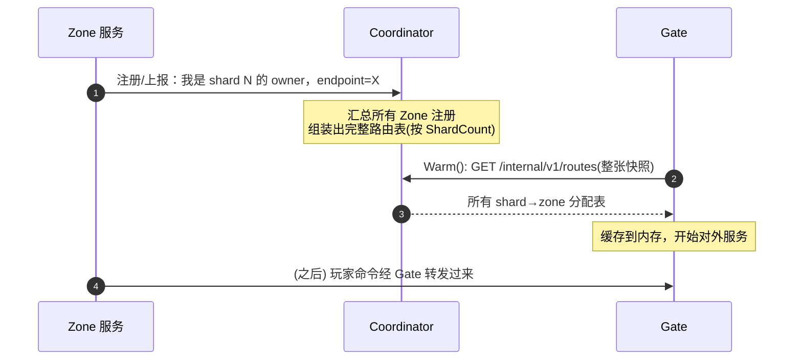
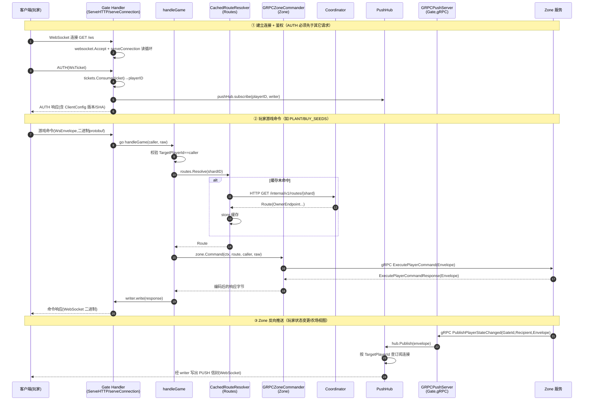
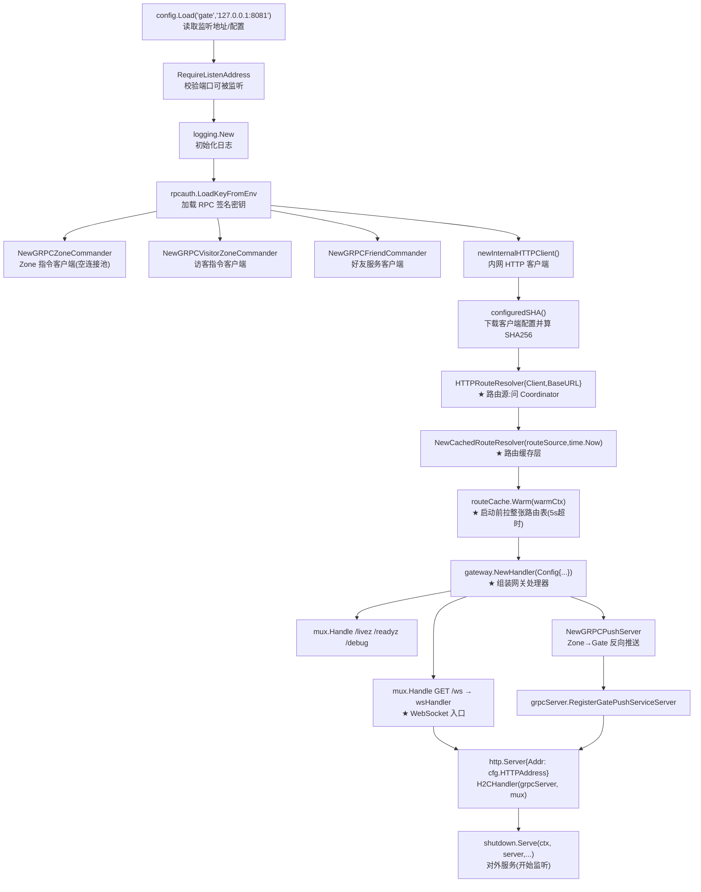
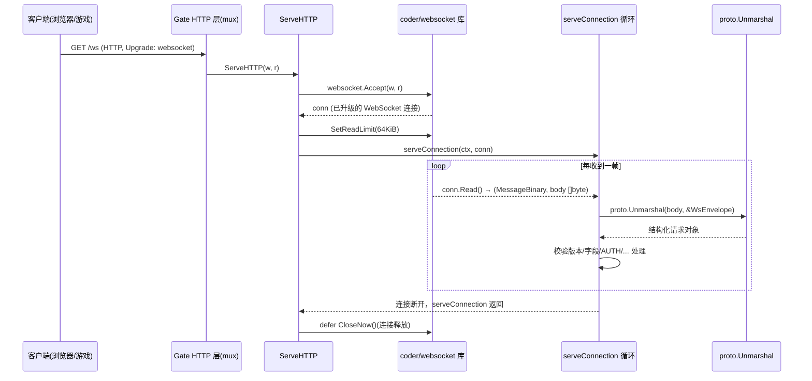
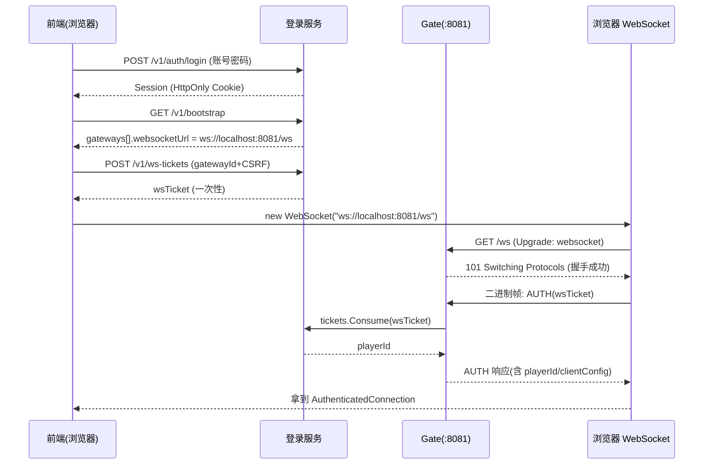

## 一、gatesvr 的组装

在 gatesvr 开始工作之前的，必要的初始化准备阶段。

 **HTTPRouteResolver 从哪里获得权威路由？**、
Zone 服务进程的注册组装在 gate 之前，他的时序图是这样的：

权威的路由信息目前是从 coordinator 来的，通过 http 的接口服务，gate 在初始化阶段从 coordinator 中获得具体的 zone 的映射路由放入到缓存层。
- 单分片：`GET {BaseURL}/internal/v1/routes/{shardID}` → `Resolve()`
- 整张表：`GET {BaseURL}/internal/v1/routes` → `LoadSnapshot()`

**`GRPCZoneCommander` 是给谁发请求？**
客户端 → Gate → GRPCZoneCommander(gRPC) → Zone 的 GameCommandService
 **WebSocket 入口是什么地址？**
运行时的时序图：




## 二、Websocket 收包
### 1.Websocket 的连接从哪里连上来？
1. [`ServeHTTP(w, r)`](command:gongfeng.gongfeng-copilot.chat.open-symbol-in-file?%5B%7B%22%24mid%22%3A1%2C%22fsPath%22%3A%22%2Fdata%2Fworkspace%2Fsupernova-classic-farm%2Fserver%2Finternal%2Fgateway%2Fgateway.go%22%2C%22external%22%3A%22file%3A%2F%2F%2Fdata%2Fworkspace%2Fsupernova-classic-farm%2Fserver%2Finternal%2Fgateway%2Fgateway.go%22%2C%22path%22%3A%22%2Fdata%2Fworkspace%2Fsupernova-classic-farm%2Fserver%2Finternal%2Fgateway%2Fgateway.go%22%2C%22scheme%22%3A%22file%22%7D%2C%22ServeHTTP%28w%2C%20r%29%22%2C%5B%7B%22line%22%3A160%2C%22character%22%3A18%7D%2C%7B%22line%22%3A160%2C%22character%22%3A27%7D%5D%5D) —— 这是 HTTP handler，当有请求打到 `GET /ws` 时被调用。w 传递的是 responseWriter，用来写相应，r 传递的是客户端的 request 信息。
2. `websocket.Accept(w, r, ...)` —— 执行 **WebSocket 握手（协议升级）**：它读取客户端 HTTP 请求里的 `Upgrade: websocket` 头，验证通过后，把这次 HTTP 响应写成 101 Switching Protocols，于是这条 TCP 连接从此变成 WebSocket 双工通道。[`conn`](command:gongfeng.gongfeng-copilot.chat.open-symbol-in-file?%5B%7B%22%24mid%22%3A1%2C%22fsPath%22%3A%22%2Fdata%2Fworkspace%2Fsupernova-classic-farm%2Fserver%2Finternal%2Fgateway%2Fgateway.go%22%2C%22external%22%3A%22file%3A%2F%2F%2Fdata%2Fworkspace%2Fsupernova-classic-farm%2Fserver%2Finternal%2Fgateway%2Fgateway.go%22%2C%22path%22%3A%22%2Fdata%2Fworkspace%2Fsupernova-classic-farm%2Fserver%2Finternal%2Fgateway%2Fgateway.go%22%2C%22scheme%22%3A%22file%22%7D%2C%22conn%22%2C%5B%7B%22line%22%3A173%2C%22character%22%3A1%7D%2C%7B%22line%22%3A173%2C%22character%22%3A21%7D%5D%5D) 就是升级后的 WebSocket 连接对象。
3. `h.serveConnection(r.Context(), conn)` —— 握手成功后，进入读循环，开始收消息。
`websocket.Accept` 来自官方的 websocket 库，已经把底层的 TCP/HTTP 包成了 `conn *websocket.Conn`。之后你看到的 [`conn.Read()`](command:gongfeng.gongfeng-copilot.chat.open-symbol-in-file?%5B%7B%22%24mid%22%3A1%2C%22fsPath%22%3A%22%2Fdata%2Fworkspace%2Fsupernova-classic-farm%2Fserver%2Finternal%2Fgateway%2Fgateway.go%22%2C%22external%22%3A%22file%3A%2F%2F%2Fdata%2Fworkspace%2Fsupernova-classic-farm%2Fserver%2Finternal%2Fgateway%2Fgateway.go%22%2C%22path%22%3A%22%2Fdata%2Fworkspace%2Fsupernova-classic-farm%2Fserver%2Finternal%2Fgateway%2Fgateway.go%22%2C%22scheme%22%3A%22file%22%7D%2C%22conn.Read%28%29%22%2C%5B%7B%22line%22%3A173%2C%22character%22%3A1%7D%2C%7B%22line%22%3A173%2C%22character%22%3A21%7D%5D%5D) / [`conn.Write()`](command:gongfeng.gongfeng-copilot.chat.open-symbol-in-file?%5B%7B%22%24mid%22%3A1%2C%22fsPath%22%3A%22%2Fdata%2Fworkspace%2Fsupernova-classic-farm%2Fserver%2Finternal%2Fgateway%2Fgateway.go%22%2C%22external%22%3A%22file%3A%2F%2F%2Fdata%2Fworkspace%2Fsupernova-classic-farm%2Fserver%2Finternal%2Fgateway%2Fgateway.go%22%2C%22path%22%3A%22%2Fdata%2Fworkspace%2Fsupernova-classic-farm%2Fserver%2Finternal%2Fgateway%2Fgateway.go%22%2C%22scheme%22%3A%22file%22%7D%2C%22conn.Write%28%29%22%2C%5B%7B%22line%22%3A173%2C%22character%22%3A1%7D%2C%7B%22line%22%3A173%2C%22character%22%3A21%7D%5D%5D) 都是这个库在 WebSocket 协议帧层面收发，不需要关心字节的拼写。

**h.serveConnection**
这个函数是 gate 中实现的 websocket 二进制 ->业务对象的解析。
把 Protobuf 格式的字节反序列化成结构体 [`WsEnvelope`](command:gongfeng.gongfeng-copilot.chat.open-symbol-in-file?%5B%7B%22%24mid%22%3A1%2C%22fsPath%22%3A%22%2Fdata%2Fworkspace%2Fsupernova-classic-farm%2Fserver%2Finternal%2Fgateway%2Fgateway.go%22%2C%22external%22%3A%22file%3A%2F%2F%2Fdata%2Fworkspace%2Fsupernova-classic-farm%2Fserver%2Finternal%2Fgateway%2Fgateway.go%22%2C%22path%22%3A%22%2Fdata%2Fworkspace%2Fsupernova-classic-farm%2Fserver%2Finternal%2Fgateway%2Fgateway.go%22%2C%22scheme%22%3A%22file%22%7D%2C%22WsEnvelope%22%2C%5B%7B%22line%22%3A221%2C%22character%22%3A19%7D%2C%7B%22line%22%3A221%2C%22character%22%3A29%7D%5D%5D)（里面有 Action、TargetPlayerId、各种 Request 等字段）。



### 2.用户登录时场景
客户端向 loginsvr 请求一次性签发的临时凭证 wsTicket，这个里面包含了一张对应某个 gatewayId 的临时票据，在第一次发送 websocket 建立请求时，客户端需要把 wsTicket 塞进第一条 Auth 请求发送给 gate，gate 会去 loginsvr 校验这张 Ticket 当前是否有效。
- ticket 是有时效限制的，防止 login 服务卡主导致连接一直挂着。
- gate 会用 ticket 发送给 login 鉴权：是否存在、是否过期、是否已被用过、是否匹配当前 gatewayId
- ticket 只能消费一次，只要消费成功，这个 ticket 就作废。
- ticket 校验成功后，向 gatesvr 返回玩家的真实 ID


### 3.鉴权成功后消息推送给 HandleGame
之前的建去哪消息全部完成后，启动一个协程开始处理玩家的信息：
```go
go func(req *wsv1.WsEnvelope, raw []byte) {
    defer workers.Done()
    h.handleGame(ctx, writer, subscription, caller, req, raw)
}(request, append([]byte(nil), body...))
```
`handleGame` 的签名如下：
```go
func (h *Handler) handleGame(
    parent context.Context,
    writer *serializedWriter,
    subscription *connectionSubscription,
    caller uint64,
    request *wsv1.WsEnvelope,
    raw []byte,
)
```
根据 request 中封装的 Action 的不同类型，把请求转发给不同的 haddler 去进行处理。
friendsvr 没有用 shard 进行分类，所以属于查询好友、生成好友码、还有进入好友农场的一系列需要走 friendsvr 的任务先会被背出去给 `h.handleFriendAction` 和 `h.handleVisitAction`。

##### **gate 的重点任务：路由解析+Zone 转发**

通过玩家的 id 分配到 shard 上，目前是哈希
```
uint32(StableHash64(playerID) % uint64(ShardCount))
```
接着用这个 shardID 查询 gate 缓存的路由表从而拿到玩家的具体信息：
```
route, err := h.routes.Resolve(ctx, shardID)
```
然后转发这个 request 到对应的 zone 去具体的处理业务请求，如果这个时候 zone 返回说自己不是这个 player 的 owner，那么 gate 需要想 coodinator 发送请求查询这个 shard 对应的最新快照。
`Not_Owner` 的重试机制只会重试一次，防止无限循环。

同一个请求的重试用的是相同的 RequestID：防止重复扣费，如果当前 Request 已经被处理过了，那么未来返回的将会是已成功的快照，直接更新真实数据。


### 4.RouteCach，gate 里面的缓存路由表

**MIss Lock**
为每一个分片定义一个锁，如果本地缓存失效了，需要访问 coodinator 时，为这个 shard 加上锁。
```
shardLocks [routing.ShardCount]sync.Mutex // 共 4096 把，每分片一把
```
查询时会阻塞转发到这个分片的其他所有请求：
```go
if route, ok := c.get(shardID); ok {
    return route, nil                      // ① 命中：无锁直接返回
}

lock := &c.shardLocks[shardID]
lock.Lock()                                // ② miss：拿到【这把分片锁】
defer lock.Unlock()
if route, ok := c.get(shardID); ok {       // ③ 双重检查（关键！）
    return route, nil                       //    别的 goroutine 已回填，直接返回
}
route, err := c.source.Resolve(ctx, shardID)  // ④ 只有"第一个"拿到锁的才回源
c.store(route)                            // ⑤ 回填缓存
```

### 5.Zone 对 Gate 的反查

Zone 收到处理之后需要校验的信息：
```
request.CallerPlayerId   // 调用玩家 ID（来自 Gate 的 caller）
request.GateId           // 哪个 Gate 转发的
request.Route            // 一整条路由（Gate 从自己缓存里取的）
request.Envelope         // 原始 Protobuf 命令（玩家发的那条 WsEnvelope）
```
还需要校验 ownership

- **owner_zone_id 是否是当前 Zone**：[`route.OwnerZoneId`](command:gongfeng.gongfeng-copilot.chat.open-symbol-in-file?%5B%7B%22%24mid%22%3A1%2C%22fsPath%22%3A%22%2Fdata%2Fworkspace%2Fsupernova-classic-farm%2Fserver%2Finternal%2Fgateway%2Froute_cache.go%22%2C%22external%22%3A%22file%3A%2F%2F%2Fdata%2Fworkspace%2Fsupernova-classic-farm%2Fserver%2Finternal%2Fgateway%2Froute_cache.go%22%2C%22path%22%3A%22%2Fdata%2Fworkspace%2Fsupernova-classic-farm%2Fserver%2Finternal%2Fgateway%2Froute_cache.go%22%2C%22scheme%22%3A%22file%22%7D%2C%22route.OwnerZoneId%22%2C%5B%7B%22line%22%3A29%2C%22character%22%3A1%7D%2C%7B%22line%22%3A29%2C%22character%22%3A14%7D%5D%5D) 必须等于 Zone 自己。
- **owner_epoch 是否匹配**：[`route.OwnerEpoch`](command:gongfeng.gongfeng-copilot.chat.open-symbol-in-file?%5B%7B%22%24mid%22%3A1%2C%22fsPath%22%3A%22%2Fdata%2Fworkspace%2Fsupernova-classic-farm%2Fserver%2Finternal%2Fgateway%2Froute_cache.go%22%2C%22external%22%3A%22file%3A%2F%2F%2Fdata%2Fworkspace%2Fsupernova-classic-farm%2Fserver%2Finternal%2Fgateway%2Froute_cache.go%22%2C%22path%22%3A%22%2Fdata%2Fworkspace%2Fsupernova-classic-farm%2Fserver%2Finternal%2Fgateway%2Froute_cache.go%22%2C%22scheme%22%3A%22file%22%7D%2C%22route.OwnerEpoch%22%2C%5B%7B%22line%22%3A29%2C%22character%22%3A1%7D%2C%7B%22line%22%3A29%2C%22character%22%3A14%7D%5D%5D) 必须等于 Zone 当前持有的 epoch。
- **Route 是否为 ACTIVE**：来自路由状态校验。
- **Lease 是否仍有效**：`s.now()` 与路由租约比较，[`now.Before(LeaseExpiresAt)`](command:gongfeng.gongfeng-copilot.chat.open-symbol-in-file?%5B%7B%22%24mid%22%3A1%2C%22fsPath%22%3A%22%2Fdata%2Fworkspace%2Fsupernova-classic-farm%2Fserver%2Finternal%2Fgateway%2Froute_cache.go%22%2C%22external%22%3A%22file%3A%2F%2F%2Fdata%2Fworkspace%2Fsupernova-classic-farm%2Fserver%2Finternal%2Fgateway%2Froute_cache.go%22%2C%22path%22%3A%22%2Fdata%2Fworkspace%2Fsupernova-classic-farm%2Fserver%2Finternal%2Fgateway%2Froute_cache.go%22%2C%22scheme%22%3A%22file%22%7D%2C%22now.Before%28LeaseExpiresAt%29%22%2C%5B%7B%22line%22%3A43%2C%22character%22%3A1%7D%2C%7B%22line%22%3A43%2C%22character%22%3A28%7D%5D%5D)。


> 目前的问题：Zone 启动时需要配置期望接入的 gateId,但是后期需要多个 gate，所有 gate 都应该可以转发信息过来，是否需要这个校验呢？

为了防止伪造的 gate 传入
多 gate 的处理方法候选：
1. 改成允许的 gate 列表
2. 删除 gateid 对比
3. 动态的从 coodinator 获得 gate 列表（感觉太重了没必要）
> coodinator 主动更新路由
