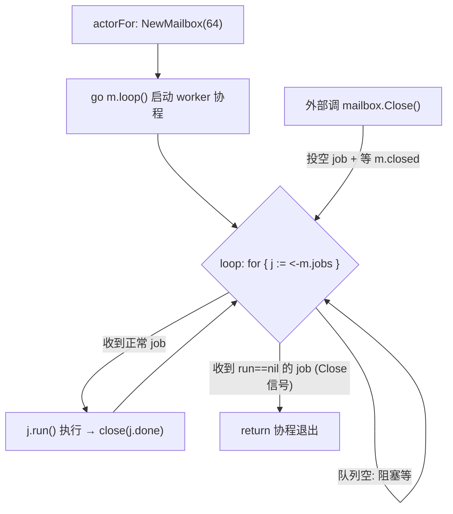

## 一、runtime 分发
每个 Zone 在运行的时候创建一个 Runtime，用来管理 zone 的去所有状态。
```go
type Runtime struct {
    mu            sync.Mutex
    actors        map[uint64]*runtimeActor   // ← 所有在线玩家的 actor 都在这里
    dirtyRevision map[uint64]uint64
    store         CheckpointStore             // 持久化（tcaplus/mysql）
    pushForwarder PushForwarder
    farmView      FarmViewDispatcher
    config        atomic.Pointer[ConfigSnapshot]
    now           func() time.Time
    backgroundCtx context.Context
    cancel        context.CancelFunc
    wg            sync.WaitGroup
    shardLocks    [routing.ShardCount]sync.RWMutex  // 4096 把分桶锁
}
```

新建 runtime 的时候对 zone 进行相应的初始化，并且加载配置、开始成熟结算的协程。
```go
func NewRuntime() *Runtime {
    ctx, cancel := context.WithCancel(context.Background())
    runtime := &Runtime{
        actors:        make(map[uint64]*runtimeActor),
        dirtyRevision: make(map[uint64]uint64),
        now:           time.Now,
        backgroundCtx: ctx,
        cancel:        cancel,
    }
    runtime.config.Store(NewDevelopmentConfigSnapshot())
    runtime.wg.Add(1)
    go runtime.runMaturityScheduler(ctx)
    return runtime
}
```

**配置拉取**
目前的所有配置写死在 `config.go` 代码中
> 后续用优化成 json 或者表格动态读取（有时间搞）

**成熟结算**
- 后台 tick：每秒遍历 `r.actors` 抄出所有在线 playerID
- 按照 playerID 创建 for 循环顺序遍历所有的 actor 的 地块，向对应 actor 的 mailbox 投递成熟结算任务并阻塞等待返回，返回后标脏并推送农场信息到客户端。


**shardLocks 存在的意义**
[`shardLocks`](command:gongfeng.gongfeng-copilot.chat.open-symbol-in-file?%5B%7B%22%24mid%22%3A1%2C%22fsPath%22%3A%22%2Fdata%2Fworkspace%2Fsupernova-classic-farm%2Fserver%2Finternal%2Fplayer%2Fruntime.go%22%2C%22external%22%3A%22file%3A%2F%2F%2Fdata%2Fworkspace%2Fsupernova-classic-farm%2Fserver%2Finternal%2Fplayer%2Fruntime.go%22%2C%22path%22%3A%22%2Fdata%2Fworkspace%2Fsupernova-classic-farm%2Fserver%2Finternal%2Fplayer%2Fruntime.go%22%2C%22scheme%22%3A%22file%22%7D%2C%22shardLocks%22%2C%5B%7B%22line%22%3A78%2C%22character%22%3A1%7D%2C%7B%22line%22%3A78%2C%22character%22%3A47%7D%5D%5D) 用 **RLock（共享读）**：允许多个玩家请求**同时**读同一个 shard 的 actor；但当有**新建/移除 actor**（写操作）时，用 [`Lock()`](command:gongfeng.gongfeng-copilot.chat.open-symbol-in-file?%5B%7B%22%24mid%22%3A1%2C%22fsPath%22%3A%22%2Fdata%2Fworkspace%2Fsupernova-classic-farm%2Fserver%2Finternal%2Fplayer%2Fruntime.go%22%2C%22external%22%3A%22file%3A%2F%2F%2Fdata%2Fworkspace%2Fsupernova-classic-farm%2Fserver%2Finternal%2Fplayer%2Fruntime.go%22%2C%22path%22%3A%22%2Fdata%2Fworkspace%2Fsupernova-classic-farm%2Fserver%2Finternal%2Fplayer%2Fruntime.go%22%2C%22scheme%22%3A%22file%22%7D%2C%22Lock%28%29%22%2C%5B%7B%22line%22%3A122%2C%22character%22%3A6%7D%2C%7B%22line%22%3A122%2C%22character%22%3A10%7D%5D%5D) 互斥，阻塞所有 RLock。这是"对 shard 下所有 actor 做原子整体操作"，它要的是：在 drain 期间，不允许任何新请求再给这个 shard 的玩家创建 actor / 执行命令。
## 二、Zone玩家请求处理
当玩家请求来到 `Handle()` 做了这些事：
1. 校验 epoch 和请求身份。
2. 根据玩家 ID 计算 Shard。
3. 取得当前配置快照。
4. 找到或激活玩家 Actor。
5. 调用 `a.mailbox.Do(...)`。
6. 在 mailbox 内结算成熟并执行业务命令。
7. mailbox 退出后标记 Dirty。
8. 返回响应并发送必要的公开农场 Patch。

## 三、actor
第一次收到玩家请求的时候创建对应 actor。
#### actorFor

> 修改：先创 actor 再 load

**找到或激活一个玩家的 Actor，并保证返回时该 Actor 处于"可用且属于当前 ownerEpoch"的状态**。
1. 查缓存，当前玩家存在就返回
2. 加载玩家状态（从 db）
3. 校验 epoch：如果存档的 ownerEpoch 比请求里的大，说明当前 zone 已经不是 owner，向 gate 返回 `Not_owner`
4. 补算离线期间的成熟，调用 `materializeDueMaturities`
5. 生成 farmView 视图： 用于"公开农场视图"的版本隔离（访客看别人农场时防止过期快照）。
6. 给玩家创建并且组装 actor
7. 二次查重写入：防止其他并发请求创建过 actor。查重没问题就把当前新建的 actor 写入 zone 的 runtime 的 actor 列表中。
```go
created := &runtimeActor{
    mailbox:           actor.NewMailbox(64),   // ← 创建玩家专属 mailbox（启动 worker 协程）
    state:             state,
    persistedRevision: persistedRevision,
    persistedToken:    persistedToken,
    farmViewEpoch:     farmViewEpoch,
}
```
#### mailbox
mailbox 的生命周期，每个 actor 持有一个，启动 loop worker 串行处理玩家请求。
> 添加重试提醒客户端



## 四、业务
**BUY_SEEDS**
> 修改：幂等直接在 gate
- 幂等检查  
    相同 `request_id`、相同请求内容直接返回第一次结果；相同 ID、不同内容返回冲突。
- 输入和配置校验  
    数量、商品、价格版本。
- 业务不变量校验  
    金币是否足够、背包是否超过堆叠上限。
- 原子内存修改  
    扣金币、加种子、推进任务。
- 版本和结果  
    `player_seq++`、`checkpoint_revision++`、保存幂等结果、构造 Patch。