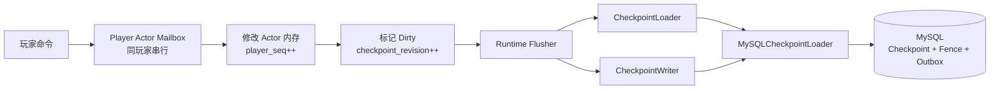
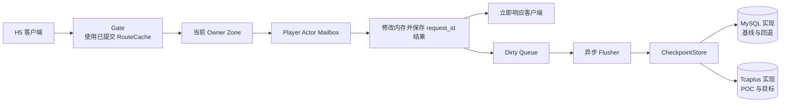
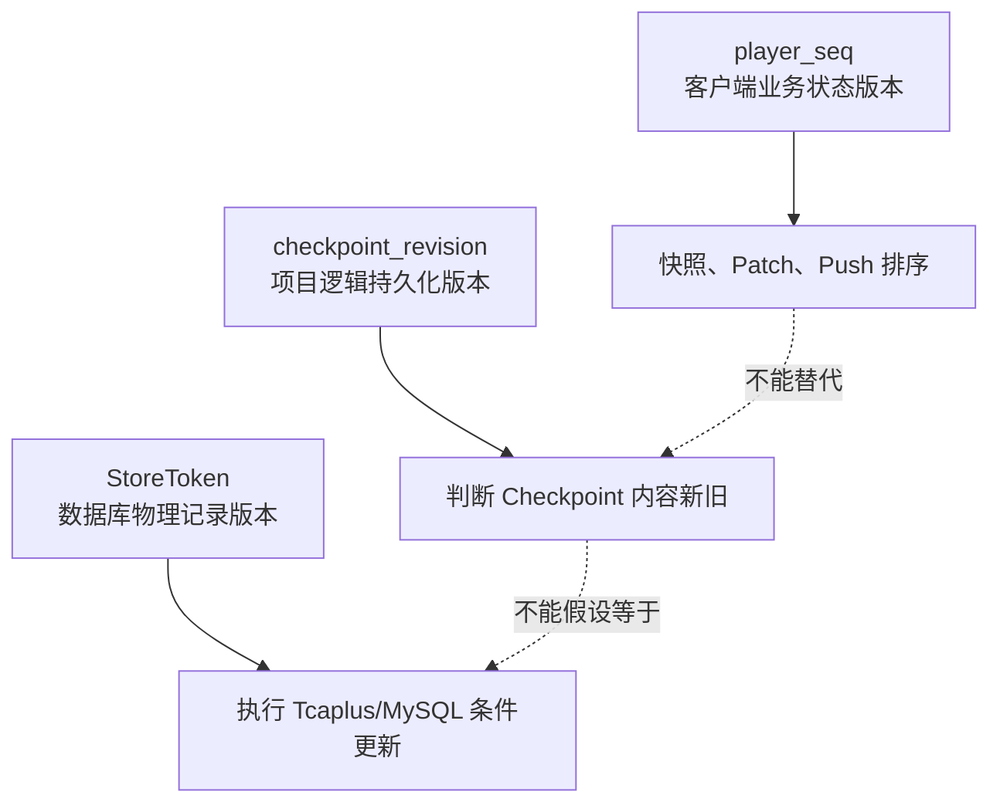
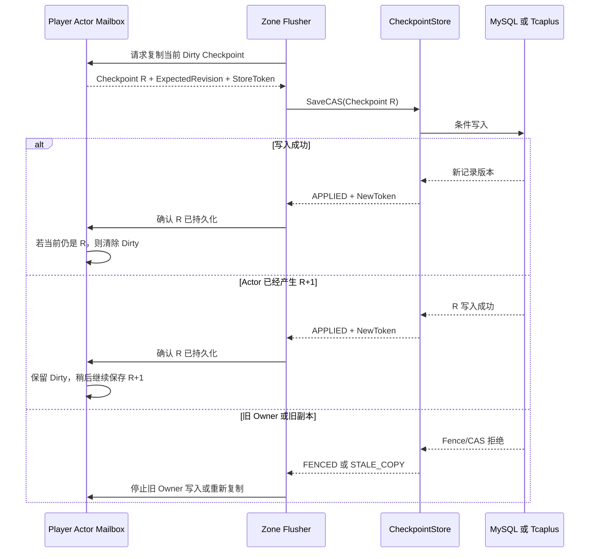

# ADR-0011：用 CheckpointStore 隔离玩家检查点与具体数据库

## 状态说明

项目负责人已于 2026-08-04 确认本文边界，状态为 `accepted（接受）`。

本文只决定“Player Actor 如何通过统一接口加载和保存检查点”，不在这一轮直接决定：

- 账号和 Session 是否从 MySQL 迁走；
- Fence、迁移进度和 Outbox 最终使用哪种数据库；
- 是否删除 MySQL 实现；
- 是否已经具备生产级跨库事务或自动故障切换。

## 一句话结论

保留当前 Player Actor、Mailbox 和异步 Dirty 机制，在它们与数据库之间增加统一的
`CheckpointStore` 接口。MySQL 和 Tcaplus 分别实现这个接口，Actor 不需要知道
底层数据库是哪一种。

## 为什么要改

当前 `Runtime` 已经通过 `CheckpointLoader` 和 `CheckpointWriter` 避免直接持有
`*sql.DB`，这是一个良好起点。但是加载和写入被拆成两个小接口，并且 MySQL 实现
同时承担：

- Protobuf Checkpoint 编解码；
- `checkpoint_revision` CAS；
- MySQL Fence 校验；
- MySQL 事务；
- Outbox 同事务写入。

如果直接把 `MySQLCheckpointLoader` 改名为 `TcaplusCheckpointLoader`，会出现三个问题：

1. **Actor 被数据库细节污染**  
   Tcaplus 单记录版本、错误码和重试方式会进入 `Runtime`，以后每换一种存储都要改
   Actor 生命周期。

2. **容易混淆两个版本号**  
   `player_seq` 是客户端业务状态版本；`checkpoint_revision` 是检查点逻辑 CAS 版本；
   Tcaplus 还可能返回自己的记录版本。三者必须由明确的数据结构隔离，不能互相替代。

3. **无法安全回退**  
   如果一次性删除 MySQL 路径，Tcaplus POC 失败时，已经通过的 Linux 主人环和迁移
   基线也会失去。统一接口可以让两种实现并存，通过配置选择。

## 当前链路



问题不在 Actor 或 Dirty 模型，而在最右侧的存储职责没有形成一个完整、可替换的契约。

## 目标链路



这里最重要的是：普通游戏命令仍然在修改内存后响应，**不会改成每条命令同步等待
MySQL 或 Tcaplus**。

## 考虑过的方案

### 方案 A：直接把 MySQL 调用替换成 Tcaplus 调用

做法：

- 删除 `MySQLCheckpointLoader`；
- 在原文件位置调用 Tcaplus SDK；
- Runtime 根据 Tcaplus 错误码处理 CAS。

优点：

- 初始代码量最少。

缺点：

- Runtime 会依赖 Tcaplus SDK 和记录版本；
- MySQL 回退路径消失；
- 难以用同一套测试比较两个实现；
- 容易把 Tcaplus 当成“MySQL 驱动替换”，忽略事务和错误语义差异。

结论：不采用。

### 方案 B：只合并现有 Loader 和 Writer

做法：

```go
type CheckpointStore interface {
    Load(context.Context, uint64) (*State, error)
    Save(context.Context, *PlayerCheckpointV1, uint64) error
}
```

优点：

- 改动很小；
- MySQL 很容易迁移到新接口。

缺点：

- `Save` 只返回 `error`，无法明确区分已应用、幂等成功、旧副本、Fence 拒绝和数据冲突；
- 没有位置保存 Tcaplus 返回的物理记录版本；
- 后续接入 Tcaplus 时仍要再次修改接口。

结论：作为过渡写法可以工作，但不作为目标接口。

### 方案 C：统一 Store，并显式表达逻辑版本、存储令牌和写入结果

做法：

- `Load` 同时返回玩家状态、已持久化 revision 和底层存储令牌；
- `SaveCAS` 输入预期 revision、存储令牌和新 Checkpoint；
- 写入结果使用固定状态枚举，不把 SDK 错误直接暴露给 Actor；
- MySQL 与 Tcaplus 分别实现相同契约。

优点：

- 一次设计即可容纳 MySQL CAS 和 Tcaplus 单记录版本 CAS；
- Actor 不依赖任何数据库 SDK；
- 可以保留 MySQL 回退；
- 同一套契约测试可以验证两种实现；
- 错误处理与现有数据契约的写入状态一致。

代价：

- Runtime 需要保存一个不透明的 `StoreToken`；
- MySQL 适配器需要从当前代码中拆分出来；
- 测试数量增加；
- Tcaplus 的实际令牌格式要等 SDK POC 后最终确认。

提议采用方案 C。

## 目标接口示例

下面是帮助理解的示意代码，不是最终提交代码。注释说明每个字段的用途。

```go
// StoreToken 是数据库返回的“不透明版本凭证”。
// Actor 只负责原样保存和传回，不解析其中内容。
// MySQL 初版可以不使用它；Tcaplus 可以在这里保存记录版本。
type StoreToken []byte

// LoadedCheckpoint 表示从持久化存储成功加载的一份玩家检查点。
type LoadedCheckpoint struct {
    // State 是恢复出的完整玩家状态。
    State *State

    // PersistedRevision 是数据库当前已经保存的 checkpoint_revision。
    // 它不是客户端看到的 player_seq。
    PersistedRevision uint64

    // Token 是下一次 CAS 写入必须携带的数据库版本凭证。
    Token StoreToken
}

// CheckpointWrite 是一次异步 Dirty 刷盘请求。
type CheckpointWrite struct {
    // Checkpoint 是 Actor Mailbox 内复制出的不可变快照。
    Checkpoint *datav1.PlayerCheckpointV1

    // ExpectedRevision 表示“我认为数据库当前是哪个逻辑版本”。
    ExpectedRevision uint64

    // ExpectedToken 表示“我读取数据库时拿到的物理记录版本”。
    ExpectedToken StoreToken
}

// WriteStatus 把不同数据库的返回值转换为项目统一语义。
type WriteStatus uint8

const (
    WriteApplied WriteStatus = iota + 1 // 新版本成功写入
    WriteAlreadyApplied                 // 相同版本和内容已存在，属于安全重试
    WriteStaleCopy                      // 数据库已有更新版本，当前副本过期
    WriteFenced                         // owner_epoch 或 Owner 已失效
    WriteRetryableFailure               // 临时网络/服务错误，可以退避重试
    WriteCorruptConflict                // 相同 revision 但内容不同，需要停止写入
)

type CheckpointWriteResult struct {
    Status WriteStatus

    // NewToken 只在成功或确认已应用时更新到 Runtime。
    NewToken StoreToken
}

type CheckpointStore interface {
    // Load 在 Actor 第一次激活时按 player_id 恢复状态。
    Load(ctx context.Context, playerID uint64) (LoadedCheckpoint, error)

    // SaveCAS 保存一个更高的 checkpoint_revision。
    // 普通玩家命令不会同步调用它，而是由后台 Flusher 调用。
    SaveCAS(
        ctx context.Context,
        write CheckpointWrite,
    ) (CheckpointWriteResult, error)
}
```

## 版本号分别解决什么问题



- `player_seq`：买种、种植、成熟等客户端可见变化时增加；
- `checkpoint_revision`：任何 Checkpoint 内容变化时增加，包括只保存失败幂等结果；
- `StoreToken`：数据库实现自己的记录版本，只用于下一次条件更新。

## 一次 Dirty 刷盘如何工作



## 如何实施

### 第一步：只重构接口，不改变行为

预计修改：

```text
server/internal/player/checkpoint_store.go
server/internal/player/mysql_checkpoint_store.go
server/internal/player/runtime.go
server/internal/player/*_test.go
server/cmd/zone/main.go
```

工作内容：

1. 新建目标接口和统一结果类型；
2. 把现有 MySQL Load/Save 包装为 `MySQLCheckpointStore`；
3. Runtime 保存 `PersistedRevision` 和 `StoreToken`；
4. 保持 MySQL Fence、CAS 和 Outbox 事务完全不变；
5. 运行全部单测和 Linux 主人环恢复 E2E。

这一阶段没有 Tcaplus SDK，也不删除 MySQL。

### 第二步：增加 Fake Store 契约测试

Fake Store 不连接数据库，用于稳定验证：

- Load 成功和不存在；
- CAS 成功；
- 相同内容重试；
- 旧 revision；
- Fence 拒绝；
- 同 revision 不同 hash；
- Actor 在刷盘期间从 R 增长到 R+1 时仍保持 Dirty。

### 第三步：实现 Tcaplus PlayerCheckpoint POC

预计新增：

```text
server/internal/player/tcaplus_checkpoint_store.go
server/internal/player/tcaplus_checkpoint_store_test.go
server/cmd/tcapluscheck/
```

只验证一张 `PlayerCheckpoint` PB 表：

```text
Create -> Load -> SaveCAS -> stale CAS rejected -> process restart -> Load
```

通过配置选择实现：

```text
CHECKPOINT_STORE=mysql
CHECKPOINT_STORE=tcaplus
```

### 第四步：完整主人环验证后再决定是否移除 MySQL Checkpoint

只有以下全部通过，才讨论下一步：

- Tcaplus 完整主人环；
- `player_seq=8` 重启恢复；
- request_id 重放不重复扣资源或发奖；
- 旧 revision 被拒绝；
- 受控迁移中旧 Owner 写入被拒绝；
- Tcaplus 环境异常时 Dirty 不被误清除。

## 预期效果

### 对玩家行为

无可见变化：

- 操作顺序不变；
- 响应协议不变；
- H5 不需要知道数据库类型；
- 普通命令延迟不增加一次同步数据库等待。

### 对开发和测试

- MySQL 与 Tcaplus 可以用同一套 Store 契约测试；
- 可以通过配置切换和回退；
- 数据库错误不会散落到 Actor 业务代码；
- Tcaplus POC 失败不会破坏已通过的 Linux MySQL 基线。

### 对架构讲解

可以清楚区分三层：

```text
业务层：Player Actor、Mailbox、request_id、player_seq
持久化契约层：CheckpointStore、checkpoint_revision、统一写入结果
数据库适配层：MySQL 或 Tcaplus SDK、物理记录版本
```

## 风险和限制

1. Tcaplus SDK 是否能返回并条件匹配单记录版本，必须在真实测试环境验证；
2. CheckpointStore 只能抽象单玩家 Checkpoint，不会自动解决跨记录事务；
3. 当前 MySQL Checkpoint 与 Outbox 同事务，Tcaplus 后续需要 Outbox 补偿方案；
4. Fence 与 Tcaplus Checkpoint 若属于不同记录，不具备 MySQL 当前单事务的原子边界；
5. 在 POC 通过前，不能删除 MySQL 实现或宣称纯 Tcaplus 已完成。

## 回滚方案

- 接口重构失败：恢复 Runtime 使用现有 MySQL 实现，不改变数据库数据；
- Tcaplus POC 失败：配置保持 `CHECKPOINT_STORE=mysql`；
- Tcaplus 完整主人环失败：只保留单记录 POC 和测试，不进入控制面替换；
- 任何 CAS 语义不明确：停止写入并保留 Dirty，不以覆盖旧数据的方式自动修复。

## 验证标准

1. `go test ./...` 全部通过；
2. Linux MySQL 双 Zone 主人环和重启恢复继续通过；
3. MySQL 活跃 Shard 迁移和旧 Owner Fence 测试继续通过；
4. Fake Store 覆盖所有统一写入状态；
5. Runtime 和 Actor 代码不导入 MySQL 或 Tcaplus SDK；
6. 普通命令路径没有新增同步 Store 调用；
7. 日志不打印 DSN、Endpoint、App ID、Token 或凭据。

## 负责人确认前需要能回答的问题

1. 为什么不能直接把 MySQL API 替换成 Tcaplus API？
2. `player_seq`、`checkpoint_revision` 和 `StoreToken` 分别解决什么问题？
3. 为什么普通命令仍然不能同步等待数据库？
4. Tcaplus POC 失败时，如何回退到已经验证的 MySQL 路径？
5. 为什么 CheckpointStore 不能自动提供跨记录事务？
