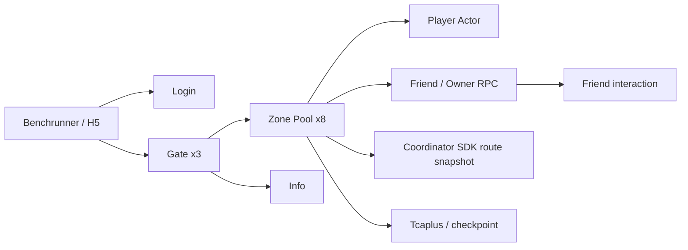
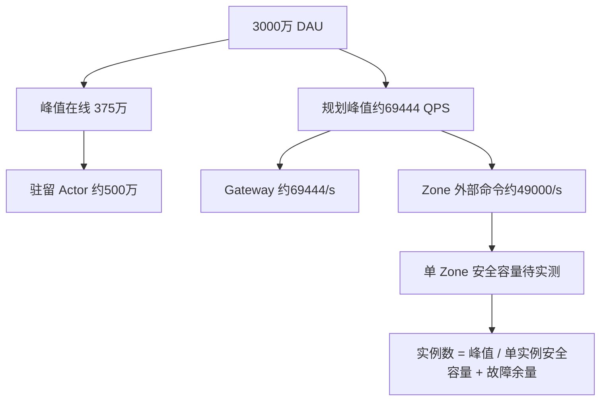

# Classic Farm 全局性能评估报告

## 1. 摘要

本报告汇总截至 2026 年 8 月 19 日在本地 Kind 集群完成的性能测试、资源采样和 pprof 分析结果，并与架构文档中的 3000 万 DAU 目标容量模型进行对照。

本次评估验证了路由 fencing、Player Actor、跨 Zone 好友访问、Coordinator SDK 路由缓存及好友交互链路，并形成了单实例性能基线。测试结果**不构成系统已具备 3000 万 DAU 承载能力的证明**，因为混合读写、长连接、Dirty 持久化、Tcaplus 故障恢复、跨可用区网络、消息积压、故障冗余以及大规模 Actor 内存等生产关键维度尚未完成验证。

基于现有证据，可形成以下阶段性判断：

- 单热点 Zone 的完整 snapshot 场景，8k QPS 可作为首版保守水位；约 10.5k QPS 已出现单 Zone 2 CPU 的饱和平台。
- 三 Gate 均匀固定分流时，25k snapshot QPS 完整承接、0 shed、0 错误；30k 的 27.5k 平台主要受压测机/连接池约束，不能当作 Gate 上限。
- Gate 路由快照 O(1) 优化使热点 c100 snapshot 从 8,194 提升到 10,663 QPS（+30.1%），瓶颈转移到 Zone。
- 好友生命周期在 Coordinator SDK 路由后从 227/s 提升到 1,227/s（50 对，+5.4x），100/200 对分别达到 1,882/2,528 lifecycle/s；200 对时 Info 已触及 500m limit，不能把它称为 Zone 上限。
- 实验版 Await 偷菜完成了 1,600/1,600 成功请求、6,057.59 QPS，但与无 Await 基线的 610 目标不等量，不能据此宣称 Await 提升。

综上，项目已完成面向 3000 万 DAU 目标的关键架构机制验证和单实例性能测量，但尚未形成生产规模容量闭环证据。

## 2. 系统与测量边界

当前生产目标是 Stateful Player Actor Zone V3：玩家状态在 Zone Actor 内串行执行，普通命令异步 Dirty 写回，Coordinator 负责逻辑 Shard、lease、epoch 和 fencing；本地原型是缩小实现，只有单节点 Coordinator 和单节点 kind 网络。

测试边界如下：认证、账号注册、好友关系建立及农场准备阶段不计入稳态业务测量；压测生成器产生的 shed、CPU wait 和连接池限制不归因于服务端；规划假设与实测结果分别列示，不将规划值表述为实测能力。

## 3. 核心实测结果

### 3.1 Snapshot：Zone 热点与 Gate 路由优化

| 场景 | 配置 | achieved QPS | P99 | shed | 主要资源结论 |
|---|---|---:|---:|---:|---|
| 单 Zone closed 基线 | hotspot-100, c100 | 8,194 | 31.06ms | 0 | 热点 Zone 峰值 1.75/2 CPU |
| 单 Zone closed 优化后 | 同参数 | 10,663 | 25.17ms | 0 | 热点 Zone 峰值 1.95/2 CPU |
| 单 Zone open | 8k offered | 7,999.86 | 23.15ms | 0 | 约 1.94 CPU 峰值 |
| 单 Zone open | 10k offered | 9,975.24 | 24.93ms | 1,354 | 开始 shed |
| 单 Zone open | 12k offered | 10,569.08 | 25.40ms | 85,493 | 平台约 10.5k |
| 三 Gate spread | 20k offered | 19,996.59 | 34.93ms | 0 | Gate 1.52–1.59/3 CPU |
| 三 Gate spread | 25k offered | 24,986.55 | 69.29ms | 0 | 仍有服务端 CPU 余量 |
| 三 Gate spread | 30k offered | 27,553.10 | 83.72ms | 70,519 | 生成器约 2.5 CPU、31–36% wait |

Gate 原始 pprof 发现每个请求为了读取 MapVersion 复制 4096 条 RouteEntry，累计分配占约 97%；改为 atomic snapshot O(1) 读取后，Gate 热点消失，Zone 成为主要约束。该优化是已测收益，不是理论推断。

### 3.2 Zone pprof：真正的 CPU 热点

8k/12k 单 Zone 对照显示，CPU 主要在内部 gRPC 传输与对象分配，而不是 Actor 业务逻辑：

| profile 项 | 8k | 12k |
|---|---:|---:|
| HTTP/2 response syscall | 22.55% | 18.02% |
| gRPC processUnaryRPC cumulative | 19.91% | 23.15% |
| rpcauth interceptor cumulative | 8.34% | 9.67% |
| runtime.mallocgc cumulative | 8.69% | 9.92% |
| Player Actor/Runtime | 约 4.54% | 约 4.59% |
| State.Snapshot | 约 2.51% | 约 2.18% |

当前第一候选优化是把 `grpc.Server.ServeHTTP` + H2C 改为原生 gRPC listener，并将 health/pprof 分端口；其次是保持 HMAC/replay/body 校验不变，降低认证和 Snapshot 临时分配。关闭认证只能做成本诊断，不能作为正式容量方案。

### 3.3 Friend：Coordinator SDK 路由缓存的效果

| 版本 | 对数 | lifecycle QPS | 近似 command/s | P99 | Coordinator 峰值 |
|---|---:|---:|---:|---:|---:|
| HTTP route lookup | 50 | 227.07 | 681 | 388.59ms | 未隔离 |
| HTTP route lookup | 100 | 228.82 | 686 | 810.19ms | 499/500m |
| SDK local snapshot | 50 | 1,227.26 | 3,682 | 52.65ms | 56/500m |
| SDK local snapshot | 100 | 1,881.51 | 5,645 | 77.43ms | 54/500m |
| SDK local snapshot | 200 | 2,528.24 | 7,585 | 124.93ms | 54/500m |

SDK 修复证明普通好友请求不再每次访问 Coordinator；但 200 对时 Info 约 501m/500m、最忙 Zone 822m/1000m，因此下一瓶颈是观察/好友副作用和混合路径，而不是已证明的 Zone 极限。

### 3.4 Friend steal：无 Await 与实验 Await

| 版本 | attempts | success | reject/error | QPS | P50/P95/P99 |
|---|---:|---:|---:|---:|---|
| 无 Await | 610 | 610 | 0/0 | 5,589.34 | 10.352/43.692/62.396ms |
| 实验 Await | 1,600 | 1,600 | 0/0 | 6,057.59 | 11.793/36.292/51.716ms |

Await 只释放 Visitor Actor mailbox 等待 Owner RPC；没有 durable pending receipt、UNKNOWN reconciliation、重复保护和迁移/驱逐协调。由于两次目标数不同，这组结果是链路验证和方向性信号，不是严格 A/B 性能结论。

## 4. Profiling 证据目录

报告附带的 PNG/SVG 是 pprof 调用关系图；真正的交互式 Flame Graph 已另存为 HTML，截图时应打开对应 HTML 页面：

- `/workspace/bechreport/flamegraphs/zone-8k-cpu.svg`：Zone 8k CPU
- `/workspace/bechreport/flamegraphs/zone-12k-cpu.svg`：Zone 12k CPU
- `/workspace/bechreport/flamegraphs/zone-hotspot-optimized-cpu.svg`：Gate 路由优化后的热点 Zone
- `/workspace/bechreport/flamegraphs/gate-baseline-cpu.svg`：Gate 路由复制优化前

对应 Flame Graph 页面为同名 `.html` 文件，例如 `/workspace/bechreport/flamegraphs/zone-12k-cpu.html`。

原始 `.pb.gz`、top 文本、monitor CSV 和复现命令仍保留在 `/data/workspace/yace/profiles/`、`raw/`、`monitor/`，便于重新生成图。

## 5. 3000 万 DAU 目标容量对照

架构文档中的中档模型为容量规划假设，包括：3,000 万 DAU、日均每人在线 60 分钟、平均在线 125 万、正常峰值在线 375 万、峰值驻留 Actor 约 500 万、正常峰值外部请求约 69,444 QPS，其中直接到达 Zone 的外部命令约 49,000 QPS；逻辑 Shard 数量为 4096，压测前 Zone 设计点约为 60 个。上述数字用于容量设计，不代表当前系统的实测结果。

将单 Zone 8k 保守水位线性乘以 60 个 Zone，可得到约 480k QPS 的数量级估算，但该计算仅用于说明扩展方向，不构成生产容量证明。当前 8k 结果来自 snapshot-only 场景，尚未覆盖长稳运行、混合写入、Dirty/Tcaplus 压力；生产容量还必须满足单可用区故障后的接管能力、Actor 内存、连接数、消息系统和存储吞吐要求。

反过来看当前证据的价值：

1. 若未来混合流量中 Zone 业务安全容量接近 8k command/s，则 49k Zone 命令/s 至少需要约 7 个“满载等价 Zone”，加上 2N 故障和发布余量，60 个 Zone 的规划数量有合理的数量级空间。
2. 但 500 万驻留 Actor 和 375 万 WebSocket 是当前完全未验证的维度；Actor 内存、连接内存、心跳、重连风暴可能比 CPU 更早成为约束。
3. Gate 已观察到 25k snapshot QPS 的三副本承载能力，但 69k 总入口、推送广播、长连接和故障余量仍没有实测。不能用 25k 乘副本数直接完成生产规划。
4. Coordinator SDK 缓存避免了好友热路径的控制面放大，但生产必须继续验证 route watch、epoch stale、迁移期间重试和多数派 Coordinator。

## 6. 对 3000 万 DAU 目标的评估结论

**架构层面：具备继续面向该目标演进的基础。** 当前 V3 的 Player Actor、4096 logical shard、异步 Dirty、Coordinator fencing 以及横向 Zone 扩展方向，与“约 500 万驻留 Actor、约 6.94 万峰值入口 QPS”的目标模型一致。已完成的性能测试表明，系统瓶颈能够通过 profiling 定位，并可通过路由缓存等架构和实现优化进行迁移。

**容量结论层面：尚不能认定已达到目标。** 目前仍缺少以下生产级验证闭环：

- 30 分钟以上的 Zone 读写混合长稳，CPU throttling、内存、GC、Dirty backlog 和 P99；
- 真实 Tcaplus checkpoint/故障/恢复时间和写入吞吐；
- connect-hold、心跳、广播、慢连接和重连风暴的百万级外推依据；
- 3 个可用区、Coordinator 多数派、Gate/Zone 单区故障接管；
- Friend/Mail/Info 的混合峰值、消息积压和最老事件延迟；
- 以实测 Actor bytes/player、连接 bytes/socket、单 Zone 安全命令/s 替换架构中的规划参数。

正式结论建议表述为：**“本项目通过缩小版分布式原型验证了支撑 3000 万 DAU 目标所需的关键机制，并建立了单实例性能基线；生产容量仍需在多机、多可用区、混合流量和故障条件下，依据实测安全容量完成外推与验证。”**

## 7. 后续验证建议

1. 保持 Gate 资源充足，先做 Zone 8k/10k/12k 的 30 分钟混合读写和 Dirty/Tcaplus 采样。
2. 原生 gRPC listener A/B，复用相同 open-loop，验证 H2C/HTTP2 是否是第一瓶颈。
3. 做 `connect_hold`、心跳和重连阶梯，建立每连接内存/CPU 模型。
4. 让 Gate 生成器跨多进程/多机，排除当前 benchrunner system/wait 平台，再测 30k 以上 Gate。
5. 对 friend steal 做等目标数、重复 3 次的无 Await/Await A/B；Await 只有在补齐一致性语义后才可进入生产方案。
6. 将单实例安全容量、Actor 内存、连接容量和故障余量代回 `基础实例数 = 目标峰值 / 单实例安全容量`，形成可审计的 30M 部署清单。

## 8. 可复现材料

- `docs/evidence/2026-08-19-zone-hotspot-route-copy-optimization.md`
- `docs/evidence/2026-08-19-zone-bottleneck-pprof-comparison.md`
- `docs/evidence/2026-08-19-gate-spread-calibration.md`
- `docs/evidence/2026-08-19-zone-friend-sdk-routing.md`
- `docs/evidence/2026-08-19-friend-steal-no-await-baseline.md`
- `docs/evidence/2026-08-19-friend-steal-await-experiment.md`
- `/data/workspace/yace/raw/`
- `/data/workspace/yace/monitor/`
- `/data/workspace/yace/profiles/`
