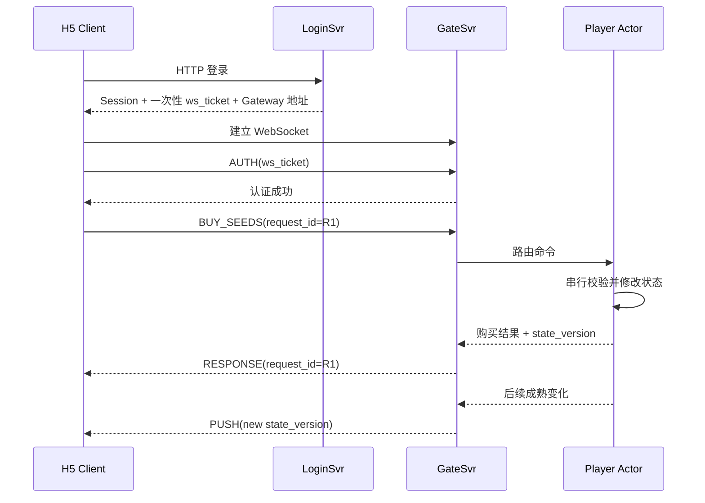

# 最小 WebSocket 契约：教学版决策清单

## 1. 我们现在在做什么

业务架构已经回答：

- 玩家可以买什么、种什么；
- 金币、仓库、地块和任务归谁管理；
- Buff 怎样影响成长；
- 哪些动作成功或失败；
- Zone 崩溃后允许回退到什么程度。

现在要回答的是：**H5 客户端怎样把这些意图准确地告诉服务器，服务器又怎样把结果可靠地告诉客户端。**

协议和 Go 没有绑定关系。无论以后服务器用 Go、Java 还是其他语言，Client 和 GateSvr 都必须约定相同的消息含义。

本轮完成后，才会产生规范性的：

- `websocket-protocol.md`：消息具体字段和流程；
- `idempotency-and-errors.md`：重试、错误码和冲突语义。

还没有开始写代码、SQL 或 Go 接口。

## 2. 一次完整流程



这里有三种数据流：

1. **请求 Request**：客户端主动问服务器或要求执行动作；
2. **响应 Response**：服务器回答某一个请求；
3. **推送 Push**：没有对应的新请求，服务器主动通知状态变化。

## 3. 先理解几个术语

### 3.1 WebSocket

HTTP 通常是一问一答。WebSocket 建立后是一条长期双向连接，客户端和服务器随时都可以发送消息，适合游戏命令和状态推送。

### 3.2 信封 Envelope

信封是所有消息都有的公共外层，例如：

```text
这是请求、响应还是推送？
协议版本是什么？
请求 ID 是什么？
执行哪个动作？
真正的业务数据是什么？
```

业务数据叫 `payload`。购买种子的 payload 才会包含商品和数量，收获的 payload 则包含地块。

### 3.3 `request_id`

它同时解决两个问题：

- **关联响应**：客户端同时发出多个请求时，知道每个响应属于谁；
- **写命令幂等**：网络超时重发同一个请求时，服务器不会重复扣钱或发奖励。

### 3.4 Snapshot 和 Push

- Snapshot：一份完整权威状态，用于首次进入、重连或版本缺口恢复；
- Push：在已有 Snapshot 上应用的小块变化。

### 3.5 `state_version`

当前使用 `(owner_epoch, player_seq)`：

- `owner_epoch` 变化表示 Shard Owner 已切换，客户端必须换成完整新快照；
- 同一 epoch 内 `player_seq` 应连续增长；
- 客户端从 20 直接收到 22，说明漏了 21，不能盲目继续。

---

# 第一部分：消息怎样编码

## D1. JSON 还是 Protobuf

### 方案 A：UTF-8 JSON

消息字段直接可读，浏览器和调试工具可以立即查看。

优点：

- Vue/H5 原生支持；
- 第一次开发最容易排查；
- 演示时可以直接展示消息；
- 不需要生成额外代码。

代价：

- 字段名会增加消息体积；
- 解析性能通常不如二进制；
- 类型约束需要服务端自行校验。

### 方案 B：Protobuf

按照预先定义的 schema 编码为二进制。

优点：

- 消息更小；
- 类型明确；
- 适合成熟的大规模服务。

代价：

- 浏览器调试不直观；
- 需要生成客户端和服务端代码；
- 协议演进、构建和排错门槛更高；
- 目前没有证据证明 JSON 是瓶颈。

### 方案 C：JSON 起步并预留版本

仍使用 JSON，但信封有协议版本，未来测出消息编码是瓶颈时再评审二进制。

项目负责人已确认后续开发统一使用 Protobuf，因此第一版直接采用 Protobuf，避免先实现 JSON 再迁移。H5 需要使用生成的 TypeScript/JavaScript 协议代码，并通过 WebSocket 二进制帧收发消息。

- [ ] A：只承诺 JSON，不考虑未来切换
- [x] B：第一版直接 Protobuf ✅ 2026-07-30
- [ ] C：JSON 起步，使用协议版本支持后续演进
- [ ] 其他：

你的判断：

> 后续开发都会使用 Protobuf，第一版一步到位，不先实现 JSON 过渡版本。

## D2. 为什么需要 `protocol_version`

假设旧客户端发送字段 `count`，新服务器只认识 `quantity`。如果没有版本，服务器无法区分“旧协议”还是“非法消息”。

### 方案 A：每条消息携带版本

优点是每条日志都能看出协议版本，经过代理或重放时也自包含；代价是每条消息多一个小字段。

### 方案 B：只在 AUTH 时协商

连接认证后，GateSvr 记住该连接版本。消息更简洁，但单独查看一条日志时需要额外连接上下文。

### 方案 C：AUTH 协商且每条消息仍携带

信息最完整，但重复。

推荐方案 A：第一版只有一个版本，不做复杂协商；每条消息明确携带版本，代码和排错最直接。

- [x] A：每条消息携带 `protocol_version`（推荐）
- [ ] B：只在 AUTH 时协商
- [ ] C：AUTH 协商且每条消息继续携带
- [ ] 第一版完全不传版本

你的判断：

> 

## D3. 客户端版本不受支持时怎么办

### 关闭连接

如果连最基础的字段含义都不一致，继续处理后续命令可能扣错资源。认证阶段返回支持版本范围后关闭最安全。

### 只拒绝当前消息

适合同一连接可能混用多个独立协议版本的复杂系统，本项目没有这种需求。

### 自动按最新版本解释

风险最大。旧字段可能被误解，不能靠猜测处理资产命令。

- [x] 认证阶段返回支持范围并关闭连接（推荐）
- [ ] 保持连接，只拒绝当前消息
- [ ] 自动按照服务端最新版本解释
- [ ] 其他：

你的判断：

> 

---

# 第二部分：连接怎样认证

## D4. 为什么先 HTTP 登录，再认证 WebSocket

HTTP 登录适合提交账号密码。登录成功后返回短期、一次性的 `ws_ticket`。WebSocket 只提交 ticket，不再次发送密码。

浏览器 WebSocket API 不能像普通 HTTP 客户端一样自由设置认证 Header，因此需要选择 ticket 的传递方式。

### 方案 A：连接后的第一条消息发送 AUTH

优点：

- ticket 不出现在 URL；
- URL 不会在代理和访问日志中泄漏凭证；
- 认证成功前可以明确禁止游戏命令。

代价：

- 建连后多一次应用层往返。

### 方案 B：ticket 放在 URL 查询参数

实现简单，但 URL 经常进入网关日志、浏览器记录和监控，不适合放认证凭证。

### 方案 C：使用 WebSocket 子协议字段

可以在握手期传递，但语义不直观，浏览器和代理兼容性排查更复杂。

- [x] A：建连后第一条消息 `AUTH(ws_ticket)`（推荐）
- [ ] B：ticket 放 URL 查询参数
- [ ] C：使用 WebSocket 子协议字段
- [ ] 其他：

你的判断：

> 

## D5. 未认证连接能做什么

如果允许未认证连接执行查询，攻击者可以绕过正常身份流程，也会增加 GateSvr 状态。

推荐只允许：

- AUTH；
- 必要的连接级 PING/PONG；
- 其他消息返回未认证错误；持续违规则关闭。

- [x] 只允许 AUTH 和必要心跳（推荐）
- [ ] 允许读取公开配置
- [ ] 建连即视为已认证
- [ ] 其他：

你的判断：

> 

## D6. 认证超时

攻击者可能大量建连后什么都不做，占用连接资源。

- 5 秒：资源释放更快，但极弱网可能误伤；
- 10 秒：仍能防止长期占用，对本地和普通网络更宽容；
- 不超时：最容易被空连接占用。

- [ ] 5 秒
- [x] 10 秒（推荐）
- [ ] 不设置认证超时
- [ ] 自定义：

你的判断：

> 

## D7. ticket 是否能重复使用

如果一个被截获的 ticket 可以多次使用，攻击者能建立第二条连接。一次性 ticket 在首次认证成功后立即作废更安全。

正常断线重连不复用旧 ticket，而是使用仍有效的 Session 通过 HTTP 获取新 ticket。

- [x] 认证成功后立即作废；重连获取新 ticket（推荐）
- [ ] 有效期内允许重复连接
- [ ] 同一 Session 允许额外复用一次
- [ ] 其他：

你的判断：

> 

## D8. 同账号重复登录

当前业务已确定单设备登录。

推荐流程：

```text
新登录成功
→ 撤销旧 Session
→ 通知旧 GateSvr 关闭旧连接
→ 新连接成为唯一有效连接
```

- [x] 新登录成功并关闭旧连接（推荐，符合已确认规则）
- [ ] 新登录失败，要求先手动退出
- [ ] 允许多个连接
- [ ] 其他：

你的判断：

> 

---

# 第三部分：消息信封

## D9. 顶层只需要三种业务消息

可以设计很多消息类型，也可以保持一个小模型：

```text
REQUEST   客户端请求认证、查询或执行命令
RESPONSE  服务端回答某个 request_id
PUSH      服务端主动发送状态变化
```

具体动作由 `action` 表达，例如：

```text
AUTH
BUY_SEEDS
PLAYER_SNAPSHOT
PLOT_MATURED
```

### 多种专用顶层类型

`AUTH_REQUEST`、`COMMAND`、`SNAPSHOT`、`ERROR` 等都独立。语义显眼，但信封和解析分支更多。

### REQUEST / RESPONSE / PUSH

结构统一，第一次实现更简单。成功与失败都通过 RESPONSE 的结果字段表达。

- [x] 使用 REQUEST / RESPONSE / PUSH 三类（推荐）
- [ ] AUTH、COMMAND、SNAPSHOT、ERROR 等分别作为顶层类型
- [ ] 其他：

你的判断：

> 

## D10. 命令类型使用 Protobuf 枚举

### Protobuf 枚举

`.proto` 文件为每种命令定义稳定编号和可读名称，例如 `BUY_SEEDS = 1`。线上二进制只传编号；客户端和服务端使用生成代码反序列化后，得到对应的枚举名称。

这样同时获得：

- 较小的线上消息；
- 代码和解码日志中的可读名称；
- Protobuf schema 对合法命令集合的约束；
- 编译期类型检查。

已经发布的枚举编号不得改绑到其他含义；删除命令时需要保留其编号，避免旧消息被错误解释。

- [x] Protobuf 枚举：线上传编号，反序列化为可读名称 ✅ 2026-07-30
- [ ] 在线上直接传字符串
- [ ] 编号和字符串同时传
- [ ] 其他：

你的判断：

> 可以在线上传对应的值，由 Protobuf 反序列化为代码中的可读枚举。

## D11. 第一批命令

建议第一批只覆盖已经确认的闭环：

```text
AUTH
GET_PLAYER_SNAPSHOT
GET_SHOP
BUY_SEEDS
PLANT
APPLY_FERTILIZER
HARVEST
CLEAN_PLOT
SELL_CROP
CLAIM_CHAPTER_REWARD
```

为什么保留显式 `GET_PLAYER_SNAPSHOT`：

- AUTH 只验证连接，不强制立即加载完整 Actor；
- 客户端可以在真正进入游戏时再取快照；
- 重连和版本缺口都可以复用同一个快照请求；
- 测试可以分别证明“认证成功”和“状态加载成功”。

- [x] 采用以上命令集和显式快照请求（推荐）
- [ ] AUTH 成功后自动下发快照，删除快照请求
- [ ] 农场、仓库、任务拆成多个查询命令
- [ ] 需要调整：

你的判断：

> 

## D12. 推荐的请求公共字段

```text
message_type       REQUEST
protocol_version   协议版本
action             BUY_SEEDS 等动作
request_id         请求与响应关联
target_player_id   GateSvr 用于路由目标 Actor
payload            本动作自己的业务参数
```

`caller_player_id` 不应由客户端填写。GateSvr 必须从已认证 Session 得到调用者身份。

`target_player_id` 不是“我是谁”，而是“我要操作谁的农场”。未来进入好友农场时它用于路由到农场主 Actor。即使第一版操作自己，也统一显式填写自己，可以让 GateSvr 路由规则保持一致。

不建议加入：

- 全局 `expected_player_seq`：已决定业务命令按 Actor 当前条件校验，避免无关状态产生误冲突；
- 客户端时间：业务时间只能相信服务端。

- [x] 采用以上字段，所有游戏请求显式携带 `target_player_id`（推荐）
- [ ] 单玩家请求省略 target，好友命令才携带
- [ ] target 放进每个 payload
- [ ] 需要增加字段：

你的判断：

> 

---

# 第四部分：`request_id` 和安全重试

## D13. 谁生成 `request_id`

必须在第一次发出前就存在，网络超时后客户端才能用同一个 ID 重发。因此不能由 GateSvr 或 Actor 收到后再生成。

### UUID

不同页面、重连和多设备几乎不会碰撞，不依赖本地计数持久化。

### 递增整数

短，但刷新页面后可能从头开始，与最近幂等窗口冲突。

- [x] 客户端为每个新请求生成 UUID（推荐）
- [ ] 客户端递增整数
- [ ] GateSvr 生成
- [ ] Player Actor 生成
- [ ] 其他：

你的判断：

> 

## D14. 查询为什么也建议有 `request_id`

查询不会扣资源，因此不需要持久化幂等结果。但 WebSocket 可以同时有多个请求，响应顺序不一定等于界面发起顺序，仍需要 ID 做关联。

推荐：

- 所有 REQUEST 都有 `request_id`；
- 只有写命令把结果放进 Actor 的近期幂等窗口；
- 查询 ID 只在连接内关联响应。

- [x] 所有请求有 ID，只有写命令保存幂等结果（推荐）
- [ ] 只有写命令有 ID
- [ ] 查询和写命令都保存幂等结果
- [ ] 其他：

你的判断：

> 

## D15. 响应超时怎样重试

请求超时可能有两种事实：

1. 服务端没执行；
2. 服务端已经执行成功，只是响应丢了。

客户端无法判断，因此必须用相同 ID 和完全相同的 payload 重发。Actor 若已执行，就返回第一次结果；若未执行，才执行一次。

生成新 ID 会把它当成新购买，可能重复扣金币。

- [x] 相同 ID、相同 payload 重发（推荐）
- [ ] 生成新 ID 重发
- [ ] 超时后永远不重发
- [ ] 其他：

你的判断：

> 

## D16. 相同 ID 却出现不同 payload

例子：

```text
R1 第一次购买 3 个种子
R1 第二次却请求购买 5 个
```

这通常是客户端 bug 或恶意请求。不能猜测应该执行哪个。

- 返回第一次结果：第二个界面可能误以为买了 5 个；
- 当新命令执行：会破坏幂等；
- 返回冲突：最安全，要求客户端生成新 ID。

- [x] 返回 `REQUEST_ID_CONFLICT`，不执行第二载荷（推荐）
- [ ] 返回第一次结果，不比较载荷
- [ ] 当作新命令执行
- [ ] 其他：

你的判断：

> 

## D17. GateSvr 路由过期

GateSvr 可能还把玩家路由到旧 Zone。旧 Zone 返回 `NOT_OWNER`。

推荐由 GateSvr：

```text
刷新 committed ShardMap
→ 使用相同 request_id 自动重试
→ 客户端只看到最终结果
```

GateSvr 不得生成新 ID，否则 Actor 无法识别同一业务意图。

- [x] GateSvr 刷新路由并用相同 ID 自动重试（推荐）
- [ ] 把 NOT_OWNER 返回客户端
- [ ] 关闭连接要求客户端重连
- [ ] 其他：

你的判断：

> 

---

# 第五部分：响应

## D18. 统一响应信封

推荐所有请求都使用同一种 RESPONSE：

```text
message_type
protocol_version
request_id
action
success
error
state_version
server_time
data
```

- 成功时 `data` 有业务结果，`error` 为空；
- 失败时 `error` 有稳定错误码和可展示信息；
- `request_id` 让客户端找到原请求；
- `server_time` 用于校准倒计时；
- 到达 Player Actor 的响应可以携带当前 `state_version`。

成功、失败使用完全不同信封会让客户端多写一套解析逻辑；统一信封更适合第一版。

- [x] 成功和失败统一使用上述 RESPONSE（推荐）
- [ ] 成功和失败使用不同结构
- [ ] 失败只返回字符串消息
- [ ] 其他：

你的判断：

> 

## D19. 哪些响应返回 `state_version`

推荐：

- 完整快照必须返回；
- 成功写命令必须返回新版本；
- 到达 Actor 的业务失败可以返回当前版本，帮助客户端判断画面是否过期；
- 协议格式错误、未认证等未到 Actor 的错误没有玩家版本。

- [x] 按以上规则返回（推荐）
- [ ] 只有成功写命令返回
- [ ] 所有错误也必须伪造一个版本
- [ ] 其他：

你的判断：

> 

## D20. 写命令返回局部状态还是完整快照

购买种子会改变金币、种子库存和任务进度。

### 返回相关局部状态

响应直接包含新的金币、该种子余额和受影响任务。消息较小，客户端不必等待 Push。

### 每次返回完整快照

客户端简单，但每次操作都发送全部仓库、地块和任务，浪费带宽。

### 只返回“成功”

必须等待 Push 或再次查询，界面可能短暂不一致。

- [x] 返回本命令影响的权威局部状态（推荐）
- [ ] 每次返回完整 Player Snapshot
- [ ] 只返回成功，等待 PUSH
- [ ] 其他：

你的判断：

> 

## D21. 重复请求返回哪个版本

第一次 R1 成功时版本是 21，之后其他操作已经让玩家到 25。R1 重试时：

### 返回第一次完整结果和版本 21

严格证明“这是第一次 R1 的结果”。客户端知道这是历史幂等响应，不能用它覆盖当前版本 25。

### 返回当前版本 25

混合了第一次业务结果与当前状态，不再是原结果，容易产生字段不一致。

### 返回重复错误

客户端无法确认第一次到底有没有成功。

- [x] 返回第一次完整结果和原版本，并标识为重放结果（推荐）
- [ ] 返回当前最新状态
- [ ] 返回 DUPLICATE_REQUEST 错误
- [ ] 其他：

你的判断：

> 

---

# 第六部分：快照和推送

## D22. 认证后何时加载完整快照

### AUTH 后自动下发

界面步骤少，但认证会立即加载 Player Actor；连接只想做其他操作时也无法跳过。

### 客户端显式请求

认证和状态加载职责清晰；重连、进入游戏和版本恢复复用同一个命令。

### 只返回玩家摘要

适合复杂大厅，但当前没有大厅需求。

- [x] AUTH 只绑定连接，客户端显式请求完整快照（推荐）
- [ ] AUTH 成功后自动发送完整快照
- [ ] AUTH 后先返回玩家摘要
- [ ] 其他：

你的判断：

> 

## D23. 第一版快照是一份还是多份

第一条闭环状态规模很小：

```text
player_id
金币
仓库
全部地块和 Buff
当前章节任务
config_version
state_version
server_time
```

### 一份完整快照

恢复逻辑简单，所有字段来自 Actor 同一时刻。

### 拆成仓库、农场和任务

单个消息更小，但客户端要处理多个版本和“只到了一半”的状态。

推荐第一版一份完整快照；未来状态实测过大再拆。

- [x] 第一版使用一份完整 Player Snapshot（推荐）
- [ ] 仓库、农场、任务拆成多份
- [ ] 初次完整，后续支持局部查询
- [ ] 其他：

你的判断：

> 

## D24. PUSH 发送增量还是完整快照

### 增量

例如只发送“地块 3 已成熟”和新版本。消息小，但客户端必须按顺序应用。

### 完整快照

客户端简单，但每个成熟、施肥和购买都发送全部状态。

### 只通知“有变化”

客户端每次都要重新请求，增加往返和服务器读取。

当前已有 `player_seq` 和缺口恢复设计，推荐使用增量 Push。

- [x] 推送本次权威增量和新 `state_version`（推荐）
- [ ] 每次推送完整快照
- [ ] 只通知变化，客户端重新拉快照
- [ ] 其他：

你的判断：

> 

## D25. 发现 `player_seq` 缺口

客户端已有 20，却收到 22。直接应用 22 可能漏掉一次金币、仓库或地块变化。

第一版没有实现持久增量补发，因此最安全的是：

```text
暂停应用该玩家后续增量
→ 请求完整权威快照
→ 用快照建立新版本基线
```

- [x] 停止应用并请求完整快照（推荐）
- [ ] 先应用 22，之后尝试补 21
- [ ] 忽略缺口
- [ ] 其他：

你的判断：

> 

## D26. `owner_epoch` 变化

新 Owner 可能只恢复到最近 Dirty 检查点，`player_seq` 甚至可能比客户端旧值小。此时不能按旧序号继续拼接。

- [x] 丢弃旧视图，接受新 Owner 完整快照（推荐，已由 V3 确认）
- [ ] 尝试沿用旧 player_seq
- [ ] 客户端要求自动补偿本地记录
- [ ] 其他：

你的判断：

> 

---

# 第七部分：并发和顺序

## D27. 客户端能否同时发送多个请求

WebSocket 能连续发送，`request_id` 可以关联响应，Player Actor 会把同玩家写命令串行处理。

### 协议允许并发

查询和不同 UI 操作不会被客户端网络层强制阻塞。实际业务顺序以 Actor Mailbox 为准。

### 客户端只允许一个未完成写命令

实现直观，但一个慢请求会阻塞所有其他操作，也不能代替服务端串行。

推荐协议允许多个在途请求；具体按钮可以在 UI 上临时禁用，防止用户连续点击。

- [x] 协议允许多个在途请求，Actor 保证写顺序（推荐）
- [ ] 客户端同一时间只发送一个写请求
- [ ] 查询可并发，写请求由客户端串行
- [ ] 其他：

你的判断：

> 

---

# 第八部分：心跳和断开

## D28. 浏览器 H5 使用什么心跳

浏览器 JavaScript 不能自由发送底层 WebSocket Ping 控制帧。服务端可以使用底层 Ping 检测连接，但客户端业务代码不容易观察完整过程。

应用层心跳是普通消息：

```text
PING(client timestamp)
PONG(server timestamp)
```

优点：

- H5 可以主动发出；
- 可以测量往返延迟；
- 可以顺便获得服务端时间；
- 本地演示容易观察。

代价：

- 比底层控制帧稍大；
- 必须防止心跳进入 Player Actor，应该只由 GateSvr 处理。

- [x] 使用应用层 PING/PONG，由 GateSvr 处理（推荐）
- [ ] 只使用服务端底层 WebSocket Ping
- [ ] 两者都使用
- [ ] 第一版不做心跳
- [ ] 其他：

你的判断：

> 

## D29. 心跳间隔

- 30 秒：更快发现断线，但消息更多；
- 60 秒：流量更低，但断线感知更慢；
- AUTH 下发：生产可以调整，客户端不写死。

当前容量模型已经按 30 秒心跳估算，推荐由服务端在 AUTH 响应中下发，第一版值为 30 秒。

- [ ] 固定 30 秒
- [ ] 固定 60 秒
- [x] 服务端下发，第一版默认 30 秒（推荐）
- [ ] 其他：

你的判断：

> 

## D30. 哪些错误需要关闭连接

应该关闭：

- 认证失败；
- 协议版本不兼容；
- Session 被撤销或过期；
- 消息超过大小限制；
- 持续发送非法格式或明显攻击流量。

不应关闭：

- 金币不足；
- 仓库已满；
- 作物未成熟；
- 价格变化；
- 肥料仍在生效；
- 其他普通业务错误。

否则玩家每次业务失败都要重新登录。

- [x] 只对连接级/安全错误关闭，普通业务错误保持连接（推荐） ✅ 2026-07-30
- [ ] 任意错误都关闭
- [ ] 只有物理网络错误才关闭
- [ ] 其他：

你的判断：

> 同意推荐项。

---

# 第九部分：大小限制和兼容性

## D31. 为什么必须限制消息大小

如果不限制，攻击者可以发送几十 MB 的 Protobuf 消息，让 GateSvr 分配大量内存或长时间解析。

第一版完整 Player Snapshot 只有有限地块、100 种以内仓库物品和一个章节任务，设计上应能控制在 64 KiB 内。若实测超过，再调整或拆分快照。

- 64 KiB：保护更严格，能暴露快照膨胀；
- 256 KiB：更宽松，但单条恶意消息成本更高；
- 1 MiB：当前没有必要；
- 不限制：不可接受。

- [x] 64 KiB（推荐，后续以真实快照测量修订）
- [ ] 256 KiB
- [ ] 1 MiB
- [ ] 不限制
- [ ] 其他：

你的判断：

> 

## D32. 收到未知可选字段

新客户端可能增加一个旧服务端不认识、但不影响旧语义的可选字段。

### 忽略未知可选字段

支持滚动升级；已知必填字段仍严格校验。

### 任何未知字段都拒绝

最严格，但客户端和服务端必须同时发布，平滑更新困难。

- [x] 忽略未知可选字段，严格校验已知必填字段（推荐）
- [ ] 出现任何未知字段都拒绝
- [ ] 只记录日志，不定义规则
- [ ] 其他：

你的判断：

> 

## D33. 收到未知命令

未知命令可能来自新客户端、拼写错误或攻击。

- 返回稳定错误并保持连接：客户端能诊断，普通兼容问题不会导致重连风暴；
- 关闭连接：对一次拼写错误过重；
- 静默忽略：客户端会一直等待直到超时。

- [x] 返回 `UNKNOWN_ACTION` 并保持连接（推荐）
- [ ] 关闭连接
- [ ] 静默忽略
- [ ] 其他：

你的判断：

> 

---

# 第十部分：完成后做什么

本轮确认的是公共信封和连接行为。下一轮会继续教学并确定：

- 每条业务命令的 payload；
- 成功响应返回哪些局部状态；
- Player Snapshot 的字段；
- 错误码及客户端行为；
- 哪些错误可以安全重试。

## D34. 下一步

- [x] 分析本轮选择并生成教学版第二轮（推荐）
- [ ] 直接生成正式 WebSocket 契约
- [ ] 暂停协议设计
- [ ] 其他：

## D35. 仍然不理解的问题

> 
