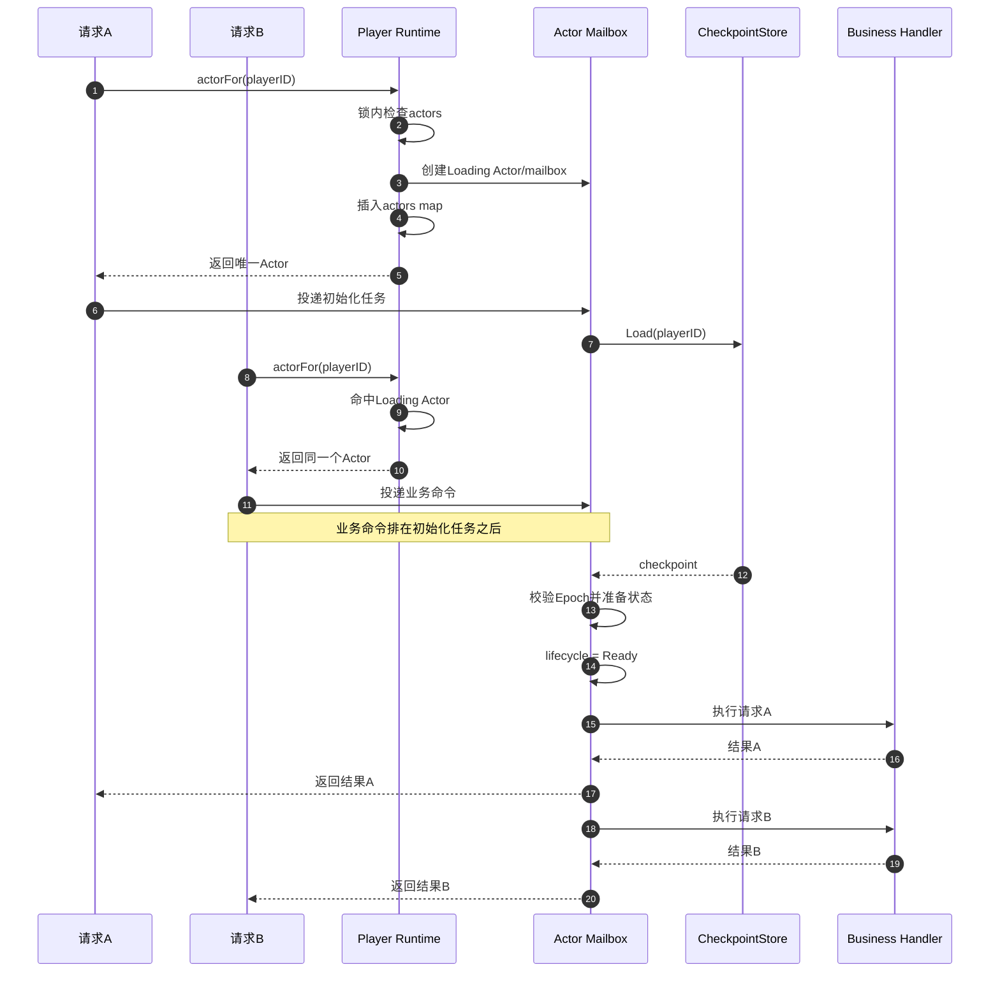
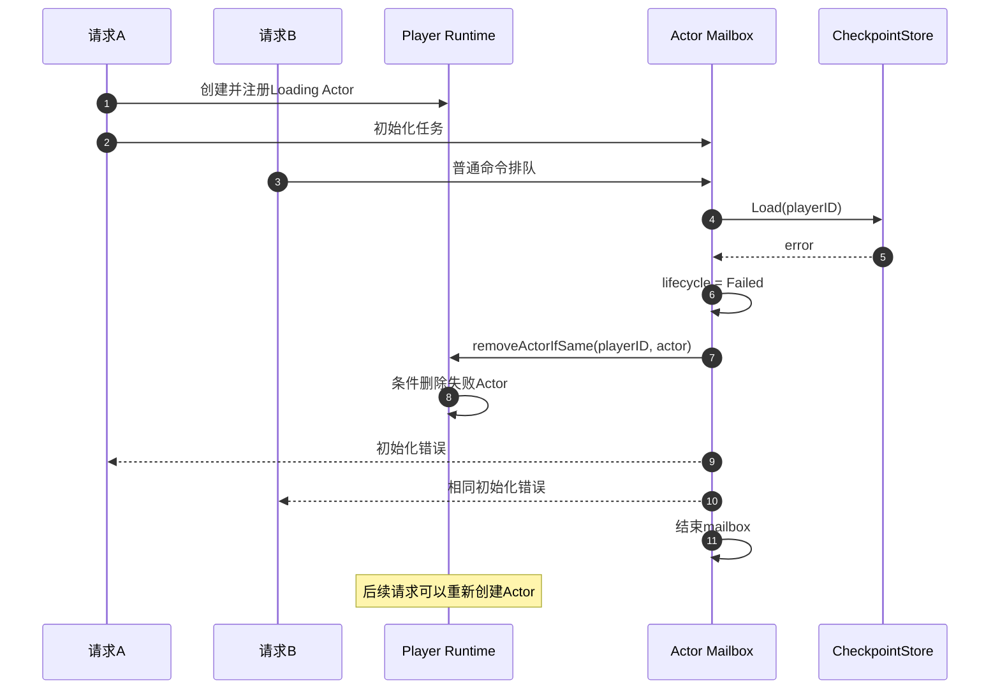

---

## status: verified
date: 2026-08-10
owner: project-owner
parent:
  - ./00-总路线图.md
related:
  - ../../context/CURRENT.md
  - ../../architecture/stateful-zone-v3-architecture.md

# Actor 先创建后 Load

> **For agentic workers:** 按任务顺序实施。每个任务完成测试后再进入下一个任务，不要同时修改广播、幂等或业务规则。

## 1. 目标

修改 Player Actor 的首次激活流程：

```text
当前：

查找 Actor
-> Actor 不存在
-> 从 Store Load
-> 准备 Player State
-> 创建 Actor/mailbox
-> 二次查重
-> 放入 Runtime actors map
```

修改为：

```text
查找 Actor
-> Actor 不存在
-> 创建 Loading Actor/mailbox
-> 原子放入 Runtime actors map
-> 将 Load 作为 mailbox 第一项任务
-> 并发请求进入同一个 mailbox
-> 初始化完成
-> Actor 进入 Ready
-> 按顺序执行已排队命令
```

完成后必须保证：

- 同一玩家的并发首请求只创建一个 Actor；
- 同一轮激活只执行一次 `Store.Load`；
- 初始化期间到达的命令进入同一 mailbox；
- 业务命令不能越过初始化任务；
- 初始化失败不会遗留永久不可用的 Actor；
- Actor 激活继续服从 Shard ownership、Owner Epoch、Drain 和 Runtime Close。

## 2. 当前问题

当前 `actorFor` 在 Store Load 完成后才将 Actor 插入缓存。

当同一玩家的多个首请求并发到达时，可能出现：

```text
请求 A：Actor 不存在 -> Load
请求 B：Actor 不存在 -> Load
请求 C：Actor 不存在 -> Load
```

当前的二次查重能够保证最终只有一个 Actor 成为权威 Actor，但不能避免：

- 重复访问 Tcaplus；
- 重复反序列化 checkpoint；
- 重复补算离线成熟；
- 重复创建 mailbox；
- 重复准备最终会被丢弃的 Actor；
- 冷激活时放大 Store 压力。

本计划修复的是“重复激活和重复 Load”，不是修复“双权威 Actor”。

## 3. 设计约束

### 3.1 必须保持

- Store Load 期间不能持有 `Runtime.mu`；
- 初始化和业务状态访问必须保持 mailbox 串行；
- Actor state 不能在 mailbox 外被并发修改；
- Loading Actor 必须参与 Shard Drain；
- Loading Actor 必须参与 Runtime Close；
- 初始化失败后必须允许后续请求重新激活；
- 旧 Actor 清理不能删除后来创建的新 Actor；
- mailbox 队列必须保持有界；
- Shard ownership、Owner Epoch 和 Fence 语义不能变弱。

### 3.2 本计划不修改

- 业务规则；
- WebSocket 和 gRPC 协议；
- Player checkpoint 格式；
- 客户端重连；
- Gate 重试；
- 普通业务命令的现有幂等逻辑；
- FriendInteraction Saga；
- 广播架构；
- Runtime maturity tick；
- Actor 自动驱逐；
- Shard 分配和 Coordinator。

Checkpoint 不存在时由 Zone 初始化新玩家农田的调整，放在下一份独立计划中处理。

## 4. Actor 生命周期

`Runtime.actors` 中允许存在尚未完成 Load 的 Actor，因此需要明确最小生命周期：

```text
Loading
-> Ready
-> Closing

Loading
-> Failed
-> Closing
```

语义：

- `Loading`：Actor 已注册，mailbox 已存在，Player State 尚未准备完成；
- `Ready`：Load、Epoch 校验和初始化已经成功，可以执行普通命令；
- `Failed`：当前初始化失败，不再执行普通命令，等待安全清理；
- `Closing`：Actor 正在参与 Drain、驱逐或 Runtime Close，不接受新命令。

具体字段可以根据现有代码决定，但必须明确由以下哪一种方式保护：

- `Runtime.mu`；
- mailbox worker 单线程；
- atomic。

禁止同一个字段在没有规则的情况下混用多种并发保护方式。

## 5. 目标流程

### 5.1 初始化成功




### 5.2 初始化失败




## 6. 修改范围

### 主要修改

```text
server/internal/player/runtime.go
```

负责：

- Actor 生命周期；
- `actorFor` 先注册占位 Actor；
- 初始化任务；
- 初始化失败传播；
- 条件删除；
- Shard Drain 和 Runtime Close 协调。

### 仅在必要时修改

```text
server/internal/actor/mailbox.go
```

只有现有 Mailbox 无法保证“初始化任务先于普通命令”时才修改。

禁止为了此次修改重写整个 Mailbox。

### 测试

优先新增：

```text
server/internal/player/runtime_activation_test.go
```

如果修改 Mailbox，再修改：

```text
server/internal/actor/mailbox_test.go
```

### 证据

```text
docs/evidence/2026-08-10-actor-register-before-load.md
```

## 7. 实施任务

### Task 1：先注册 Actor，再执行 Load

**Files:**

- Modify: `server/internal/player/runtime.go`
- Modify only if required: `server/internal/actor/mailbox.go`
- Test: `server/internal/player/runtime_activation_test.go`

- [x] 编写并发冷激活测试：阻塞 `Store.Load`，同时发送 100 个相同 player ID 的请求，期望：
  - `Runtime.actors` 中只有一个 Actor；
  - 所有请求使用同一个 Actor；
  - 只创建一个 mailbox；
  - `Store.Load` 只调用一次。
- [x] 修改前运行一次，确认测试因重复 Load 而失败。
- [x] 修改 `actorFor`：
  - 在 `Runtime.mu` 内查找 Actor；
  - 不存在时创建 `Loading` Actor 和 mailbox；
  - 立即插入 `Runtime.actors`；
  - 释放 `Runtime.mu` 后再执行初始化；
  - 禁止持有 `Runtime.mu` 调用 Store。
- [x] 保证 Load 是 mailbox 的第一个任务，初始化完成前普通业务命令不能执行。
- [x] 将现有初始化逻辑移入初始化任务：
  - Load checkpoint；
  - 保存 persisted revision 和 Store token；
  - 校验或采用 Owner Epoch；
  - 补算离线成熟；
  - 初始化 farm-view activation version 和 sequence；
  - 恢复 sync pending 状态；
  - 成功后将 Actor 标记为 `Ready`。
- [x] 运行并发测试和 race detector。

建议测试：

```go
func TestRuntimeRegistersActorBeforeCheckpointLoad(t *testing.T)
func TestRuntimeQueuesCommandsBehindActorInitialization(t *testing.T)
```

验证命令：

```bash
cd server
go test -race ./internal/player \
  -run 'TestRuntimeRegistersActorBeforeCheckpointLoad|TestRuntimeQueuesCommandsBehindActorInitialization' \
  -count=20
```

完成标准：

- 一个 Actor；
- 一个 mailbox；
- 一次 Load；
- 初始化严格早于业务命令；
- 无数据竞争。

### Task 2：处理初始化失败和重新激活

**Files:**

- Modify: `server/internal/player/runtime.go`
- Test: `server/internal/player/runtime_activation_test.go`

- [x] 使用 fake Store 模拟第一次 Load 失败、第二次 Load 成功。
- [x] 并发发送多个请求，断言：
  - 第一轮等待者收到一致的初始化错误；
  - 业务 handler 没有执行；
  - 失败 Actor 不再接受新命令。
- [x] 实现条件删除：

```go
if r.actors[playerID] == failedActor {
    delete(r.actors, playerID)
}
```

- [x] 再次发送请求，断言创建新 Actor、重新 Load 并成功执行命令。
- [x] 增加 Owner Epoch 不匹配测试，断言返回现有 `NOT_OWNER` 语义且不留下 Actor。
- [x] 增加竞争测试，证明旧 Actor 的延迟清理不会删除后来创建的新 Actor。
- [x] 使用 race detector 重复运行。

建议测试：

```go
func TestRuntimeRemovesFailedActivationAndAllowsRetry(t *testing.T)
func TestRuntimeFailedActivationCannotRemoveReplacementActor(t *testing.T)
func TestRuntimeActivationRejectsStaleOwnerEpoch(t *testing.T)
```

验证命令：

```bash
cd server
go test -race ./internal/player \
  -run 'FailedActivation|ActivationRejectsStaleOwner' \
  -count=20
```

完成标准：

- 不遗留永久 `Failed` Actor；
- 后续请求可以重新激活；
- 旧 Actor 清理不会删除新 Actor；
- Stale Owner 不能执行命令。

### Task 3：处理背压、Drain 和 Runtime Close

**Files:**

- Modify: `server/internal/player/runtime.go`
- Modify only if required: `server/internal/actor/mailbox.go`
- Test: `server/internal/player/runtime_activation_test.go`
- Test only if Mailbox changes: `server/internal/actor/mailbox_test.go`

- [x] 阻塞 Actor 初始化并填满 mailbox，验证：
  - 队列容量仍然有界；
  - 等待入队响应 context deadline；
  - 不为每个等待者创建额外的无界 goroutine；
  - 已确认入队的命令不会静默丢失。
- [x] 在 Store Load 期间触发 Shard Drain，验证：
  - 停止接受新命令；
  - `Loading` Actor 被纳入 Drain；
  - 不发生 Shard lock、Runtime lock 和 mailbox 之间的死锁；
  - Drain 后 Actor 从 map 移除。
- [x] 在 Store Load 期间调用 `Runtime.Close`，验证：
  - 停止创建新 Actor；
  - 初始化使用可取消 context 或有界等待；
  - 已排队请求收到确定错误；
  - mailbox worker 和 Runtime goroutine 能退出。
- [x] 如果当前 Tcaplus Load 能可靠响应 context cancellation，Drain/Close 时取消 Load。
- [x] 如果不能可靠取消，则使用有超时的等待策略，并在证据中记录限制。
- [x] 运行 mailbox、Player Runtime 和迁移相关测试。

建议测试：

```go
func TestRuntimeActorLoadingBackpressure(t *testing.T)
func TestRuntimeDrainWhileActorIsLoading(t *testing.T)
func TestRuntimeCloseWhileActorIsLoading(t *testing.T)
```

验证命令：

```bash
cd server
go test -race ./internal/actor ./internal/player \
  -run 'LoadingBackpressure|DrainWhileActorIsLoading|CloseWhileActorIsLoading' \
  -count=10
```

完成标准：

- mailbox 仍然有界；
- context deadline 有效；
- Drain 和 Close 不永久阻塞；
- 不遗留 `Loading` Actor；
- 无明显 goroutine 泄漏；
- ownership 和 Fence 语义不变。

### Task 4：完整回归与证据

- [x] 运行 Actor 和 Player Runtime 测试：

```bash
cd server
go test -race ./internal/actor ./internal/player -count=1
```

- [x] 运行相关业务回归：

```bash
cd server
go test ./internal/interaction ./internal/visit ./internal/farmview -count=1
```

- [x] 运行完整 Go 回归：

```bash
cd server
go test ./... -count=1
go vet ./...
```

- [ ] 运行现有最小 E2E：

```text
注册/登录
-> WS AUTH
-> 第一次 GET_PLAYER_SNAPSHOT
-> 第一次普通写命令
-> Dirty flush
-> 服务重启
-> 再次加载 Player Actor
```

- [ ] 运行现有双 Zone、Shard 迁移和 FriendInteraction 回归。
- [x] 创建证据：

```text
docs/evidence/2026-08-10-actor-register-before-load.md
```

证据只记录：

- 修改前并发测试确实失败；
- 修改后 100 个并发请求只 Load 一次；
- race test 结果；
- Load 失败和重新激活结果；
- Drain/Close 结果；
- 完整回归结果；
- 尚未解决的限制。

- [x] 只有全部验证通过后才更新 `docs/context/CURRENT.md`。

完成标准：

- 并发冷激活只 Load 一次；
- Player 业务行为不变；
- 双 Zone ownership 不变；
- 迁移、重启和好友互动回归通过；
- 有可复现证据。

## 8. 风险与停止条件

遇到以下情况时停止扩大修改范围，重新检查设计：

- 无法保证初始化任务先于普通命令；
- 必须持有 `Runtime.mu` 执行 Store Load；
- 初始化失败会让排队请求永久等待；
- Loading Actor 无法参与 Shard Drain；
- Runtime Close 无法取消或有界等待初始化；
- 必须修改 Player checkpoint 或网络协议才能完成；
- 必须同时重写广播、幂等和 Tick；
- 与其他任务的代码改动发生不可安全合并的冲突；
- 完整回归出现无法解释的版本变化。

## 9. Agent 完成检查

- [x] Actor 在 Store Load 前注册；
- [x] 并发首请求只创建一个 Actor；
- [x] Store Load 只执行一次；
- [x] 初始化是 mailbox 第一项任务；
- [x] 业务命令不会越过初始化；
- [x] 初始化失败可安全重试；
- [x] 旧 Actor 清理不会删除新 Actor；
- [x] mailbox 背压有界；
- [x] Drain 测试通过；
- [x] Runtime Close 测试通过；
- [x] race detector 通过；
- [x] Player Runtime 回归通过；
- [x] FriendInteraction 回归通过；
- [ ] 双 Zone 和迁移回归通过；
- [ ] 冷激活 E2E 通过；
- [x] Evidence 文档已创建；
- [x] `CURRENT.md` 只记录已验证结果。

## 10. 项目所有者复盘

完成后，项目所有者需要能够口述：

```text
旧实现是在 Load 完 checkpoint 后才把 Actor 放进 Runtime，所以并发首请求
可能重复 Load。二次查重只能保证最终只有一个 Actor生效，不能避免重复访问
Store。

新实现先原子注册一个 Loading Actor，并创建 mailbox。Load 是 mailbox 的
第一项任务，后续请求会找到同一个 Actor，并排在初始化之后执行，因此同一轮
激活只会 Load 一次。

如果初始化失败，等待请求收到失败，Runtime 只在 map 中仍然是这个旧 Actor
时才删除它，所以不会误删后来创建的新 Actor。Loading Actor 同样参与 Shard
Drain 和 Runtime Close，避免迁移或退出时留下半初始化 Actor。
```

## 11. 决策状态

已经确认：

- 先创建并注册 Actor，再 Load Player 状态；
- 初始化期间的请求进入同一 mailbox 等待；
- 本计划不迁移现有业务幂等逻辑。

仍为 `proposed`：

- 是否需要修改通用 Mailbox API；
- lifecycle 字段的具体并发保护方式；
- 初始化失败后排队任务的具体错误传播方式；
- Drain 时取消 Load，还是等待 Load 到超时；
- 已入队请求在 caller context 取消后的执行语义。

这些细节必须通过实现前的代码检查和测试确认。本计划本身不自动形成新的 accepted ADR。