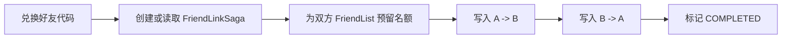

# FriendSvr 详细设计

## 1. 职责

FriendSvr 是独立的 gRPC 服务，只管理社交关系：

```text
好友代码
→ 建立双向好友
→ 好友列表
→ 校验两名玩家是否双向好友
```

它不管理农场地块、访客心跳、农场公开 Push 或偷菜 Saga。

## 2. 已确认规则

- 好友列表显示现有 `account_name`；
- 每名玩家最多 100 名好友；
- 每名玩家同时最多一个有效好友代码；
- 好友代码服务端生成、可重复兑换、有效期 10 分钟；
- 有效代码被同一玩家重复兑换时返回已有好友关系；
- 玩家不能兑换自己的代码；
- 好友申请确认、备注、分组、在线状态、删除好友 UI 不在第一版范围。

## 3. 逻辑数据

```text
FriendCode
- code
- owner_player_id
- created_at
- expires_at
- status

FriendList
- player_id
- entries: [{friend_player_id, account_name, created_at}]
- active_count
- reserved_count

FriendLinkSaga
- link_id
- code
- owner_player_id
- redeemer_player_id
- status
- created_at / updated_at
```

`FriendList` 每位玩家一条 Tcaplus 记录。`reserved_count` 用于并发兑换时预留好友名额，避免两次兑换同时超过 100 人上限。

## 4. 建立好友 Saga



规则：

1. `link_id` 由代码和兑换者确定，同一兑换可安全重试；
2. 只有双方边都写入且 Saga 为 `COMPLETED`，才算双向好友；
3. `CheckMutualFriend` 不认可半完成状态；
4. 任一步 CAS 冲突或临时失败保留 Saga，稍后重试或对账；
5. 已经是好友时不重复占用名额。

## 5. gRPC 方法

```text
CreateShareCode(caller_player_id)
RedeemShareCode(caller_player_id, code)
ListFriends(caller_player_id)
CheckMutualFriend(player_a_id, player_b_id)
```

`CheckMutualFriend` 仅由 Zone 内部调用。H5 只能经 Gate 使用好友代码和好友列表接口。

## 6. 边界

- FriendSvr 的双向好友 Saga 与跨玩家农场互动 Saga 是两套独立状态机；
- 好友关系成功不代表已经进入对方农场；
- 进入农场仍需经过访客 Zone、`ENTER_FARM` 与农场主 Zone 的访客表校验；
- 好友代码、Session、Ticket、gRPC Metadata 和日志都不得包含可重放的明文 Secret。

