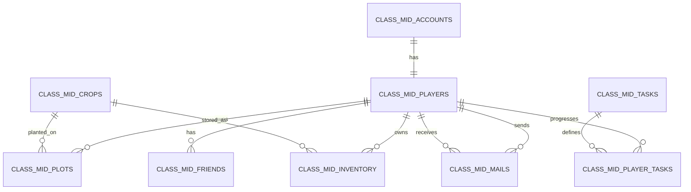

# class-mid 简单关系型后端改造设计

日期：2026-09-14  
状态：待负责人复核

## 1. 改造目标

本轮只修改 Go 后端、MySQL 表和后端文档，不要求 Qt 同步增加好友界面。

- 保持单个 Go 游戏服务器，不恢复 Login、Gate、Coordinator、Shard、Actor 或 Protobuf。
- 删除当前 `Store → Engine → 回调 → JSON 存档` 的复杂更新链路。
- 玩家资产、仓库、农田、任务、邮件和好友使用关系表保存。
- 每个玩家有 16 块地，商店提供 6 种作物。
- 保持 Qt 当前使用的 HTTP 路径、WebSocket action 和主要响应字段。
- 新好友功能使用额外 HTTP JSON 接口，并提供 PowerShell 演示脚本。
- 代码使用简单英文标识符和中文注释，减少抽象层和辅助函数。

本设计面向本地课程演示。凯撒变换是可逆编码，不具备真实密码存储安全性；文档和答辩不得将其描述为安全加密。

## 2. 后端结构

后端保留以下主要文件：

```text
server/
├─ cmd/game/main.go
├─ internal/game/model.go
├─ internal/game/mysql.go
├─ internal/game/http.go
├─ internal/game/websocket.go
├─ internal/game/game.go
├─ sql/reset_class_mid.sql
└─ scripts/demo-friends.ps1
```

职责如下：

| 文件 | 职责 |
|---|---|
| `main.go` | 连接 MySQL、创建 Server、启动和关闭 HTTP 服务 |
| `model.go` | 请求、响应、玩家、作物、仓库、地块、好友和邮件结构 |
| `mysql.go` | 建表、注册、登录查询、快照查询、好友和邮件 SQL |
| `http.go` | 路由、Session、注册登录和好友 HTTP 接口 |
| `websocket.go` | AUTH、循环读取 JSON、分发游戏与邮箱 action |
| `game.go` | 购买、种植、施肥、收获、清理、出售和领奖事务 |

生产运行只使用 MySQL，不再保留 MemoryStore、Store 接口、Engine 回调和整体状态 JSON。

## 3. 数据库设计

旧 `class_mid_*` 数据允许全部删除。`reset_class_mid.sql` 按外键顺序删除旧表并创建新表；服务器正常启动不执行 DROP，防止重复启动清空数据。

### 3.1 表清单

| 表 | 主键 | 作用 |
|---|---|---|
| `class_mid_accounts` | `player_id` | 用户名和凯撒变换后的密码 |
| `class_mid_players` | `player_id` | 金币、肥料、章节和状态版本 |
| `class_mid_crops` | `crop_id` | 六种作物、价格、成熟时间和产量 |
| `class_mid_inventory` | `(player_id, crop_id)` | 每名玩家每种作物的种子和成品数量 |
| `class_mid_plots` | `(player_id, plot_no)` | 所有玩家的 16 块农田状态 |
| `class_mid_tasks` | `task_id` | 简单任务定义 |
| `class_mid_player_tasks` | `(player_id, task_id)` | 玩家任务进度和领取状态 |
| `class_mid_mails` | `mail_id` | 系统或好友投递的邮件 |
| `class_mid_friends` | `(player_id, friend_id)` | 双向好友记录 |

### 3.2 实体关系



账号与玩家为 1:1；玩家与地块、仓库记录、邮件为 1:N；玩家与作物、任务和好友通过中间表形成 N:M。

### 3.3 六种作物

| ID | 名称 | 种子价格 | 出售价 | 成熟时间 | 产量 |
|---:|---|---:|---:|---:|---:|
| 1 | 胡萝卜 | 2 | 5 | 30 秒 | 3 |
| 2 | 玉米 | 3 | 7 | 35 秒 | 3 |
| 3 | 土豆 | 4 | 9 | 40 秒 | 4 |
| 4 | 番茄 | 5 | 11 | 45 秒 | 4 |
| 5 | 草莓 | 6 | 14 | 50 秒 | 5 |
| 6 | 南瓜 | 8 | 18 | 60 秒 | 5 |

作物配置在重建脚本中插入，Go 从 `class_mid_crops` 查询，不再硬编码商店价格。

### 3.4 农田状态

`class_mid_plots` 字段为：

- `player_id`：所属玩家。
- `plot_no`：1 至 16。
- `crop_id`：空地为 NULL，种植后关联作物。
- `status`：`EMPTY`、`GROWING`、`NEED_CLEANUP`。
- `planted_at_ms`：种植时间。
- `mature_at_ms`：成熟时间。
- `fertilized`：是否施肥。

数据库不定时写入 `MATURE`。查询时若状态为 `GROWING` 且当前时间大于等于 `mature_at_ms`，响应中显示 `MATURE`。

### 3.5 注册初始化

注册在一个事务中执行：

1. 插入账号。
2. 插入玩家，初始 50 金币、2 份肥料、章节 1、状态版本 1。
3. 插入 16 条空地记录。
4. 为 6 种作物插入 6 条数量为零的仓库记录。
5. 插入玩家任务进度。
6. 插入一封系统欢迎邮件。

任一步失败均回滚。

## 4. 密码与会话

密码限制为 6 至 20 个 ASCII 字母或数字。凯撒函数固定移动 3 位，并分别在以下字符集合内循环：

- `a-z`
- `A-Z`
- `0-9`

注册时保存变换结果；登录时对输入执行相同变换后比较。token 仍使用随机字符串并保存在 Go 内存 Session 中，以兼容 Qt 的登录和 WebSocket AUTH。删除 PBKDF2、`authSlots` 和认证耗时均衡逻辑。

## 5. 现有接口兼容

以下 HTTP 路径保持不变：

- `GET /healthz`
- `GET /api/config`
- `POST /api/register`
- `POST /api/login`
- `POST /api/logout`
- `GET /ws`

以下 WebSocket action 保持不变：

- `AUTH`
- `PING`
- `GET_PLAYER_SNAPSHOT`
- `GET_SHOP`
- `BUY_SEEDS`
- `BUY_FERTILIZER`
- `PLANT`
- `APPLY_FERTILIZER`
- `HARVEST`
- `CLEAN_PLOT`
- `SELL_CROP`
- `CLAIM_CHAPTER_REWARD`
- `GET_MAILBOX`
- `READ_MAIL`

`request_id` 继续原样返回，供 Qt 匹配响应，但服务端不再保存指纹和最近 100 条请求记录。

旧 Qt 请求没有 `crop_id` 时默认操作胡萝卜。新客户端可以为 `BUY_SEEDS`、`PLANT` 和 `SELL_CROP` 增加可选 `crop_id`。

旧响应字段继续提供：

- `coins`
- `seeds`：胡萝卜种子数量。
- `fertilizer`
- `crops`：胡萝卜成品数量。
- `plots`
- `chapter`
- `tasks`

响应新增 `inventory` 和 `shop` 数组；旧 Qt 忽略未知字段，新 Qt 可展示六种作物。`state_version` 保留为简单递增字段，避免旧 Qt 的快照判断失效。

## 6. 游戏事务

每个写操作使用一个直接、可阅读的 MySQL 事务，不再把匿名修改函数传给存储层。

### 6.1 购买种子

查询作物价格，检查和扣除玩家金币，增加相应仓库种子数量，更新任务进度后提交。

### 6.2 种植

查询并锁定玩家地块，检查为空；查询仓库种子并扣除一个；根据作物成熟秒数更新地块后提交。

### 6.3 施肥

检查地块正在生长且未施肥，检查玩家肥料数量；肥料减一，成熟时间减少 10 秒，地块标记已施肥。

### 6.4 收获和清理

收获要求当前时间达到成熟时间；按作物产量增加仓库成品数量，地块改为 `NEED_CLEANUP`。清理后地块恢复 `EMPTY` 并清空作物和时间字段。

### 6.5 出售

检查仓库成品数量，减少对应作物，按数据库中的出售价增加玩家金币。

## 7. 好友、查看农田、偷菜和邮件

Qt 当前没有好友页面，因此好友功能使用新增 HTTP JSON 接口；原接口不变。

### 7.1 接口

| 方法和路径 | 输入 | 结果 |
|---|---|---|
| `POST /api/friends/add` | `username` | 插入双向好友关系 |
| `GET /api/friends` | 无 | 返回好友 ID 和用户名 |
| `GET /api/friends/{id}/farm` | 无 | 返回好友 16 块地 |
| `POST /api/friends/{id}/steal` | `plot_id` | 偷取一块成熟作物 |
| `POST /api/friends/{id}/mail` | `title`, `content` | 给好友投递邮件 |

这些接口通过 `Authorization: Bearer TOKEN` 取得当前玩家身份。

### 7.2 加好友

根据用户名取得目标玩家；禁止添加自己；在一个事务中插入 `A→B` 和 `B→A` 两行。重复添加返回“已经是好友”。本版本不设计申请、同意、拒绝和删除好友。

### 7.3 查看好友农田

先查询好友关系，再从 `class_mid_plots` 查询目标玩家的 16 行记录并关联 `class_mid_crops` 取得作物名称。不是好友时拒绝查询。

### 7.4 偷菜

偷菜事务按以下规则执行：

1. 当前玩家与目标玩家必须是好友。
2. 目标地块必须处于 `GROWING`，且当前时间达到成熟时间。
3. 事务锁定目标地块，确保同一块地只能被偷一次。
4. 按作物产量增加偷菜玩家的 `crop_count`。
5. 偷菜玩家额外增加 1 金币。
6. 目标地块改为 `NEED_CLEANUP`。

本版本不做每日次数、部分偷取、保护时间、偷菜记录和通知。

### 7.5 好友邮件

确认双方是好友后，向 `class_mid_mails` 插入 `sender_id`、`receiver_id`、标题、正文、未读状态和创建时间。收件人继续通过现有 `GET_MAILBOX` 和 `READ_MAIL` 使用邮箱。

## 8. 错误处理

保留少量稳定错误码，供 Qt 和演示脚本判断：

- `INVALID_ARGUMENT`
- `INVALID_CREDENTIALS`
- `UNAUTHENTICATED`
- `ACCOUNT_EXISTS`
- `INSUFFICIENT_COINS`
- `INSUFFICIENT_ITEMS`
- `PLOT_STATE_CONFLICT`
- `CROP_NOT_MATURE`
- `FRIEND_NOT_FOUND`
- `ALREADY_FRIENDS`
- `MAIL_NOT_FOUND`
- `SERVICE_UNAVAILABLE`

服务端继续使用 SQL 参数占位符、Session 身份和必要事务。这些逻辑用于保证程序基本正确，不增加限流、请求指纹、自动重试、复杂恢复或生产网络防护。

## 9. 演示与测试

不为每个辅助函数建立测试，只保留少量关键验证：

1. 注册、登录和 16 块地初始化。
2. 六种作物中的一条购买、种植、成熟、收获、出售链路。
3. 一条好友集成流程：加好友、查看农田、偷菜、检查库存与金币、发送和读取邮件。

`scripts/demo-friends.ps1` 使用 HTTP 和 WebSocket JSON 接口，用于 Qt 尚无好友界面时的现场证明。脚本为作物施肥后等待 21 秒，再验证偷菜和 B 的邮箱内容。

行为变更后运行相关 Go 测试；Qt 接口兼容完成后重新构建 Qt 和运行现有 smoke；真实命令与结果记录到 `docs/evidence/`。

## 10. 明确删除的能力

- MemoryStore 和 Store 接口。
- Engine 回调更新结构。
- `state_json` 整体存档。
- PBKDF2 密码派生。
- `authSlots` 登录并发限制。
- request_id 指纹、Receipts 和持久化去重。
- 复杂的未知结果恢复说明。
- 与当前课程演示无关的网络保护和抽象。

仍保留 WebSocket、token、互斥锁、SQL 参数、事务和目标地块锁，因为现有 Qt 依赖 WebSocket，而基本身份隔离和跨表一致性是功能正确运行所需。
